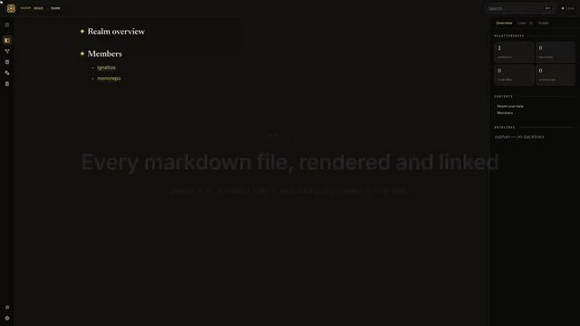

<h1 align="center">Atomic Claude</h1>

<p align="center">
 
</p>

<p align="center">
 <strong>Code graphs, wikis, and research-backed agentic coding. Deterministic tools for nondeterministic workflows, in one opinionated Claude Code config.</strong>
</p>

<p align="center">
 <em>Stop re-explaining your repo to Claude every session.</em>
</p>

<p align="center">
 <a href="docs/guides/install.md">Install</a> &bull;
 <a href="docs/reference/concepts.md">Concepts</a> &bull;
 <a href="docs/reference/workflow.md">Workflow</a> &bull;
 <a href="docs/reference/commands.md">Commands</a> &bull;
 <a href="docs/reference/skills.md">Skills</a> &bull;
 <a href="docs/reference/agents.md">Agents</a> &bull;
 <a href="docs/credits.md">Credits</a>
</p>

<p align="center">
 
 <a href="https://github.com/damusix/atomic-claude/releases/latest"></a>
 <a href="./LICENSE"></a>
</p>

<p align="center">
 
</p>

<p align="center">
 <em><code>atomic serve</code>, the whole tour: wiki docs, search, SQL schema, two agents on the bus, plans, and the code graph.</em>
</p>


## 🌟 Features

| Feature | What it does |
|---|---|
| **Repo-aware sessions** | One scan builds a standing map of your codebase that Claude reads before your code, so it stops inventing `npm` scripts. |
| **Code graph** | A tree-sitter symbol graph across 31 languages and 23 web frameworks answers callers, call sites, and blast radius, no compiler required. |
| **SQL in the graph** | Procedures, views, foreign keys, and lineage across Postgres, MySQL, T-SQL, and Snowflake, plus dbt models and macros, read from `.sql` files with no database connection. |
| **Autopilot** | `/autopilot` takes an issue to a merged PR: plans, tests first, reviews its own diff, ships. Your only decision is how to merge. |
| **Self-sharpening config** | `/retrospective-learning` mines your corrections for friction and edits its own skills and rules, only with your say-so. |
| **Inter-session bus** | Concurrent Claude Code sessions message each other over named rooms: delegate work to a peer session, watch or halt a room as the operator. |
| **Persistent REPLs** | Named Python and Node interpreter sessions hold state across separate Bash calls, so agents stop re-running setup code to get back to where they were. |
| **Structured replies** | Tables, trees, and ASCII flows replace walls of prose when they explain faster. |
| **Incremental adoption** | One install; every layer is optional, from clearer replies up to full autopilot. |


## 🚀 Usage

Everything below is opt-in and composes into one lifecycle. Lost? `/atomic-help` reads your git state and names one next command; `/atomic-help tour` walks the whole system.

### The workflow

```
onboard your repo

  /setup-wiki .......................... audit conventions, scaffold what's missing
  /refresh-wiki ........................ scan + infer: teach Claude the repo's shape

then get to work

  /atomic-plan <desc> .................. design doc + checkpoint spec
    /gather-evidence <hypothesis> ...... chase the hunch through primary sources
    /pressure-test ..................... defend the design in dialogue before it's built
    /challenge-swarm @spec.md .......... parallel expert lenses attack the written spec
  /subagent-implementation @spec.md .... implement → review loop; wikis refreshed
  /quick-fix <task> .................... same loop, no spec, for known-cause fixes
  /commit [push|pr|merge|squash] ....... ship from one verb
  /autopilot <task|issue#> ............. all of it unattended; you pick the merge
```

Fresh-context subagents drive the loop as a maker/checker split (Anthropic's evaluator-optimizer pattern): the implementer writes a failing test before any code, the reviewer re-runs tests and gates the diff against the spec, and work commits per green checkpoint. → [workflow](docs/reference/workflow.md)

Each phase's working state lives in one `atomic scratchpad` bundle per task — later phases join the same bundle rather than scattering new directories. `atomic serve`'s Plans view lists every bundle and its docs across your worktrees, so you can check what's in flight without `cd`-ing anywhere. → [conventions](docs/reference/conventions.md) · [serve](docs/reference/serve.md)

### Wikis

Wikis are how Claude learns a codebase once instead of every session. Two scopes:

- **Repo wiki**: `docs/wiki/` inside one repository. Build and framework facts, a domain map, cross-cutting notes.
- **Realm wiki**: a Karpathy-style knowledge base you compile with Claude instead of maintaining by hand. A folder holds your repos and the loose material around them; the `wiki/` beside them holds per-repo summaries, shared concerns, and knowledge pages synthesized from capture buckets.

```text
~/work/acme/       the realm: repos + the material around them
├─ CLAUDE.md       realm rules, loaded from any session inside
├─ billing-api/    repo · has its own wiki → linked
├─ gateway/        repo · has its own wiki → linked
├─ vendor-sdk/     repo · no wiki → summarized
├─ research/       capture bucket: findings you write
├─ raw/            capture bucket: PDFs, exports, pasted notes
└─ wiki/           the map atomic compiles
   ├─ index.md     member registry + bucket listing
   ├─ repos/       summaries of members without their own wiki
   ├─ concerns/    what cuts across repos
   └─ knowledge/   digests synthesized from the buckets
```

The scopes compose. A realm summarizes the repos under it without writing into them, and a member repo that keeps its own wiki is linked rather than re-summarized. Claude loads whichever scope the session sits in: a realm session sees the cross-repo picture, a repo session sees that repo's map. `atomic code index` layers a symbol graph onto either scope; at a realm root it indexes every member, and queries fan out across them.

Two commands drive it. `/setup-wiki` audits a repo's conventions (ignore rules, docs layout, CLAUDE.md wiring) and proposes only what's missing. `/refresh-wiki` builds or refreshes the wiki at either scope: a deterministic scan captures the facts, an inference pass writes the summaries, and ship verbs mark the wiki dirty as the source tree changes, so a session-start nudge tells you when a refresh is due. → [realm wiki](docs/reference/realm-wiki.md) · [knowledge base](docs/guides/knowledge-base.md) · [repo wiki](docs/reference/repo-wiki.md)


## 💭 Contributing & feedback

Atomic Claude dogfoods itself: the root artifacts are both the live config and the bundle source. Bugs and ideas are welcome via [Issues](https://github.com/damusix/atomic-claude/issues). To work on the config, see [docs/guides/contributing.md](docs/guides/contributing.md).


## 📖 Further reading

| Topic | Link |
|-------|------|
| Workflow lifecycle | [docs/reference/workflow.md](docs/reference/workflow.md) |
| Commands | [docs/reference/commands.md](docs/reference/commands.md) |
| Skills | [docs/reference/skills.md](docs/reference/skills.md) |
| Agents | [docs/reference/agents.md](docs/reference/agents.md) |
| Output style | [docs/reference/output-style.md](docs/reference/output-style.md) |
| Repo wiki | [docs/reference/repo-wiki.md](docs/reference/repo-wiki.md) |
| Realm wiki | [docs/reference/realm-wiki.md](docs/reference/realm-wiki.md) |
| Bus (inter-session messaging) | [docs/reference/bus.md](docs/reference/bus.md) |
| REPL (persistent interpreter sessions) | [docs/reference/repl.md](docs/reference/repl.md) |
| Code intelligence | [docs/reference/code-intel.md](docs/reference/code-intel.md) |
| Code-intel MCP setup | [docs/guides/code-intel-mcp.md](docs/guides/code-intel-mcp.md) |
| Concepts (how it flows) | [docs/reference/concepts.md](docs/reference/concepts.md) |
| Conventions | [docs/reference/conventions.md](docs/reference/conventions.md) |
| Install / update / uninstall | [docs/guides/install.md](docs/guides/install.md) |
| Docker evaluation | [docs/guides/evaluations.md](docs/guides/evaluations.md) |
| Contributing | [docs/guides/contributing.md](docs/guides/contributing.md) |
| Credits | [docs/credits.md](docs/credits.md) |
| Specs | [docs/spec/](docs/spec/) |
| Anthropic patterns behind it | [Building Effective Agents](https://www.anthropic.com/engineering/building-effective-agents), [Effective context engineering](https://www.anthropic.com/engineering/effective-context-engineering-for-ai-agents) |


## License

[MIT](LICENSE)
