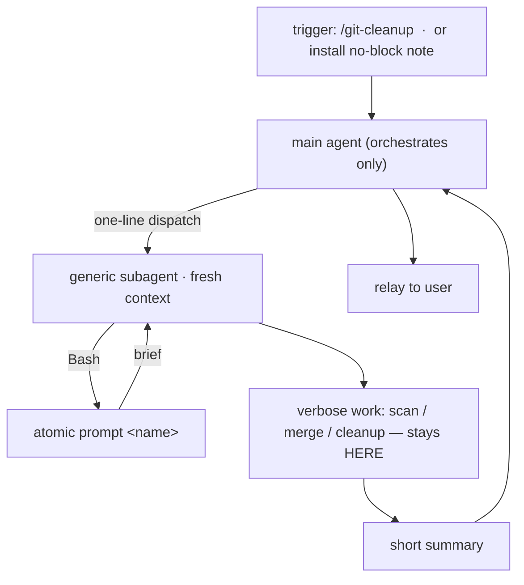

# Artifact consolidation

## Problem

The config ships 50 Claude-facing artifacts (9 agents, 33 commands, 8 skills). A full decomposition (`tmp/decomposition/`) surfaced two costs:

1. **Surface sprawl.** Combinatorial command families (11 ship verbs = `{commit} × {push, pr, merge, squash}` plus standalone), single-consumer agents, and once-per-install ops all hold permanent slots in the session artifact roster, the slash menu, `/atomic-help`, and the mandatory artifact checklist.

2. **Divergence-as-bug.** Because the 11 ship verbs are 11 code paths, they drifted: signals refresh fires twice in `commit-and-merge`, never in `pr-only`; doc-impact runs per-surface in `commit-*` but coarse in `merge-to-main`. Eleven paths means eleven places a shared concern can disagree.

What is **not** the problem: the duplication the template/partial render pipeline already removes. `templates/shared/*` renders into self-contained `commands/` and `agents/` outputs — the rendered line count looks large, but the source is DRY. Compressing rendered output is pointless; it regenerates. The target is the **count of standing artifacts** and the **hand-maintained divergence between siblings**.

## Goals / Non-goals

- Goals:
    - Reduce Claude-facing artifact count without losing capability.
    - Collapse combinatorial command families into one verb that asks.
    - Merge agents with overlapping concerns; orchestrator selects the mode.
    - Move cold/rare ops out of standing artifacts into binary-emitted prompts, executed only inside a disposable subagent.
    - Eliminate ship-family divergence by reducing to one ship flow.

- Non-goals:
    - No change to skills (8) or the output style.
    - No behavior change to the surviving lifecycle (plan → implement → ship → docs).
    - Not merging `/undo-commit` into `/commit` (opposite intent).
    - Not merging the two `report-issue` commands (different targets: user repo vs atomic itself).
    - Not touching determinism already correctly split into the binary (`atomic signals scan`, etc.).

## The principle (banked)

Two tiers:

- **HOT = Claude config** (output style, skills, commands, agents) — frequent, on the hot path, listed every session.
- **COLD = binary** (`atomic prompt <name>`) — rare ops, emitted on demand, executed only inside a throwaway subagent.

An agent earns a standing slot only if it needs one of:

1. **independent / adversarial context** the caller cannot provide (reviewer, strategist, implementer clean-room).
2. **isolation from a hot + verbose workload** whose output must stay out of main context (signals-inferrer, investigator).

A pinned cheap model is now a dispatch flag (`model: haiku`), so it no longer earns a slot by itself.

**Ask-don't-enumerate:** one verb prompts for the missing choice instead of N pre-named verbs. One flow means one consistent behavior, which is what kills sibling divergence.

## Cold-op execution model

The defining mechanism. The main agent never runs `atomic prompt` and never sees the brief — it emits a one-line dispatch to a generic subagent, which runs the CLI and executes the work in its own fresh context. Main context holds only the dispatch and the returned summary; the brief (any length) and the verbose work are quarantined in the subagent.

Cold-op dispatch flow:

## Approaches

Each sub-decision, with alternatives considered.

Cold-op execution model:

| # | Approach | Pros | Cons |
|---|----------|------|------|
| A | named agent + command (status quo) | discoverable, isolated | permanent slot for a rare op |
| B | thin command, main agent runs prompt inline | fewer agents | prompt text + verbose work pollute main context |
| C | binary prompt, main dispatches generic subagent that runs `atomic prompt` | main ctx = one-line dispatch + summary only; brief any length; no named agent | one extra dispatch hop |

Chosen: **C**.

Ship family:

| # | Approach | Pros | Cons |
|---|----------|------|------|
| A | 11 enumerated verbs (status quo) | explicit one-word verbs | combinatorial sprawl; sibling divergence |
| B | single `/commit`, ask-don't-enumerate | one flow, uniform behavior, −9 commands | one prompt at ship time |

Chosen: **B** — named `/commit` (not `/ship`); commit is the common path, escalates by asking push? / PR? / merge? / squash?.

builder / surgeon:

| # | Approach | Pros | Cons |
|---|----------|------|------|
| A | two agents | explicit scope contracts | ~80% identical (share `agent-implementer-workflow`) |
| B | one `atomic-implementer`, orchestrator selects mode | −1 agent; single workflow | must preserve surgical hard-refuse rail as a mode block |

Chosen: **B** — modes `surgical | feature`; surgical mode keeps the hard-refuse-at-3-files rail verbatim.

haiku:

| # | Approach | Pros | Cons |
|---|----------|------|------|
| A | named `atomic-haiku` agent | discoverable cheap runner | name = model not purpose; 1 consumer |
| B | dispatch flag (`model: haiku`) on the caller | −1 agent; no abstraction without reuse | brief lives in the caller |

Chosen: **B** — `/watch-ci` dispatches a generic subagent with `model: haiku`, `run_in_background: true`, and an inline brief. Promote the brief to `atomic prompt watch-status` only if a second poller appears.

claude-merge trigger:

| # | Approach | Pros | Cons |
|---|----------|------|------|
| A | `/atomic-claude-merge` command | discoverable | a slot for a once-per-install op |
| B | docs detail; install no-block path points at `atomic prompt claude-merge` | matches block-aware install | not in slash menu |

Chosen: **B** — the LLM merge path (`ActionMergeRequired`, `install.go:72-112`) only fires when CLAUDE.md has no parseable `<atomic>` block, i.e. first install into an existing file. After the block exists, every update is a deterministic in-place swap. So the merge can only happen first-time; a slash slot for it is waste. The install message at `install.go:481` is rewired from `/atomic-claude-merge` to `atomic prompt claude-merge`.

git-cleanup trigger:

| # | Approach | Pros | Cons |
|---|----------|------|------|
| A | keep `/git-cleanup` slash command (thin) | recurring maintenance earns a slot | one command remains |
| B | docs / CLI only | −1 command | less discoverable for a recurring op |

Chosen: **A** — recurring op keeps its slash slot; body is thin (dispatch a generic subagent to run `atomic prompt git-cleanup`).

## Recommendation

Adopt C / B / B / B / B / A above.

Before → after:

| Surface | Before | After | Delta |
|---------|--------|-------|-------|
| agents | 9 | 5 | −4 |
| commands | 33 | 22 | −11 |
| skills | 8 | 8 | 0 |
| output styles | 1 | 1 | 0 |
| Claude-facing total | 50 | 35 | −30% |
| binary | — | `atomic prompt {git-cleanup, claude-merge}` | +1 verb |
| partials | — | `worktree-setup` | +1 |

What moves where:

| Gone from Claude surface | Lands at |
|--------------------------|----------|
| builder · surgeon | `atomic-implementer` (mode flag) |
| atomic-git-scout | `atomic prompt git-cleanup` (subagent-run) |
| atomic-claude-merger | `atomic prompt claude-merge` (subagent-run) |
| atomic-haiku | dispatch flag (`model: haiku`) on `/watch-ci` |
| 9 ship verbs | `/commit` |
| worktree-start | `worktree-setup` partial |
| `/atomic-claude-merge` command | docs detail (first-time-only) |

Surviving agents map cleanly to the slot rule: `atomic-implementer` (1 clean-room + 2), `atomic-reviewer` (1 adversarial), `atomic-investigator` (2 search dumps), `atomic-strategist` (1 independent reasoning), `atomic-wiki-inferrer` (2 hot + verbose).

Binary wiring grounded:

| What | File:line |
|------|-----------|
| verb dispatch switch | `atomic/cmd/atomic/main.go:92-129` |
| verb registry (cliusage) | `atomic/internal/cliusage/cliusage.go:36-349` |
| install merge message (rewire target) | `atomic/internal/claudeinstall/install.go:481` |
| `ActionMergeRequired` decision | `atomic/internal/claudeinstall/install.go:72-112` |
| rendered kinds | `atomic/internal/templaterender/templaterender.go:26` |
| orphan detection | `atomic/internal/templaterender/templaterender.go:176-213` |
| bundle agents inclusion | `atomic/internal/bundlemirror/mirror.go:39-56` |
| embedded bundle | `atomic/internal/embedded/bundle.go:12` (`//go:embed all:bundle`) |

## Open questions

- **Cold prompt storage.** Embed under the existing install bundle vs a dedicated `prompts/` embed read via `embedded.FS`. Lean: dedicated embed — the prompt text is not an install artifact and should not ship into `~/.claude/`.
- **`bundlespec.MatchesAgent` / `MatchesCommand`.** Pattern match (`atomic-*` prefix) or explicit allowlist? If allowlist, agent removal/rename and the new `atomic-implementer` need it edited. Builder must verify before assuming auto-propagation.
- **`worktree-setup` form.** Pure prompt partial vs an `atomic worktree start` CLI verb for the deterministic detection (npm/cargo/pip/go + baseline tests). Lean: partial now; promote to a CLI verb only if a second consumer needs the determinism.
- **`/commit` escalation UX.** AskUserQuestion at ship time vs argument flags (`/commit pr`, `/commit squash merge`) vs both. Lean: both — flags for power users, prompt when unspecified.
- **release-please commit type.** Removing user-facing verbs is a breaking change → `fix!:` so it lands in the changelog and bumps semver.
