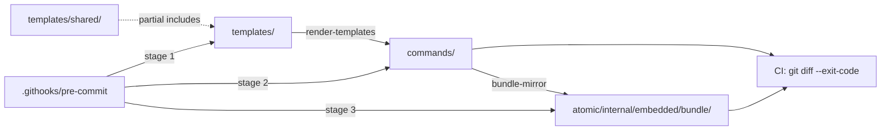

# Artifact templates: deduplicating cross-artifact text via partials


## Problem


Pipeline ship verbs duplicate large blocks of text from leaf verbs verbatim:

- The `atomic-documentation` impact-check block (~6 lines + 4 sub-bullets) appears in `commands/commit-only.md`, `commands/commit-and-squash.md` (twice — pre-commit and post-reset), and almost certainly `commands/squash-only.md`. Three to four character-identical copies across two to three files.
- The signals freshness gate (`command -v atomic` → `atomic signals stale` → invoke skill) appears in `/commit-only`, `/commit-and-squash` step 6, and presumably `/squash-only`, `/commit-and-merge`, `/merge-to-main`.
- The base-resolution snippet (`gh repo view --json defaultBranchRef ... || git config init.defaultBranch || echo main`) appears in `/commit-and-merge`, `/commit-and-squash`, and the underlying merge/squash verbs.
- The full `/commit-only` body is conceptually inlined into `/commit-and-pr`, `/commit-and-push`, `/commit-and-merge`, `/commit-and-squash` — five copies, all subtly drifting.

**Why this matters.** Pipeline verbs say "Run /commit-only flow:" then immediately inline the body. The pointer is a lie — the inlined version runs, not the referenced one. Edit `/commit-only` once, the other five files silently run the old behavior. LLM-driven edits exacerbate this: a refinement turn touches one file, model writes "slightly different" text in the others next time anyone reads them. Drift compounds.

The bug is invisible until a user notices that `/commit-only` and `/commit-and-pr`'s commit phase do not behave identically.


## Goals / Non-goals


**Goals.**

- Single source of truth for shared text blocks across `commands/` (and later `agents/`, `skills/` if needed).
- Zero runtime change. Bundle still reads from `commands/`. `.claude/commands/` symlinks unchanged. Claude Code loads the same plain-markdown files it loads today.
- Single contributor path: edit `templates/`. `commands/` is fully generated, never hand-authored. Mirrors today's embedded-bundle shape (where `atomic/internal/embedded/bundle/` is 100% generated).
- Drift caught by `make render` + pre-commit hook (the contract). CI is a backstop.
- Incremental migration via bootstrap: ship CP1 with byte-equal `cp` copies for every existing command; extract partials one slice at a time after that.
- No new external dependency.


**Non-goals.**

- Runtime templating in the installed bundle. Renders happen at build time; users see plain markdown.
- Per-user variables (config values, hostname). Templates are static at render time, identical for every install.
- Templating for output-styles or rules. The duplication problem is concentrated in commands; broadening prematurely is speculative.
- Replacing the embedded bundle pipeline. Render feeds bundle, not the other way around.


## Mental model


```
templates/                    commands/                bundle/
├── shared/                   ├── commit-only.md       (atomic/internal/embedded/bundle/commands/*)
│   ├── commit-flow.md   ──►  ├── commit-and-pr.md ──► ship-ready, embedded into binary
│   ├── pr-flow.md            ├── commit-and-merge.md
│   ├── doc-impact.md         └── ...
│   └── ...
├── commands/
│   ├── commit-only.md   (source: {{ template "commit-flow" . }} ...)
│   └── ...
```

Source of truth for **editing**: `templates/`. Source of truth for **shipping**: `commands/` (rendered). Both committed. Renderer reads `templates/`, writes `commands/`. Bundle-mirror reads `commands/`, writes embedded bundle. Two render stages, two CI gates.


## Approaches


| # | Approach | Pros | Cons |
|---|----------|------|------|
| A | New `atomic/cmd/render-templates/` tool, text/template engine, `templates/{shared,commands}/` source, `commands/*.md` rendered output | Clean separation; standard Go pattern; mirrors bundle-mirror pattern; no new dep | Two-stage build (render → bundle); contributor learns two source dirs |
| B | Extend `cmd/bundle-mirror` to render-then-mirror | One tool, one stage; bundle-mirror becomes "render + embed" | Mixes two responsibilities; harder to test render in isolation; tool grows |
| C | Render in place via HTML-comment markers (`<!-- @include shared/commit-flow -->`) | No separate output dir; `commands/*.md` is both source and output; symlinks/bundle wiring unchanged at all layers | Source files contain marker comments; partial content visually duplicated into every consumer; renderer must be careful about idempotent in-place rewrites |
| D | Pre-processor with custom DSL (Liquid, Mustache, etc.) | Familiar to web developers | New dep; learning curve; weaker stdlib integration |


## Recommendation


**Approach A.** New `render-templates` tool, text/template engine, separate input dir (`templates/`) and output dir (existing `commands/`).

Rationale:

- **Mirrors the bundle-mirror pattern this repo already uses.** Contributors learn one pattern (source dir → tool → tracked output → CI gate via `git diff --exit-code`), not two. The bundle has worked well; this is the same shape.
- **Renderer is testable in isolation.** Golden-file tests on `render-templates` cover partial composition without standing up the full bundle pipeline.
- **Full bootstrap, one contributor path.** Every file in `commands/` has a counterpart in `templates/commands/`. CP1 ships with 32 `cp` copies so the rule holds from day one. After that, "always edit `templates/`" is unambiguous — no "if templated then else hand-authored" fork.
- **No new dep.** `text/template` is stdlib; the package is the same one `bundle-mirror` already imports for manifest generation.
- **Pure-fragment partials.** No variant-passing machinery (`dict` func, `{{ if }}` conditionals). Each partial is a step-number-agnostic body fragment; consumer templates wrap with their own step headers. Optional sub-fragments (like the `doc-impact` "Why" tagline) become their own micro-partials that consumers include or omit.

Rejected:

- **Approach B** mixes render and embed in one tool. Harder to test, harder to read, blocks reuse if we later want to render templates without embedding (e.g., for `atomic claude install --dry-run`).
- **Approach C** sounds appealing (no output dir) but the in-place marker approach pollutes source files with marker comments forever and makes partial edits visually confusing (you edit the partial, then every consumer's marker block gets rewritten — `git diff` looks like changes to N files when really only one source changed).
- **Approach D** is unnecessary. We have one Go binary and stdlib templating. Bringing in a templating dep for what amounts to `{{ template "name" . }}` would be over-engineering.


## Partial taxonomy


Two levels. Keeps `templates/shared/` from sprawling into hundreds of micro-fragments.

**Big partials — entire verb bodies.** One per top-level workflow phase. Consumed by the leaf verb (1 caller) and any pipeline verb that includes that phase (1-3 more callers).

| Partial | Consumers (count) |
|---------|-------------------|
| `commit-flow.md` | `/commit-only`, `/commit-and-pr`, `/commit-and-push`, `/commit-and-merge`, `/commit-and-squash` (5) |
| `pr-flow.md` | `/pr-only`, `/commit-and-pr` (2) |
| `merge-flow.md` | `/merge-to-main`, `/commit-and-merge` (2) |
| `squash-flow.md` | `/squash-only`, `/commit-and-squash`, `/squash-and-merge` (3) |
| `push-flow.md` | `/push-only`, `/commit-and-push` (2) |


**Small partials — fragments inside big partials.** Composed multiple times per file when a big partial calls them more than once.

| Partial | Where it lives | Why partial |
|---------|----------------|-------------|
| `doc-impact.md` | inside `commit-flow`, `squash-flow` | 6+ lines, identical text, two consumers + recursive composition. Step-number-agnostic — consumer wraps with its own `## Step N` heading |
| `doc-impact-why.md` | inside `commit-flow` (and any consumer that wants the tagline) | optional 1-line "Why doc-before-signals" tagline. Separate micro-partial instead of a variant flag |
| `signals-gate.md` | inside `commit-flow`, `squash-flow`, `merge-flow` | 6 lines, gate logic identical across all ship verbs |
| `base-resolution.md` | inside `merge-flow`, `squash-flow`, top of `commit-and-merge` / `commit-and-squash` | 4 lines, exact snippet repeated |
| `worktree-cleanup-prompt.md` | inside `merge-flow`, `squash-flow` | 5-line prompt block, identical |


Anything narrower than the small-partials list above stays inline in its template. Resist the urge to partial-ize single sentences — partial overhead exceeds savings.


## Rendering semantics


- Engine: `text/template` (stdlib). Same import as `cmd/bundle-mirror`.
- Partial registration: every file in `templates/shared/**.md` registered by its path-without-extension (`templates/shared/commit-flow.md` → name `commit-flow`; `templates/shared/sub/foo.md` → name `sub/foo`). Flat by convention; subdirs allowed but discouraged until a category emerges.
- Partial invocation in source: `{{ template "commit-flow" . }}`. No variant args — partials are pure fragments. No custom `dict` function, no template-level conditionals.
- **Orphan rule (option a — error loudly).** If `<kind>/<file>.md` exists in the output target but no matching `templates/<kind>/<file>.md` exists, the renderer halts with an error that names both remediation paths: create the template (preferred), or `rm` the orphan output. Renderer never auto-deletes (axiom 3 — destructive ops need explicit intent).
- **Bootstrap.** CP1 ships with `templates/commands/<name>.md` for every existing `commands/<name>.md` (literal `cp` copies). From CP1 onward, every command has a template and the orphan rule holds. Adding a new command means dropping the file in `templates/commands/`, never directly in `commands/`.
- Output is deterministic: file order is sorted by path; partial expansion is pure (no time, no hostname, no env reads).
- Drift gate (the contract): `make render` is the source of truth. `.githooks/pre-commit` auto-runs render and re-stages outputs on any `templates/` change. `--no-verify` bypass is accepted — matches today's bundle behavior; maintainer cleans up if it ships. CI runs `make render && git diff --exit-code` as a backstop, not the primary gate.


## Build pipeline


```
make render           →  reads templates/, writes commands/ (and later agents/, skills/)
make bundle           →  reads commands/, writes atomic/internal/embedded/bundle/
make hooks            →  installs .githooks/pre-commit
```

`.githooks/pre-commit` gains a new first stage: if any staged file under `templates/` (or any output it generates) changed, run `make render`, then re-stage `commands/`. The existing bundle-regen stage stays — render output may have changed `commands/*.md`, which triggers bundle regen.

CI gate is two-step:

1. `make render` → `git diff --exit-code` (catches stale renders)
2. `make bundle` → `git diff --exit-code` (catches stale bundles — already in place)

Order matters: render must run before bundle, since bundle reads what render wrote.


## Architecture




Renderer code lives in two places:

- `atomic/cmd/render-templates/main.go` — CLI entrypoint; argument parsing; calls into the package.
- `atomic/internal/templaterender/` — pure rendering logic (load partials, parse source templates, execute, write). Testable in isolation. Mirrors `bundlemirror` package structure.


## Dogfood and contributor mental model


`.claude/commands/` symlinks today point at `<repo>/commands/`. That remains true. The dogfood loop becomes:

1. Edit `templates/commands/foo.md` (or `templates/shared/bar.md`).
2. Run `make render`.
3. `commands/foo.md` regenerates. `.claude/commands/foo.md` is the symlink — Claude Code picks up the new render on next session start (or `/restart`).

`commands/` is fully generated from CP1 onward. No "edit `commands/foo.md` directly" path exists. Adding a new command means creating `templates/commands/<name>.md` and running `make render`. Editing `commands/foo.md` directly is caught two ways: drift surfaces in `git status` (template unchanged, output diverged), and the pre-commit hook re-renders and re-stages on the next commit that touches anything — silently overwriting the manual edit.

Contributor skill (`.claude/skills/atomic-cli-contrib/SKILL.md`) gains a section: "Edit templates, not rendered output. Every `commands/<name>.md` is generated. Direct edits will be overwritten on the next render."


## Resolved questions (settled in pressure-test)


- **Drift contract.** `make render` + pre-commit hook is the gate; CI is a backstop. `--no-verify` bypass accepted; matches today's bundle behavior.
- **Composition model.** Templates always own outputs (model B). No "if templated, edit there; else edit `commands/` directly" fork. Single contributor path.
- **Orphan rule.** Option (a) — renderer errors loudly when an output exists without a matching template. Names both remediation paths. Never auto-deletes.
- **Bootstrap.** CP1 ships with 32 `cp` copies of every existing command into `templates/commands/`. From CP1 onward, every command has a template.
- **Variant-passing.** Rejected. Partials are pure fragments. No `dict` func. The one case that originally needed variants (`doc-impact` step number + optional "Why" tagline) split into step-agnostic body + optional `doc-impact-why` micro-partial.
- **Migration order.** Pipeline verbs are templated exactly once. CP3 extracts all big partials except `commit-flow` + migrates their leaf verbs. CP4 migrates all pipeline verbs together with their full partial set. No re-edits.
- **SC 9 verifiability.** Verified against the SOURCE template, not the rendered output: `templates/commands/commit-and-*.md` contain the `{{ template "commit-flow" . }}` directive and do not contain commit-flow's body as literal text. Cheap grep in PR review; automated lint deferred to follow-up.


## Open questions


- **Do we make `atomic` a render-wrapper too** (`atomic templates render`)? Pro: discoverable, consistent with `atomic signals scan`, `atomic followups render`. Con: adds a subcommand surface for a contributor-only tool that doesn't need to ship in the bundle. Current lean: keep render as a `make`-only target until a concrete reason to expose it as a binary subcommand appears.
- **Do agents and skills get partials in v1?** No concrete duplication has been identified there. Defer until one appears. `templates/agents/` and `templates/skills/` can exist as empty placeholders or be created lazily.
- **Should the SC 9 lint be automated in a later checkpoint?** Manual PR-review grep is the v1 plan. If drift recurs across multiple PRs, a lint script that asserts known fragments of any shared partial never appear as literal text in `templates/commands/*.md` is worth adding. Tracked as a follow-up at CP6 finalize.


## Migration philosophy


Incremental, never big-bang. Each checkpoint is one cohesive slice:

1. **Renderer infrastructure + bootstrap.** Build the tool, package, tests, Makefile targets, pre-commit stage, CI gate. Same commit ships `templates/commands/<name>.md` as byte-equal `cp` copies of every existing `commands/<name>.md`. Renderer's first run produces zero diff (output already matches what render would write). Orphan rule enforced from this commit forward.
2. **Extract `commit-flow` + migrate `/commit-only`.** Highest-value partial. Single template (`templates/commands/commit-only.md`) now references `{{ template "commit-flow" . }}` instead of the inline body. Rendered output byte-equal to pre-CP1 state.
3. **Extract `pr-flow`, `merge-flow`, `squash-flow`, `push-flow` + migrate their leaf verbs.** Leaf verbs (`pr-only`, `merge-to-main`, `squash-only`, `push-only`) get rewritten to reference their flow partial. Pipeline verbs are untouched in this checkpoint.
4. **Migrate all pipeline verbs.** `commit-and-pr`, `commit-and-push`, `commit-and-merge`, `commit-and-squash`, `squash-and-merge` each get rewritten ONCE, pulling their full partial set in their final form. No re-edits.
5. **Extract small partials.** `doc-impact`, `doc-impact-why`, `signals-gate`, `base-resolution`, `worktree-cleanup-prompt`. Refactor big partials to consume them.
6. **Update contributor skill; verify dogfood loop end-to-end.** Document "every command file is generated" rule. Run a manual dogfood test: edit a partial, run `make render`, confirm symlinked `.claude/commands/<file>.md` reflects the change.

Each step ships a rendered `commands/` that matches the prior committed state byte-for-byte (or with intentional, documented diff captured in the same commit). Reviewers can verify "rendered output unchanged" as the safety property of each migration step.


## Risks


| Risk | Likelihood | Mitigation |
|------|-----------|-----------|
| Partial count grows beyond the v1 taxonomy (5 big + 5 small) | med | Pure-fragment rule (no variants) prevents the worst form of bloat (nested conditionals); review discipline rejects new partials with duplication count < 2; flat naming + two-level taxonomy makes the set scannable at a glance |
| Render output drifts silently when a contributor forgets `make render` | low | Pre-commit hook is the contract; CI is backstop. `--no-verify` bypass accepted (same as bundle drift today) |
| Contributors edit `commands/*.md` directly and lose work on next render | low | Contributor skill documents "every command is generated"; pre-commit re-renders and overwrites; `git status` surfaces the drift before commit |
| Contributor pastes commit-flow's body inline instead of `{{ template "commit-flow" . }}` directive | med | SC 9 verifies against source templates (grep); manual PR-review catches in v1; automated lint deferred to follow-up |
| Migration introduces behavioral drift (rendered file ≠ original file byte-for-byte for reasons other than intentional dedup) | low | Each migration checkpoint includes a "byte-equal verification" step; intentional diffs documented in the commit |
| Render engine choice (text/template) is too limiting for a future case | low | Engine choice is encapsulated in the `templaterender` package; swappable if a real need emerges |
| Build pipeline ordering bugs (bundle runs before render in some path) | low | Single Makefile target `make all` (or explicit `render bundle`); pre-commit and CI both enforce order |
