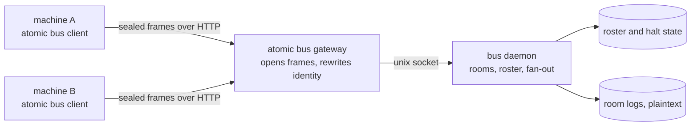
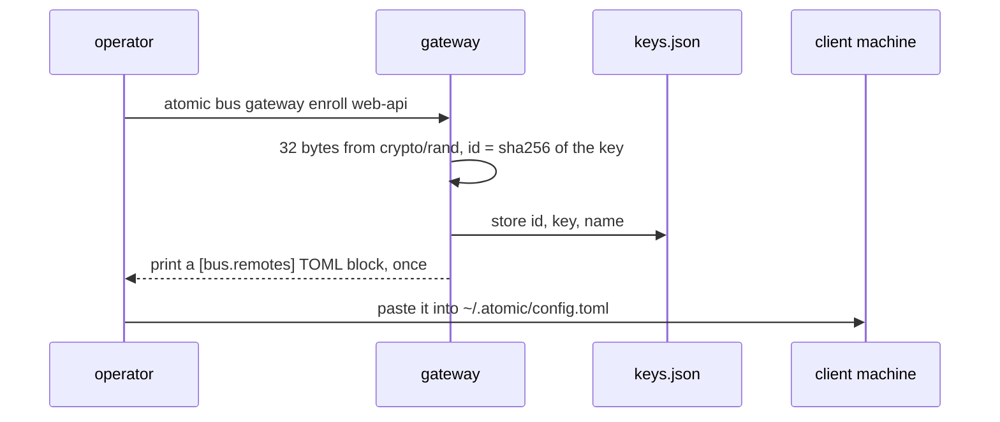
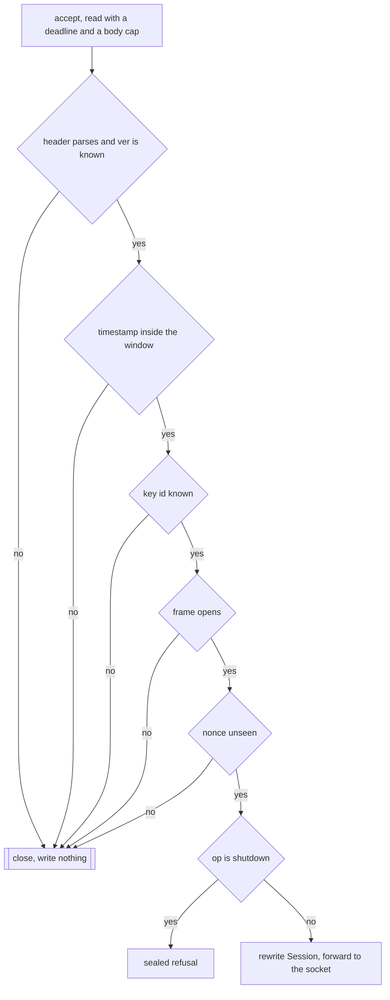
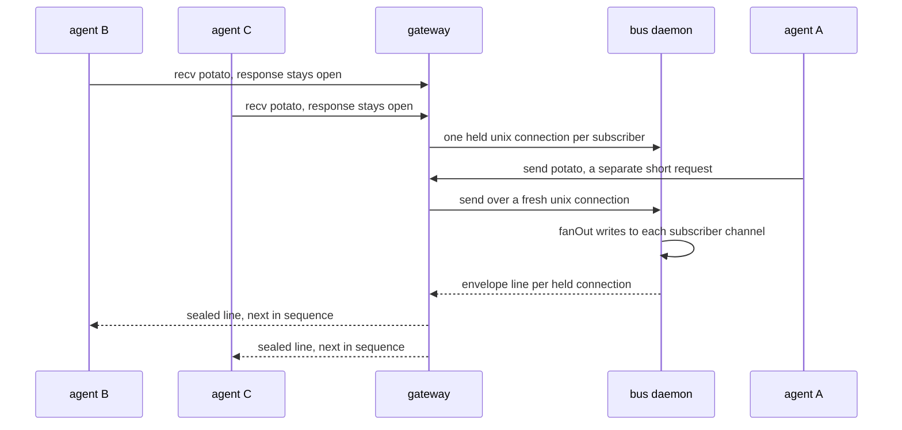
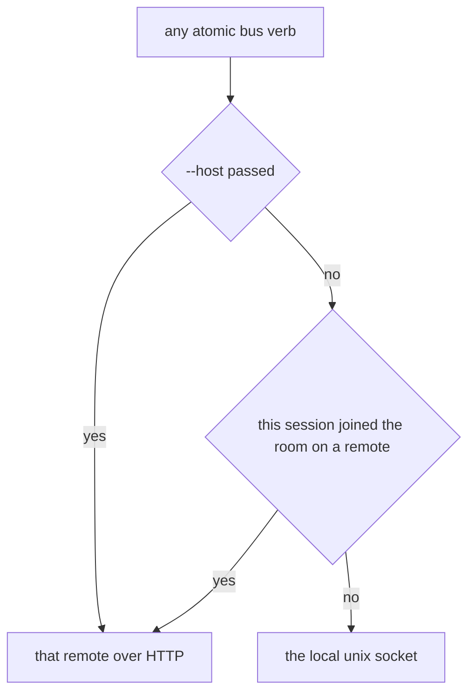
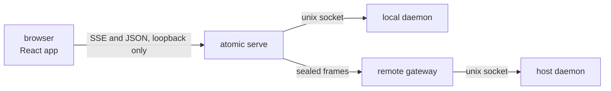
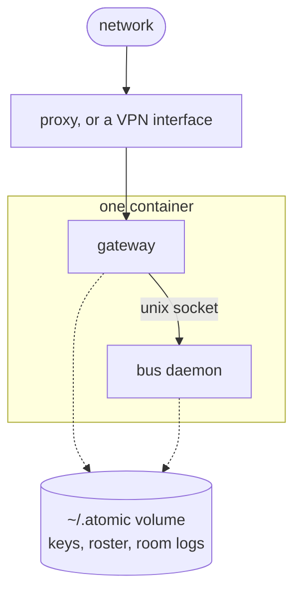

# atomic bus over a network


## What we are building


`atomic bus` connects Claude Code sessions on one machine through a Unix socket, where file
permissions are the entire security model. This adds a hosted deployment so sessions on different
machines share rooms.

A gateway process runs beside the bus daemon, starts it, and fronts it. It opens each sealed frame,
rewrites the caller's identity so it cannot be claimed, and speaks the existing protocol to the
daemon over its socket. The daemon does not know the network exists.



Why this needs a threat model rather than a login form: the `atomic-bus` skill tells a receiving
agent that an addressed message is acted on "as if the user had asked", and those agents hold Edit,
Write and Bash. A frame a stranger can insert or alter is code execution against every agent in the
room.


## The security boundary


One threat drives the design: **an attacker on the network path who injects, alters, replays,
reorders, or drops a frame.** A TLS-terminating proxy is in that position by construction. The
transport crosses ground nobody controls, so the transport is what has to be sound.

| In scope | Closed by |
|----------|-----------|
| Reading traffic in flight | The sealed body |
| Altering a frame | The AEAD tag, covering the body and the whole header |
| Injecting a frame without a key | It does not open, and the connection closes silently |
| Replaying a frame | Timestamp window, seen-nonce set, per-stream subkey |
| Dropping, reordering or splicing stream frames | Monotonic sequence, and a subkey bound to the stream |
| Speaking as another machine | Identity comes from the key that opened the frame |

Out of scope, and accepted:

| Accepted risk | Why |
|---------------|-----|
| Room logs are plaintext on the host | The host is infrastructure the deployer runs |
| `keys.json` holds real keys | Same. Shell on that host is already full access |
| The client key is a file the user's own processes can read | A local dev tool, not a secrets product |
| No end-to-end encryption | The gateway must read frames to route them |
| A key holder can instruct any agent | Issuing a key is the trust decision |

Disk, transcripts and host access belong to whoever deploys the bus. Hardening them is their call.


## One key per machine, and no roles


Enrollment issues one 32-byte key. It does three jobs at once: only its holder produces a frame the
gateway opens, the key that opens a frame says which machine sent it, and the body is ciphertext to
anything in between.

**Holding a key puts a machine in the same position as a process on the host with socket access,
minus `shutdown`.** That is the whole authorization model. There is no role split and no per-op
table, because a key holder is already trusted and a per-op rule defends against an attacker this
threat model does not contain. `halt`, `say`, `close`, `tail` and `end` all work over the wire.

`shutdown` is the one refusal, because it ends the daemon for every member and the operator has
shell on the host anyway. It costs one branch.

The consequence to be aware of: any enrolled machine can `say`, and `from_kind: "human"` wins the
reaction policy unconditionally, so any enrolled machine can speak with the identity every agent
obeys without question. That follows from issuing the key, and it is why keys are issued
deliberately and revoked when a machine is done.


## The frame


### Key material


A key is 32 bytes from `crypto/rand`. Its id is `sha256(key)` truncated, so nothing has to be
carried alongside it. There is no passphrase and no structure.

Subkeys come from `crypto/hkdf`, and the two directions derive differently on purpose:

| Direction | Subkey | Nonce |
|-----------|--------|-------|
| Client to gateway | `hkdf(key, "c2s")`, one per key | 96 bits from `crypto/rand`, fresh per frame |
| Gateway to client | `hkdf(key, "s2c" ‖ request nonce)`, **one per stream** | The sequence counter itself, from zero |

The per-stream subkey makes nonce uniqueness structural rather than probabilistic, and that
distinction is load-bearing. Under a single per-key `s2c` subkey every stream restarts its counter
at zero, so two streams need only collide on whatever stream identifier the nonce carries. At 32
bits that is a 39% chance after 65,536 streams and near certain by 200,000, and an attacker who
kills connections forces reconnects toward it rather than waiting. AES-GCM nonce reuse under one key
recovers the GHASH key and yields **forgery**, so it is the attacker sealing frames of their own.

Deriving per stream from the full 96-bit request nonce removes the collision instead of bounding it,
and closes whole-stream replay for free: a stream captured earlier is sealed under the subkey of the
nonce that opened it, and a reconnecting client derives from a new one, so the old stream does not
open at all.


### On the wire


A fixed binary header, then a sealed body. The header is the AEAD's additional data byte for byte,
so no reserialization step can leave two implementations disagreeing about what was signed:

```
ver        1 byte    frame format version, so this layout can change
key_id     1 + n     length prefix then the id, cleartext, selects the key
timestamp  8 bytes   unix seconds, big endian, replay window
nonce      12 bytes  random on c2s; the big-endian sequence counter on s2c
body       remainder AES-256-GCM sealed JSON, tag included
```

There is no separate stream field: the subkey carries that binding, and a redundant identifier would
be one more thing to check and to get wrong.


### Per-message integrity is not stream integrity


An AEAD proves each frame came from a key holder and says nothing about the frames around it. A
response stream sealed as independent messages is still attackable by someone who only moves bytes:
drop the `halt` envelope, reorder two instructions, replay one, splice a line from another stream.

So the stream is bound, not just the frame:

- **The subkey binds a frame to its stream.** A frame from another stream does not open, and neither
  does an old stream replayed at a new connection.
- **The sequence is monotonic from zero.** The client rejects a gap, a repeat, and a first frame
  whose counter is not zero. That last one matters alone: without it an attacker starts a client
  mid-stream having swallowed everything before.
- **Heartbeats are sealed frames that advance the sequence.** Outside the seal a heartbeat is a free
  injection point and leaves gaps unexplained.
- **Errors are sealed too.** An unsealed error channel bypasses everything above it.
- **The client derives its subkey from the nonce it sent**, so verification is against what this
  client requested rather than what the frames claim among themselves.

A break ends the stream rather than delivering the frame, and an ended stream is treated as a fault
and reconnected, because a clean end and a truncation are indistinguishable from inside.


## Where state lives


```
client machine
  ~/.atomic/
    config.toml            [bus.remotes.<name>]: host, key, optional ca
    bus.json               joined rooms, each carrying its host

host
  ~/.atomic/
    gateway/keys.json      key_id -> key, name, enrolled_at
    bus.sock               what the gateway dials
    bus-roster.json        roster and per-room halt, written only by the daemon
    rooms/<room>.log       append-only transcript, plaintext
  in memory
    seen nonces            retained at least as long as a timestamp stays admissible
```

`bus.json` and `bus-roster.json` are separate on purpose. `bus.json` is client state, written by the
CLI and by `serve` with an unlocked load-modify-save. Having the daemon write it too would put two
processes in that cycle on a machine that is both client and host, and the later write would discard
the earlier one silently.

The nonce window's low edge is `max(now - window, gateway start)`. A restart drops the seen set while
the timestamp check would still admit frames captured just before it.


## Enrollment


One command each side, and nothing to copy but a block of TOML.



`atomic bus gateway revoke web-api` deletes the record. The gateway notices on its next lookup, so
nothing restarts and no watcher runs. A live stream is re-checked against the key store before each
frame is sealed, so revocation ends it within one frame rather than needing a registry of streams.


## Admission


**A frame failing any check closes the connection with no bytes written.** No error body, no detail,
no hint about which check failed, so nothing becomes an oracle. Every drop is logged for the owner.



Ordering is cheapest-first inside what the protocol allows. Measured on an M-series laptop, an
AES-256-GCM open costs 130 ns and is identical at 132 ns with the wrong key, so failure leaks no
timing signal. The body cap and read deadline are not optional: the daemon decodes frames with no
size limit at all, and `MaxTextBytes` bounds only `Text` after decoding.

| Event | Logged | Sent |
|-------|--------|------|
| Malformed header, unknown version | remote address | nothing |
| Timestamp outside the window | skew, remote address, key id | nothing |
| Unknown or revoked key id | key id, remote address | nothing |
| Frame did not open | key id, remote address | nothing |
| Replayed nonce | nonce, key id | nothing |
| `shutdown` attempted | key id, name | sealed refusal |
| Accepted | name, op, room, duration | the sealed response |

A frame that fails to open under a known key id is the line worth alerting on: a machine that has a
valid id and the wrong key means tampering rather than a stranger.


## Identity


The gateway rewrites `Session` to `<key_id>/<client session>` **unconditionally, including when the
client sends an empty one.** That exception is not cosmetic. A member joining with an empty session
is recorded under `""`, so a second key sending with `Session: ""` would publish as the first one's
member. Rewriting always is what closes it.

The rewrite is namespacing rather than replacement. A bare key id would collapse every Claude
session on one machine into a single member, because the daemon maps one session to one name per
room. The key id is the namespace and the client's own session id is the discriminator, so a machine
mints identities under its own key and can reach no other.

The name is still the client's. It is the stacked `realm-repo-as` position, which the gateway cannot
derive because it does not know the client's realm or repo, and `--to` fragment matching depends on
it. Squatting a name is not a concern when every key holder is trusted.

`who` returns each member's session id to every member, so a gateway forwarding client-supplied
sessions would hand out the credential and then accept it. The rewrite makes that harmless.


## One endpoint, and how the two directions work


The daemon's socket protocol is already newline-delimited JSON over a byte stream: one `Request` in,
then either one `Response` or a `Response` plus an `Envelope` per line until disconnect. HTTP wraps
that rather than replacing it, so **one endpoint, `POST /v1/op`**, and the gateway copies socket
output until the daemon closes. A one-shot op ends immediately; a `recv` streams for hours. Same
path.



Push needs no multiplexing because a subscriber already holds a connection open. Inside the daemon,
`Hub.Subscribe` registers a buffered channel per subscriber and `Publish` calls `fanOut`, which
writes to each; the gateway sits in that path sealing each line into the response it still holds.

Three mechanics follow. The gateway needs `http.Flusher` and no write deadline on a streaming
response. A quiet stream needs a sealed heartbeat under 30 seconds, because proxies drop idle
responses and a reconnect loses whatever was published while it was down. And h2 must be disabled
explicitly on both sides, or a silent close on one request tears down an unrelated live stream.

Subscriber buffers hold 32 envelopes and `fanOut` sends without blocking, so a slow subscriber drops
rather than stalling the room and is told how many it missed. That depth was chosen against a local
socket write and is not retuned here; kernel socket buffers sit in front of it, so the practical
headroom is larger than the number suggests.


## Local versus remote


**Local stays the default.** Configuring a remote never changes what an unflagged verb does.



`bus.json` records each membership's host, so after `atomic bus join potato --host prod` every later
verb on `potato` resolves there with no flag. A session cannot hold the same room name on two buses:
the second join is refused rather than silently shadowing the first, which keeps resolution a lookup
rather than a guess.

```toml
[bus.remotes.prod]
host = "bus.example.com"
key  = "hex…"
ca   = "~/.atomic/bus/prod-ca.pem"   # only when the host's certificate is private
```

A machine with no `[bus.remotes]` table behaves exactly as the bus does today: no keys, no
configuration, no flags.

Two client behaviors follow from being remote. A failed remote dial must never spawn a local daemon,
or a broken connection quietly starts a second bus. And `recv` needs real backoff, because it retries
twice at 50 ms today, tuned for a local daemon restart, which no sleeping laptop survives.


## What the daemon must change


| Change | Where | Why |
|--------|-------|-----|
| Reject path-shaped room names and control characters | `getOrCreateRoom` and `Append` | A room name reaches the log path through `filepath.Join`, and `Subscribe` and `Rehydrate` both reach `getOrCreateRoom` without passing `Join`. Nothing validates on the daemon today |
| Cap session id length | `Join` | The discriminator is client-supplied, and the daemon should not depend on a gateway being in front |
| Persist roster and halt to a daemon-owned file | `daemon.go`, `identity.go` | `Rehydrate` reads a file only the CLI writes, so a host restart unjoins every remote member |
| Add `Host` to a membership, and refuse a same-name join on another host | `identity.go` | `Rooms` is keyed by bare room name, so a local and a remote `potato` would overwrite each other |
| Add `read` as a wire op, and an `end` CLI verb | `protocol.go`, `daemon.go`, `action.go` | The drop marker tells a subscriber to recover from the room log, which a remote client cannot open. `end` exists only as a `serve` route today |
| Add remote routing, seal and open, reconnect backoff, spawn bypass, in a package `serve` can call | `action.go`, `client.go` | `Dial` is Unix-only, and `serve` is a second consumer |

The room-name guard is a live bug rather than a new requirement. The CLI's `read` verb and `serve`'s
`requireRoom` both check, and both are client-side.


## The human surface


`atomic serve` already renders rooms for a human, streams live envelopes to the browser as
`text/event-stream`, and is bound to loopback. Extending it is the same routing change the CLI takes,
one layer up, and nothing between the browser and `serve` changes.



Routing is not one seam. `busAPIHandler.do` covers the one-shot routes, and three paths sit outside
it: `handleTail` dials the socket itself and needs the remote stream, `handleLog` opens the log file
and needs `read`, and `handleRooms` asks one daemon and has to fan out. The browser needs a host
discriminator on the room model, the query parameter and the `EventSource` URL, or two rooms named
`potato` are indistinguishable.

Local and remote rooms share one list, tagged by host. With no roles there is no operator key to
withhold, so `serve` needs no extra flag and works against a remote the moment one is configured.


## Deployment


The gateway runs beside the daemon and starts it, so the host runs one command.



One volume, mounted at `~/.atomic`. Losing it drops every key, the roster, and every transcript.

**TLS is optional, because the frames are already sealed.** The gateway listens plain HTTP by
default and takes `--tls-cert` and `--tls-key` when it is exposed directly. Behind a terminating
proxy it never sees TLS at all, and behind a VPN there is nothing to terminate. This is what the
sealed-frame layer buys: the transport does not depend on who holds the certificate.

TLS still earns its place where it is free, since it hides `key_id` and traffic shape from an
observer. It is defence in depth rather than the floor, and `ca` in the client config exists for a
host whose certificate is private. There is no insecure flag in either direction.

| | Private network | Public host |
|---|-----------------|-------------|
| Reached at | The host's VPN address | A public name |
| TLS | Optional, nothing to terminate inside the VPN | Usually the proxy's |
| Exposed | Nothing | One port |
| Enrollment | Identical | Identical |

The private topology is the smaller step and the better first deployment: nothing is published, and
an attacker has to be inside the VPN before the transport is reachable at all. Sealed frames still
apply there, so a compromised device on that VPN cannot speak as another machine.

Room logs stay plaintext on the host, and anyone with shell reads every room and every key.


## Decisions taken


| Decision | Chosen | Instead of |
|----------|--------|-----------|
| Authorization | A key holder can do anything a local process can, minus `shutdown` | A role split and a per-op table, defending against an attacker who does not hold a key and therefore never gets that far |
| Identity | Derived from the key that opened the frame, rewritten unconditionally | Trusting the frame, which `who` hands out to every member |
| The name | Still the client's stacked position | Assigning it from the key record, which breaks `--to` fragments and the realm-repo naming the gateway cannot derive |
| `s2c` nonce | A per-stream subkey with the sequence as the nonce | A per-key subkey with a stream id in the nonce, which reuses a nonce after ~65k streams and yields forgery |
| Stream binding | The subkey | An explicit stream field, which is redundant once the subkey binds and is one more check to get wrong |
| TLS | Optional | Required, when the sealed frame already carries the guarantee and requiring it forces certificate work into every topology |
| Certificates | `autocert` dropped; `--tls-cert` when wanted | A new `golang.org/x/crypto` dependency for a case the proxy usually covers |
| Endpoints | One, `POST /v1/op` | A route per op, when the op is in the frame |
| Streaming | Chunked HTTP, one sealed line per envelope | WebSocket or gRPC, for a stream that flows one way |
| Transport | HTTP/1.1, h2 disabled explicitly | HTTP/3, whose only useful property was migration, or default h2, where one close kills an unrelated stream |
| Roster persistence | A daemon-owned file | Sharing `bus.json`, which already has two unlocked writers |
| Failure response | Close with no bytes | Descriptive errors, which say which credential to fix |
| Verb name | `atomic bus gateway` | `atomic bus server`, one letter from `serve`, which runs the local daemon |

This design delivers attribution and revocation, not prevention. Any key holder can instruct any
agent, because the reaction policy says so and no allowlist exists on the receiving side. Issuing a
key is the trust decision; revoking it is the remedy.


## Open questions


- **Subscriber buffer depth.** 32 was sized against a local socket write. The remote drain path is
  longer, though kernel buffers sit in front of it. Left as-is and measured rather than guessed at.
- **What `rooms` means remotely.** `--host prod` lists every room on that host, which is the useful
  answer and also exposes room names a machine never joined. Acceptable while a key holder is
  trusted; worth revisiting if that changes.
- **Log rotation.** The daemon never rotates a room log and the gateway does not either, so a busy
  deployment grows without bound. Operational rather than security, and deferred.
