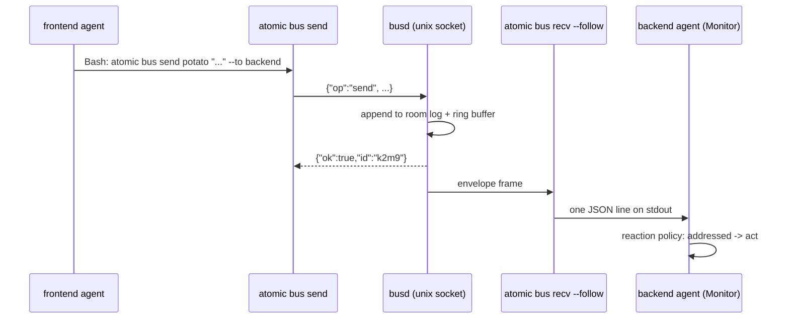

# atomic bus — inter-session messaging over named rooms


## Problem


Multiple Claude Code sessions on one machine cannot talk to each other. A frontend session that
discovers a missing endpoint has no way to hand that work to the backend session already running
next to it; the operator becomes the message bus, copying text between terminals.

The motivating case is three sessions on one feature: frontend delegates a missing endpoint to
backend and keeps working, backend notifies frontend on completion, and a third session observes
to referee. None of that is possible today.

A secondary problem is supervision. Once two agents message each other automatically, they can
loop faster than a human can read, and there is no way to intervene short of killing sessions.

The delivery mechanism is settled prior art: Claude Code's `Monitor` tool runs a long-lived
command and turns each stdout line into a notification that reaches the agent as a prompt. The
reference implementation (`yilunzhang/claude-code-inter-session`) proves the path end to end.
What it does not give us is rooms — it is name-addressed with a single global broadcast, so every
session hears everything and there is no way to scope a conversation to a feature.

How a message travels from one session to another:




## Goals / Non-goals


- Goals:
    - Named rooms, so a conversation is scoped to a feature rather than the whole machine.
    - Addressed vs. FYI messages, so three reactive agents in one room do not loop forever.
    - Push delivery with no polling, consumed by the `Monitor` tool.
    - A human member who can watch, speak, and stop the room.
    - Machine-parseable output and distinguishable exit codes on every read path.
- Non-goals:
    - Remote or cross-machine messaging. Localhost only.
    - Authentication beyond Unix file permissions.
    - Replacing subagents or agent teams. This connects sessions that already exist.
    - Durable message history that survives a daemon restart in the replay path. Room logs are
      the durable record; live replay is bounded and in-memory.


## Approaches


The transport was the live fork. Everything else follows from it.

| # | Approach | Pros | Cons |
|---|----------|------|------|
| A | Unix-socket daemon | Authoritative roster; real fan-out; halt is enforceable server-side; no port, no token | A daemon to supervise: spawn races, staleness, version skew, idle shutdown |
| B | Append-only inbox files, `tail -f` | No daemon, no socket, no lifecycle; trivially inspectable | Roster is guesswork from heartbeats; halt is unenforceable; no atomic name-collision check |
| C | Localhost WebSocket | `Monitor` consumes `ws:` natively, no subprocess | Adds a dependency and a port; a bearer token to manage; strictly worse than A for a single-user machine |


## Recommendation


**Approach A — a single per-user daemon behind a Unix domain socket at `~/.atomic/bus.sock`.**

Three of this feature's requirements are only honest with a broker holding authoritative state:

1. **Name collisions must be rejected atomically.** "Never allow two `backend`s in one room" is a
   compare-and-swap against the roster. File-based approaches can only detect a collision after
   both writers have already claimed the name.
2. **`halt` must bind, not merely inform.** A halted room rejecting an agent `send` is the feature
   that makes unattended agent-to-agent loops safe. Advisory halt is a request an agent can ignore
   — and the agent that most needs halting is the one looping.
3. **The roster must be authoritative.** `who` reporting a member who crashed ten minutes ago is
   worse than useless when the operator is deciding whether to intervene.

Approach B was seriously considered and rejected on those three points, not on latency — `tail -f`
is fast enough. Approach C buys nothing over A on a single-user machine while adding a port and a
token; Unix file permissions already give us exactly the trust boundary we want.

### Module layout

```
atomic/internal/bus/
  protocol.go   wire types and op constants; the version constant
  paths.go      ~/.atomic/{bus.sock,bus.lock,bus.json}, ~/.atomic/rooms/<room>.log
  identity.go   session-id resolution; per-session joined-room state
  client.go     dial, round trip, ensureDaemon (flock spawn), stale-socket recovery
  daemon.go     listener, per-connection loop, idle shutdown, version handshake
  room.go       roster, ring buffer, halt flag, subscriber fan-out
  roomlog.go    append-only per-room log
  action.go     verb dispatch; one flag.NewFlagSet per verb
  render.go     human table + tail line rendering, colour, hanging-indent wrap
  chat.go       interactive client
```

`action.go` is the only file `cmd/atomic/main.go` reaches, matching `internal/wiki`'s
`WikiAction` precedent (`atomic/internal/wiki/action.go:17`).

### Wire protocol

Newline-delimited JSON over the socket, in both directions. A request is `{"op": "...", ...}`;
a response is `{"ok": true, ...}` or `{"ok": false, "code": <exit-code>, "error": "..."}`. The
`code` field carries the exit code the client should exit with, so error mapping lives in one
place — the daemon — rather than being re-derived from message text on the client.

Most ops are a single round trip and the connection closes. Three ops (`recv` with `--follow`,
`tail`, `chat`) are **subscriptions**: after the initial `{"ok":true}` the daemon keeps the
connection open and writes one envelope frame per line until the client disconnects. This is why
the protocol is line-delimited rather than request-scoped — a subscription is an unbounded
response.

| op | Shape | Reply |
|----|-------|-------|
| `ping` | `{}` | `{ok, version, pid, started}` |
| `join` | `{room, name, mode, kind, session}` | `{ok, name}` — name may differ (suffix retry) |
| `leave` | `{room, session}` | `{ok}` |
| `send` | `{room, session, to[], reply_to, text}` | `{ok, id}` |
| `recv` | `{room, session, follow, since}` | `{ok}` then envelope frames |
| `tail` | `{rooms[], since, filters}` | `{ok}` then envelope frames |
| `who` | `{room}` | `{ok, members[]}` |
| `rooms` | `{}` | `{ok, rooms[]}` |
| `halt` | `{room, text}` / `resume` | `{ok}` |
| `shutdown` | `{}` | `{ok}` — backs `serve --stop` |

### Identity

Keyed by `CLAUDE_CODE_SESSION_ID` — verified present in a live session (a UUID matching the
session's scratchpad directory name). Falling back to cwd or pid would violate hard constraint 2,
so its absence outside Claude Code is an explicit error on `join` with a `--session` override for
scripted use and tests.

Because every CLI invocation is a fresh process, the joined-room mapping is written to
`~/.atomic/bus.json` at `join` and read by every later command. That file — not process memory,
not the daemon — is what makes `--room` default to the last joined room.

### Resolved open decisions

The task brief flagged five decisions as "surface, do not silently pick". Autopilot cannot stop to
ask, so each is decided here with its rationale, and each is called out in the run summary.

| # | Decision | Choice | Why |
|---|----------|--------|-----|
| 1 | Durable rooms | Bounded in-memory ring (256/room) for replay; the per-room log file is the durable record | `--since` is in the command contract, and the log file is already mandated. A ring over state the daemon holds anyway is a few lines; a disk-backed replay queue is a database nobody asked for. |
| 2 | Version skew | **Refuse**, exit 6, naming both versions and the remedy | Drain-and-restart lets one client's upgrade silently kill every other session's live `recv --follow`. A client action must not have that blast radius. `serve --stop` makes the remedy one documented command. |
| 3 | `observe` enforcement | **Client-side** reaction policy; the server advertises `mode` in `who` and on every envelope | Server-side rejection of observer sends breaks the motivating case outright — the referee exists to *offer guidance*. `observe` is a declaration about what a member reacts to, not a permission to speak; the spec's own wording is "receives everything and acts on nothing unless addressed". |
| 4 | `halt` binding | **Server-enforced.** Agent `send` into a halted room fails with exit 7; human `say` always passes | The brief calls enforceable the safer default, and the agent most in need of halting is the looping one that will ignore advice. |
| 5 | `chat` vs `tail` identity | No separate identity. `tail` never joins and holds no name; `chat` joins as a named `kind: "human"` member; two operators collide on name and take the same numeric-suffix retry as agents | One operator per machine is an assumption worth not making, and it costs nothing to avoid — the collision rule already exists. |

### Ambiguity resolved in the contract

The brief lists `--json` as a flag on `recv` and separately says `recv --follow` "emits one JSON
object per line". Settled as: **`--follow` always emits JSONL** (it is the `Monitor` path, and
hard constraint 4 wants parseable output), while a one-shot `recv` renders a human table by
default and JSONL under `--json`.

Relatedly, the reference implementation documents a ~400-character cap on notification display.
A long message would therefore arrive at the receiving agent truncated with no pointer to the
rest. Envelopes over a threshold are emitted with `text` truncated plus `truncated: <bytes>` and
`log: <path>`, so the agent can always recover the full body from the room log. This is the same
problem part 2 solves for human readers with "collapse long payloads"; both use the room log as
the escape hatch.


## Open questions


None. The five decisions the brief flagged are resolved above; each is reported in the run
summary so they can be revisited with the code in hand.
