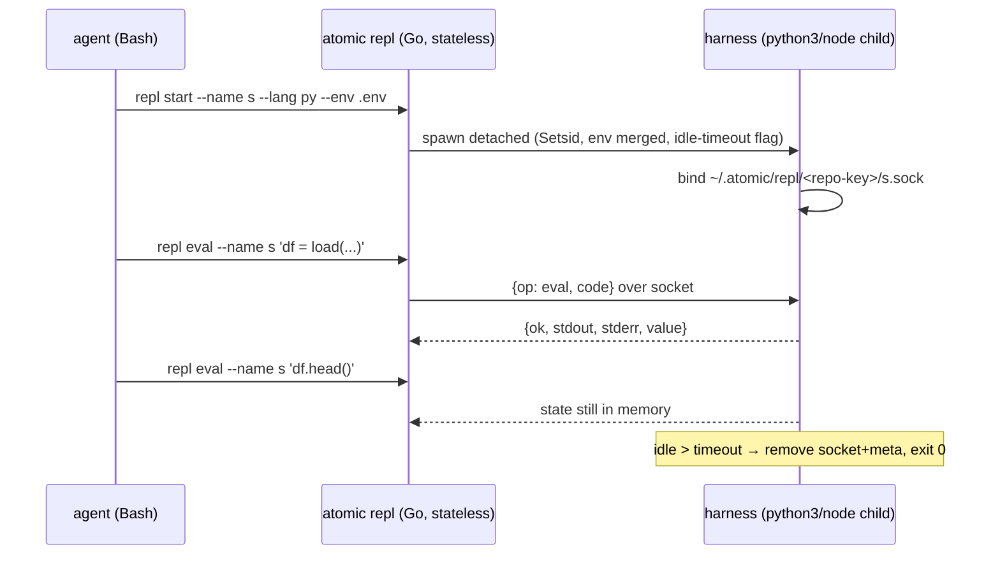

# atomic repl

## Problem

Agents have no way to keep interpreter state alive across Bash calls. Claude Code's Bash tool resets shell and interpreter state on every invocation (only the working directory persists), and NotebookEdit edits `.ipynb` JSON without a live kernel. Load-once-query-many work — exploring a large dataset, probing an API iteratively, building up a computation — forces either re-running the full setup on every step or hand-serializing state to disk between calls.

`atomic repl` gives an agent a named, persistent interpreter session: define a variable in one Bash call, use it in a later one.

Session lifecycle, from prepare to idle self-termination:

## Goals / Non-goals

- Goals:
  - Named sessions with prepared environment: `repl start --name <s> --lang py|js --env <file>` (`--bin` override for venv/alternate interpreters).
  - Multiline code via argument and via stdin pipe.
  - Interpreter state persists across `eval` calls until `stop`, `reset`, crash, or idle reap.
  - Idle reaping: a session terminates itself after a configurable idle window (default 1h; `[repl] idle_timeout` in `.claude/atomic.toml`).
  - Deterministic exit codes so agents route on codes, not prose.
  - Bounded, structured output: `{stdout, stderr, value}`, truncation flagged explicitly; `--json` for machine output.
  - Session introspection and control: `list`, `status`, `reset`, `stop`.
- Non-goals:
  - MCP exposure — the CLI over Bash is the agent surface; revisit only on demonstrated need.
  - Eval history / transcript replay.
  - Jupyter kernel protocol or rich (non-text) output.
  - Languages beyond Python and Node in v1.
  - Windows support.
  - Cross-session or cross-repo variable sharing.
  - TCP/remote transport — unix sockets only.
  - Sandboxing — same trust level as the Bash tool.

## Approaches

| # | Approach | Pros | Cons |
|---|----------|------|------|
| A | Central per-user repl daemon (bus pattern): one Go daemon owns every session as a child interpreter | Single process to operate; mirrors `atomic bus` | Custom Go-side session registry, reaper loop, restart semantics; daemon crash kills all sessions; largest new surface |
| B | Embedded goja (pure-Go JS interpreter inside the binary) | Zero subprocess management; no runtime dependency | JS-only (Python is the primary ask); no npm ecosystem; interpreter fidelity gaps |
| C | Jupyter kernel protocol client (spawn ipykernel, speak ZMQ) | Interrupt + rich-output semantics already solved | Heavy deps (ZMQ), requires a Jupyter install, overkill for a text REPL |
| D | Per-session self-serving harness: `repl start` spawns a detached `python3`/`node` running an embedded harness script that serves its own unix socket; the Go CLI is a stateless spawner/client; the harness self-exits after the idle window | Fewest moving parts; per-session crash isolation; idle reaping is a harness-local timer — no daemon, no reaper loop; reuses the proven probe-and-spawn idiom | Harness logic written twice (~100 lines per language); interrupt is SIGINT-to-pid via a meta file rather than an in-band protocol |

## Recommendation

**D — per-session self-serving harness.** Evidence:

- Detached spawn + flock-guarded probe-and-spawn already exists and is battle-tested: `atomic/internal/codeintel/mcp/proxy.go:52-141` (`Setsid`, nil stdio, `Start` without `Wait`, stale-socket recovery, spawn race guarded by flock).
- Newline-delimited JSON over a unix socket is the established wire idiom (`docs/spec/atomic-bus.md:127`).
- `go:embed` for the two harness scripts follows `atomic/internal/doctemplate/doctemplate.go:17-30` and `atomic/internal/coldprompt/coldprompt.go:17-45`.
- A central daemon (A) buys nothing D lacks: the registry becomes a directory listing of meta files, the reaper becomes a timer inside each harness, and one session crashing cannot take the others down.
- Sockets live under `~/.atomic/repl/<repo-key>/` — macOS caps `sun_path` at ~104 chars, ruling out in-repo socket paths; `~/.atomic` is the established per-user state root (`atomic/internal/config/statemigrate.go`).

Mechanism decisions that shape the spec:

| Concern | Decision |
|---------|----------|
| Session identity | Repo-scoped: key = short hash of repo root + session name. Sessions started in repo X are invisible from repo Y. |
| Wire protocol | Newline-delimited JSON request/response: `{op: eval\|ping\|reset\|shutdown, code}` → `{ok, stdout, stderr, value, error, truncated}`. |
| Env preparation | Go parses the `--env` file (minimal KEY=VALUE: comments, blank lines, single/double quotes; no expansion, no new dep) and passes the merged environment at spawn via `exec.Cmd.Env`. `list`/`status` never echo env values. |
| Code input | Argument wins when present; otherwise stdin when it is not a tty; neither → usage error. |
| Eval semantics | Code executes in one persistent global namespace; `value` is the repr/inspect of the final expression (REPL semantics), empty for statements. |
| Timeout | Client-side deadline (`--timeout`, default 30s). On expiry the client sends SIGINT to the harness pid (from meta file); still hung after a short grace → SIGKILL, session reported dead. |
| Output bounds | Harness truncates stdout/stderr at 64KiB each, sets `truncated`; CLI prints an explicit `[truncated]` marker. |
| Concurrency | Harness is a single-threaded accept loop — evals serialize naturally; a concurrent caller blocks until its deadline. |
| Idle reap | Harness-local timer since last op. On expiry: remove socket + meta, exit 0. Timeout resolved by Go at `start` time from `[repl] idle_timeout` in `.claude/atomic.toml` (default `1h`) and passed to the harness as a flag — the harness never reads config. |
| Crash semantics | Fail loud: a dead session is reported as dead with a distinct exit code and a hint to `repl start` again. Never silently restarted — silent restart would hide state loss. |
| Working directory | Harness cwd = repo root. |

## Open questions

- Auto-detect `.venv/bin/python` at `start` when present, or require explicit `--bin`? Lean: explicit only — auto-detection guesses wrong in monorepos and the flag is one token.
- Should a user-level `[repl]` default in `~/.atomic/config.toml` back the repo-scoped key? v1 ships repo-scoped only.
