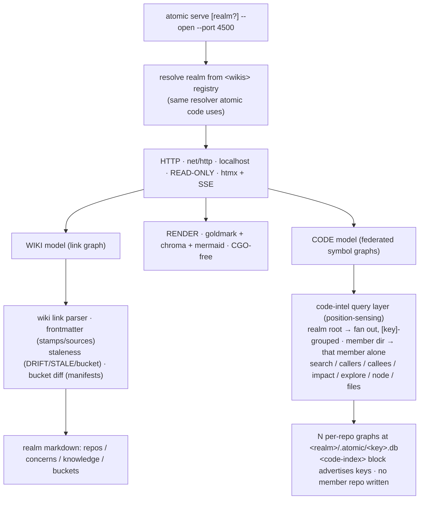

# atomic serve — wiki + code-intel render engine


## Problem


A wiki realm is browsable today only as raw markdown (Obsidian, or any markdown
server), made navigable by `atomic wiki linkify` turning path citations into
file-relative links. That is a folder of files, not a graph. Three things are latent
in the realm but never surfaced:


- **The link graph.** Markdown links and Obsidian wikilinks already wire repos →
  concerns → knowledge → buckets together, but nothing renders backlinks, orphan
  detection, or a map of how knowledge connects.
- **The provenance DAG.** `sources:` and fingerprint stamps already record which raw
  capture fed which knowledge page, and which knowledge page a concern cites. Nothing
  walks that chain or flags a stamp that has drifted from its source.
- **The code graph.** Each member repo can be code-indexed, and (since realm
  federation landed) the realm holds N per-repo symbol graphs queryable from one place.
  Nothing presents them in a browser.

Separately, a long-standing follow-up (`code-web-explorer`) asked for an htmx web UI
over a single repo's `atomic code` index — a visual companion to the CLI query verbs,
driven by the SQL schema graph. That is the same shape of program: a local, read-only,
htmx presentation layer over an engine that already exists.

Tracked as issue #51. This design **unifies both** under one verb rather than shipping
two near-identical local servers.


## Goals / Non-goals


- Goals:
    - One top-level verb, `atomic serve`, peer to `atomic wiki` and `atomic code`,
      that renders a realm as a navigable graph in the browser.
    - Presentation only — zero new analysis. Every view wraps an engine that already
      exists (wiki link parser, wiki staleness, bucket diff, code-intel query layer).
    - Render the link graph, the provenance DAG, and (per member) the code graph from
      the same server.
    - Absorb the `code-web-explorer` follow-up: the per-repo Code Explorer becomes a
      mount inside `atomic serve`, not a standalone `atomic code serve`.
    - Reuse the realm-resolution substrate `atomic code` already uses (position-sensing
      over the `<wikis>` registry), so serve and code-intel agree on what a realm is.
    - Stay local-only and read-only for v1. No auth, no mutation, no build step.

- Non-goals:
    - **Cross-repo code edges.** Federation, not merging — a call from member A into
      member B's symbol stays unresolved. Serve renders what the graphs contain; it
      does not compute cross-repo resolution. (Inherited from the federation non-goal.)
    - **A JS toolchain.** No npm, no SPA build. htmx + one graph lib vendored via
      `go:embed`. CGO-free so the release pipeline is unchanged.
    - **Write operations.** No editing the wiki, re-stamping, or re-indexing from the
      UI. Those stay CLI verbs (`/refresh-wiki`, `atomic code index`). Serve observes.
    - **MCP / remote exposure.** localhost only in v1. Not an API surface.
    - Any change to `atomic wiki` or `atomic code` subcommands, the `<wiki-scan>` /
      `<code-index>` block formats, or the index format.


## Substrate this builds on (realm federation)


Issue #51's original design comment was written before code-intel realm federation
landed and flagged that the substrate would shift. It has now shipped
(`docs/design/code-intel-realm.md`, `docs/spec/code-intel-realm.md`). The shift, folded
into this design:


- **Code-intel is realm-aware, not per-repo-only.** `atomic code` is position-sensing:
  at the realm root it fans out across every member; inside a member directory it
  queries that member alone. Output is `[key]`-grouped (human) or a `{ "<key>": … }`
  object (`--json`).
- **The realm owns the code state.** Member graphs live at `<realm>/.atomic/<key>.db`,
  config at `<realm>/.atomic/code.toml` — outside every member repo. Serve reads these;
  it never reaches into a member repo's `.claude/.atomic-index/`.
- **A deterministic code registry exists.** The `<code-index>` block in the realm
  `CLAUDE.md` lists `<member key=… path=… />` entries — the code-side parallel to
  `<wiki-scan>`. Serve reads it to know which members are indexed, the same way it reads
  `<wiki-scan>` for wiki membership.
- **Shared realm resolution.** Serve and `atomic code` resolve a realm identically:
  walk up to a registered `<wikis>` realm, sense scope by position. Serve borrows the
  resolver instead of inventing its own.

Net effect on the original design: code-intel gains a **realm altitude** (search across
all members) on top of the **repo altitude** (drill into one member) it already had.


## Concept — one server, three substrates





**Join point — two altitudes.** A repo node in the wiki graph is where the two
substrates meet:


- **Repo altitude.** A repo node mounts that member's signals and — if the member is
  indexed — its Code Explorer, scoped to its single keyed db. Exactly what `atomic code`
  returns from inside that member directory.
- **Realm altitude.** The realm node mounts a federated code search: one query fans
  across every member graph, results grouped by `[key]`. Exactly what `atomic code`
  returns from the realm root. No cross-repo edges are drawn — federation, not merging.

Wiki = the map; code-intel = both a realm-wide search lens and per-pin drill-down.


**Three scopes, one resolver.** Serve resolves what to render exactly the way
`atomic code` resolves scope by position:


- **Realm** — cwd (or the `[realm?]` arg) is a registered `<wikis>` realm root → render
  the full realm: nav tree, wiki graph, federated code search, per-member Code Explorer.
- **Member** — cwd is inside one member of a realm → that member's page (docs, signals,
  Code Explorer), still inside the realm chrome.
- **Bare repo** — cwd is a plain repo with no wiki (`atomic serve .`) → serve it
  standalone: its `docs/`, its signals, and — if it has a code index — the full Code
  Explorer, with no realm chrome. A repo does not need a wiki to be servable.


## Frontend interaction model (canonical reference)


Confirmed with the author 2026-06-14. The UI is **Obsidian-like and read-only** —
navigate a knowledge graph, never edit it. This section is the authoritative picture;
the "Three-pane UI + overlays" bullet under Recommendation defers to it, and any later
divergence is a bug in that bullet, not here.


Regions, fixed:


```
top    breadcrumb (realm › member › page)  +  search box with (md | code) toggle
left   nav tree (repos · concerns · knowledge · code)
middle content of the current page  — OR — the whole-system graph (mode toggle)
right  graph OF the current page (top)  ▸  OUT links (from here)  ▸  IN links (into here)
modal  a code file opens over a dimmed page: source + code-intel relationships
```


### ① Page view (default)


Middle renders the focused page. Right rail is its local graph, then its outbound links,
then its backlinks.


```
┌──────────────────────────────────────────────────────────────────────────────┐
│ ◆ atomic  spt › billing-svc › README        ⌕ Charge________  ( ●md ○code )    │
├─────────────┬─────────────────────────────────────────────┬────────────────────┤
│ NAV         │ CONTENT                  [ page ◀ | system ] │ GRAPH · this page  │
│             │                                             │   ┌────────────┐   │
│ ▾ repos     │ # Billing Service                           │   │    ● you   │   │
│   api       │                                             │   │   ╱  │  ╲  │   │
│   billing ◀ │ Handles invoicing + dunning. Depends on     │   │  ○   ○   ○ │   │
│   wiki      │ `payments` and shared `auth`.               │   └────────────┘   │
│ ▾ concerns  │                                             │ ─────────────────  │
│   payments  │ ## Architecture                             │ → OUT  (from here) │
│   identity  │ See [payments](payments.md) and the         │  · payments.md     │
│ ▾ knowledge │ [billing.go](src/billing.go) entrypoint.    │  · auth.md         │
│   dunning   │                                             │  · src/billing.go ⟨⟩│
│ ▾ code      │   ┌ src/billing.go ⟨code⟩ click → modal ──┐ │ ← IN  (into here)  │
│   ⌕ search  │   │ func Charge(id) error { … }           │ │  · api/README      │
│             │   └──────────────────────────────────────┘ │  · dunning.md      │
│             │                                             │  · concern:payments│
└─────────────┴─────────────────────────────────────────────┴────────────────────┘
```


### ② System graph


A `[ page | system ]` toggle in the content header swaps the middle to the whole-realm
Cytoscape/ELK graph; the right rail collapses. Clicking any node returns to page view
focused on it.


```
┌──────────────────────────────────────────────────────────────────────────────┐
│ ◆ atomic  spt › system graph                 ⌕ search________  ( ●md ○code )   │
├─────────────┬──────────────────────────────────────────────────────────────────┤
│ NAV         │ SYSTEM GRAPH · whole realm              [ page | system ◀ ]      │
│ ▾ repos     │        ○ api ──────────► ● billing                              │
│   api       │         │                  │   ╲                                │
│   billing   │         ▼                  ▼    ╲                               │
│   wiki      │        ○ auth ◄────────── ○ payments                            │
│ ▾ concerns  │                            │                                    │
│   payments  │        ○ dunning ◄─────────┘                                    │
│   identity  │  node = page · repo · symbol     edge = link · import · call     │
│ ▾ knowledge │  ● focus   color = fresh/stale   click node → page view          │
│   dunning   │  [ filter: docs · code · concerns ]   [ layout: ELK ]            │
└─────────────┴──────────────────────────────────────────────────────────────────┘
```


### ③ Code modal


Any code node, `file:line`, or link-to-file opens a modal over the dimmed page: left is
chroma-highlighted source, right is the code-intel relationships (imports, exports/defs,
callers/impact, callees) when the member is indexed. Relationship rows are clickable
jumps. Esc / ✕ closes. Degrades to source-only when the member has no code index.


```
        ┌──────────────────────────────────────────────────────────────────┐
        │  src/billing.go                                           [ ✕ ]   │
        ├──────────────────────────────────────────┬───────────────────────┤
        │  1  package billing                       │  CODE INTELLIGENCE    │
        │  3  import (                              │  ▾ imports            │
        │  4    "spt/payments"                      │    payments · auth    │
        │  5    "spt/auth"                          │  ▾ exports / defs     │
        │  6  )                                     │    Charge() Refund()  │
        │  8  func Charge(id string) error {        │  ▾ callers  (impact)  │
        │  9    return payments.Debit(id)           │    api/handler.go     │
        │ 10  }                                     │    dunning.go         │
        │ 12  func Refund(id string) error { …      │  ▾ callees            │
        │                                           │    payments.Debit     │
        │                                           │    auth.Verify        │
        └──────────────────────────────────────────┴───────────────────────┘
```


### ④ Search (command-palette dialog + dedicated page)


Search is a **dialog**, not an inline dropdown. The top bar carries a search *trigger*;
clicking it — or `⌘K` / `Ctrl K`, or `/` when not typing — opens a centered command
palette. The palette holds the `(md | code)` source toggle and a debounced live-results
list. **md** = grep over the markdown files the server indexes and renders (literal text,
not semantic). **code** = the federated symbol graph. Selecting a result navigates (md →
page in the middle pane; code → the code modal). `Enter` (or "view all results") opens the
dedicated **`/search?q=&src=`** page — a full, URL-addressable, shell-wrapped results view
with `All | Markdown | Code` tabs that composes the same `/search/md` and `/code/search`
fragments. Quick-jump in the dialog; browse-everything on the page.


```
top bar:   ◆ atomic  realm › member › page                 [ ⌕ Search…   ⌘K ]

⌘K dialog:  ┌───────────────────────────────────────────────┐
            │ ⌕ Charge______________________   ( ●md ○code ) │
            │ README.md:12 · dunning.md:4                    │
            │ ───────────────────────────────────────────── │
            │ View all results →            Enter · Esc      │
            └───────────────────────────────────────────────┘

/search page:  Search · Results for "Charge"   [ All | Markdown | Code ]
               Markdown → README.md:12 · dunning.md:4
               Code     → billing.Charge() func :8 · api.Charge call :31
```


### Engine reuse map (net-new is small)


| region / feature | engine (already built) | status |
|------------------|------------------------|--------|
| content render | `render.go` (goldmark + chroma + mermaid) | reuse |
| this-page graph | `BuildLinkGraph` + Cytoscape/ELK | reuse, scope to focus |
| out / in links | `mdlink.ExtractLinks` + `context_handler.go` | reuse → move into right rail |
| system graph | `graph.go` / `graphoverlay.go` | reuse as a middle-pane mode |
| code modal + relations | `codeexplorer.go` (callers / callees / impact / imports) | reuse → render as modal |
| code search | `codesearch.go` (federated) | reuse → wired to the search dialog + `/search` page |
| md search | `search_md.go` | grep over served `.md` |
| search dialog + `/search` page | `layout.html` palette + `search_page.go` | **new** — composes the two search fragments; no new search logic |
| modal shell + right-rail compositing | — | **new** — wiring, not analysis |


The heavy engines all exist; the work is re-wiring them into this one shell plus the
markdown grep and the modal. The first build slice is the **shell + page view**
(nav · breadcrumb · content · right-rail graph+links), the skeleton every other frame
hangs on.


## Storage & awareness surfaces


Serve introduces no new persistent state. It reads what already exists:


| Surface | Path | Written by | Serve uses it for |
|---------|------|-----------|-------------------|
| wiki membership + summaries | `<wiki-scan>` block in realm `CLAUDE.md`; `wiki/repos/**` | `atomic wiki scan` / `/refresh-wiki` | nav tree, repo nodes |
| code membership + keys | `<code-index>` block in realm `CLAUDE.md` | `atomic code index` (realm scope) | which members have a code graph, their keys |
| code graphs | `<realm>/.atomic/<key>.db` | `atomic code index` | the Code Explorer / federated search |
| concerns + knowledge | `wiki/concerns/**`, `wiki/knowledge/**` | `/refresh-wiki` synthesis | concern / knowledge nodes, provenance DAG |
| fingerprints + sources | YAML frontmatter (`reflects:` / `sources:`) | `atomic wiki stamp` | provenance edges, drift detection |
| bucket manifests | `wiki/.buckets/<name>/` | `atomic wiki bucket` | bucket diff view |
| staleness | computed | `atomic wiki stale`, doctor check 11 | realm-health front page badges |


The realm root is a plain container (only `wiki/` is a git repo), so `<realm>/.atomic/`
is inherently untracked. Serve adds nothing to either git history.


## Approaches


### Unified `atomic serve` vs two standalone servers


| # | Approach | Pros | Cons |
|---|----------|------|------|
| A | **One `atomic serve`** composing wiki + code | one server, one nav model; the repo-node join point is natural; one infra/vendor surface; matches the realm shape users already have | the presentation package must import both wiki and code-intel |
| B | Separate `atomic wiki serve` + `atomic code serve` | each subsystem self-contained | two near-identical localhost servers; the join point (repo → its code graph) has no home; double the vendored htmx/graph infra |


**Chosen: A.** The whole value is the join — a repo pin in the wiki map opening its
code graph. Two servers cannot render that without one embedding the other, which is
just A with worse ergonomics. The presentation package is a **leaf**: it imports wiki +
code-intel; neither imports it back, so the dependency direction stays clean. This is
also why the `code-web-explorer` follow-up is absorbed here rather than built as
`atomic code serve`.


### Render stack


| # | Approach | Pros | Cons |
|---|----------|------|------|
| A | **goldmark + chroma + mermaid, htmx, one graph lib via `go:embed`** | pure Go, CGO-free → release pipeline unchanged; no npm/build step; htmx fits the no-toolchain ethos; assets embed in the binary | hand-rolled interactivity vs a framework |
| B | A real SPA (React/Svelte) over a JSON API | richer client | npm toolchain, build step, CGO-irrelevant but pipeline-heavy; contradicts the project's no-JS-toolchain stance |


**Chosen: A.** Server-rendered HTML + htmx fragments map cleanly onto the engine query
layer, and embedding assets via `go:embed` keeps `atomic` a single binary. fsnotify →
SSE gives live-reload without a client framework.


### Graph visualization library


| # | Approach | Pros | Cons |
|---|----------|------|------|
| A | **Cytoscape.js + ELK layout**, vendored via `go:embed` | mature interaction model and layout engine; no layout algorithm to write or maintain; effort goes into the data model and views, not graph math; handles realm-scale node counts | larger vendored asset than a hand-rolled canvas |
| B | Hand-rolled force-directed canvas | minimal vendored weight | reinvents layout; manual tuning; a graph-algorithm rabbit hole the feature does not need |


**Chosen: A (Cytoscape.js + ELK) from day one.** Building a graph engine is not the
job — rendering the realm's existing graph is. A mature library buys layout, hit-testing,
zoom/pan, and edge routing for free so the work stays on what matters: the node/edge
model, the three edge classes, and the provenance overlay. The heavier vendored asset is
accepted deliberately; assets embed via `go:embed`, so there is no CDN and the binary
stays self-contained.


## Recommendation


One `atomic serve` verb, pure-Go presentation leaf over the existing wiki and
code-intel engines, rendered with goldmark/chroma/mermaid + htmx, graph via Cytoscape.js
+ ELK (vendored). Behavior:


- **Scope resolution** is shared with `atomic code` (position-sensing over `<wikis>`),
  resolving to realm, member, or bare repo (above). `atomic serve` with no arg resolves
  the enclosing scope; `atomic serve <path>` targets one explicitly. A bare repo with no
  wiki is servable — docs, signals, and code-intel, no realm chrome.
- **UI — see "Frontend interaction model (canonical reference)" above** for the
  authoritative picture. In brief: left nav · top breadcrumb + `(md | code)` search ·
  middle content with a `[ page | system ]` toggle (page content or the whole-realm
  graph) · right rail = the current page's graph then its OUT links then its IN links ·
  a code file opens in a modal carrying chroma-highlighted source beside its code-intel
  relationships. Stale / bucket-diff / code-index badges ride as dots on nav items and
  links, not a separate page.
- **Code Explorer** mounts under a repo's Code tab when that member is indexed. Views
  wrap the engine query layer: search, node detail, callers, callees, impact, explore,
  files, plus a derived SQL schema view (tables → columns / constraints, FK graph,
  writers-vs-readers from the `writes` edges). Edge chips are clickable, edge kind shown
  (`calls / references / writes / contains`).
    - **Scope is parametric, mirroring `atomic code`:** realm scope returns
      `{ "<key>": <results> }` (fan-out; a cold member is skipped with a `[key] not
      indexed` note, never aborting the rest); member scope returns one member's results.
      `--only` / `--exclude` map to a member filter in the UI.
    - SQL schema rendering is a **derived view** over the graph nodes/edges, not a 1:1
      CLI verb — there is no `atomic code schema`; it is built from `node` + `writes`
      edges.
- **Graph model:**

    | Node | Edge kinds out |
    |------|----------------|
    | realm | contains → repo · (mount) federated code search |
    | repo | summary-link, signals-link, (mount) code-graph (single member) |
    | concern | md-link, **fingerprint** → knowledge |
    | knowledge | **fingerprint** → bucket file (`sources:`) |
    | bucket | contains → captured files |
    | external URL | sink (registry page) |
    | symbol | calls / references / writes / contains |

    Three edge classes drawn distinctly: md-link, wikilink, and **fingerprint /
    provenance** (dashed — the citation DAG). Code edges are per-member sub-graphs
    entered via a repo node (single member) or via the realm node's federated search;
    no cross-repo edges are drawn.

- **Provenance walk (the differentiator).** Nothing else renders this — it is latent in
  the existing stamps. Click a concern, walk back to the raw capture that fed it:

    ```
    concern  ──cites──▶  knowledge page  ──sources──▶  bucket capture files
       (fingerprint)        (fingerprint)               (live SHA vs stamped)
    ```

    A stamp mismatch turns the edge red and flags the node.

- **Realm-health front page** renders the existing staleness report: per-repo /
  per-concern / per-bucket badges, the provenance DAG's broken edges, **and** aggregate
  code-index health from doctor check 11 (realm-aware — worst severity across all member
  dbs, naming only the repos needing action: `fresh` / `stale (run atomic code sync)` /
  `not indexed`). Code-index badges sit beside the wiki staleness badges.

- **External-link registry** — every outbound URL across the realm collected into one
  page (URL, source pages, first-seen date) so external references are auditable and
  dead links findable.


## Scope tiers


v1 surfaces everything the existing engines already expose — the whole bet is "reuse
what exists, give it a frontend," so there is no value in holding reuse-only views back
behind a tier gate. A deep iteration phase follows to refine UX against real use.


```
v1    serve · scope resolve (realm / member / bare repo, shared with atomic code)
      · nav tree · md render (mermaid + chroma) · ⌘K search (markdown + federated code symbols)
      · backlinks · staleness + code-index health badges · file dialog
      · graph overlay (Cytoscape + ELK; global + local) · external-link registry · bucket diff view
      · per-repo Code Explorer (search / callers / callees / impact / SQL schema view)
      · provenance DAG walk
iter  deep iteration phase — UX refinement, SSE live-reload, multi-realm switcher,
      performance passes, graph layout/filter tuning, and whatever v1 use surfaces
```


Why so much in v1: every view wraps a query the engine already answers (wiki link
parser, staleness, bucket diff, the federated `{ "<key>": <results> }` code layer) or a
fingerprint already stamped (the provenance DAG). None of it is new analysis, so the only
cost is presentation — and splitting presentation across release tiers adds coordination
overhead without buying correctness. The graph ships in v1 because exploring the realm as
a graph is the point of the feature, not a later polish; expect to iterate on it heavily.


## Open questions


None — all resolved 2026-06-13:


- **Bare repo, no wiki → yes, servable.** `atomic serve .` over a plain repo renders its
  docs, signals, and (if indexed) the full Code Explorer, no realm chrome. Federation
  makes serve's scope resolution line up 1:1 with `atomic code`'s cases (repo / realm
  root / inside-member), so serve borrows the same resolver and the case is nearly free.
- **Graph lib → Cytoscape.js + ELK from day one.** Use a mature engine; do not write a
  layout algorithm. Effort goes into the data model and views.
- **Graph cut line → v1.** The graph is the point of the feature, not later polish.
  Expect a deep iteration phase to refine it.
- **Federated code search → v1.** It reuses the existing `{ "<key>": <results> }` fan-out
  shape — a frontend over an engine that already answers the query. No reason to defer.


## Relationship to existing work


- **Absorbs `code-web-explorer` follow-up** (`.claude/project/followups/code-web-explorer.md`,
  `kind: plan`). That plan's htmx-over-the-index UI becomes the Code Explorer mount here
  rather than a standalone `atomic code serve`. Close or repoint that follow-up when this
  ships.
- **Builds on code-intel realm federation** (`docs/design/code-intel-realm.md`). Serve
  consumes the federation substrate (per-member dbs, `<code-index>` block, shared
  resolver, doctor check 11) and adds no analysis.
- **Reuses the wiki engine** (`atomic/internal/wiki/`): link parser, staleness
  (`DRIFT` / `STALE` / `STALE bucket`), bucket diff manifests, fingerprint stamps. Serve
  renders their output; it does not recompute.
