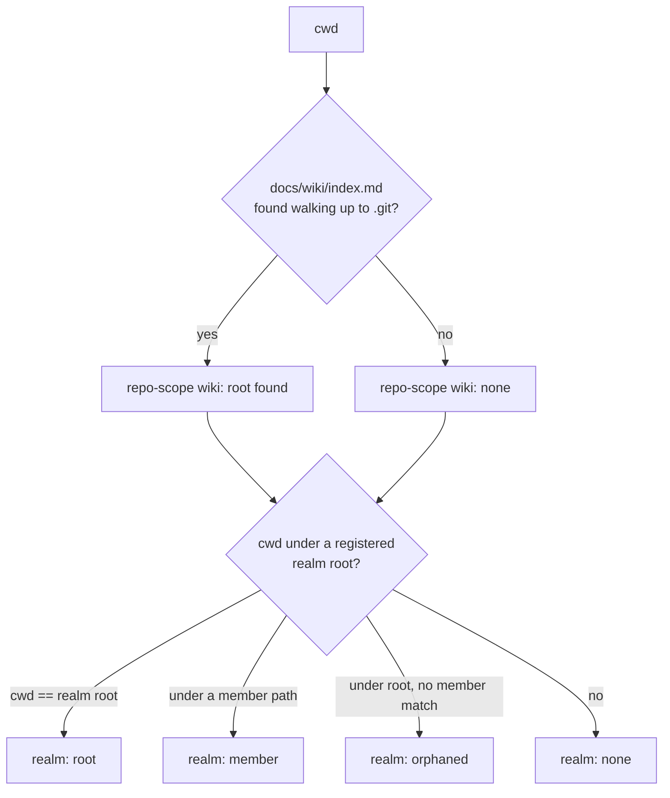

# atomic where — position orientation verb

## Problem

No single surface answers "what is this directory, relative to the wiki/repo
taxonomy?" Three detectors exist and each answers a slice of the question:

- `codeintel/realm.Resolve` — code-index scope only (`atomic code` verb
  routing). Blind to wiki structure.
- `wiki.ReadWikiIndexPaths` + private `isUnder` — realm-root/member detection,
  but only ever consumed internally by `MarkDirty`/`CheckStaleness`. No public
  report.
- Repo-scope wiki (`docs/wiki/index.md`) presence — no detector exists at all.

A repo that is both a realm member *and* carries its own repo-scope
`docs/wiki/` (a real, expected combination) is invisible today — nothing
reports that composite state. Agents currently have no deterministic way to
find out "am I in a wiki, a repo with a wiki, or neither" and either guess
from file listings or ask the user.

*cwd resolves to one repo-scope state and one realm-scope state independently; the two combine into the reported position (e.g. "realm member + own repo-scope wiki").*

## Goals / Non-goals

- Goals:
  - One command reports repo-scope wiki presence, realm-scope position
    (none/root/member/orphaned), and code-index scope, composed from existing
    detectors wherever one already exists.
  - Reports the composite case: repo-scope wiki present AND cwd is a realm
    member.
  - `--json` output for scripting/agent consumption.
  - Agents get a documented convention to run this for orientation, mirroring
    how `agent-code-intel` already tells agents to lead with `atomic code
    explore`.
- Non-goals:
  - No refactor of `wiki.isUnder` / `realm.isUnder` duplication. Two private
    copies already exist by established precedent; this may add a third
    rather than force a cross-package extraction.
  - No caching/daemon layer — detection is a handful of stat calls, not a
    perf problem.
  - No change to `<wikis>` registry format or `codeintel/realm`'s existing
    `Scope` semantics — consumed as-is.
  - No interactive prompts — read-only reporting verb only.
  - No watch/live mode.

## Approaches

| # | Approach | Pros | Cons |
|---|----------|------|------|
| A | New `internal/where` package composing all three detectors (new upward git-boundary walk for repo-scope + reused `wiki` registry read + reused `realm.Resolve`) behind one `atomic where` top-level verb | Reuses two working detectors untouched; new code is isolated to the one genuinely-missing piece (repo-scope walk) + composition; matches existing package-per-concern layout | One more top-level verb + one more package to maintain |
| B | Extend `codeintel/realm.Resolve` to also return wiki-scope info; `atomic where` becomes a thin CLI wrapper, no new package | Avoids a new package | Conflates code-index scoping (realm's actual job) with general orientation; every existing `atomic code` caller of `Resolve` pays for a wiki walk it doesn't need |
| C | Promote `isUnder` to a shared exported helper (new tiny package or export from `wiki`) as part of this work, consolidating all three call sites | Removes existing duplication | Touches two already-shipped, tested packages for a cosmetic win unrelated to the feature; surgical-changes principle says don't |
| D | Cache the resolved report on disk, invalidate on repo/realm registry change | Saves repeat stat calls | Detection cost is negligible; cache invalidation (a repo gets added to a realm later) is a footgun for no measurable gain |

## Recommendation

Approach A. The only truly new detection logic is the repo-scope walk: from
cwd, walk upward checking for `docs/wiki/index.md` at each level, stopping
after checking the level where `.git` is found (or at filesystem root) — pure
filesystem stats, no git exec, matching the "zero git spawns" contract already
established in `wiki/staleness.go`. Stopping at the git boundary prevents a
false-positive match against an unrelated ancestor directory's `docs/wiki/`.

Composition: `where.Resolve(cwd, claudeHome string) (Report, error)` calls the
git-boundary walk for repo-scope, `wiki.ReadWikiIndexPaths` + a local
under-root check for realm-scope (root/member/orphaned/none), and
`codeintel/realm.Resolve` unmodified for code-index scope. One `Report`
struct holds all three as independent fields — repo-scope and realm-scope are
genuinely orthogonal (a repo can be both), so the CLI/JSON output reports them
side by side rather than collapsing into one enum.

CLI: `atomic where [--json]`, top-level verb, cobra registration + cliusage.go
entry + main_test.go golden fixture, same shape as `buildDoctorCmd`. Plain
text output by default — this is a descriptive report, not a health check, so
no PASS/WARN/FAIL severity.

Session-start hook: one new nudge-style line appended in `hooks.go`
`buildBody`, surfaced only when the position is not the plain
no-wiki/no-realm case — matches the hook's existing silent-unless-relevant
behavior rather than adding output to every session.

Context-prompt: a short addition (new or existing shared partial) telling
agents to run `atomic where` for orientation before wiki/realm-scoped work,
mirroring `agent-code-intel`'s existing "lead with `atomic code explore`"
convention.

## Open questions

- Session-start hook line: unconditional every session, or interesting-only
  (leaning interesting-only, per above, but it's a UX call worth confirming).
- Should the composite report expose code-index scope as a top-level field or
  a secondary/verbose-only detail? Leaning top-level since it's cheap to
  compute and the brief asked for it folded in, not hidden behind a flag.
