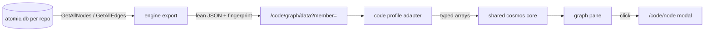

# Code graph view

## Problem

`atomic serve` renders the documentation link graph as a GPU-simulated network (cosmos.gl system view), but the richer graph the tool owns — the per-repo code-intel symbol graph (`.claude/.atomic-index/atomic.db`: ~17.5k symbols, ~20k+ resolved edges on a repo this size) — has no visual at all. The code explorer exposes it only as per-symbol drill-downs (`/code/node`, `/code/callers`). Users should be able to *see* a repo's code structure the way they see the wiki: one navigable force-directed graph per repo.

Scale mandate (user, verbatim intent): the tool must handle massive workloads — symbol counts in the tens of thousands are the norm, not the ceiling. cosmos.gl was adopted for exactly this.

## Goals / Non-goals

Goals:

- A code graph view inside the existing serve graph pane, one graph **per repo**: symbol-level nodes + resolved edges from that repo's code-intel DB.
- Realm mode: the user picks which member repo to view (the `/code/*` member-federation pattern: `?member=<prefix>`). Single-repo mode: the repo itself, no picker.
- Same cosmos.gl stack, motion policy, and interaction grammar as the system view: settle-then-pause, seed-and-pause IndexedDB layout cache, live drag reheat, DOM label overlay with zoom fade, legend filter, WebGL2 detect-and-message fallback.
- Hover shows symbol identity (name, kind, file:line, signature when present); click opens the existing code-explorer node view for that symbol.
- Zero behavior change to the doc/system view.

Non-goals:

- Merged realm-wide code graph (requirement is one graph per repo; cross-repo edges don't exist in the data anyway).
- Live re-index / file watching (a separate live-reload feature is planned; keep it out).
- File-level aggregation lens, path filtering, or subgraph queries (callers-of-X view) — future work; the full-graph view ships first.
- Any write path. The view is read-only over the index.
- Serving repos with no index beyond a friendly "not indexed" message.

## Evidence (investigated this session)

- DB schema: `nodes(id TEXT PK, kind, name, qualified_name, file_path, language, start_line, …)`, `edges(source, target, kind, provenance, …)`, `files(path PK, …)` — `atomic/internal/codeintel/db/schema.sql`.
- Bulk reads exist: `GetAllNodes(ctx)` (`db/crud.go:187`), `GetAllEdges(ctx)` (`db/crud.go:277`), `GetAllFiles(ctx)` (`db/stats.go:65`). The engine facade has no whole-graph dump; a thin export method follows those primitives.
- Member federation exists end-to-end: `codeMember{Key, Prefix, Path, DBPath}` (`serve/code_members.go:32`), discovery via `discoverCodeMembers()`, per-request engine resolution via `engineForRequest()` reading `?member=` (`serve/codeexplorer.go:198`), engine construction via the `EngineProvider` seam wrapping `engine.NewWithDBPath` (cwd-independent). The new endpoint slots into this handler family.
- Scale (this repo, healthy index): 17,560 nodes / 895 files; edges 12,408 `contains` + 6,750 `calls` + 1,094 `imports` + 130 `references` + 44 `writes`. Node kinds concentrate in function (6.8k), variable (3.2k), import (2.7k), field/method/column/file (~3k combined).
- cosmos.gl handles hundreds of thousands of points; 17.5k nodes / ~20k edges is comfortably small for it. The binding cost is JSON payload and label DOM, both already bounded (label cap 150).

## Approaches

### Granularity

| # | Approach | Pros | Cons |
|---|----------|------|------|
| A | File-level (~900 nodes, aggregated cross-file edges) | Guaranteed legible; tiny payload | Discards the symbol graph; underuses the engine; "code graph" in name only |
| B | Symbol-level full graph (~17.5k nodes; contains + calls + imports + references + writes) | The actual code graph; `contains` edges make each file a hub with its symbols clustered around it — structure emerges instead of hairball; scale showcase | Payload ~3–6 MB JSON (localhost, acceptable); legibility relies on styling discipline |
| C | Two-level drill (file default, expand to symbols on demand) | Legible + deep | Two data paths, two layout caches, expansion UX — highest complexity; YAGNI for v1 |

**Chosen: B.** The `contains` edges are the clustering skeleton (file→symbol), styled faint; `calls`/`imports` weave clusters together and get visual priority. Legend filters node-kind groups client-side. A is a future lens if B proves illegible on 100k+ repos; C is explicitly deferred.

### JS reuse shape

| # | Approach | Pros | Cons |
|---|----------|------|------|
| A | Fork `system-graph.js` → `code-graph.js` | No regression risk to the just-tuned system view | ~800 duplicated lines including the hand-tuned physics constants; every future tuning fix lands twice |
| B | Extract a shared cosmos core (mount/teardown, WebGL2 gate, motion policy, cache, drag, labels, legend) parameterized by a per-view profile (data URL, adapter, palette, taxonomy, meta resolver, cache key, click/hover hooks) | One copy of the physics; both views inherit future tuning | Refactor touches freshly hand-tuned code |
| C | Grow `system-graph.js` in place with `if (codeMode)` branches | No new file | Conditional soup in an already 1,100-line file |

**Chosen: B.** The physics constants were tuned across seven feedback rounds; duplicating them guarantees drift. Regression risk is mitigated by a **committed headless gate harness built as part of this feature**: the system-graph work verified settle/drag/overlap/cache behaviors with ad-hoc, uncommitted Playwright scripts (its own spec accepted browser behavior as manually verified), and this feature promotes those probes to a committed script that runs against the system view *before* the extraction (baseline green) and after it (regression gate), before any code-view code exists. The harness requires a local headless Chromium via Playwright and skips with a clear message when unavailable — CI still carries only the Go/unit coverage.

### Data endpoint shape

| # | Approach | Pros | Cons |
|---|----------|------|------|
| A | Reuse `/graph/data` Cytoscape-envelope shape | Same adapter | Wasteful at 17.5k nodes (nested `{data:{}}` per element); conflates doc and code graph contracts |
| B | New `/code/graph/data?member=` with a lean flat shape: fingerprint + flat node list (id, label, kind, file, line, language) + flat edge list (source, target, kind) | No nested per-element envelope, so materially smaller at 17k+ nodes; fingerprint travels with the data (layout-cache key); member resolution identical to sibling `/code/*` routes; exact JSON key names are the implementer's choice | New (small) adapter in the profile |

**Chosen: B.** The fingerprint is computed server-side from index state (node count + edge count + max `files.indexed_at`) so the client cache invalidates exactly when the index changes.

## Recommendation

Symbol-level full graph per repo, served by a new `/code/graph/data` endpoint in the code-explorer handler family, rendered by the existing cosmos stack refactored into a shared core + two thin profiles (docs, code). UI: the graph pane gains a `Docs | Code` switcher; in realm mode, code mode adds a member picker; URL state extends the existing graph view-state params. Hover → preview card with symbol identity; click → existing code-explorer node modal. Not-indexed members render the message pattern the code search already uses.

Data flow:

### Styling sub-decisions

- **Node palette**: 38 node kinds collapse into ~8 visual groups (callable, type, value, module/file, sql-data, sql-routine, import/export, other). Legend chips filter by group. Theme-aware via the existing retheme path.
- **Edge styling**: `contains` faint/thin (structural skeleton), `calls` primary, `imports` secondary, `references`/`writes`/rest tertiary. Same RGBA-array mechanism as `computeLinkStyling`.
- **Node sizing**: degree-based within the existing MIN/MAX point-size window; file nodes typically dominate degree and read as cluster anchors.
- **Labels**: DOM overlay, cap 150 by degree — file hubs and hot symbols get names; zoom fade unchanged.
- **Layout cache**: same IndexedDB store, key namespaced `code:<member>:<fingerprint>`; full-coverage hit gate and format versioning reused.

## Open questions

(none — judgment calls recorded in the run's STATE.md; the physics constants carry over as-is and get a dedicated tuning pass only if the code graph's shape demands it)
