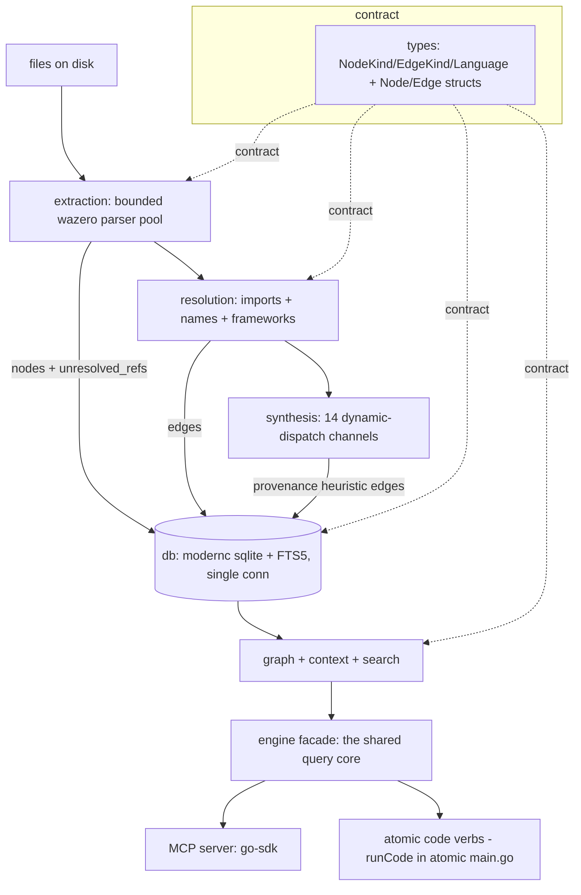

# Code-intelligence engine (atomic CLI) — design

A pure-Go code-intelligence engine built **into the `atomic` CLI**, ported from
an existing SQLite-backed TypeScript engine. This document is the conceptual
workspace; the contract is in `docs/spec/code-intel-engine.md`.

Throughout, **"the reference implementation"** means the existing TypeScript
engine whose source is the learning anchor for this port. **"The engine"** means
the new Go subsystem being built inside the `atomic` binary.

## Branding & naming (read first)

The engine ships **inside the `atomic` CLI**. The brand slug is resolved to
**`atomic`**. The reference implementation has its own product name and branded
identifiers — they **must not leak into this engine's code, comments,
identifiers, strings, tool names, directory names, or output.**

- Never emit the reference product's name anywhere in the new code or its
  output. Treat the reference repo strictly as a read-only design anchor.
- Resolved brand bindings (the spec used a `<brand>` placeholder; here it is
  `atomic`):
  - **Command surface:** `atomic code <verb>` (e.g. `atomic code index`,
    `atomic code search`, `atomic code explore`).
  - **Data directory:** `<projectRoot>/.claude/.atomic-index/` — the engine's
    state lives under the project's `.claude/` folder, gitignored, created and
    wired by `atomic setup`.
  - **SQLite file:** `<projectRoot>/.claude/.atomic-index/atomic.db`.
  - **MCP tool prefix:** `atomic_code_*` (e.g. `atomic_code_explore`,
    `atomic_code_search`).
- When the reference's source contains branded comments or names, port the
  *behavior*, not the *branding*. Rename to the neutral term or the `atomic`
  binding above.
- This rule is load-bearing: a fresh-context implementer reading the reference
  will otherwise copy its branding by reflex. The spec's reference appendix
  repeats this warning at point-of-use.

## Problem

The reference implementation parses a codebase with tree-sitter, stores
symbols/edges in SQLite (FTS5), resolves references (including synthesized
dynamic-dispatch edges), and exposes a knowledge graph to AI agents over MCP so
they answer structural/flow questions without Read/Grep.

We want a **Go subsystem of the `atomic` binary** that:

1. Ships in the same **single static binary** as `atomic` (`CGO_ENABLED=0`, no
   Node, no C toolchain on build or target host). No separate install.
2. Exposes the same intelligence over **MCP** (`atomic code mcp`) *and* over
   **`atomic code <verb>` CLI subcommands** — the CLI path matters because many
   corporate environments forbid installing MCP servers, so the graph must be
   queryable from a plain command line.
3. Reproduces the **data model and tuned constants** of the reference exactly
   (so the cited reference paths stay valid as a learning anchor), while writing
   **idiomatic Go** for the runtime (goroutines, native error handling, no
   Node-isms).

The spec's target reader is a fresh-context agent building the engine. The spec
carries a **reference appendix** of full paths into the reference repo,
annotated COPY / ADAPT / SKIP.

## Goals / Non-goals

- **Goals**
  - Pure-Go static binary (`CGO_ENABLED=0`), cross-compiles to all targets.
  - Byte-identical **data contract**: schema DDL, node-id scheme,
    `NodeKind`/`EdgeKind`/`Language` strings, synthesized-edge provenance,
    explore budget constants.
  - Broad-parity extraction: all 19 tree-sitter languages + the standalone
    extractors (Vue, Svelte, Liquid, Delphi DFM, MyBatis XML).
  - Reference resolution including the **callback synthesizer** (14
    dynamic-dispatch channels) in v1.
  - One **shared query core** (the engine facade) consumed by two thin adapters:
    an MCP server and the `atomic code <verb>` CLI handlers.
- **Non-goals**
  - **No new CLI framework.** `atomic` already has a hand-rolled flag-based
    dispatch (`atomic/cmd/atomic/main.go`, top-level `switch args[0]` →
    `run<Verb>`). The engine adds one `case "code": runCode(...)` that
    sub-dispatches the verbs — it reuses the existing pattern, it does not pull
    in `cobra`/`commander`. The query *logic* lives in the engine facade; the
    `runCode` layer is thin arg-parsing in atomic's existing style.
  - The reference's multi-agent **installer** (wiring into Claude/Cursor/…).
    Atomic ships its own way (`atomic claude install`).
  - A separate docs site and the npm release pipeline (the reference's; atomic
    has its own goreleaser + VitePress).
  - Re-tuning any calibrated constant (BM25 weights, scoring, budgets). We
    reproduce them; A/B re-tuning is a later concern.
  - **File watching** in v1 — sync-on-demand only. Mitigation: `status` surfaces
    last-indexed time + pending-change count so a stale graph is never served
    silently (see spec non-goals).

## The foundational decision: pure-Go runtime

Chosen: **pure-Go static binary** — `modernc.org/sqlite` + tree-sitter via
`wazero` (WASM), CGO off. Right for the enterprise-drop-in goal, but with one
consequence the spec must make explicit:

> Running tree-sitter grammars as **WASM under wazero** brings back WASM's
> **grow-only linear memory** (the WASM spec forbids shrinking it). The
> reference implementation spends real machinery — worker-thread spawn, recycle
> every 250 files, parser reset every 5000 — to reclaim that heap. An earlier
> assumption was that a *native cgo* Go port makes all of that unnecessary; that
> is true for cgo and **false for wazero**.

Correct adaptation: **drop the OS-worker-thread machinery** (Go uses
goroutines), but **keep a memory-reclaim strategy** — periodically close and
re-instantiate the wazero module to release linear memory. Same insight as the
reference's worker-recycle, re-expressed in-process. Captured as Risk R1 with an
explicit CP0 spike acceptance (bounded RSS across a recycle).

### Extraction concurrency

A tree-sitter parser is **stateful** (cursor, scratch buffers) and a single WASM
linear memory cannot be mutated by two goroutines at once. So the model is **not
"one parser, many goroutines"** — it is a **bounded pool of wazero module
instances, one parser per in-flight file**. This is the reference's worker pool
minus the OS-thread cost. The memory-reclaim recycle (R1) operates **per
instance**. The DB write path behind the pool is **serialized** (see the
single-connection decision below).

**Proven (2026-06-03 spike, `tmp/spike-concurrency`):** sharing one instance
across goroutines is a data race + panic; the pool-of-independent-instances
model is race-clean and deterministic; recycling every ~500 parses/instance
holds RSS flat at ~1 GB (vs unbounded without). **New principle from the spike:**
a naive Go-side walk that calls `Child`/`ChildCount` per node is ~70× slower
than parsing because each call re-crosses the WASM boundary — so the extractor
must **minimize Go↔WASM round-trips** (tree cursor or bulk in-WASM traversal),
never per-node iteration. This is the single place the pure-Go choice has a real
cost (Risk R-WALK), and it is mitigated in traversal design, not by abandoning
wazero.

### Single SQLite connection

The reference data model assumes a **single SQLite connection**. Go's
`database/sql` pools connections, which breaks two invariants: `foreign_keys=ON`
is **per-connection** (a pooled conn that skipped the pragma silently drops
cascade deletes), and the `busy_timeout`-first pragma ordering. Decision: the
engine uses a **single connection**, and the goroutine extraction pool reaches
it through a serialized write path. (If `database/sql` pooling is ever used, a
connection-init hook must apply the full pragma sequence to *every* pooled
connection — but single-connection is the v1 mandate.)

### Approaches — tree-sitter binding (the only live architectural fork)

| # | Binding | Sketch | Pros | Cons |
|---|---------|--------|------|------|
| A | `wazero` + WASM grammars (e.g. `malivvan/tree-sitter`) | Run tree-sitter compiled to WASM, no cgo | Pure Go, static binary, cross-compiles | **Pre-release**; grow-only WASM memory → needs module-recycle; slower than native; **grammar ABI must match the reference's** or node-type strings diverge |
| B | `gotreesitter` pure-Go reimplementation | Ground-up Go runtime, no WASM | Truly pure Go, no WASM memory issue | Reimplementation — grammar coverage/correctness across 19 languages is the highest unknown |
| C | cgo `tree-sitter/go-tree-sitter` behind a build tag | Native C tree-sitter as an opt-in fast path | Fastest, most battle-tested, no WASM memory issue | Needs C toolchain; cross-compile painful — violates the static-binary default |

**Recommendation:** default to **A**, gate the whole port on the **CP0 spike**,
keep **C behind a `//go:build cgo` tag** as the documented fast-path fallback.
The binding sits behind one Go interface so extractors never see which is active
— an A→C swap is a build-tag flip, not a rewrite. The spike resolves a **three-
way** outcome, written into the spec body: (A) wazero covers all 19 → proceed;
(A+C) wazero covers most → wazero default + cgo build-tag for the failing
grammars; (C/narrow) wazero broadly fails → cgo-default *or* narrow language
scope to the proven set and ship the rest in v1.1. **Partial parity is a release
lever, not a default** — only pulled if the spike fails.

The single most decision-relevant unknown the spike must answer **first**: are
`malivvan`'s WASM grammars the **same tree-sitter ABI/version** the reference's
grammars use? If not, every per-language extractor config (the node-type
strings) mismatches and produces empty extraction — making A a dead end
regardless of memory.

**Spike result (2026-06-03, `tmp/spike-go`):** run for real.
`modernc.org/sqlite` (SQLite 3.53.1) drives FTS5 + BM25 + the sync triggers
cleanly. A wazero binding parses C and emits standard node types at **ABI 14** —
the runtime path works and stays pure-Go/static. The catch is coverage:
`malivvan/tree-sitter` v0.0.1 ships only C/Cpp in its wasm but **vendors 14 of
our 19 grammar sources** (missing: typescript, tsx, dart, luau, objc, pascal).
So **A is feasible but front-loads a fork-and-rebuild-the-wasm task** — compile
all 19 grammars into `ts.wasm` (`zig cc`, build-time only; runtime stays
CGO-free). A stays the path; cgo is the fallback only if the rebuild proves
impractical. The remaining CP0 unknowns are now just parallel-parse safety and
the memory-recycle cadence — not whether the binding works.

The SQLite driver is **not** a fork: `modernc.org/sqlite` is pure Go, supports
WAL + FTS5 + expression indexes — the direct analogue of the reference's
`node:sqlite` choice (both chosen to avoid a native build step).

The MCP layer is **not** a fork: use the official
`github.com/modelcontextprotocol/go-sdk` (Google-maintained) for transport,
session, and tool registration.

## Architecture

The reference domains map cleanly onto Go packages. Dependency direction is
unchanged: `types` is the shared contract; `db` is the substrate; the analysis
pipeline (`extraction → resolution → graph/context/search`) sits on `db`; the
engine facade wires them; MCP and the CLI handlers are thin adapters.



Caption: the pure-Go pipeline. A bounded parser pool feeds a single-connection
DB; both MCP and CLI handlers are thin adapters over one facade; `types` is the
cross-cutting contract.

### Package layout (proposed)

All engine packages live under **`atomic/internal/codeintel/`** so they sit
beside the existing `atomic/internal/*` packages without polluting that
namespace. Each row's Go package is `internal/codeintel/<name>`. The reference's
`context` package is renamed **`codectx`** to avoid confusion with the stdlib
`context` (which the engine also imports).

| Go package (`internal/codeintel/…`) | Reference origin | Holds |
|------------|------------------|-------|
| `types` | `src/types.ts` | kind/language consts, `Node`/`Edge`/`Subgraph`/`Context`/`SearchResult` structs |
| `db` | `src/db/` | embedded schema, single-connection setup + pragmas, migrations, prepared-statement layer, FTS triggers |
| `extraction` | `src/extraction/` | binding iface, parser pool, node-id, generic extractor, helpers, generated-detection, orchestrator (scan/sync) |
| `extraction/languages` | `src/extraction/languages/` | one `LanguageExtractor` per language behind a registry |
| `extraction/standalone` | `*-extractor.ts` | Vue/Svelte/Liquid/DFM/MyBatis |
| `resolution` | `src/resolution/` | resolver pipeline, import-resolver, path-aliases, name-matcher |
| `resolution/frameworks` | `src/resolution/frameworks/` | framework iface + registry + per-framework resolvers (23) |
| `resolution/synthesis` | `src/resolution/callback-synthesizer.ts` | the 14 synthesizers + provenance convention |
| `graph` | `src/graph/` | traverser (BFS/DFS) + query manager |
| `codectx` | `src/context/` | context builder + markdown/JSON formatter (renamed from `context`) |
| `search` | `src/search/` | query parser, FTS query build, scoring helpers |
| `engine` | `src/index.ts` | the facade struct — the shared query core |
| `mcp` | `src/mcp/` | go-sdk server, tool handlers, explore algorithm + budgets, server-instructions, daemon |
| `grammars` | `src/extraction/grammars.ts` | embedded `ts.wasm` blob (`//go:embed`) + extension→language map |

The thin `atomic code <verb>` arg-parsing layer is **not** an engine package —
it lives in `atomic/cmd/atomic/` (a `runCode` function in the existing
`main.go`-style dispatch, calling the `engine` facade). This is the only piece
outside `internal/codeintel/`.

## Integration into the atomic CLI

The engine is not a standalone binary — it is a subsystem of `atomic`. Five
integration seams, each a concrete decision for this port:

1. **Command dispatch.** `atomic/cmd/atomic/main.go` dispatches with a top-level
   `switch args[0]` where each verb calls `run<Verb>(args[1:], repoOverride)`.
   Add `case "code": runCode(args[1:], repoOverride)`. `runCode` sub-dispatches
   the verbs (`index`, `sync`, `status`, `search`, `callers`, `callees`,
   `impact`, `node`, `files`, `affected`, `explore`, `mcp`) using the same
   `flag.FlagSet` style the other `run*` functions already use. Each verb
   constructs/opens the engine facade and calls one method.

2. **Data directory + project root.** The DB lives at
   `<projectRoot>/.claude/.atomic-index/atomic.db`. Project root is resolved the
   same way the rest of atomic resolves it (`internal/repoctx` / `repoOverride`).
   The `.atomic-index/` dir is created lazily on first `atomic code index`.

3. **`atomic setup` wiring.** `/atomic-setup` (and the `atomic` setup path) must
   add `.claude/.atomic-index/` to the project `.gitignore` — the DB, WAL files,
   and any downloaded artifacts are machine-local build state, never committed.
   `atomic setup` audits `.gitignore` already; this adds one managed entry.
   Setup does **not** auto-index (indexing a large repo is slow and explicit) —
   it only prepares the ignore entry and prints how to run `atomic code index`.

4. **Embedded grammar blob.** The 19-grammar `ts.wasm` (~30–60 MB) is embedded
   unconditionally via `//go:embed` in `internal/codeintel/grammars`. Decision
   (per project owner): binary size is **not** a constraint — no lazy download,
   no build tag, no per-language split. Every goreleaser artifact grows by the
   blob size; accepted. (R-WASM is therefore a size *note*, not a gated risk.)

5. **New dependencies.** `go.mod` gains: `modernc.org/sqlite` (pure-Go SQLite,
   FTS5), `github.com/tetratelabs/wazero` (WASM runtime), the tree-sitter wasm
   binding (forked from `malivvan/tree-sitter` to rebuild `ts.wasm` with all 19
   grammars — see CP0), and `github.com/modelcontextprotocol/go-sdk` (MCP). All
   are `CGO_ENABLED=0`-compatible. Run `go mod tidy`; verify the static build
   still cross-compiles to darwin/linux × amd64/arm64.

**Build-pipeline note.** Everything here is Go under `atomic/` — it is **not** a
bundle artifact (`agents/`, `commands/`, `skills/`, `output-styles/`, `rules/`,
`CLAUDE.md`). So `make render` / `make bundle` do **not** apply. The only
pipeline obligations: `go mod tidy`, `gofmt`, `go vet`, `go test ./...`, and the
artifact-discovery checklist for a new user-facing binary verb — register
`atomic code` in `CLAUDE.md` → "Atomic binary subcommands", the `/atomic-help`
binary topic, and `docs/reference/commands.md` (or a new engine reference page).

## MCP server lifecycle (singleton auto-managed daemon)

The MCP server is **not** a process the user starts and stops. It is a per-project
singleton that auto-starts on demand and auto-shuts-down when idle — "unmanaged
by the user," never on forever, never orphaned. This elevates the reference's
*optional* daemon (design's earlier open question) into the **primary serving
model**.

- **Liveness via a unix domain socket, not a PID file.** Socket path:
  `<projectRoot>/.claude/.atomic-index/mcp.sock`. The socket's connectability —
  not a recorded PID — is the source of truth. A leftover socket file whose
  server is dead fails `connect()` with `ECONNREFUSED`; that counts as
  not-running. Per-project, because the engine + DB are per-project (one warm
  server per indexed repo).
- **Auto-start on tool call.** Every MCP tool call (and every `atomic code` verb
  that needs the warm engine) first attempts to connect to the socket. On
  absence or refused connect: acquire a start lock
  (`flock` on `<…>/.atomic-index/mcp.lock`) to prevent a thundering herd, re-check
  the socket, remove a stale socket file, spawn the server **detached**, and
  retry connect with short backoff. The server binds the socket on startup.
- **Connection registry with `updated_at`.** The server tracks every connection:
  `{connID, created_at, updated_at}`. `updated_at` is refreshed to *now* on **every
  request** that connection sends. This timestamp — last activity, not connection
  age — drives reaping.
- **Background reaper (in-process ticker).** A goroutine ticks periodically
  (e.g. every 60 s) and force-disconnects any connection whose
  `now − updated_at > 30 min`. ("Cron job in the background" = an in-process
  reaper goroutine, since it manages the server's own live connections — not an
  OS cron entry.)
- **Auto-shutdown when idle.** When the registry empties, a 30-minute idle timer
  starts; if no new connection arrives before it fires, the server closes the
  listener, **removes the socket file**, and exits. Equivalently: 0 connections
  sustained for 30 min → shut down. The socket removal means the next tool call
  cleanly triggers a fresh start.
- **Thresholds are named constants** (axiom 2 / R6): connection-idle 30 min,
  server-idle 30 min, reap tick 60 s. Centralized; candidates for `atomic config`
  later, constants for v1.

```mermaid
sequenceDiagram
    participant C as tool call (client)
    participant S as socket file
    participant D as daemon (singleton)
    C->>S: connect()
    alt socket dead/absent
        C->>C: flock(mcp.lock); recheck; spawn detached
        C->>D: start → bind socket
    end
    C->>D: request (refresh updated_at)
    loop reaper tick 60s
        D->>D: drop conns idle >30m
        D->>D: if 0 conns for 30m → close socket + exit
    end
```

Caption: a tool call connects to the per-project socket, auto-starting the daemon
if the socket is dead; the daemon refreshes `updated_at` per request and a reaper
goroutine drops idle connections and shuts the whole server down when idle 30 min.

## Invariants — the contracts reproduced exactly

A deviation in any of these breaks compatibility with the data model and
silently corrupts graphs:

1. **Schema DDL** — tables, indexes, FTS5 vtable + the three sync triggers,
   `ON DELETE CASCADE`, the dropped narrow edge indexes. Verbatim.
2. **Node-id scheme** — `kind + ":" + sha256(filePath:kind:name:line)[:32]`,
   with the `file:` exception. Edges reference ids by value. **Because the id
   embeds `line`, sync must delete a file's nodes then re-insert** — a moved
   symbol gets a new id; an in-place REPLACE leaves orphans.
3. **`NodeKind`(22) / `EdgeKind`(12) / `Language`(29) strings** — the wire format
   between every layer and the on-disk DB.
4. **Synthesized-edge provenance** — `provenance:'heuristic'` +
   `metadata.synthesizedBy/via/registeredAt`, dedup key `source>target`, fan-out
   caps. The explore/node renderers depend on this tag.
5. **Resolution order** — built-in skip → pre-filter → JVM fast path → frameworks
   → imports → name match; synthesis runs **last**, after all static edges
   commit.
6. **Explore budget constants** — `getExploreBudget` call tiers and
   `getExploreOutputBudget` output tiers, the monotonic `maxCharsPerFile`
   invariant, the 25,000-char ceiling, and the section-boundary cut logic.
7. **Pragma sequence** — `busy_timeout` first, then `foreign_keys=ON`
   (per-connection — single-connection mandate), WAL, `synchronous=NORMAL`,
   cache/mmap.

## Cross-cutting Go conventions (decide once)

Stated here so 24 checkpoints don't each reinvent them:

- **JSON-in-TEXT columns** (`decorators`, `type_parameters`, `metadata`,
  `candidates`, `errors`): round-trip as `json.RawMessage` or typed structs —
  pick one in CP1/CP2 and hold it.
- **Integer-bool flags** (`is_exported INTEGER`): scan into `int`, expose `bool`;
  modernc won't auto-convert.
- **`Subgraph` is `map[string]Node`** for lookup, but Go map iteration is
  non-deterministic — **any serialization sorts by a stable key** (id or line)
  so output is reproducible and eval diffs don't flap.
- **Single connection** (above): the extraction pool writes through a serialized
  path; pragmas apply once to the one connection.
- **Error policy:** extraction is **best-effort per file** — a single
  unparseable file records its error in `files.errors` and the index continues.
  No abort on one parse failure.

## Open questions

- **CP0 outcome:** does wazero cover all 19 grammars (ABI-aligned, node-type
  vocab matching) with a workable memory-reclaim cadence? Drives the three-way
  fork.
- **Daemon necessity:** RESOLVED — the unix-socket singleton daemon is the
  primary serving model (see §MCP server lifecycle), not a conditional add-on.
  Open sub-question: tune the 30-min idle thresholds + 60-s reap tick against
  real usage (constants for v1).
- **Memory-reclaim cadence:** ANSWERED by spike A3 — recycle every ~500
  parses/instance holds RSS flat ~1 GB (tighten to 200 if needed). Parallel-pool
  safety (A2) and wasm-rebuild feasibility (A1) likewise proven.
- **Traversal cost (new, from spike A4):** how to walk the AST with minimal
  Go↔WASM crossings — tree cursor vs a bulk in-WASM serialize. The one open
  *optimization* question; viability is not in doubt.
- **Partial parity:** is shipping N<19 in v1 acceptable if the spike shows some
  grammars don't cover — or is 19-in-v1 hard (forcing cgo-default)? This answer
  defines CP0's fail branch.
