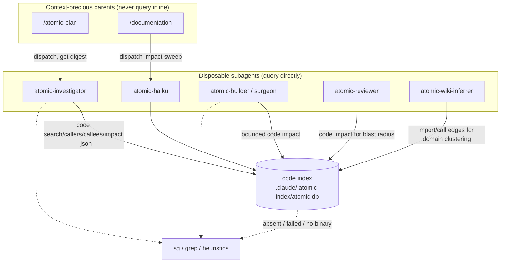

# Code-intel integration

## Problem

The `atomic code` code-intel engine is built and green (tree-sitter/wazero symbol graph + SQLite store + 11 query verbs + MCP server, 29 languages, 15 framework route resolvers, SQL schema graph). It is **100% unintegrated** into the atomic artifact system: only `atomic-help.md` mentions it, as a CLI catalog row. No agent, command, or skill *uses* the graph. The tooling that would benefit most — domain clustering in signals, blast-radius checks in review, structural grounding in planning — still relies on filename heuristics and grep.

The engine answers questions the rest of the system asks constantly:

- "what calls this symbol?" (`code callers`)
- "what does changing this break?" (`code impact`)
- "where is X defined / used?" (`code search`)
- "what are the real dependency edges between these files?" (`code callees` / import graph)

Integration means wiring those verbs into the agents and commands that ask those questions — without flooding context, without hard-depending on an index that most user repos will never build.

## Goals / Non-goals

**Goals:**

- Teach the disposable subagents (investigator, builder, surgeon, reviewer, haiku, signals-inferrer) to query the index when it exists.
- Keep context-precious parent agents from querying inline — they delegate to subagents and receive a compact digest.
- Define one index-lifecycle contract (who indexes, when) centralized in orchestrator commands, never duplicated per-subagent.
- Define one graceful-degradation contract: every consumer falls back to sg/grep/heuristics when the index, the binary, or a query is unavailable. This is non-negotiable — the artifacts install into user repos that never ran `code index`.
- Add a doctor check for index presence/freshness, scoped to not nag repos that opted out.
- Keep the engine discoverable: help-router, CLAUDE.md, docs reference tables, and a public MCP-registration docs page.

**Non-goals:**

- MCP server registration as a shipped feature. The subagents shell out to `atomic code … --json` and need no MCP. MCP is documented as a manual, project-scoped, opt-in convenience only (a `.mcp.json` snippet in a public docs page). No helper command, no auto-register on install.
- Auto-indexing on session start. First `code index` on a large repo is expensive (seconds-to-minutes); ambushing the user at session start is a worse failure than a missing index.
- A new `atomic code stale` CLI verb. The doctor check calls a Go helper directly (mirroring `signals.Stale`); orchestrators use incremental `code sync` as the self-healing gate.
- Any change to the engine's query/index internals. This is pure consumption of the existing surface.

## The governing principle: subagents query, parents delegate

Code-intel query output is token-heavy — graph verbs (`callers`/`callees`/`impact`) can return large sets. The organizing rule:

- **Disposable contexts query the index directly.** Investigator, builder, surgeon, reviewer, haiku, signals-inferrer are subagents — thrown away after they report, mostly non-Opus. They eat the query tokens and return a compact digest.
- **Context-precious parents never query inline.** The main agent inside `/atomic-plan` and `/documentation` dispatches a subagent (investigator/haiku) for any graph exploration and receives the digest. It never runs `code impact` itself and floods its own window.

This is why the keystone edit is the investigator. `/atomic-plan` and `/subagent-implementation` already dispatch `atomic-investigator` for structural exploration; teaching the investigator to use code-intel makes every parent that delegates to it inherit the capability for free.

Flow — a parent needing graph knowledge dispatches a subagent that queries the index and returns a digest; a subagent needing it queries directly:

## Index lifecycle contract

Indexing is centralized in orchestrator commands. No subagent ever runs `index` or `sync` — they only query and degrade.

| State | Trigger | Action | Cost |
|-------|---------|--------|------|
| Cold (no DB) | orchestrator about to dispatch query-capable subagents | offer / note `atomic code index`; on decline, proceed with degraded (grep) mode | expensive (seconds-to-minutes); never silent on session start |
| Warm (DB exists) | same | `atomic code sync` before dispatch | cheap, incremental (only changed files), self-healing |
| Per-iteration | `/subagent-implementation` after each builder commit | `atomic code sync` so the next reviewer query sees current working tree | cheap |

Why `sync` is the gate and not a staleness verb: the indexer enumerates via `git ls-files --cached --others --exclude-standard` and reads **working-tree** content (`os.ReadFile`), so `sync` re-indexes exactly the changed files and makes the index current. An exit-code staleness check would only tell the orchestrator to then run `sync` — so the orchestrator just runs `sync`. The expensive, decision-worthy case is the cold start, which is a presence check (`test -f .claude/.atomic-index/atomic.db`), not a staleness check.

The doctor check is the one consumer that needs a *read-only* freshness signal (it reports, it does not mutate). It calls a Go helper (`codeintel` package) mirroring how `checks_signals.go` calls `signals.Stale(root)` — no CLI round-trip.

## Graceful degradation contract

Every consumer, before querying, confirms the path is live; on any failure it falls back silently to sg/grep/heuristics. The checks, in order:

1. `atomic` on PATH? (`command -v atomic`)
2. Index DB present? (`test -f .claude/.atomic-index/atomic.db`, or `atomic code status` exits clean)
3. Query returned usable output?

Any "no" → degrade. No artifact prints an error or blocks because the index is missing. This is stated once in the shared `agent-code-intel` partial and inherited by every subagent that composes it; the orchestrator commands carry the same fallback in their lifecycle steps.

## Partial shape decision

Two candidate shapes for the agent-facing guidance:

| # | Approach | Pros | Cons |
|---|----------|------|------|
| A | Overload `agent-search-tooling` with the code-intel tier + graph verbs | one partial, already composed into investigator/builder/surgeon | muddies single-responsibility (search-tool-selection vs graph queries); graph verbs have no grep equivalent; reviewer/haiku/signals-inferrer don't carry search-tooling and don't need its full grep/sg paragraph |
| B | New dedicated `agent-code-intel` partial; one-line bridge added to `agent-search-tooling` | single-responsibility per partial (matches repo philosophy); composed only where relevant; graph verbs + degradation live in one place | one more partial in the shared pool |

**Recommendation: B.** Create `templates/shared/agent-code-intel.md` covering (1) when an index exists, `code search` outranks sg/grep for symbol location; (2) the graph verbs (`callers`/`callees`/`impact`) as novel capabilities; (3) bounded-query discipline (one symbol, never a full-graph dump); (4) the degradation contract. Compose it into `agent-implementer-workflow` (reaches builder + surgeon), `atomic-investigator`, `atomic-reviewer`, `atomic-haiku`, `atomic-wiki-inferrer`. Add a one-line bridge to `agent-search-tooling` so its tiering points at code-intel as the top tier when an index is present, keeping the two partials coherent without duplication.

## Doctor check scope

Mirrors `checks_signals.go` structurally, but diverges on the absence case: code-intel is **opt-in**, so a repo with no index is the normal state and must not WARN.

| Index state | Severity | Detail |
|-------------|----------|--------|
| no DB | PASS (informational) | `code index not initialized (optional; run 'atomic code index' to enable)` |
| DB present, source changed / N days old | WARN | `index N days old (run 'atomic code sync')` |
| DB present, fresh | PASS | `index fresh (N files)` |

Never FAIL — the index is never a hard requirement.

## Open questions

- Should `/refresh-wiki` *offer* to run the cold-start `code index` (interactive prompt), or only use the index when already warm and otherwise stay on filename heuristics? Leaning: offer once, remember the decline per axiom 2 (memory), so a user who opts out is not re-asked every refresh. The spec checkpoints the offer; the memory-of-decline can be a follow-up if it complicates CP3.
- `/refresh-wiki` indexes each member repo — on a realm of many large repos this is a real time cost. Leaning: sync-if-warm, index-only-on-explicit-opt-in per repo, degrade to summary-without-graph otherwise. Spec treats cross-repo indexing as best-effort and degradable.
