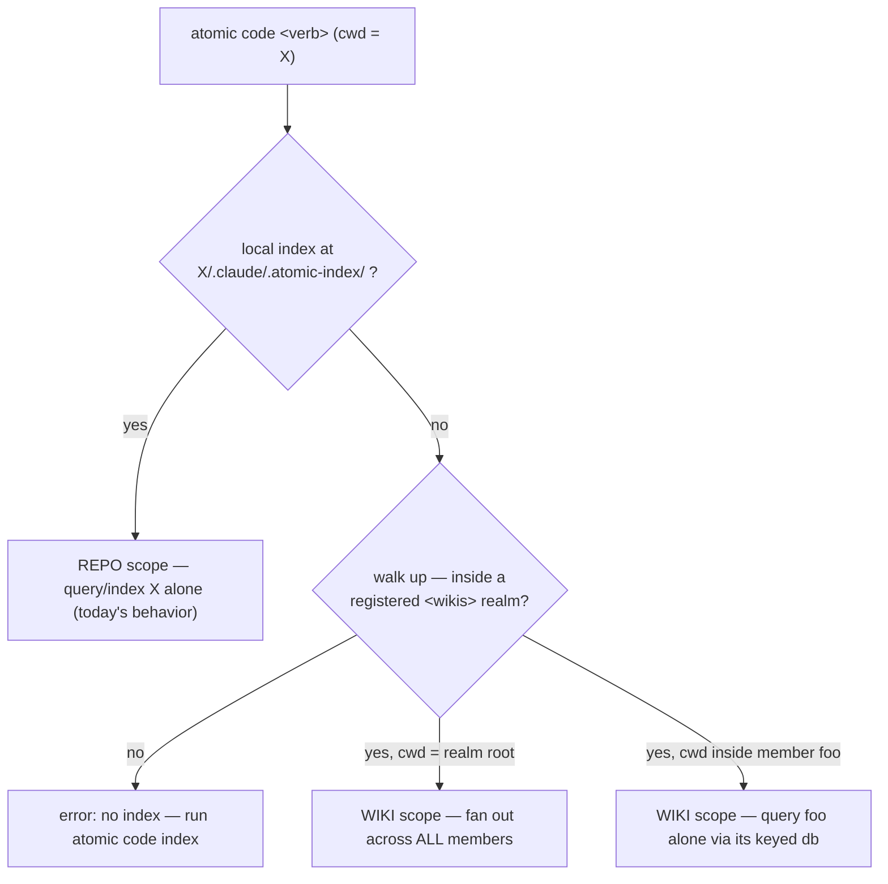

# Code-intel realm federation

## Problem

`atomic code` stores its symbol graph at a hardcoded path (`<projectRoot>/.claude/.atomic-index/atomic.db`) and indexes exactly one repo. The source root and the db location are the same value — `engine.New(projectRoot)` uses `projectRoot` both as the tree to scan and the place to write the db (`engine.go:52-56,86-88`).

This bites in a **wiki realm** — a root directory holding many member repos plus a `wiki/` summary layer (the shape `/refresh-wiki` and the `<wikis>` block already manage). In that layout you cannot index without writing `.claude/.atomic-index/` into a member repo you may not own or want to keep clean, and there is no way for realm tooling to query across members.

Reported as issue #54. Verified against `4.5.0`. The issue proposed a configurable `--db` path; the design below lands on **automatic scope detection** instead — no user-facing path flag, because there turn out to be exactly two scopes and each one places its db on its own.

## Goals / Non-goals

- Goals:
    - Index N member repos under a realm into N separate per-repo dbs, and query across them.
    - Never write index state into a member repo when operating in realm scope.
    - Make the session model aware, in-context, that a realm's members are code-indexed and how to query them.
    - Keep standalone (single-repo) behavior unchanged, byte-for-byte.

- Non-goals:
    - **Merged cross-repo graph.** No cross-repo symbol/call/import edges. A call from repo A into repo B's exported symbol stays unresolved in A's graph. (Federation, not merging.)
    - **A user-facing `--db` flag / arbitrary detached-db scope.** YAGNI — there are two scopes (repo, realm) and each locates its db automatically. No third "point an arbitrary db at an arbitrary tree" mode, so no flag, no source-root meta row.
    - **MCP realm awareness.** The CLI is sufficient for an LLM to drive; the MCP server stays single-root, unchanged. No realm fan-out over MCP.
    - Index format / backend changes.
    - Any change to the `sg`/`grep` graceful-degradation contract.

## Concept — two scopes, position-sensing

There are exactly two scopes, and `atomic code` picks between them by **where you stand**, with no flag:

- **Repo scope** — a standalone repo with its own index. Unchanged from `4.5.0`: db at `<repo>/.claude/.atomic-index/atomic.db`, root derivable from the db's own location.
- **Wiki scope** — cwd is under a registered realm and has no local index. Resolution walks up, finds the realm, and uses the realm's federated dbs.
- **Scope = position.** At the realm root, query verbs fan out across every member. Inside member `foo`, a query returns only `foo`'s results, served from its keyed db. The model is intuitive: results match where you are.

## Storage & awareness surfaces

All realm machine-state lives in `<realm>/.atomic/` — **outside** the `wiki/` git repo. The realm root is a plain container directory (verified: `/Users/alonso/projects/spt` is not a git repo; only `wiki/` is), so `.atomic/` is inherently untracked — nothing to gitignore.

| Surface | Path | Consumer | Tracked? |
|---------|------|----------|----------|
| machine config | `<realm>/.atomic/code.toml` | CLI (parse) | no — regenerable from `<wiki-scan>`; seed is append-don't-overwrite, so re-scans preserve manual edits |
| db data | `<realm>/.atomic/<key>.db` | engine | no — binary noise, 3–10 MB/repo; the wiki's git history is for knowledge, not machine state |
| LLM awareness | `<code-index>` XML block in `<realm>/CLAUDE.md` | session model | n/a — regenerated only on membership/key change, never on a routine index run |
| read instruction | one ¶ in the global `<atomic>` CLAUDE.md | every session | shipped in the bundle |

Repo scope keeps its `4.5.0` home: `<repo>/.claude/.atomic-index/atomic.db`.

## Approaches

### Federation vs merged graph (the pivotal fork)

| # | Approach | Pros | Cons |
|---|----------|------|------|
| A | **Federation** — N independent per-repo dbs; verbs fan out | no cross-repo resolution work; resolution pipeline unchanged (per-root); incremental per repo; matches consumers' existing per-repo + `sg` fallback | cannot follow a call from repo A into repo B (stays unresolved/external) |
| B | Merged graph — one db spanning all members, cross-repo edges | "who calls B's `Foo` from A?" resolves | cross-repo resolution is the expensive/hard part; resolution pipeline assumes a single root — large rework; new query semantics for every consumer |

**Chosen: A (federation).** Buys the realm value that matters — find/query across all repos — for a fraction of the cost. The only loss is following a call across a repo boundary, which the fan-out-and-aggregate consumers rarely need. B is dropped, not deferred; revisit only if a concrete cross-repo-call use case appears.

### How does the db location decouple from the source root?

| # | Approach | Pros | Cons |
|---|----------|------|------|
| A | **Automatic scope detection** — repo→local, realm→`.atomic/<key>.db`; root always derivable from db location + config | no flag, no meta row, no third scope; standalone db never changes | the rare "arbitrary db at arbitrary tree" case has no escape hatch (none exists today) |
| B | `--db` flag + per-repo `db=` override + source-root meta row in the db | supports an arbitrary detached db | scaffolding for a third scope nobody asked for; meta row is a second record of the source root that can drift from config; writing it changes the standalone db (breaks byte-for-byte-unchanged) |

**Chosen: A.** With only two scopes and each placing its db automatically, the source root is always derivable from the db's location plus the config — nothing needs to be *told* where the root is. B's `--db`/override/meta-row all served a third scope that does not exist; dropping them keeps both real scopes simpler and removes a config-vs-meta-row drift hazard. Re-adding a flag later is additive and non-breaking, so deferring costs nothing.

### Config + awareness substrate

| # | Approach | Pros | Cons |
|---|----------|------|------|
| A | **TOML in `.atomic/` + `<code-index>` XML block in realm CLAUDE.md** | typed config via existing `go-toml/v2`; machine state out of the wiki's knowledge-history git; realm CLAUDE.md loads into member sessions (upward walk crosses git boundary), so the block makes the model aware; XML block is a clean tag-swap to regenerate | two surfaces (config + block) kept in sync, one generated from the other |
| B | markdown `## Code index` section in CLAUDE.md | human-readable | rewrites the user's CLAUDE.md on every index run; a markdown splice rather than a clean tag swap |
| C | `<code-index>` block in `wiki/index.md` | co-located with `<wiki-scan>` | `wiki/index.md` is never loaded into context, so it gives the model zero awareness — defeats the entire purpose |

**Chosen: A.** Awareness only happens in a surface that loads into context; `wiki/index.md` (C) never does, so it cannot make the model aware. Between an XML block (A) and a markdown section (B), the block regenerates as a clean tag swap and — regenerated *only on membership/key change*, not every index run — almost never churns the user's CLAUDE.md. The generic "how to read a `<code-index>` block" instruction ships once in the global `<atomic>` block; the per-realm data block lives in the realm CLAUDE.md.

## Recommendation

Federation + automatic two-scope detection + `.atomic/` storage + `<code-index>` XML awareness block. Behavior:

- **Standalone (repo scope):** unchanged. Local index at `<repo>/.claude/.atomic-index/atomic.db`; same output, same exit codes as `4.5.0`.
- **Realm (wiki scope):** `atomic code index` indexes every non-excluded member → `<realm>/.atomic/<key>.db`; no member repo is touched. Query verbs are position-sensing: at the realm root they fan out across all members and group output by `[key]` (or a `{ "<key>": … }` object under `--json`); inside a member they return that member alone.
- **Fan-out partial failure:** a member with no db yet is skipped with a surfaced `[key] not indexed` line; the operation completes across the rest. One cold member never breaks the run.
- **Seeding:** first realm `index` with no `code.toml` seeds one entry per `<wiki-scan>` member (`key` = basename, slugged on collision; `path` = member path), marking `pending`-status and `trash/`-pathed members `exclude = true`. Append-don't-overwrite: later members append as excluded, existing entries (and manual edits) are never clobbered by a re-scan.
- **Awareness:** the `<code-index>` block in the realm CLAUDE.md is regenerated only when membership or keys change.

## Relationship to in-flight `artifact-consolidation`

Orthogonal — roster reduction vs a new code-intel capability. Overlap is additive in different regions of shared files (`cliusage.go`, `main.go` dispatch, `atomic-help.md`, the `agent-code-intel` partial composition). Robustness rule: this work references implementers **by role and via the `agent-code-intel` partial**, never a hard-coded agent list — so a merged `atomic-implementer` and a dropped `atomic-haiku` recompose without touching this feature. Conflicts, if any, are line-level.

## Open questions

None — all resolved during the 2026-06-13 pressure-test:

- Key collisions → slug the realm-relative path; user can rename the `key`.
- Per-repo language scope → dropped; always index all detected languages.
- Config placement → `<realm>/.atomic/` (config + dbs), untracked.
- MCP realm awareness → dropped from scope; CLI suffices.
- Doctor in a realm → one check, worst severity across N dbs, detail names only the repos needing action.
