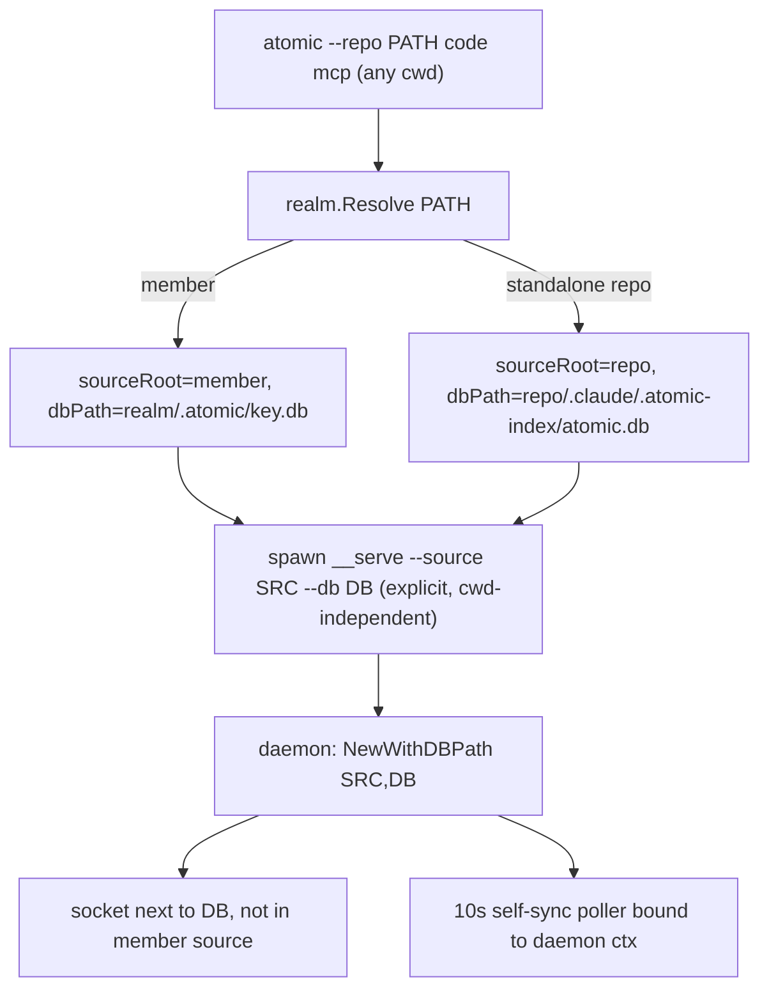

# Per-repo code-intel MCP: serve by explicit path, not cwd

## Problem

`atomic --repo <path> code mcp` is meant to run one MCP server per repo, so a `.mcp.json` can register several (one per member of a realm) and Claude Code queries each repo's symbol graph. It does not work: the server never registers its tools, sitting on "still connecting".

Reproduced deterministically. Claude Code launches an MCP server with its cwd at the directory holding `.mcp.json` — for a realm that is the **realm root**, which is not a git repo. From there:

```
atomic --repo /…/taxgentic/gui code mcp        (cwd = /…/taxgentic, not a git repo)
  → proxy resolves --repo gui (ok, no git needed)
  → spawns:  atomic code __serve gui     (child inherits cwd = /…/taxgentic)
  → child re-resolves scope from CWD, not from its path arg:
       realm.Resolve(/…/taxgentic) = ScopeRealmAll → __serve is in the realm reject set → daemon exits
       (or, from a plain non-git dir: repoctx.Resolve("") → git rev-parse fails → exit 128)
  → socket never binds → proxy waitLive times out (10s) → "daemon did not start within 10s"
```

Verified: from the realm root, `stdout` is empty, stderr is `daemon did not start within 10s`, no daemon survives. From inside a git repo it "works" only by accident of cwd.

Second defect, same area: a realm member has no local index — its graph lives at `<realm>/.atomic/<key>.db`. The `--repo` path forces single-repo scope (`repoctx.Resolve` → looks only at `<path>/.claude/.atomic-index/`), so even if the daemon started it would serve an empty index and `Init` would write a junk `.claude/.atomic-index/` **into** the member (the realm model's whole point is to keep members pristine).

## Goals / Non-goals

**Goals**

- `atomic --repo <path> code mcp` starts and serves regardless of launching cwd (realm root, any non-git dir).
- The served db is resolved from the explicit path: realm member → its realm db; standalone repo → its local index.
- Nothing (db, socket, lock) is written into a realm member's source tree.
- N per-repo MCP servers run concurrently from one `.mcp.json` with no collision.
- The daemon keeps its index fresh by syncing periodically (default 10s).

**Non-goals**

- Realm-mode / fan-out MCP, grouped results, a `member` tool arg. Each MCP is single-repo. (Decided against in design review — Claude works in one repo at a time; N per-repo servers match how `.mcp.json` already wires `noorm`.)
- A standalone `atomic code watch` verb or a wiki watcher. The periodic sync lives only inside the MCP daemon.
- Search-tier prompt changes and sync-on-commit (separate effort).
- Windows.

## Root cause (one line)

The daemon (`__serve`) and the `code` dispatch resolve project scope from the **current working directory** instead of trusting the path they were handed; launched from a non-git / realm-root cwd (where `.mcp.json` lives), the spawned daemon dies before binding its socket.

## Approaches

| # | Approach | Pros | Cons |
|---|----------|------|------|
| A | Spawn daemon with explicit (sourceRoot, dbPath); daemon uses `NewWithDBPath`, never consults cwd | cwd-independent; fixes db-location + pollution in one move; no realm-verb-rejection in the daemon | touches proxy spawn + daemon signature + socket path |
| B | Set `cmd.Dir = <member>` on the spawn so cwd becomes the member | smaller diff | member dir is a git repo but the index is under the realm → still wrong db; still pollutes; fragile |
| C | Make `--repo`/`__serve` run `realm.Resolve(path)` in the existing dispatch | reuses position-sensing | still routes through the realm-verb-rejection (mcp/__serve rejected in member scope); needs un-rejection anyway |

## Recommendation

**A.** The proxy resolves the explicit path once (via `realm.Resolve(path)` for db-location: member → `<realm>/.atomic/<key>.db`, standalone → local index) and spawns the daemon with **explicit** sourceRoot + dbPath. The daemon constructs its engine with `NewWithDBPath(sourceRoot, dbPath)` and never consults cwd or the realm-verb gate. The socket/lock are keyed to the **db directory** (members → under `<realm>/.atomic/`, repos → the local index dir as today), so members stay pristine and per-member sockets don't collide. A periodic in-daemon sync (default 10s, bound to the daemon ctx) keeps the served graph current; the already-landed lazy pool makes each sync cheap and only boots a parser when a file actually changed.



## Open questions

- Socket naming under `<realm>/.atomic/` for members (e.g. `<key>.mcp.sock`) — pick a non-colliding scheme; confirm repo-mode socket path is unchanged.
- Self-sync flags on `code mcp` (`--watch-interval`, `--no-watch`) — default 10s, on.
