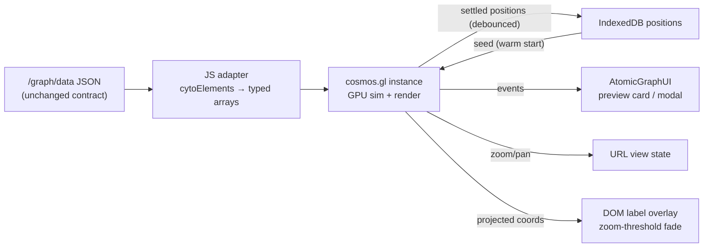

# Cosmos system graph

## Problem

The serve system graph (full-pane network view) feels clunky next to Obsidian's graph view. Three structural causes, all in the current engine choice (Cytoscape canvas 2D + one-shot cola layout):

- **CPU rendering.** Cytoscape's canvas 2D renderer re-rasterizes every node/edge/label per frame on the main thread; pan/zoom drops frames as graphs grow.
- **One-shot layout.** cola solves once (2.5s cap, `layout.html:901`) and freezes. Obsidian's "alive" feel is a continuous force simulation with damped physics and drag reheat. Reheating cola was tried and rejected — a constraint solver re-solves and lurches (`layout.html:967-973`).
- **No headroom.** Canvas 2D degrades near ~3k nodes (published Cytoscape benchmark: 3fps at 3,200 nodes / 68k edges). Current realm graphs are 2–322 nodes, but the product intent is massive-workload tolerance: monorepo realms and a future code/symbol-graph view (100k+ nodes in `atomic.db` on large repos).

Requirement set by the user: Obsidian-grade smoothness at current scale AND survive abuse-scale without a second engine migration.

## Goals / Non-goals

- Goals:
  - Continuous force simulation: nodes flow, drag reheats locally, 60fps at current scale.
  - Scale ceiling effectively unreachable (100k+ nodes) with the same engine.
  - Full interaction parity with today's system view: hover preview card, click modal, legend type-filter, zoom/pan→URL recording, theme flip, provenance edge styling, position persistence across opens.
  - Node labels with zoom-threshold fade (Obsidian behavior) — an *upgrade* over today's always-on labels.
  - Zero runtime build step preserved (vendored, committed JS assets).
- Non-goals:
  - Rail mini-graph migration — stays Cytoscape (`concentric` layout, ~10 nodes; `layout.html:588-596`).
  - Symbol-graph rendering itself — this work builds the engine headroom, not the code-graph view.
  - New `/graph/data` payload format (typed-array / LOD). The JSON contract stays; the payload is the named scaling seam for when symbol-graph scale arrives.
  - 3D view, clustering, community detection.
  - Live reload / file-watch refresh of the graph — separate planned feature; nothing here may pre-build it.
  - WebGL context-loss auto-recovery — deferred; adjacent to the live-reload remount machinery.

## Approaches (engine)

| # | Approach | Pros | Cons |
|---|----------|------|------|
| A | force-graph (vasturiano): d3-force + canvas | UMD script tag, smallest glue, live sim built in | Canvas 2D ceiling ~2k nodes — fails the headroom requirement |
| B | sigma.js + graphology: WebGL render, forceatlas2 worker layout | Battle-tested (Gephi lineage), labels built in | Layout is separate assembly; ceiling tens-of-thousands — marginal for symbol graphs |
| C | Pixi.js + d3-force in worker (literal Obsidian architecture) | Full control | Most hand-rolled code (camera, picking, labels); ceiling ~20k; we maintain a renderer |
| D | cosmos.gl (`@cosmos.gl/graph`): GPU simulation + GPU rendering (luma.gl/WebGL2) | Sim AND render in shaders; 1M+ nodes real-time; MIT, OpenJS incubating; continuous physics native | ESM-only (no UMD); no text labels (DOM overlay needed); lower-level index-based API |

## Recommendation

**D — cosmos.gl.** Only option whose ceiling makes the headroom requirement moot; out-scales Obsidian's own architecture rather than matching it. Continuous GPU physics gives the Obsidian feel natively at any size. Interaction surface maps 1:1 to existing wiring: `onClick` → `AtomicGraphUI.openPageModal` (`layout.html:985-988`), `onPointMouseOver` → preview card (`layout.html:983`), `enableDrag`, `fitView`, `setPointPositions(Float32Array)` → IndexedDB warm start (`layout.html:826-855`). Decided with the user 2026-07-04 after the scale requirement was made explicit.

Conceptual flow of the replacement mount:

## Motion policy

Calm by default, alive on interaction. The physics primitives were verified against cosmos.gl docs (context7, 2026-07-04): `setPinnedPoints` (fix points against forces, still draggable), `start(alpha)` (bounded reheat energy), `pause()`/`unpause()`/`isSimulationRunning`, `onSimulationEnd`.

| State | Behavior |
|-------|----------|
| Fresh mount (no cached positions) | Sim runs to rest (`onSimulationEnd`), then pauses |
| Cached open, unchanged fingerprint | Seed positions, pause immediately — exact replay, zero motion, zero cool ("seed-and-pause"); seed is applied before the first sim tick |
| Drag | Bounded local reheat; non-neighborhood stays put (pinning); release → cool → pause |
| At rest + viewport idle | Zero view-owned per-frame work — no readback, no DOM label writes, no JS-side animation loops. cosmos.gl's internal rAF redraw of the static scene continues: `pause()` stops only the simulation and `stopFrames()` is private (verified against unminified 3.1.0 source, 2026-07-04) — accepted upstream ceiling, candidate upstream feature request |
| Position saves | On drag release only (as today) — no per-open cache rewrite |

This preserves today's contracts the swap must not regress: exact position replay and hand-arranged maps (`layout.html:899-901,943,973`), zero idle cost, and the no-lurch rule recorded at `layout.html:967-973`.

## Sub-decisions

| Decision | Chosen | Why | Rejected |
|----------|--------|-----|----------|
| Data path | Reuse `/graph/data` cytoElements JSON; adapt client-side | Endpoint is shared with rail mini-graph (`?node=&depth=`, `graphoverlay.go:153-242`) and covered by tests (`graphoverlay_test.go`); transform is trivial at md-graph scale | New typed-array endpoint now — YAGNI at 322 nodes; named as the seam for symbol scale |
| Labels | DOM overlay divs; culling policy is a pure function (viewport + degree + zoom → label set) with a fixed numeric cap; zoom-threshold fade; hovered node's label always shown | CSS theming free; pure function is testable outside a browser; cap makes SC falsifiable | Canvas 2D overlay (second render loop to maintain); no labels (regression); unbounded labels (per-frame DOM cost negates GPU wins) |
| Find-by-name at low zoom | Served by the existing top-bar md search, not the graph | Labels culled at low zoom remove find-by-scanning for leaf notes; the product already ships the finder | Graph-side search affordance — duplicate of the top bar |
| Position cache | Keep IndexedDB store; "seed-and-pause" per the Motion policy; cache value format is versioned so pre-swap entries under an identical fingerprint are detected and discarded, never fed to `setPointPositions` | Preserves exact replay and hand-arrangements; fingerprint hashes realm content, not client code, so a format marker is the only stale-entry defense | Seed-and-cool — a per-open sim burn that erodes exact replay, rewrites the cache every open, and destroys hand-arranged maps (challenge finding, 3 lenses) |
| Vendoring | One-time `esbuild --bundle`; committed single-file output in `assets/vendor/`; provenance record committed alongside (package@version, resolved dependency pins, esbuild version, exact command, output checksum) | Zero runtime/CI build step; without pins the bundle is irreproducible and CVE triage in 2028 is impossible — verified that no existing vendor file carries provenance, so this work defines the pattern rather than citing one | Runtime build step; vendoring raw ESM dep tree (luma.gl tree impractical); "match existing pattern" — no such pattern exists |
| Code home | System-graph subsystem lives in a served static asset (`assets/system-graph.js`), not inline in `layout.html` | The rewrite touches nearly every line anyway; `layout.html` is 1,661 lines with ~1,400 of inline JS that Go tests can only substring-grep; a static file costs one script tag (same `go:embed assets`) and makes the culling policy and adapter lintable/testable | Staying inline — entrenches an untestable 2k-line template as a WebGL app's home |
| WebGL2 failure UX | Detect unavailability at mount; clear the loading indicator; render a message naming the WebGL2 requirement in the existing error affordance. The working-rail/black-system split is accepted and the message is what makes it explainable | `getContext('webgl2')` returns null rather than throwing — the current fetch-chain `.catch` (`layout.html:990-994`) never fires, leaving a hung "Laying out graph…" spinner; remote-desktop/VM/policy-managed browsers make this Medium likelihood, not Low | Silent caveat-in-docs (shipped mystery-blank view); canvas 2D fallback renderer (second engine for the same view) |
| `AtomicGraphUI` contract | Becomes engine-neutral: helpers take plain data (node id, type, meta, screen coords), rail call sites updated in the same change; preview card stays anchored to its node while the node moves | Current signatures consume Cytoscape objects (`cyNode.renderedPosition()`, `cy.getElementById()` — `layout.html:376-434`); cosmos delivers an index + coords; duck-typed fake nodes would split the API into trusted/untrusted halves | Fake Cytoscape node shims (hidden coupling; rail passes real nodes, system passes fakes) |
| Legend filter semantics | Filtered-out types: alpha-0 recolor, excluded from hover/click by guard, layout does not reflow (points keep simulating in place) | Chip toggle today is purely visual (`layout.html:799-812`); a reflow on filter scrambles the user's map; alpha-0 sim participation is trivial at md scale | Removing points from the sim (map reflows on every chip toggle); Cytoscape-style display toggling (no cosmos equivalent) |
| cola cleanup | Remove `cola.min.js` + `cytoscape-cola.js` + registration bridge (`layout.html:106-115`) | System view was the only cola consumer; rail uses `concentric` | Keeping them — dead weight |
| Rail mini-graph | Untouched Cytoscape | 10-node concentric graph has no smoothness problem; shared `atomicCyStyle` factory stays for it | Migrating both — scope without payoff |

## Parity inventory

Every behavior the swap must preserve (from ground pass, 2026-07-04):

| Behavior | Current wiring |
|----------|----------------|
| Hover preview card | `layout.html:983`, `AtomicGraphUI.showPreviewCard` (`layout.html:345-504`), anchored to container coords |
| Click → page modal | `layout.html:985-988`, `AtomicGraphUI.openPageModal` |
| Legend type-filter chips | `buildLegend` (`layout.html:707-1022` block), CSS `app.css:1325-1374` |
| Zoom/pan → URL | `readViewFromURL`/`writeViewToURL`, debounce 250ms (`layout.html:710,915,977-981`) |
| Theme flip re-style | `layout.html:1197-1210` re-applies style from CSS vars |
| Degree-based node sizing | computed in JS from edges (`layout.html:888-895`) |
| Node type colors (OKF) | `atomicCyTypeColors` (`layout.html:120-191`), types from `graph.go:133-200` |
| Provenance edges | `fingerprint` / `fingerprint drift` classes (`graphoverlay.go:339-388`) — need distinct link styling in cosmos |
| Position persistence | IndexedDB `atomic-serve/graph-layout`, keyed by `X-Graph-Fingerprint` (`layout.html:826-855`, `graphcache.go:58-90`) |
| Mount/teardown lifecycle | htmx delegated mount (`layout.html:999-1004`), `mode-system` body class, history-restore survival |
| Lifecycle guards | Double-mount flag (`layout.html:861-863`), instance destroy on swap-out (`teardownSystemGraph`, `layout.html:726-748`), mid-fetch teardown safety. Under WebGL the destroy is load-bearing: browsers cap live GL contexts, so a leaked instance per open/close cycle eventually blacks out the view |
| Loading indicator | `.system-graph-loading` (`serve.go:33-37`, `app.css:1312-1322`) — including its failure branch: it must clear on any mount failure, never hang |

## Open questions

- Bundle size of cosmos.gl + luma.gl after esbuild is unverified until first build. Acceptance bar: anything under `mermaid.min.js` (3.3MB, already vendored) is tolerable; expected well under.

## Challenge outcomes (2026-07-04)

A five-lens challenge swarm (performance, end-user, maintainer, tester, runtime-compat) attacked the first spec draft. The engine choice survived; every high-severity finding targeted the surrounding contracts and is folded into the sections above: the Motion policy section (sim rest, seed-and-pause, local drag reheat), the WebGL2 failure UX, provenance, code-home, `AtomicGraphUI`, label-cap, and filter-semantics sub-decisions, and the Lifecycle-guards parity row. Two conflicts were resolved by decision: label findability at low zoom is delegated to the existing md search; filtered types never reflow the layout. Known residual risk, accepted: CI has no browser/GPU, so client runtime behavior is verified manually at implementation time — the mitigations are accurate test premises, the extracted testable JS asset, and a local bundle import smoke; an automated browser harness is out of scope.

## Rejected engine notes

force-graph was this design's original recommendation when the requirement was current-scale-only; the scale requirement stated 2026-07-04 ("should handle massive workloads") eliminated it. Sigma.js remains the fallback if cosmos.gl's label-less, index-based API proves too costly in practice — it trades ceiling for built-in labels.
