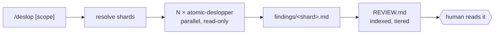
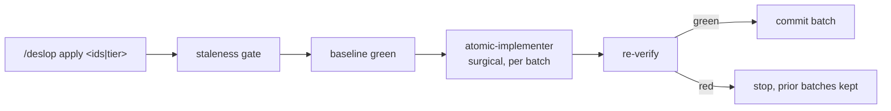

# /deslop: auditing a standing codebase against atomic conventions

## Problem

Every review surface atomic ships is **diff-scoped**. Nothing looks at a codebase
as it stands.

| Surface | Sees | Trigger |
|---------|------|---------|
| `atomic-reviewer` | one iteration's diff against a spec | inside the implement loop |
| `/review-branch` | `base..HEAD` | pre-PR |
| `/commit` review gate | staged diff | pre-commit |
| `atomic-auditor` | one task's SHA range | end of a loop |
| `/retrospective-learning` | session transcripts, installed artifacts | after friction |

The gap is the code that was already there. A repo adopting atomic mid-life
carries whatever it accumulated before the conventions applied: comments that
narrate the line below them, an `AbstractRepository` with one implementation, a
hand-rolled date formatter, exports nothing calls, README prose written in
launch-post voice. None of that is a bug, so no reviewer ever sees it, and none
of it appears in a diff, so no gate ever fires on it.

`todo.md` has carried "cleanup this codebase without breaking the public API" in
the backlog for exactly this reason. The need is real here and in every repo the
config installs into.

## Goals / Non-goals

- **Goals**
  - Audit a standing codebase against conventions atomic already defines, not a new ruleset.
  - Survive a large repo — a shard-and-fan-out pass, not one agent reading everything.
  - Land findings in a file the user reads on their own time, with a human gate before anything changes.
  - Preserve behavior when fixes are applied, and be explicit about where that guarantee stops.

- **Non-goals**
  - Bug hunting. `atomic-reviewer` and `/code-review` own correctness; this owns accumulated cruft.
  - Replacing a linter. Anything `eslint`, `ruff`, or `go vet` already catches is out of scope.
  - Refactoring for architecture. Moving a module is a design decision, not slop removal.
  - Auto-fixing everything it finds. The report is the deliverable; fixes are a separate, gated verb.

## What counts as slop

Every category resolves to a rule atomic already carries. Nothing here is invented
for this command, which is what keeps `/deslop` from becoming a second, drifting
style authority.

| Category | Rule it comes from |
|----------|--------------------|
| Comment noise | comment-discipline principle, `agent-comment-discipline` partial |
| AI-tell prose in shipped docs | `atomic-writing` skill |
| Speculative abstraction | YAGNI ladder, step 7 |
| Hand-rolled stdlib or platform feature | YAGNI ladder, steps 4-5 |
| Duplicate of an existing helper | YAGNI ladder, step 2 |
| Dead code | no callers in the symbol graph |
| Errors used as control flow, swallowed failures | `rules/typescript/style.md`, `rules/python/style.md` |
| Drift from the repo's own stated conventions | the project's `CLAUDE.md` and `docs/wiki/` |

Dead code is the one category that gets **proof** rather than judgment:
`atomic code callers <symbol>` returning zero is evidence a grep sweep cannot
match. Where the index is cold, the category degrades to a heuristic finding and
says so.

## Shape

Two phases with a human gate between them. The gate is the point — a command that
audits and fixes in one pass is a command nobody can review.

Phase 1 audits and stops.

Phase 2 runs only when the user comes back and names what they accepted.

Phase 1 writes only into the scratchpad bundle. Phase 2 is the only phase that
touches source, and it starts from findings the user marked, never from the full
list. A user who never runs Phase 2 is left with a report and an unchanged repo,
which is a legitimate outcome rather than an abandoned run.

### Sharding

One agent cannot hold a real codebase, and one agent per file is thousands of
dispatches. Shards sit in between.

| Approach | Verdict |
|----------|---------|
| One agent, whole repo | Rejected — context overflows on anything past a toy repo |
| One agent per file | Rejected — dispatch cost swamps the work, and cross-file duplication becomes invisible |
| One agent per wiki domain, falling back to top-level source directories | **Chosen** |

Domains already exist in `docs/wiki/index.md` and are defined as "things that
break together", which is also the right boundary for spotting a duplicated
helper. A repo with no wiki falls back to top-level source directories, which is
the same idea with a worse map.

### Why a new agent

`atomic-deslopper` is a new read-only agent rather than a reuse of an existing one.

| Candidate | Why not |
|-----------|---------|
| `atomic-reviewer` | Its contract is diff plus spec plus TDD signals plus `VERDICT:`. Every other caller depends on that shape; bending it to audit standing files dilutes a contract five commands rely on. |
| `atomic-investigator` | Explicitly refuses to judge. Locating is not auditing. |
| `atomic-strategist` | Read-only reasoning over a question, returning prose. Not file-set scoped, no per-finding output. |

Fixes reuse `atomic-implementer` in surgical mode. No new implementer is needed:
a slop fix is by definition small and mechanically obvious, which is what surgical
mode already is.

## Safety tiers

"Without breaking functionality" is not a promise a model can make. It is a
property of *which* findings get auto-fixed, so the tier is assigned per finding
at audit time and carried into the fix phase.

| Tier | Covers | Fix rule |
|------|--------|----------|
| `safe` | comments, doc prose, unused imports | No behavior surface. Fix directly. |
| `guarded` | dead code, duplicate helpers, speculative abstraction, defensive cruft | Green baseline required before the change and green re-run after. No test suite in the repo demotes every `guarded` finding to `report-only`. |
| `report-only` | exported or public API, dynamic references (reflection, DI containers, route tables, string dispatch), generated files, anything the agent could not resolve | Never auto-fixed. The user decides by hand. |

The demotion rule is what makes this usable in an untested codebase: `/deslop`
still audits it, still writes the report, and refuses to touch code it
cannot prove it did not break.

`report-only` catches the failure mode that matters most. `atomic code callers`
sees this repository; it does not see a downstream consumer importing the package.
An unreferenced export is therefore evidence of nothing on its own, which is why
public surface never leaves the report.

## What bites

- **Findings age.** The report is a snapshot against a SHA. It records the SHA it was taken at, and `/deslop apply` refuses to run against a materially different tree rather than editing lines that moved.
- **A large repo produces a large report.** Findings are grouped by tier and category with counts up front, so the user can accept a whole tier without reading every line.
- **Judgment, not lint.** Two runs will not produce identical lists. That is acceptable for a manual, gated verb and would not be acceptable for a CI gate, which is why this is not one.
- **The fix phase can still regress.** `guarded` leans on the repo's own tests. A repo with weak tests gets weak protection, and the tier table is the honest statement of that, not a workaround for it.

## Change log

- 2026-09-04 — Initial design.
