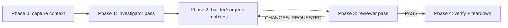

# Diagnose orchestrator (`/subagent-diagnose`)

> **Latest decision (2026-05-18):** ship as a single command `/subagent-diagnose` with two input modes (`ci` and `bug`) sharing one engine file. Naming aligned with `/subagent-implementation` to signal the orchestrator pattern. Body below is preserved as the audit trail of the design path — earlier headings still say "two commands" / "`/diagnose-ci` only" because those were the prior recommendations. See `## Recommendation` for the current contract; everything above it documents how we got there.

## Problem

Two recurring failure-investigation flows currently have no orchestrator:

1. **CI failure remediation.** A CI run failed. The user wants Claude to pull logs, isolate the failing step, propose a fix, write a regression test, commit, and re-watch CI. Today this is ad-hoc — the user copies log excerpts into chat and drives investigation turn-by-turn.
2. **Cross-session bug investigation.** A bug spans more than one session, or needs investigator + builder + reviewer with persistent scratchpad context. Today the `atomic-debug` skill handles fast in-context hypothesis loops, but anything heavier (multi-file surface, needs test + fix + review) falls back to manual orchestration.

Both flows share the working-memory + multi-agent pattern proven by `/subagent-implementation`. Neither has a contract.

## Goals / Non-goals

- **Goals.**
    - Decide whether the two flows ship as one spec or two.
    - Define the shared orchestrator substrate (scratchpad layout, agent sequence, FOLLOWUPS handling, hard-stop discipline) once, so both specs reference it instead of duplicating it.
    - Settle the brief-verbosity rule: the orchestrator transfers everything to the next agent so no re-discovery happens.
    - Settle the iteration cap and bail-out behavior.
- **Non-goals.**
    - Replacing the `atomic-debug` skill. Skill stays for fast in-context loops; `/diagnose-bug` is the orchestrated heavy-debug counterpart.
    - Replacing `/watch-ci`. `/diagnose-ci` *uses* the watch-ci pattern for its re-watch phase; it does not subsume it.
    - Auto-firing on CI failure or error pastes. Both are user-invoked slash commands (axiom 5: skills auto-fire; commands are explicit-only).
    - Touching `/subagent-implementation`. The pattern is being adapted, not extended in place.

## Shared substrate

Both commands follow the same five-phase loop:

Caption: shared phase pipeline. Phase 0 is unique per command; phases 1-4 are largely identical.

### Scratchpad layout

| Path | Contents |
|------|----------|
| `.claude/.scratchpad/<YYYY-MM-DD>-<topic>/BRIEF.md` | Pointer to source (failed run ID / bug report), current iteration scope, reviewer feedback rollup |
| `.claude/.scratchpad/<YYYY-MM-DD>-<topic>/STATE.md` | Append-only iteration log |
| `.claude/.scratchpad/<YYYY-MM-DD>-<topic>/FOLLOWUPS.md` | Non-blocking findings carried across iterations; dispositioned at finalize |
| `.claude/.scratchpad/<YYYY-MM-DD>-<topic>/CONTEXT.md` | Phase-0 capture (logs for `/diagnose-ci`, repro + symptom map for `/diagnose-bug`) |

`<topic>` derivation:

- `/diagnose-ci` → `ci-<run-id>` (e.g. `2026-05-17-ci-9821334512`)
- `/diagnose-bug` → kebab slug from user-supplied brief (e.g. `2026-05-17-token-refresh-race`)

Teardown: scratchpad **archived** on success (PASS + clean exit) to `.claude/.scratchpad/.archive/<topic>/`; retained in place on bail-out for user inspection. `.archive/` is gitignored. Age-prune via `/git-cleanup` extension (defer; not part of these specs). Rationale: iteration logs are mineable later for pattern-of-failure analysis; deletion is irreversible information loss.

### Agent sequence

| Phase | Agent | Why |
|-------|-------|-----|
| 0 (CI) | `atomic-haiku` | Pull full CI logs into `CONTEXT.md`. Read-only, cheap. |
| 0 (bug) | foreground orchestrator | Capture symptom, repro, suspected surface. No agent — context comes from user. |
| 1 | `atomic-investigator` | Map suspect surface as `file:line — what` table. **Also emit scope estimate**: `files_touched_estimate: <N>` + `cohesion: tight\|loose`. Read-only. |
| 2 | `atomic-builder` or `atomic-surgeon` | TDD fix: failing test first, then implementation. **Orchestrator branches on Phase 1 scope estimate**: surgeon iff `files ≤ 2 && cohesion: tight`; builder otherwise. Picking before Phase 1 ran is a contract violation. |
| 3 | `atomic-reviewer` | Verify TDD signals, spot-check tests, emit `VERDICT`. |
| 4 (CI) | `atomic-haiku` | Re-watch CI run post-commit until terminal state. |
| 4 (bug) | foreground orchestrator | Run repro one more time, confirm fix, prompt user for FOLLOWUPS disposition. |

### Brief verbosity discipline (hard rule)

The orchestrator writes `BRIEF.md` *exhaustively*. Every fact the next agent needs to do its job lives in the brief — log excerpts, file:line references, base SHA, what's already been tried, suspected hypotheses. Nothing implicit.

Why: each subagent dispatch starts fresh. Tokens spent on a verbose brief are tokens saved on re-discovery. A short brief that forces the agent to re-grep the same files is a false economy.

### Iteration cap + bail-out

- **Hard stop.** Default N = 5 iterations of Phase 2→3 before bailing. **Per axiom 2 (memory-first)**: orchestrator reads user memory key `diagnose iteration cap` for override; falls back to 5. User says "remember diagnose cap is 3" → memory updated, future runs honor it.
- **Same-failure detection.** Compare *normalized* top-level error string across iterations. Normalization (applied before compare): strip `:\d+:\d+` line/col suffixes, absolute paths (replace with basename), ISO timestamps, hex addresses (`0x[0-9a-f]+`), test-runner durations (`\d+(\.\d+)?(ms|s)`). If three consecutive iterations report the same normalized error, bail early (the loop is stuck on the same symptom).
- **Bail behavior.** Retain scratchpad in place (not archived), print summary of what was tried, recommend user-driven next steps. Do not auto-open a PR comment or post anywhere.

### FOLLOWUPS disposition

Same flow as `/subagent-implementation` Phase 3: at finalize, present the FOLLOWUPS.md ledger, ask the user per-item to close / defer (promote to `.claude/project/followups.md`) / convert-to-spec.

## One spec or two — alternatives

| Option | Pros | Cons |
|--------|------|------|
| **A. One combined spec** (`docs/spec/diagnose-orchestrators.md`) | Substrate defined once. Easier to keep the two flows in sync when the substrate evolves. Single file to grep. | Phase 0 + Phase 4 differ enough that the spec becomes a `if /diagnose-ci do X else do Y` ladder. Readers looking for one command's contract have to mentally filter. Commits touching one flow conflict with commits touching the other. |
| **B. Two specs, no shared file** (`docs/spec/subagent-diagnose.md`, `docs/spec/diagnose-bug.md`) | Each command has a clean self-contained contract. No conditional ladders. Commits stay scoped. | Substrate duplicated. Drift risk: a change to scratchpad layout in one spec misses the other. |
| **C. Two specs + a shared substrate doc** (`docs/spec/subagent-diagnose.md` + `docs/spec/diagnose-bug.md` + `docs/spec/diagnose-substrate.md`) | Substrate defined once, command specs stay clean and reference it. Drift risk minimized. | Three files instead of one or two. Cross-reference burden — readers must follow links. Substrate file has no command of its own, which breaks the "one spec, one feature" convention. |

## Recommendation

**Ship `/subagent-diagnose` as a single command with two input modes (`ci` and `bug`). One spec file (`docs/spec/subagent-diagnose.md`) containing Goal / Non-goals / Invocation / per-mode Phase 0 + Phase 4 / shared Phase 1–3 loop / Checkpoints / Risks. No separate engine file — under N=1 consumer, a "shared engine" is just a split file with no readers benefiting from the split.**

Reasoning (post second reversal, 2026-05-18):

- Both prior entries (`/diagnose-ci` + `/diagnose-bug`) shared the same orchestrator shape: scratchpad brief → context-gatherer agent → builder/surgeon → reviewer loop → Phase 3 finalize. The only delta was the brief source. Two commands = two surfaces drifting independently for no benefit.
- Naming `/subagent-diagnose` (not `/diagnose`) mirrors `/subagent-implementation` and signals the orchestrator pattern at the call site. `/diagnose` alone would collide nominally with the `atomic-debug` skill (which is the in-context hypothesis loop, not an orchestrator).
- The mode subcommand (`ci` | `bug`) adds a Phase 0 + Phase 4 pair without touching the shared loop. Future modes (`perf`, `flake`) can be added the same way until one needs a different loop shape — at which point fork the engine file per its "When to fork instead of extend" rule.
- The earlier shelve-`/diagnose-bug` decision (made under the two-command shape) no longer applies. Under one command with mode subcommands, the `bug` mode is cheap to ship alongside `ci`. `atomic-debug` skill stays for fast in-context loops; `/subagent-diagnose bug` is the orchestrated escalation. F-1 (skill-boundary tweak) still tracks separately.

Prior reasoning (first reversal, 2026-05-17 — kept for the audit trail):

- Independent opus strategy review found the inline-sync infrastructure (substrate doc + check script + Makefile target + pre-commit hook + CI step) disproportionate for N=2 consumers. Bundle-regen precedent doesn't apply — that syncs generated artifacts from human sources; this would sync human text into human text.
- Strategic risk of the inline-sync pattern: future orchestrators won't pay the substrate tax — they'll fork inline. After two forks the substrate is meaningless and the sync infrastructure is dead weight that's hard to remove.
- Engine-by-reference precedent already exists in this repo: `docs/spec/session-report.md § Ship-verb integration` is the canonical source for ship-verb behavior, and ship-verb command files reference it by link rather than inlining. Same pattern works here.

### Shape — single spec, no separate engine

All loop semantics live in `docs/spec/subagent-diagnose.md` directly. No `_engine/` subdirectory, no shared loop file, no link-jump on read. Under one command with two modes, factoring loop content into a separate file produces a split file with one reader, not an engine — pure overhead. If a second orchestrator command ever earns its keep (e.g. `/subagent-perf-diagnose` with a fundamentally different loop), revisit the engine question then; until then, one spec is the simplest thing that works.

### Original alternatives table (kept for the audit trail)

| Option | Pros | Cons |
|--------|------|------|
| **A. One combined spec** (`docs/spec/diagnose-orchestrators.md`) | Substrate defined once. Single file to grep. | Phase 0 + Phase 4 differ enough that the spec becomes an if-ladder. |
| **B. Two specs, no shared file**, substrate duplicated verbatim | Each command self-contained. No conditional ladders. | Drift risk; reviewer-discipline-only. |
| **B+. Two specs, substrate inlined via fenced sync markers + drift gate** (originally chosen, then rejected at first reversal) | Read-time locality + mechanical drift prevention. | 5 pieces of new machinery for N=2 consumers; future forks bypass the tax; back-out cost high. |
| **C. Two specs + shared substrate doc, link reference** (chosen at first reversal, then made moot at second reversal) | Single source. No machinery. Pattern already in use (session-report.md). | One link hop on read. Engine file useless under N=1 consumer. |
| **D (chosen, second reversal).** One spec (`/subagent-diagnose`) with two modes, no engine file, loop sections inlined in the spec body. | Simplest scaffolding. One file to read. No premature factoring. | Modes converge in the body; a third mode with a different loop would force re-factoring. Acceptable — defer until it happens. |

## Cross-artifact wiring (must update when specs land)

Per `claude.local.md` → "Adding a new artifact" checklist, the spec PRs must include:

| Surface | What to update |
|---------|----------------|
| `CLAUDE.md` "Other commands" paragraph | Add `/subagent-diagnose` one-line description (covers both `ci` and `bug` modes). |
| `README.md` commands table | Add `/subagent-diagnose` with one-line description. |
| `commands/_templates/` | No new templates needed — reuse `implementer-prompt.md` + `reviewer-prompt.md`. |
| Bundle inclusion | No `bundlemirror/mirror.go` change — `commands/*.md` auto-bundles. |
| Signals refresh | `/refresh-signals` after command file lands. |

## Resolved open questions

All four questions from the initial draft were resolved by independent opus review (2026-05-17). Decisions baked into the substrate above:

| # | Question | Resolution |
|---|----------|------------|
| 1 | Phase 4 re-watch — separate command or inline? | **Inline via `atomic-haiku`.** Chaining `/watch-ci` loses scratchpad context and forces re-briefing. Same agent already used in Phase 0; reuse, don't chain. |
| 2 | `/diagnose-bug` input — spec or freeform brief? | **Freeform brief.** Bugs arrive without specs; gating kills the use case. Phase 0 `CONTEXT.md` capture is the contract. Mirrors `/diagnose-ci`'s log-driven Phase 0. |
| 3 | `atomic-debug` cross-link to `/diagnose-bug`? | **Yes, in a separate skill-edit PR.** Keep the spec PRs scoped. Add one line to the skill description per F-1 boundary pattern. |
| 4 | Concurrent runs on same topic dir? | **Refuse with manual-cleanup instruction.** Per axiom 3 (destructive ops explicit confirm), no silent overwrite. `--resume` is YAGNI until a user hits the collision twice. |

## Remaining open questions

- **Cohesion classification — who decides?** Resolved post-QA: orchestrator classifies `tight` / `loose` itself from the investigator's `file:line` surface map. No agent-contract amendment to `atomic-investigator.md` required. Surgeon self-refuses on >2 files; orchestrator falls back to builder on refusal.
- **`.archive/` retention window.** Default forever vs default N-day prune? Lean forever until disk pressure is a real signal; revisit via `/git-cleanup` extension if `.claude/.scratchpad/.archive/` grows past a memory-configured threshold. Not part of this spec.
- **When to introduce a second consumer.** The engine pays off at N≥2 consumers. Until then, this is effectively a one-spec system with the engine extracted for cheap forking later. If the second consumer never materializes (12 months on, only `/diagnose-ci` exists), inline the engine into the spec and delete the engine file.
