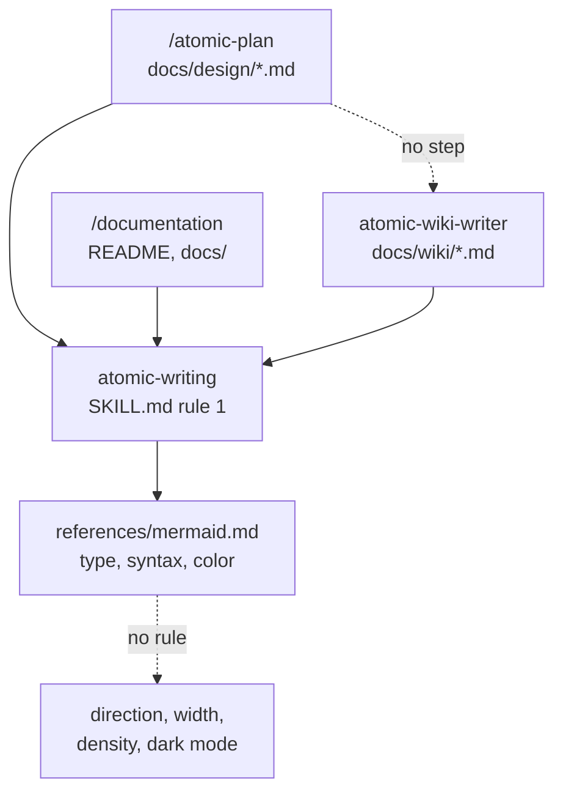
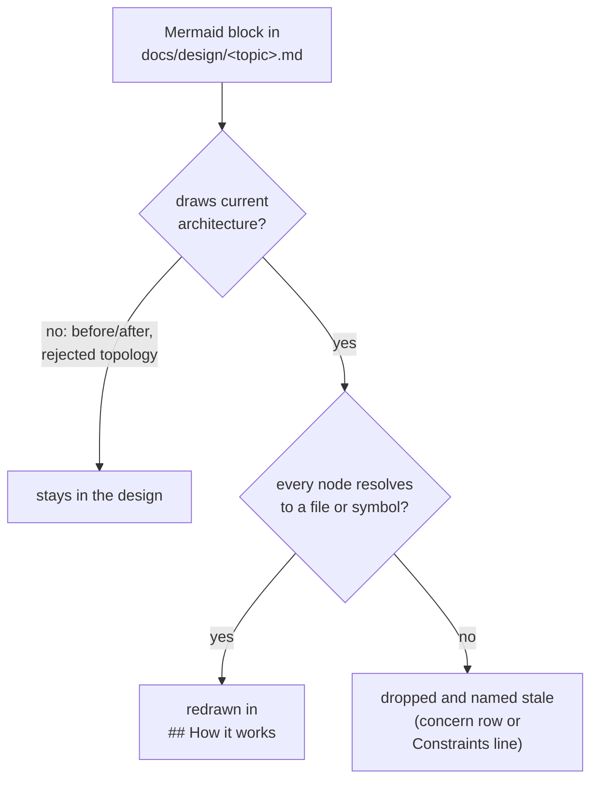

# Diagram legibility and carry-over

## Problem

Two gaps around diagrams, reported in issue #272 with nine dated complaints.

`context/skills/atomic-writing/references/mermaid.md` decides the diagram type and lists what breaks the parser. It says nothing about direction, width, node density, or what a fill color does in dark mode. Five of the complaints are the result: a mind map nobody could read, a design-doc block with broken syntax, a user-journey diagram whose labels rendered white over pastel in dark mode, a horizontal flowchart the reader asked to have turned vertical, and a data model called illegible. The skill body caps node counts (9 nodes, 6 participants, 8 entities), and every one of those diagrams could pass the cap and still be unreadable, because width and color are what failed.

The second gap is a missing step. `docs/design/` holds 36 Mermaid blocks across 29 files on this repo alone, and the wiki page for the same domain never sees them. The repo pipeline in `context/skills/atomic-wiki/references/repo.md` hands `atomic-wiki-writer` a source path set at Step 4 and tells it to draw from source, never from prose. A design doc is prose, so its diagrams stay behind. Four complaints trace to this: "good diagrams in designs don't make it over to wiki", ASCII where Mermaid belonged, a README never given a diagram, and a design doc's flows and data model never updated.

Every diagram-writing surface funnels through one skill and one reference file, so the missing rules have one home; the design-to-wiki path has no step at all:

`docs/design/doc-consolidation.md` already plans a role for design files in wiki inference (its section "Design and spec files get a role in wiki inference") and lists three edits to `repo.md`. That plan is `status: draft` and unshipped. The diagram row of its Step 4 change is what Gap 2 needs; this design ships that row and leaves purpose and vocabulary to the parent plan.

## Goals / Non-goals

- Goals:
    - A layout rule an agent can apply and a reviewer can verify by counting: a stated default direction, a side-by-side limit, a label-width limit, and per-type budgets.
    - A dark-mode rule that prevents the white-over-pastel case: no color statements, and the diagram types that paint their own palette are out.
    - Every current-architecture diagram in a domain's design docs reaches the domain's wiki page, redrawn against source, as an explicit writer step the reviewer checks.
    - Both directions wired: the inferrer's dispatch brief supplies the design docs, the writer's own file names the step, the reviewer checklist verifies it.
- Non-goals:
    - No Go code. No `atomic validate` rule that parses Mermaid; the check is a counting rule plus one `grep`, and a linter is a follow-up if the rule keeps failing in review.
    - No change to which surfaces get diagrams. The floors in `atomic-writing` rule 1 already require a drawing for a narrated process; the ASCII and README complaints are covered there and this change does not add a second trigger.
    - No purpose or vocabulary role for design docs in the wiki (the other two rows of `doc-consolidation.md`'s phase 2).
    - No backfill of existing docs. `docs/design/user-profile.md` carries a `style D fill:#dff` line today; it is the kind of line the new rule bans and it stays until that doc is next edited.

## Approaches

Gap 1, where the layout rules live:

| # | Approach | Pros | Cons |
|---|----------|------|------|
| A | A layout section in `references/mermaid.md`, with a rule/limit/check table; the skill body and the wiki reviewer checklist point at it | Loads only when a diagram is being written; one file to keep current; every writer surface already reads it | The check is manual counting |
| B | The rules in `SKILL.md` rule 1 next to the node budgets | Nothing to cross-reference | The skill body loads on every `.md` edit; eight more rules there cost tokens on turns that draw nothing |
| C | An `atomic validate` rule that parses Mermaid blocks and enforces the limits | Deterministic; blocks a commit | New parser, new dependency on Mermaid grammar; the limits are still being calibrated and a code gate freezes them |

Gap 2, how a design diagram reaches the wiki:

| # | Approach | Pros | Cons |
|---|----------|------|------|
| D | The inferrer passes the domain's design docs in the writer's dispatch; the writer redraws each current-architecture diagram against source; the reviewer checks presence and node resolution | No new subsystem; implements the diagram row `doc-consolidation.md` already planned; the source-not-prose rule holds because every node is checked against code | Costs the writer one more read per design doc |
| E | A code step copies Mermaid blocks from `docs/design/` into the wiki page | Deterministic | Copies whatever drifted; a design diagram draws intent and nothing checks its nodes against the code; a second place the same picture lives without an owner |
| F | Link only: the pointer card's `Designs:` category already lists the design docs | Zero change | The complaint is the picture, not a link to it |
| G | Fold the design doc into the wiki page | One picture, one place | That is phase 3 of `doc-consolidation.md`, a consolidation verb with its own gating |

## Recommendation

**A for Gap 1, D for Gap 2.**

A: `references/mermaid.md` gains a layout section. Each rule is a number and a way to count it, in a table, so a reviewer verifies it without judgment:

| Rule | Limit | Evidence for the number |
|------|-------|------------------------|
| Direction | `TD` unless the diagram is a straight chain of at most 5 nodes with one-line labels | The renderer fits the SVG to the page width, so width shrinks text and height costs a scroll; the 2026-08-28 complaint was exactly a horizontal chart with branches |
| Side by side | At most 4 nodes at the same depth; a node fans out to at most 4 | Four boxes of 24-character labels fill a GitHub content column at readable size; five do not |
| Label width | At most 24 characters per line, at most 3 lines, split with ` ` | A label sets its node's width and one long label widens the whole rank |
| Edges | At most 12; at most 2 backward | Crossing edges are what makes a dense flowchart unreadable, and crossings appear once edges outnumber nodes |
| Subgraphs | At most 3, never nested | A subgraph's `direction` is ignored once any node in it links outside (Mermaid flowchart docs, "Direction in subgraphs", limitation), so nesting does not give layout control |
| Sequence | 6 participants, at most 12 messages, participant names of at most 2 words | Participant names set the column widths |
| ER and class | 8 entities, at most 5 attributes each: keys plus what the claim needs | The 2026-09-08 "model illegible" case; attribute rows scale the box height and the whole diagram with it |
| Color | No `style`, `classDef`, `linkStyle`, `fill:`, or `%%{init` line; `journey`, `mindmap`, `timeline`, `gantt`, `pie`, `quadrantChart`, `sankey`, `gitGraph` are not used | A fill sets one half of a text/background pair and the host theme sets the other, which is the 2026-08-18 white-over-pastel case; the listed types carry fixed palettes the theme does not restyle |

Over any limit, the diagram is split by abstraction level: one overview in which each stage is a single node, then one diagram per stage under its own `###` heading. This is the skill body's existing "split, not shrink" rule given its mechanics.

The three banned types that a writer reaches for most get a named replacement, taken from the form table the skill body already carries: a `journey` is a `sequenceDiagram` when parties exchange messages and a table otherwise; a `mindmap` is an indented tree in a fenced block; a `timeline` is a table with one row per event. The other five (`gantt`, `pie`, `quadrantChart`, `sankey`, `gitGraph`) have no place in these docs and get no replacement.

Two smaller edits ride along: the skill body's rule 1 and its checklist point at the table, and the "rarely belong" sentence about `journey` and `mindmap` becomes a ban with the dark-mode reason.

D: `repo.md` Step 3 assigns each `docs/design/*.md` to a domain (its `domain:` frontmatter when present, else the domain whose paths it describes, which is the same judgment Step 3 already makes for "the docs that describe them"). Step 4 passes the list in a `<design_docs>` block and adds one instruction. Step 5 gives the reviewer the same list, the writer's concerns (`Writer concerns:` field), and two checks: every current-architecture diagram from those docs is on the page with nodes that resolve to source, or is named in the concerns block as stale; and every block passes the layout table. `realm.md` W4 and W5 restate both with one difference: realm mode has no concerns channel, so W4 omits it and W7 prints none, so a stale block is named as one `## Constraints` line stating what breaks. `atomic-wiki-writer.md` gains the step in its own workflow so the responsibility is visible from the agent file, not only from the pipeline that dispatches it.

The writer's decision per block, and the only place a design diagram is allowed to fail:

"Resolves" means `atomic code search <label>` returns the symbol when the index exists, or a grep of the source paths finds the file or identifier. A diagram whose nodes are generic nouns cannot resolve and is redrawn with real identifiers, which is what the skill's label rule already demands. The redraw is also where the layout table applies, so a design diagram that was drawn wide arrives in the wiki vertical.

The ownership rule from `doc-consolidation.md` holds: the design keeps decision diagrams (before and after, rejected topologies) and also keeps its copy of the architecture diagram; the wiki owns the current-architecture picture and is the one that gets checked against code on every refresh.

Why not C or E, which are the deterministic options: both freeze a judgment in code before the rule has been exercised. The layout numbers are first estimates calibrated against the five complaints; a linter would make each recalibration a Go change. A copy step would ship stale pictures with no owner, which is worse than the current gap because a reader trusts a wiki page.

## Open questions

- None. The layout numbers are calibrated against the five reported cases; a sixth case that passes the table and still reads badly is the trigger to revisit them.
