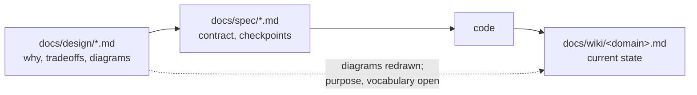
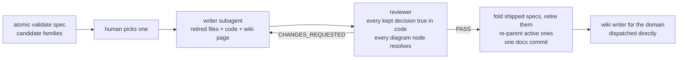

# Design and spec consolidation


## Problem


Every non-trivial task leaves a `docs/design/<topic>.md` and a `docs/spec/<topic>.md`. Nothing retires them. Measured on this repo at `cef29d8`:

| Surface | Count | State |
|---------|-------|-------|
| `docs/spec/` | 89 files | 11 in the `code-intel-*` family alone, every one shipped; `*-v2` pairs for `sql-dbt-snowflake` and `tsql-lineage-gaps` |
| `docs/design/` | 54 files | 36 Mermaid blocks across 29 files |
| `docs/wiki/` | 13 pages | 20 Mermaid blocks; `code-intel.md` has 2 where its design family has 6 |
| Family links | 13 files | Prose only: `Parent spec:`, `Child of`, `Umbrella:`, `Continues` |
| Frontmatter on design or spec | 0 of 143 | Every file opens on a bare `# H1` |

Three failures compound:

- A feature's contract is spread over N specs that drifted from each other and from the code. A reader reconstructs the current design by diffing them; a subagent cannot.
- The design docs hold the tradeoffs, and the wiki never sees them. The repo pipeline in `context/skills/atomic-wiki/references/repo.md` assigns each design doc to a domain at Step 3, and the writer at Step 4 redraws that domain's current-architecture diagrams into the page against source. Purpose and vocabulary have no role yet: a design doc's intent-shaped prose still has no legal use beyond the link row, which is what `docs/wiki/code-intel.md` carries for its spec family: five spec links, no rationale. Step 5 tells the reviewer to catch "contradictions between a spec and its implementation" and never supplies the spec.
- Spec-versus-code drift is invisible until someone reads both.

Where each document kind sits today. The dotted edge is the one the pipeline provides for diagrams only; purpose and vocabulary still cross by link row alone.




## Goals / Non-goals


- Goals:
    - One living design doc per feature that passes the rebuild test: an agent reading only it, plus the code's language and runtime, reaches the same build.
    - Every retired file recoverable from a lineage table that names the commit which last held the whole family.
    - Design and spec files gain a purpose and vocabulary role in wiki inference, so intent crosses into `docs/wiki/<domain>.md` alongside the diagrams already carried, and drift surfaces on every refresh.
    - Family membership walkable by code, not by prose grep.
- Non-goals:
    - No third documentation surface. `docs/design/`, `docs/spec/`, `docs/wiki/` keep their roles.
    - The wiki does not absorb tradeoffs. A wiki page that argues is a second design doc that goes stale.
    - No retirement of work in flight. An `active` spec re-parents to the consolidated design doc and continues; only `shipped` specs fold in.
    - No end-of-life for the feature. The consolidated design doc is a normal design doc that keeps accepting amendments and new child specs.
    - No automatic consolidation. Detection is code; the write is a human-gated verb.


## Approaches


Where the consolidated feature record lives:

| # | Approach | Pros | Cons |
|---|----------|------|------|
| A | Merge the family into one `docs/spec/<feature>.md` | Keeps the spec as the single contract | `rules/specs/spec-currency.md` forbids history in a spec body; a spec for shipped work is a dead contract, the code and wiki are truth |
| B | New surface, `docs/features/<feature>.md` | Clean slate | Third place for the same facts; the design/spec split already encodes current versus history |
| C | Consolidate into `docs/design/<feature>.md`, retire the specs, wiki stays current truth | Design already owns why, rejected approaches, and diagrams; zero new surfaces; spec retirement leaves no hole because `docs/wiki/<domain>.md` already carries current state | Backfill cost on the first families; `/atomic-plan` must look at the family design doc before grepping `docs/spec/` |

How code identifies a family:

| # | Approach | Pros | Cons |
|---|----------|------|------|
| D | New `feature:` frontmatter key | Direct | Invents a convention: 0 of 143 files carry any frontmatter today |
| E | Filename prefix plus prose markers | Zero migration | `atomic-*` covers bus, serve, doctor, validate, repl, and where; prose grep is fragile |
| F | Extend the OKF keys the wiki and bucket docs already use (`type`, `description`, `status`) with `domain` and `parent`; family is the `parent` chain | Same vocabulary as `docs/wiki/*.md` and the bucket six-key contract; `atomic serve` markdown search reads frontmatter as raw text, so specs become searchable for free | 143-file backfill, mostly scriptable; `atomic validate spec` must learn to skip the block |


## Recommendation


C and F.

### Document roles after consolidation

| File | Owns | Never carries |
|------|------|---------------|
| `docs/design/<feature>.md` | Problem, constraints, approaches weighed, the pick and why, decision diagrams, landmines, `## Lineage`, `## Change log` | Checkpoint tables, change trees, current-state claims the code can answer |
| `docs/wiki/<domain>.md` | What it is now, current-architecture diagrams, code-verified facts | Tradeoffs, decision history |
| `docs/spec/<feature>.md` | The contract while `status` is `draft` or `active` | Anything once `status: shipped` and folded: the file is retired |

The consolidated design doc behaves exactly like any other design doc. It accepts amendments under `## Change log` (same entry template as `rules/specs/spec-currency.md`), and new work on the feature starts a fresh child spec with `parent:` pointing at it. Consolidation compacts history; it does not close the feature. A family consolidates as many times as it ships, and every round folds the newly shipped specs into the same file.

Which members fold in on a round:

```
for each spec in family(root):
    shipped  -> fold into docs/design/<root>.md, then retire
    active   -> keep; set parent: docs/design/<root>.md
    draft    -> keep; set parent: docs/design/<root>.md
```

### The rebuild test governs content and length

A paragraph that would not change what gets built goes. Visuals carry the shape; prose carries only what a diagram cannot: why an order is fixed, which hop surprises, what the failure looks like.

| In | Out |
|----|-----|
| Problem, constraints, who reaches it | Checkpoint tables, iteration notes |
| Approaches weighed, tradeoffs, the pick and why | Change trees, outlines |
| Architecture, data-model, and flow diagrams | Per-spec Goal and Non-goals boilerplate |
| Every `Correction:` and `Superseded:` entry from the retired change logs, and closed follow-ups: the mistakes a rebuild would repeat | Dates, SHAs, agent chatter |
| Lineage table and freeze SHA | |

Spec change logs are the richest rebuild input. The writer mines them, not only the design bodies.

### Consolidation is reconciliation, not summarization

Summarizing drifted specs consolidates the drift. The writer reads the retired files and the code; every decision kept must still be true in the code. A contradiction becomes a finding for the human, never a blended sentence. The same rule applies to pictures: a design diagram drew intent, and every node in a promoted diagram must resolve to a real symbol or file. `atomic code search <node>` checks that mechanically. No match means redraw or drop, never copy.

### Frontmatter contract

Extends the OKF keys already on `docs/wiki/*.md` and bucket docs. No new vocabulary beyond `domain` and `parent`.

```yaml
---
type: Spec                                   # Design | Spec
description: <the H1, as a sentence>
domain: code-intel                           # wiki domain slug; roots only, children inherit
parent: docs/spec/sql-language-support.md    # absent on a family root
status: shipped                              # draft | active | shipped
---
```

Family resolution:

```
root(f)   = f if f.parent is absent, else root(f.parent)
family(r) = r plus every file whose root is r
domain(f) = root(f).domain
target(r) = docs/design/<basename of r>.md
```

`status: shipped` and the shipping SHA are stamped by the finalize phase of `/subagent-implementation` and `/autopilot`, so no prose parsing decides whether a file is done.

Backfill of the 143 existing files is scriptable: `type` from the directory, `description` from the H1, `parent` from the 13 prose markers, `domain` from the filename prefix with a hand table for the 12 `atomic-*` files, `status: shipped` by default with the handful in flight flipped by hand.

### Lineage and the freeze SHA

Each round has its own freeze: the parent of that round's retirement commit on the landed branch, the last commit that held every file folded in that round. The path is the durable key: a squash merge discards branch SHAs, a file path does not move.

```markdown
## Lineage

Recover any row with `git show <freeze>:<path>`, or without the SHA:
`git log -1 --diff-filter=D --format=%H -- <path>` and read its parent.

| Round | Freeze | Retired file | Contributed |
|-------|--------|--------------|-------------|
| 2026-09-01 | `a1b2c3d` | `docs/spec/code-intel-query.md` | query core, part 4/5, appendix K |
| 2026-09-01 | `a1b2c3d` | `docs/spec/code-intel-substrate.md` | schema, indexer, pragma order |
| 2026-11-14 | `e5f6a7b` | `docs/spec/code-intel-package-nodes.md` | package nodes, import edges |
```

Rows append; nothing is rewritten. The N-to-1 form of the spec-currency rename rule: the lineage table is the pointer, no stub files. The round also lands as a `## Change log` entry on the design doc naming what the fold changed in the body.

### Design and spec files get a role in wiki inference

Three edits to `context/skills/atomic-wiki/references/repo.md` and the writer and reviewer prompts:

| Step | Today | After |
|------|-------|-------|
| 3 partition | "the docs that describe them", discretionary | **Shipped.** `docs/design/*` joins the domain named by its `domain:` frontmatter when present, otherwise the domain whose paths it describes (`context/skills/atomic-wiki/references/repo.md` Step 3) |
| 4 writer | facts only; design is unusable | **Diagram clause shipped:** the writer redraws every current-architecture diagram from a domain's design docs into the page, checked against source. Purpose and vocabulary role for design docs: open |
| 5 reviewer | assumes specs were read | **Diagram check shipped:** the reviewer verifies every current-architecture design diagram lands on the page or is named stale. Claim-contradiction Concern row for design/spec text: open |

The reviewer edit makes `/refresh-wiki` the drift detector and the consolidation verb the drift resolver. Same signal, no new scanning.

Diagram ownership follows the owner-carries, sibling-points rule with one accepted duplication: the wiki owns current-architecture diagrams, the design owns decision diagrams (before and after, rejected topologies), and the design embeds the architecture diagram too because a link to a picture is worse than the picture.

### Detection is code, the write is gated

`atomic validate spec` (or a `spec families` verb) lists candidates from frontmatter alone: every spec with `status: shipped` that has not been folded, grouped by family root. No size threshold and no quiet period; a shipped spec is a dead contract the day it ships, and waiting for the rest of the family is what lets hundreds pile up. The report shows the active and draft members beside them so the human sees what re-parents. The verb follows the `/git-cleanup` shape: scan, indexed report, the human picks, nothing destructive without confirmation.



The last hop is direct because docs-only commits skip the signals gate, so `mark-dirty` would not fire.

### Delivery order

1. Frontmatter contract, backfill script, finalize stamping, validator fix. Makes the graph visible; candidates are invisible without it.
2. Wiki pipeline roles (Steps 3, 4, 5) (diagram slice shipped; purpose and vocabulary open).
3. The consolidation verb.

### Landmines

- `mdparse.IsATXOnly` (`atomic/internal/mdparse/mdparse.go:133`) treats a `---` under a non-empty line as a setext underline. A frontmatter closing fence after `description: x` is exactly that, so `atomic validate spec` fails every frontmattered spec until it strips the block first. `internal/frontmatter` is used by ten packages and not by `validate/spec.go`.
- The spec template emitted by `atomic template` and `rules/specs/spec-currency.md` must carry the block, or fresh specs ship without it.
- The design-doc template has no `## Lineage` or `## Change log` section and forbids improvised headers. Both become optional template sections, and the spec-currency rule's amendment discipline extends to design docs that carry a change log.
- Feature PRs target `next`; record the freeze SHA after the retirement lands, or rely on the path-keyed recovery.


## Open questions


- Umbrella specs: `code-intel-engine.md` is `shipped` and carries the appendix A to O that its active children cite by letter. Folding it moves the appendix into the design doc; the children's citations must re-point in the same round, or the appendix gets folded last.
- `/atomic-plan` lookup order after retirement: family design doc lineage table first, then `docs/spec/`. One line in the command, but it changes what the planner reads first.
- Verb name: `/consolidate-docs <feature>` is the working name.
- Whether `status` is stamped by finalize only, or also derived when every checkpoint row is checked, for specs written before stamping existed.


## Change log


### 2026-09-20 — Diagram row of the wiki-inference section shipped

**What changed:** `docs/design/diagram-legibility.md` shipped the diagram slice of the wiki-inference section: Step 3's domain-assignment rule, Step 4's carried-diagram clause, and Step 5's carry-over check in `context/skills/atomic-wiki/references/repo.md`, the matching W4/W5 restatement in `context/skills/atomic-wiki/references/realm.md`, and the carry-over responsibility on `atomic-wiki-writer`. The Problem bullet and the wiki-inference goal above are rewritten to describe that slice as shipped, leaving purpose and vocabulary as the remaining goals.

**Why:** issue #272.
