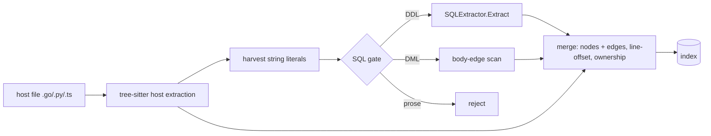

# Embedded SQL extraction

## Problem

SQL is routed to the standalone SQL extractor purely by file extension (`.sql`/`.ddl`/`.pgsql`/`.mysql` — `indexer/orchestrator.go:150`). SQL inside host-language string literals — Python `db.execute("CREATE TABLE ...")`, Go raw-string migrations, TS template-literal queries — is invisible: the host tree-sitter extractor emits the function node and stops. Verified 2026-06-09: a probe repo with 4 `CREATE TABLE`s embedded in `.py`/`.go` indexed 7 nodes, **0** tables/columns. The data layer of migrations-in-code apps is absent from the graph, so `atomic code impact users` cannot answer "what touches this table."

Conceptual flow — where embedded extraction slots into indexing:

## Goals / Non-goals

Goals:

- Embedded DDL mints real table/column/constraint nodes attributed to the host file with correct line numbers.
- Embedded DML emits references/writes/calls edges owned by the enclosing host function (file node fallback).
- Strict admission gate: prose never enters the SQL machinery; acceptance bar is zero resolved phantom edges on a harvested real-string corpus.
- Host languages v1: Go, then Python, then TypeScript (incl. TSX — same literal shapes, separate grammar config).

Non-goals:

- Multi-fragment/concatenated queries (`"SELECT " + cols + " FROM t"`) — accepted false negative.
- dbt-Jinja / templating dialects (separate follow-up exists).
- New SQL parsing capability — reuse the existing regex extractor only.
- English-language heuristics in the gate (no stopword lists) — the gate recognizes SQL structure, nothing else.
- Wiring variable/constant nodes into Python/Go extractors (ownership uses existing nodes only).

## Decisions (pressure-tested 2026-06-09)

| # | Decision | Why |
|---|----------|-----|
| 1 | DML edges attach to the **enclosing host function** — narrowest node whose `StartLine..EndLine` contains the literal's line; **file node** fallback. | Host nodes carry real spans (`extractor.go:533-548`); containment scan is cheap and host-syntax-agnostic. Python/Go emit no variable nodes, so "the assigned variable" is not in the graph. |
| 2 | No synthetic `CREATE FUNCTION` wrapper for DML. Call the body-scan machinery (`scanBodyEdges`, `sql.go:1446`) directly on the harvested span via a new exported entry point. | The wrapper solved a problem that doesn't exist — `scanBodyEdges` already takes a bare body + fromNodeID + offset. |
| 3 | Gate errs **strict**: best-effort structural SQL recognition; reject unless the literal reads as proper SQL. Greedy scanning only after admission. | A surviving false positive is an actively wrong `impact` answer consumed by humans and reviewer agents; a false negative leaves the graph at today's baseline. The extractor's own history (F-6/F-7) is a campaign against noise. |
| 4 | Python **docstrings are comments** — excluded before gating. Host comments never enter (tree-sitter literal harvest). SQL comments inside literals already stripped by `stripComments`. | Docstrings are string literals to tree-sitter but document SQL that executes nearby; ingesting them double-counts. |
| 5 | FP rate settled **empirically**: exhaustive synthetic tests for the closed space (literal shapes × {DDL, DML, prose}, offsets, ownership) + a harvested real-corpus run for the open space, bar declared before measuring. | Author-written negatives share the author's blind spots; real literals sample the true prose distribution. |
| 6 | Acceptance bar: **zero resolved phantom edges** from the corpus run (target; "as little as possible" is the posture). | "Not lots" gets graded on a curve after the fact; zero is falsifiable. |
| 7 | Embedded-derived edges carry `Provenance: "embedded"` — **new value**, dedup/demotion checks for `"heuristic"` untouched. | The strict gate exists so embedded edges are trustworthy — demotion unwanted. `GetEdgesByProvenance("embedded")` (`crud.go:290`) is the measurement instrument for decision 6. |
| 8 | Interpolated literals (f-strings, template literals with `${}`): interpolation segments treated as opaque placeholders. If the table name itself is interpolated, extraction yields nothing. | Consistent with strict-gate posture: dynamic SQL is an accepted false negative, same as concatenation. |

## Approaches

| # | Approach | Pros | Cons |
|---|----------|------|------|
| A | Orchestrator post-pass: after host tree-sitter extraction, harvest literals → gate → SQL machinery → merge into the same `ExtractionResult` | Reuses `SQLExtractor` verbatim for DDL (verified: probe extracted 4 nodes + FK ref from a bare snippet); single store transaction; ownership scan has the host nodes in hand | One change in the hot indexing path; per-language literal node types to enumerate |
| B | Synthetic `CREATE FUNCTION` wrapper to reuse DML body-scan via `Extract` | No new exported entry point | Parse round-trip to fake what `scanBodyEdges` already accepts directly; offset math through the wrapper; rejected in pressure-test |
| C | Second indexing pass over all files for SQL-in-strings (separate extractor registration) | No orchestrator change | Re-reads/re-parses every file; ownership scan loses host-node context; two store transactions per file |
| D | Wire a tree-sitter SQL grammar for validation + extraction | Real parser | No SQL grammar in `tsbinding/src/` (verified); large new surface; prose can be *grammatically valid* SQL (alias forms), so a parser doesn't even close the FP door |

## Recommendation

**A.** The SQL side is proven reusable as-is (DDL: `Extract` verbatim; DML: direct `scanBodyEdges` call — both probed). The host side already has every primitive: literal spans from tree-sitter (`extractor.go:1003` handles string nodes), line-offset mapping (`offsetResult`, `standalone/standalone.go:123`, load-bearing for Vue/Svelte), node spans for ownership containment. The only genuinely new code is the harvester (per-language literal collection + docstring exclusion), the gate, and ~10 lines of orchestrator wiring. Provenance plumbing has a clean seam: embedded refs carry `Language: SQL` with a non-SQL `FilePath` extension, distinguishable at `createEdges` (`pipeline.go:753`).

## Gate shape (conceptual)

The gate recognizes SQL structure, not English. Admission requires a statement-shaped match — DDL signature (`CREATE TABLE|VIEW|INDEX|...` with identifier) or DML signature (SQL verb leading the trimmed literal plus structural corroboration: comma-separated select list, comparison operator, quoted literal, or placeholder `$1`/`?`/`:name`/`%s`). Exact discriminators and their required-vs-confidence ranking are defined **by the test corpus in the spec**, not prose here — two implementers reading the corpus must build equivalent gates. Known residual: alias-shaped English (`select one record from the queue`) is grammatically valid SQL; the corpus run measures whether residual admissions ever *resolve* (the bar), not whether they exist.

## Risks

| Risk | Likelihood | Mitigation |
|------|-----------|-----------|
| Gate admits prose that resolves to a real table name | low (strict gate) | Corpus run with zero-resolved-phantom bar before merge; `Provenance: "embedded"` makes any escapee queryable and deletable |
| Duplicate table nodes: same table defined in `schema.sql` and embedded migration | medium | Both are real definitions — duplicates are legitimate facts; resolver's existing candidate machinery handles multi-candidate refs. Revisit only if corpus run shows resolution misbehavior |
| Per-literal gate cost on string-heavy repos | low | Cheap pre-filter (SQL keyword presence) before structural regex; gate runs only on literals, not source |
| Python docstring detection misses a form (e.g. class-level, module-level) | medium | Enumerate docstring positions in synthetic tests; module/class/function docstrings all excluded |
| Embedded contains-edges (table→column) bypass resolution, so provenance must be stamped at creation, not only at `createEdges` | certain | New entry point stamps `Provenance` on directly-returned edges; resolution seam covers unresolved refs |

## Open questions

(none — all decisions settled in pressure-test session 2026-06-09; see Decisions table)
