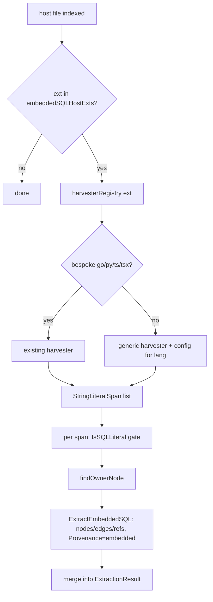

# Embedded SQL language expansion

## Problem

Embedded-SQL extraction (SQL inside host-language string literals → real table/column/edge nodes) ships for 4 host languages: Go, Python, TypeScript, TSX. The engine supports 20 tree-sitter languages. The remaining 16 — C, C++, C#, Java, JavaScript, Kotlin, Lua, Luau, Objective-C, Pascal, PHP, Ruby, Rust, Scala, Swift, Dart — emit no embedded-SQL graph, so SQL written in those hosts is invisible to `atomic code impact` and related verbs.

The original feature spec (`docs/spec/embedded-sql-extraction.md`) anticipated this: "the harvester registry and `StringLiteralSpan` seam already generalize." This design works out how.

## Goals / Non-goals

- **Goals:** extract embedded SQL from string literals in all 16 remaining engine languages, into the same node/edge/`Provenance: "embedded"` graph, with file-absolute line numbers, behind the same `IsSQLLiteral` gate and zero-resolved-phantom-edge bar.
- **Non-goals:**
  - Re-architecting the 4 shipped harvesters (Go hand-scanner, Python docstring-aware, TS/TSX). They are tested and carry special-case logic (Python docstring exclusion). Unifying them onto the new generic harvester is a deliberate future boundary, not in scope.
  - New SQL parsing capability — the existing `standalone` SQL extractor and gate are reused verbatim.
  - Multi-fragment / concatenated queries — same accepted false negative as the original spec.
  - Vue/Svelte SFC inline staleness — tracked separately (`followup-hardening-f-4`).
  - JSX/Liquid/XML/YAML host extraction — JSX folds into the JavaScript grammar; the rest are not general-purpose code hosts.

## The seam (current state)

```
orchestrator.go: host tree-sitter extraction
   └─ if embeddedSQLHostExts[ext]: embeddedSQLPostPass(...)
         └─ harvesterRegistry[ext](ctx, src, pool) -> []StringLiteralSpan
               · .go  -> hand-written scanner (standalone.HarvestGoStringLiterals)
               · .py  -> tree-sitter walk (HarvestPythonLiterals) + docstring filter
               · .ts  -> tree-sitter walk (HarvestTypeScriptLiterals)
               · .tsx -> tree-sitter walk (HarvestTypeScriptLiterals, LangTSX)
         └─ per span: IsSQLLiteral gate -> findOwnerNode -> ExtractEmbeddedSQL -> merge
```

`StringLiteralSpan{Text, StartLine, EndLine}` (1-based, file-absolute) is the contract every harvester returns. `extToLanguage` (orchestrator) is the canonical ext→`types.Language` map; `extraction/languages/registry.go` bridges `types.Language → extraction.Lang`. An `init()` already derives the SQL ext set from a single source (`standalone.SQLExtensions`) — the same single-source pattern applies here.

## Key insight: the Python and TS harvesters are the same walk

Both `python_literals.go` and `typescript_literals.go` are DFS tree-sitter walks that differ only in three node-kind sets:

| Concern | Python | TS / TSX |
|---------|--------|----------|
| String literal node kinds | `string` | `string`, `template_string` |
| Raw-text content child kinds | `string_content` | `string_fragment` |
| Interpolation child kinds (→ `?`) | `interpolation` | `template_substitution` |

The only genuinely Python-specific logic is docstring exclusion (positional: first statement in a module/class/function body). Everything else is a parameterizable config. With 16 more languages, that parameterization is reuse proven 16× over — a config-driven generic harvester is justified (not speculative abstraction).

## Grammar ground truth (probed, not guessed)

Each grammar's string-literal node kinds were captured by parsing real fixtures through the wazero/tree-sitter binding (throwaway probe; method mirrors the CP8 `tmp/probe-cp8c/` work that verified symbol node kinds). Three content-extraction shapes emerged:

**Shape 1 — content-child grammars** (grammar emits a raw-text child node that excludes delimiters; interpolations are sibling child nodes). Reconstruct by walking descendants in source order: content child → its text, interpolation child → `?`.

| Lang | String node kinds | Content child kinds | Interpolation child kinds |
|------|-------------------|---------------------|---------------------------|
| C | `string_literal` | `string_content` | — |
| C++ | `string_literal`, `raw_string_literal` | `string_content`, `raw_string_content` | — |
| C# | `string_literal`, `interpolated_string_expression` | `string_literal_content`, `string_content` | `interpolation` |
| Java | `string_literal` | `string_fragment`, `multiline_string_fragment` | — (no interpolation in Java) |
| JavaScript | `string`, `template_string` | `string_fragment` | `template_substitution` |
| Kotlin | `string_literal` | `string_content` | `interpolated_identifier`, `interpolation` |
| Luau | `string` | `string_content` | — |
| Objective-C | `string_literal` | `string_content` | — |
| PHP | `encapsed_string`, `heredoc` | `string_content` | `variable_name` |
| Ruby | `string`, `heredoc_body` | `string_content`, `heredoc_content` | `interpolation` |
| Rust | `string_literal`, `raw_string_literal` | `string_content` | — |
| Swift | `line_string_literal`, `multi_line_string_literal` | `line_str_text`, `multi_line_str_text` | `interpolated_expression` |

**Shape 2 — inline-content grammars** (no raw-text child node; the string node's own text carries the content, delimiters included). Interpolations, when present, are still child nodes. Reconstruct by taking the node text, replacing each interpolation child's byte range with `?` (descending order), then stripping leading/trailing delimiter runs.

| Lang | String node kinds | Content | Interpolation child kinds |
|------|-------------------|---------|---------------------------|
| Lua | `string` | inline (covers `"…"`, `'…'`, `[[…]]`, `[==[…]==]`) | — |
| Pascal | `literalString` | inline (`'…'`) | — |
| Scala | `string`, `interpolated_string` | inline (covers `"…"`, `"""…"""`, `s"…"`) | `interpolation` |
| Dart | `string_literal` | inline (`"…"`, `'…'`) | `template_substitution` |
| C# (verbatim) | `verbatim_string_literal` | inline (`@"…"`) | — |

The two shapes unify in one algorithm: **if the string node has any content-child descendant, use Shape 1; otherwise use Shape 2.** A node with interpolation children but no content children (Dart, Scala `s"…"`) correctly takes Shape 2, where interpolations are substituted by byte range — Shape 1 would lose the literal text between interpolations.

Heredocs (PHP `heredoc`, Ruby `heredoc_body`) are content-child (Shape 1): their content lives in a `string_content`/`heredoc_content` descendant. Treating the heredoc node as a string-literal node and collecting that descendant captures the body and excludes the `<<<TAG`/`TAG` markers.

## Delimiter stripping (Shape 2)

Strip a leading run and a trailing run of characters drawn from the delimiter alphabet `" ' \` @ [ ] = \`. SQL always begins with a keyword letter (none of these), so the leading strip never eats SQL. The trailing strip can over-trim a DML literal that ends in a quoted SQL string (e.g. a Lua `"… WHERE x = 'a'"` → trailing `'` clipped); this only mangles the tail after the table reference was already captured and can never invent a valid identifier, so the zero-phantom-edge bar holds. Documented known boundary, same spirit as the concatenated-query false negative.

## Architecture

```
extraction/embedded_literals.go        NEW — generic config-driven harvester
   EmbeddedLiteralConfig{ StringKinds, ContentKinds, InterpKinds }
   HarvestEmbeddedLiterals(ctx, inst, src, lang, cfg) -> []StringLiteralSpan
        DFS walk; at a StringKinds node: Shape1 if content descendant else Shape2

indexer/embedded_literals_config.go    NEW — config table keyed by extraction.Lang
   embeddedLiteralConfigs map[extraction.Lang]EmbeddedLiteralConfig  (16 entries)
   genericHarvester(lang, cfg) -> literalHarvester closure (borrow pool, harvest)

indexer/embedded_sql_postpass.go       EXTEND
   harvesterRegistry stays ext-keyed for go/py/ts/tsx (unchanged).
   init(): for each ext in extToLanguage whose types.Language bridges to an
           extraction.Lang with a config, register the generic harvester and add
           the ext to embeddedSQLHostExts — derived, never hand-duplicated.
```

The existing Go/Python/TS/TSX entries are untouched. The new languages are dispatched through one generic harvester parameterized by the config table. The host-ext set for the new languages is derived from `extToLanguage` + the config table at `init()` time, so there is no second ext list to drift (the lesson from `embedded-sql-ext-list-dup`).

## Conceptual flow



## Open questions

- Kotlin `${expr}` interpolation: the probe captured only `$ident` (`interpolated_identifier`). `interpolation` is included in the config defensively; if the `${…}` form uses a different kind it degrades to leaving the segment text, which the gate handles. Verified-enough; corpus run is the backstop.
- C# has three string forms (regular, interpolated, verbatim) all routed through one config — covered by Shapes 1+2 selection.
