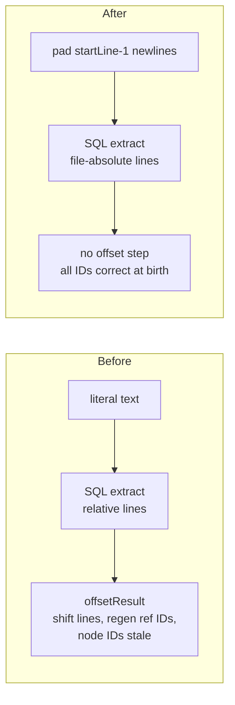

# Followup hardening batch (pre-expansion)

## Problem

Nine open followups gate or pollute the upcoming embedded-SQL language expansion (~16 new harvesters). Bugs and false-positive surface in the shared core compound per language added; the corpus harness is the expansion's verification instrument and currently can pass vacuously. Clear all nine before multiplying the surface.

Scope decided with the user (2026-06-10): the 7 embedded-SQL findings plus `gorilla-multiline-methods` and `mdlink-nested-fence`. Work stacks on the unshipped `embedded-sql-extraction` worktree branch.

## Goals / Non-goals

- Goals: close all 9 findings; shared embedded-SQL core hardened before per-language expansion; harness can no longer pass vacuously.
- Non-goals: the language expansion itself (separate plan); other ledger items (doctor, signals-router, install — orthogonal); Vue/Svelte node-ID staleness (pre-existing, see Known boundaries); adding a real gorilla/mux app to the eval corpus.

## Findings and fixes

| Followup | Severity | Evidence | Fix shape |
|----------|----------|----------|-----------|
| embedded-sql-node-id-collision | risk | `offsetResult` (standalone.go:123-145) shifts node lines but IDs stay minted from literal-relative lines → same-table DDL in two literals collide, `INSERT OR REPLACE` (db/crud.go:67) drops one | Newline-padding at extraction entry (see Decision below) |
| embedded-sql-dml-gate-tightening | risk | `dmlStartRE` (embedded_sql.go:59) admits `UPDATE` prose when any `dmlConfidenceRE` token (`=`, `,`, `%s`) co-occurs — 5 corpus FPs | When the start verb is UPDATE, additionally require `SET` in the literal. Real SQL `UPDATE` always carries `SET`; prose ("update available: %s") never does. Other verbs already require a preposition (`INSERT INTO`, `DELETE FROM`, `MERGE INTO`) — unchanged |
| embedded-sql-harness-empty-index | risk | embedded-sql-eval.sh: `EMBEDDED_COUNT=0` on an empty index → both dangling counts 0 → vacuous PASS | Guard PASS: require total node count > 0 AND `EMBEDDED_COUNT` ≥ 1 (the local `atomic/` corpus contains known embedded SQL in db/migrations.go — zero means the pipeline broke, not that the corpus is clean) |
| embedded-sql-ext-list-dup | risk | SQL ext list duplicated: `standaloneExts` (indexer/orchestrator.go) vs `isStandaloneSQLExt` (resolution/pipeline.go); comment says "mirrors", nothing enforces | Single exported source in the standalone package; both sites consume it. Parity test |
| embedded-sql-multiline-offset-test | nit | `TestExtractEmbeddedSQL_MultiLineDDLOffset` asserts `StartLine < baseLine`-style weak guard; doubled offset would pass | Exact-equality assertion |
| embedded-sql-lineoffset-test-nodeid | nit | `TestExtractEmbeddedSQL_LineOffset` asserts lines, not IDs | Node-ID assertion; pairs with the collision fix and proves it |
| embedded-sql-eval-tool-nits | nit | eval.sh echoes unused report.txt; admission tool silently skips unreadable files (main.go:64-82); rough non-Go harvester misses single/triple-quoted strings | Drop dead echo; count + print skipped files; document the harvester limitation in scripts/code-eval/README.md |
| gorilla-multiline-methods | risk | **Already fixed** — newline rejection absent from `extractGorillaMethods` (golang.go:521-538), `TestGorillaExtract_MultiLineMethods` (golang_test.go:803) asserts the multi-line form; landed in `045e5ce`, followup never closed against it | Remove the stale contradicting comment at golang.go:492 ("Only consider if the window doesn't have a newline…"); close the followup noting real-gorilla-app corpus verification remains undone (non-goal here) |
| mdlink-nested-fence | nit | `mdlink.go:74` toggles fence state on bare `HasPrefix(trimmed, "```")` — a 4-backtick outer fence containing a 3-backtick inner block flips state on the inner lines; no fence-length tracking | Track opener length (and fence character): a fence closes only on a run of the same character at least as long as the opener, per CommonMark. Inner shorter fences stay literal content |

## Decision: node-ID correctness via newline padding

The collision root cause is **extract-then-offset**: the SQL extractor mints node and ref IDs from literal-relative lines (`GenerateNodeID(filePath, kind, name, line)` — extraction/helpers.go:32), then `offsetResult` shifts the line *fields* but cannot regenerate the IDs.

Post-hoc regen is not generically possible: the name input to the hash varies per call site (`name` at standalone.go:82, `qname` at sql.go:389, `policyName` at sql.go:891). A remap function would have to re-derive which string fed each node's hash — fragile against every future extractor change.

Instead, make IDs **born file-absolute**: before calling the SQL extractor, prepend `startLine-1` newlines to the literal text. Every line computed inside extraction (newline counts) is then already file-absolute, so every minted node ID, ref ID, and edge line is correct at the source. The embedded path stops calling `offsetResult` entirely.

Caption: embedded extraction pipeline, before and after.



## Approaches (node-ID collision)

| # | Approach | Pros | Cons |
|---|----------|------|------|
| A | Newline-padding before extraction | No remap; fixes node IDs, ref IDs, and edge lines in one move; deletes the embedded `offsetResult` call and the special-case ref-ID regen for this path; zero changes to sql.go | Allocates padded copy of each admitted literal (admitted literals are few — 126 over 22,847 scanned); column numbers stay literal-relative (already true today) |
| B | Post-hoc ID regen + old→new edge/ref remap in `offsetResult` | Fixes Vue/Svelte latent staleness too | Cannot re-derive the per-call-site name input to the hash; breaks the moment an extractor changes its formula; most code |
| C | Thread a lineBase param through sql.go | Explicit, no allocation | ~16 `GenerateNodeID` call sites touched; invasive for the same result as A |

## Recommendation

A. The padding is applied once at the embedded entry point (`ExtractEmbeddedSQL`), behind the gate, so only admitted literals pay the allocation. `offsetResult` keeps its current behavior for its remaining consumers (Vue/Svelte) — including the CP3 ref-ID regen, which stays correct there.

## Known boundaries

- Vue/Svelte node IDs are still minted from script-relative lines and shifted by `offsetResult` without regen — the same latent staleness, pre-existing, out of scope here. A future fix can apply the same padding trick in the SFC extractors.
- The DML gate stays heuristic; tightening targets the one observed FP class (UPDATE-verb prose). New FP classes surfaced by the language expansion get their own pass.

## Open questions

(none — all decisions settled above)
