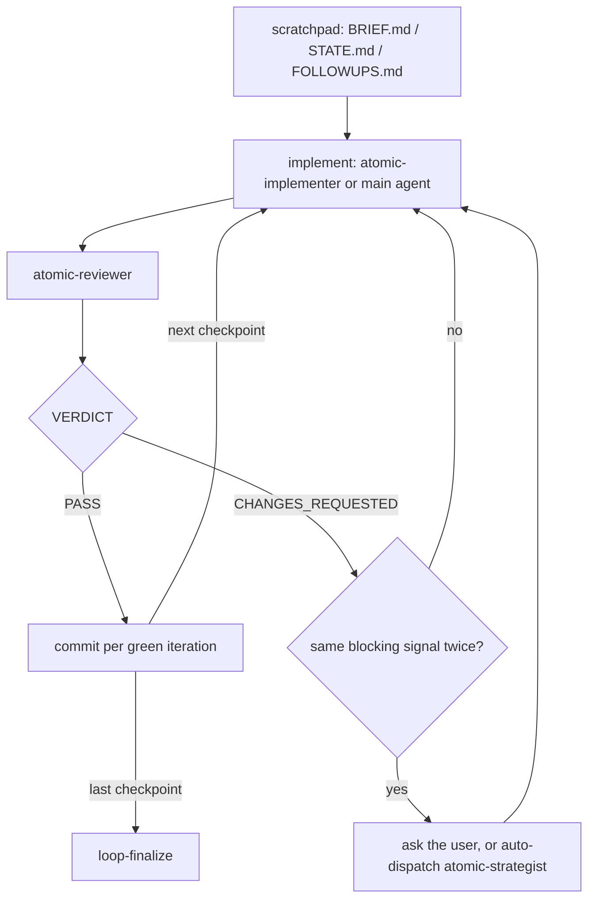

# Implement-loop consolidation


## Problem


`/subagent-implementation`, `/quick-fix`, `/autopilot`, and `/implement` run one loop: seed a scratchpad, produce a checkpoint, dispatch `atomic-reviewer`, triage the verdict, commit per green iteration, then verify, audit, and refresh signals. Each command restates that loop in full and differs from its siblings in eight policy choices (who writes the code, what happens when stuck, which finalize steps run, and so on). The restatements are kept in sync by hand: `quick-fix.md:50` and `implement.md:194` each contain a note saying "this command and `/subagent-implementation` are co-consumers of the same contract; a shape change to either should update both." That note exists because no partial holds the shared text.

Three costs follow.

| Cost | Where it shows |
|------|----------------|
| Size. The family is 72.8k chars of source (84.1k rendered after the `worktree-setup` partial expands into three of them). Every invocation loads one command body into the main context. | `subagent-implementation.md` 22.0k source / 27.6k rendered; `autopilot.md` 15.9k / 21.6k; `implement.md` 16.0k / 21.6k; `quick-fix.md` 13.3k. |
| Gates that say the same thing several times. `/quick-fix` and `/implement` each spend about 45 lines on a fit-gate table, a mid-loop escape-hatch list, a four-step "on fire" procedure, and a ten-line handoff block, with the same routing rows in both (cause unknown → diagnose; approach or criteria open → plan; contract choice → plan). `/quick-fix` states "no numeric file threshold" three times (`:24`, `:74`, `:184`). `/subagent-implementation` spends 31 lines on the stuck check (`:131-161`, a printed block plus an `AskUserQuestion` with the same three options plus six numbered steps) where `/implement` states the same contract in one paragraph (`:103`). `/autopilot` states its five rules, restates them as Phase 3 overrides (`:70-77`), and restates them again as constraints (`:133-139`). The auditor's once-only rule appears in all four commands and in the auditor's own constraints. | `quick-fix.md:11-24, 115-145`; `implement.md:13-26, 115-139`; `subagent-implementation.md:131-161`; `autopilot.md:9-19, 70-77, 133-139`. |
| Duplicated instructions per dispatch. `atomic prompt reviewer` (5,605 chars) and `atomic-reviewer.md` restate each other: the suppression-pattern rule, the output format, the read-brief → pull-diff → verify-signals workflow, and the no-fix/no-commit constraints. Severity tiers are defined three times in one reviewer dispatch (the `atomic-review` skill, the agent file, the brief). The implementer receives two output formats that disagree: `agent-signals-output` ends in `## Commit`, the brief ends in `## Status DONE \| BLOCKED \| NEEDS_CONTEXT`, and the orchestrator reads both. The agent bounces with `NEED CLARIFICATION:` while the orchestrator triages on `NEEDS_CONTEXT`. This duplication is loaded on every dispatch, twice per iteration, not once per invocation. | `atomic-reviewer.md:43-51` vs `briefs/reviewer.md` step 5; `:110-145` vs step 7; `:74-90` vs steps 1-4. `agent-signals-output.md` vs `briefs/implementer.md` step 6; `atomic-implementer.md:38-42` vs step 6 status line. |

Two smaller defects. `autopilot.md:70` says "run the loop exactly as `/subagent-implementation` defines it" without loading that file; a command body is not in context by mention, only its description, so the model runs the loop from its memory of that file. And the four commands disagree on choices that have no policy reason to differ: `/subagent-implementation` gates on a file count (`:27`, "touches ≥3 files") that `/quick-fix` forbids; `/quick-fix` refuses to build a cold index (`:39`) while the global contract calls indexing automatic; `/quick-fix` deletes its scratchpad (`:168`) while the others retain it for `/git-cleanup`; `/quick-fix` uses a three-iteration cap where the others use a same-signal stuck check.


## Goals / Non-goals


- Goals:
  - One source for the loop text, composed into every command at build time, so a change applies to all four and a missing partial name fails `make bundle`.
  - Each command reads as a policy table plus the sections only it needs.
  - Entry and mid-loop routing to sibling verbs is one table, stated once.
  - The dispatch briefs contain only what varies per dispatch; the agent file contains the rules.
  - Resolve the four inconsistencies above with one answer each.
- Non-goals:
  - Merging the four commands into one with modes. `docs/spec/quick-fix.md` and `docs/spec/autopilot.md` both rejected a mode flag on `/subagent-implementation`; those decisions stand.
  - Changing what any agent checks, the scratchpad trio, the verdict protocol, or the stuck-fix escalation contract from `docs/design/stuck-fix-escalation.md` (surface a runnable escalation; never auto-dispatch outside `/autopilot`).
  - Template conditionals or a `dict` helper. `docs/design/artifact-templates.md` fixed partials as pure fragments; this design keeps that rule.
  - New Go verbs in the same change. Four are named below as follow-ons because they remove the largest remaining deterministic blocks, but the partials do not depend on them.


## The shared loop and its settings


Every command runs this loop. The commands differ only in who produces the checkpoint, what happens when stuck, and which finalize steps run; the policy table in each command states those choices.



The settings as the four commands set them today:

| Setting | `/subagent-implementation` | `/quick-fix` | `/autopilot` | `/implement` |
|------|---|---|---|---|
| Writer | `atomic-implementer` | `atomic-implementer` | `atomic-implementer` | main agent |
| Entry gate | spec exists / small → inline / refuse | fit table | none, plans itself | fit table |
| Worktree | ask | none | auto | ask, clean tree only |
| Cold index | build | degrade | build | build |
| Stuck | 2 same-signal rounds → ask | 3-iteration cap → ask | auto-strategist | 2 same-signal rounds → ask |
| Non-blockers | ledger → user | ledger → user | fix all, ledger empty | ledger → user |
| Finalize | verify, follow-ups, log, docs, audit, signals | verify, audit, follow-ups | verify, docs, audit, signals, ship | verify, follow-ups, log, docs, user-picked gate, signals |
| Scratchpad at end | retain | delete | retain | retain |

Everything outside that table is shared loop text, and it is the same in each file. Counted by grep across the four: the `atomic template brief` seeding appears three times verbatim, the reviewer placeholder table three times, the five commit steps three times, the four-step signals block three times (`subagent-implementation.md:234-239`, `autopilot.md:96-103`, `implement.md:167-174`), the code-intel check four times, and the auditor once-only rule five times counting the agent.


## What one dispatch loads


The reviewer's system prompt is `atomic-reviewer.md` after partial expansion plus five skills declared in its frontmatter. The user turn is `atomic prompt reviewer` with four placeholders filled. Where each rule is stated today:

| Rule | `atomic-review` skill | `atomic-reviewer.md` | `atomic prompt reviewer` |
|------|:---:|:---:|:---:|
| Severity tiers and finding format | yes | yes, with additions | yes |
| Suppression-pattern rule | | yes | yes |
| Output structure, totals, verdict line | | yes | yes |
| Read brief → pull diff → verify signals | | yes | yes |
| Report only; do not commit | | yes | yes |
| Do not write under the scratch path | | | yes |

The brief's shape comes from the cold-op model in `docs/design/artifact-consolidation.md`, where a `general-purpose` subagent runs `atomic prompt <name>` itself and the brief has to be self-contained. The implementer and reviewer are not cold ops: the orchestrator runs the verb and dispatches to a custom agent whose file is already the system prompt. A self-contained brief is unnecessary on that path.


## Approaches


| # | Approach | Pros | Cons |
|---|----------|------|------|
| A | Shared partials (`implement-loop`, `loop-finalize`, `handoff`) plus a policy table at the top of each command. Settings whose variants are one clause long are handled by conditional sentences inside the partial (`Stuck ask → …; Stuck auto → …`), as `worktree-setup` already does for its interactive and hands-off modes. | One source; a partial rename or removal fails the build; follows the pure-fragment rule from `artifact-templates.md`; the conditional-sentence pattern is already in use. | The model resolves three or four "per the policy" clauses while reading the partial. A partial edit changes four commands at once. |
| B | One skill, `atomic-implement-loop`, loaded on demand; commands stay short and invoke it. | Same dedup. `/autopilot` would load the loop text only when it reaches the loop. | Skills copy byte-for-byte, so the loop text could not compose partials of its own. Correctness depends on the model invoking the Skill tool mid-command, the gap `autopilot.md:70` has today. Nothing checks it at build time. |
| C | Fold the three siblings into `/subagent-implementation` as modes. | One file. | Rejected twice already (`docs/spec/quick-fix.md` approach B, `docs/spec/autopilot.md` approach B): every invocation loads every mode's text, and the entry conditions become harder to state. |
| D | Text-only pass: cut the gates and the rationale in place, keep four copies. | No build change; lowest effort. | The co-consumer sync problem stays. Roughly a third of the saving of A. |


## Recommendation


**A**, together with the shorter briefs and the four unifications below. D's cuts are made inside the partials, so each cut is made once.

Evidence for the mechanics:

- `templaterender.go:63-74` clones the partial pool per artifact and executes with `nil` data, so a partial receives no parameters, an include is a plain text substitution, and a name that does not resolve fails `make bundle`. This is how `worktree-setup` composes into three commands today.
- `worktree-setup.md:27-37` already states two behaviors ("interactive mode (ask-if-unspecified)" and "hands-off mode (auto-create)") as sentences the caller selects between. The policy table names the selection instead of implying it.
- `docs/design/stuck-fix-escalation.md` fixes the escalation as an orchestrator decision that surfaces a runnable offer and never auto-dispatches; `/autopilot` overrides it by its own spec. The loop partial keeps both behaviors as the `ask` and `auto` values of one setting. Only the text changes.
- `atomic code sync` refuses to create an index by design (`codeintel/cli/code.go:211`), so the present/absent branch stays until a verb absorbs it.


### Target shape


```
context/_partials/
├── implement-loop.md     index, scratchpad trio, implement (dispatch or inline),
│                         review, triage, stuck check, commit per green      3.7k
├── loop-finalize.md      verify, docs, audit, follow-ups, log, signals, report,
│                         each step run when the policy names it             2.3k
├── handoff.md            one routing table, checked at entry and mid-loop   0.8k
└── worktree-setup.md     detect → ask|auto|none → create → EnterWorktree   1.2k with `atomic worktree new`; 5.6k as today

context/commands/
├── subagent-implementation.md   policy table + Understand + Spec             1.7k
├── quick-fix.md                 policy table + Surface                       1.1k
├── implement.md                 policy table + Checkpoints                   1.7k
└── autopilot.md                 policy table + Scratch hygiene + Resolve + Plan + Ship   2.6k
```

Sizes are from the samples in this document. The commands keep the `<workflow>` and `<constraints>` wrappers the authoring rules ask for; the samples omit them to stay short.

What each command keeps as its own text, and what moves into the partials:

| Command | Keeps as its own text | Moved into the partials |
|---------|-----------------------|-------------------------|
| `/subagent-implementation` | Understand (investigator dispatch), Spec (currency, the small-and-obvious inline path) | Phases 0 index and 1 scratchpad, Phase 2 loop and stuck block, Phase 3 finalize including the 28-line defer mechanics and the signals block |
| `/quick-fix` | Surface (optional investigator) | Fit gate, escape hatch, iteration cap, loop, finalize, rules |
| `/autopilot` | Scratch hygiene, Resolve (issue lookup), Plan, Ship | Five-rules block (becomes the policy table), Phase 3 overrides, Phase 4 (becomes `loop-finalize`), constraints restatement |
| `/implement` | Checkpoints (declare before writing; the exit when remaining context runs low) | Fit gate, escape hatch, worktree copy, index copy, scratchpad copy, per-checkpoint steps, finalize copy, the three-way final-gate choice |


### Unifications


Four choices differ across the commands without a policy reason. One answer each:

| Question | Today | Proposed | Why |
|----------|-------|----------|-----|
| Stuck handling in `/quick-fix` | 3-iteration cap, then ask | Same-signal check, `ask` | One mechanism for one concern. A cap fires on slow progress that is still progress; the signal check fires on no progress. |
| Final gate in `/implement` | User picks auditor, reviewer, or strategist | `atomic-auditor` always | Removes a prompt, a table, and the strategist verdict-parsing caveat. The strategist is dispatched from the stuck check, not at finalize. |
| Scratchpad at the end of `/quick-fix` | Deleted after dispositions | Retained; `/git-cleanup` archives it | Same lifecycle as the other three. |
| Cold index in `/quick-fix` | Degrade | Build | The global contract calls indexing cheap, idempotent, and never prompted. Skipping the index saves seconds and leaves the reviewer without the call graph. |

Also removed: the `≥3 files` bar in `subagent-implementation.md:27`. The entry row reads "more than a small obvious change," and `handoff` states once that no row counts files.


### Shorter briefs


`atomic prompt implementer` and `atomic prompt reviewer` shrink to the per-dispatch variables plus the one constraint the agent file lacks (the scratch path is orchestrator-owned). Three agent-side edits keep every instruction the long briefs stated:

- `agent-signals-output` gains a `## Status` line (`DONE | DONE_WITH_CONCERNS | BLOCKED | NEEDS_CONTEXT`) so the implementer's report includes both the commit proposal and the status the orchestrator triages on, in one format.
- `atomic-implementer.md` scope-guard bounces use `NEEDS_CONTEXT: <question>` and `BLOCKED: <reason>` instead of `NEED CLARIFICATION:` and `OUT OF SCOPE:`, so the report vocabulary and the triage vocabulary are the same words.
- The `general-purpose` fallback in the dispatch heuristic is dropped. Feature mode accepts any file count, so "neither fits" has no definition, and a generic agent would need the long brief this change removes.


### Before and after


Measured on the samples below. Rendered means after partial expansion, which is what the main agent loads.

| Surface | Today | Proposed | Note |
|---------|------:|---------:|------|
| Family source (4 commands + worktree partial) | 72.8k | 15.0k | commands 7.1k, partials 7.9k |
| `/subagent-implementation` rendered | 27.6k | 9.6k | 14.0k with today's worktree partial |
| `/implement` rendered | 21.6k | 9.7k | 14.1k with today's worktree partial |
| `/autopilot` rendered | 21.6k | 9.7k | 14.2k with today's worktree partial |
| `/quick-fix` rendered | 13.3k | 7.8k | no worktree |
| `atomic prompt reviewer` | 5,605 | 305 | per dispatch |
| `atomic prompt implementer` | 3,466 | 372 | per dispatch |
| Stuck check | 31 lines | 7 lines | `subagent-implementation.md:131-161` → `implement-loop` Triage |
| Fit gate + escape hatch + handoff | ~45 lines × 2 commands | 12 lines × 1 partial | |
| `defer` mechanics | 28 lines | 1 line | the full `atomic followups add` invocation |
| Signals refresh | 8 lines × 3 | 1 step × 1 | |
| Code-intel check | 5 lines × 4 | 1 line × 1 | |

The rendered totals fall from 84.1k to 36.8k. The per-dispatch saving is about 8.4k chars per iteration (two briefs), loaded on every iteration of every run.


### CLI verbs to add later


Four blocks are deterministic procedures written as instructions to the model. Each is a candidate `atomic` verb in a separate Go change; the partials work either way and get shorter once the verb exists.

| Block today | Lines | Verb | Effect on the partial |
|-------------|------:|------|------------------------|
| `worktree-setup.md:69-131`: branch check, `git worktree add`, eight-row setup detection, six-row baseline-test detection, report | ~60 | `atomic worktree new <branch>` | 5.6k → 1.2k (sample below) |
| Signals refresh staging and commit, three copies | 8 each | `atomic signals commit <topic>` | step 6 becomes "exit 1 → dispatch inferrer → verb" |
| `subagent-implementation.md:193-220` defer arg mapping | 28 | `atomic followups promote <ledger> F-<N> --topic <slug>` | step 4 loses the long invocation |
| Code-intel present/absent branch, four copies | 5 each | `atomic code sync --or-index` | one line, no branch |


## Samples


The files as they would be committed, in the prompt-artifact voice: instruct plainly, cut rationale that only defends the instruction.


### `context/_partials/handoff.md`


Replaces the fit gate, the escape hatch, and the handoff block in `/quick-fix` and `/implement`.

```markdown
{{- define "handoff" -}}
<handoff>

## Hand off

Check these at entry, and again whenever an implementer report or a reviewer finding surfaces one. On a match: name the signal in one line, print the handoff, keep `$SCRATCH` (its `STATE.md` records the work so far), stop.

| Signal | Handoff |
|--------|---------|
| Root cause unknown, or it shifted mid-loop | `/subagent-diagnose <task>` |
| Two viable approaches, or success criteria still open | `/atomic-plan <task>` |
| A new public API, schema migration, or cross-service contract is implied | `/atomic-plan <task>` |
| Implementer reports `BLOCKED` or `NEEDS_CONTEXT` | surface the report to the user |

The policy table may add rows. No row counts files.

</handoff>
{{- end -}}
```


### `context/_partials/implement-loop.md`


The shared loop. `Writer` and `Stuck` are the two settings it reads from the policy table.

```markdown
{{- define "implement-loop" -}}
<implement-loop>

## Index

`test -f .claude/.atomic-index/atomic.db` → present: `atomic code sync`; absent: `atomic code index` after a one-line notice. Skip silently when `atomic` is missing or errors. The loop never blocks on the index.

## Scratchpad

Derive a kebab-case `<topic>` from the spec filename or the task.

    command -v atomic >/dev/null 2>&1 && atomic repo init >/dev/null
    SCRATCH=$(atomic scratchpad new "<topic>" --purpose <implement|fix>)

Seed three files from `atomic template brief|state|followups`; fill every `<placeholder>`, delete the guidance comment.

| File | Rule |
|------|------|
| `BRIEF.md` | This iteration's scope, success criteria, and reviewer feedback. Overwrite each iteration. Without a spec the `**Spec:**` line reads `no spec — inline brief in BRIEF.md`. |
| `STATE.md` | `Loop base SHA: $(git rev-parse HEAD)` before the first entry. One `## Iteration N` per cycle; never rewrite a prior entry. |
| `FOLLOWUPS.md` | Non-blocking findings (🟡 that did not drive the verdict, 🔵, ❓) as `F-N`, numbered across severities. Append after every reviewer pass, PASS included. Readability 🟡 is never recorded here; it blocks the iteration. |

If `atomic prompt` or `atomic template` fails, stop and report the error. Never inline a prompt or improvise a skeleton.

## Iterate

One iteration per checkpoint. Checkpoints come from the spec's table when one exists, else from the brief. Repeat until the reviewer passes the last one.

### Implement

Writer `atomic-implementer` → dispatch it (`subagent_type: "atomic-implementer"`), fresh context. Mode `surgical` when the iteration touches at most 2 non-test files and is mechanically obvious, else `feature`. Prompt from `atomic prompt implementer`, substituting `{SCRATCH_PATH}`, `{SPEC_PATH}`, `{MODE}`, `{ITERATION_SCOPE}`, `{REVIEWER_FEEDBACK}` (`N/A — first iteration` on the first), `{BASE_SHA}` = HEAD now.

Writer `main agent` → write the checkpoint yourself under the `atomic-tdd` skill, run the project's signals, record the commands and results in `STATE.md`. Stay inside the checkpoint.

### Review

Dispatch `atomic-reviewer` (`subagent_type: "atomic-reviewer"`), fresh context, code mode. Prompt from `atomic prompt reviewer`, substituting `{SCRATCH_PATH}`, `{SPEC_PATH}`, `{BASE_SHA}`, `{HEAD_SHA}`. Attach the implementer's report, or say `main agent wrote this`.

### Triage

1. Read the `VERDICT:` line. Append the iteration to `STATE.md`: built, findings, next focus.
2. Harvest non-blocking findings into `FOLLOWUPS.md`.
3. `PASS` → Commit. `CHANGES_REQUESTED` → stuck check, then loop with every 🔴 and every readability 🟡 as the next focus. Readability findings are fixed, never deferred.

**Stuck check.** Two consecutive `CHANGES_REQUESTED` on the same underlying blocking signal (same root failure, however the reviewer phrases it):

- Stuck `ask` → `AskUserQuestion`: continue / `/pressure-test @docs/spec/<topic>.md` / dispatch `atomic-strategist` (read-only RCA). Record the choice in `STATE.md`. A strategist run feeds the next `BRIEF.md` and is not an iteration.
- Stuck `auto` → dispatch `atomic-strategist` without asking; fold its findings into the next `BRIEF.md`.

The check resets when the blocking signal changes.

### Commit

1. Message: the implementer's `## Commit` proposal (the reviewer already checked it), else the `atomic-git-discipline` skill.
2. Stage the touched files by explicit path. No `-A`.
3. Commit via HEREDOC. Record the SHA in `STATE.md`.
4. `atomic code sync` when the index exists; skip silently on error.

Skip only when the iteration produced no diff, and say so in `STATE.md`.

</implement-loop>
{{- end -}}
```


### `context/_partials/loop-finalize.md`


Seven steps in one fixed order. The policy's `Finalize` row names which run. The order puts docs before the audit so the auditor's documentation pass has something to read, and follow-ups before the log so the log can record deferrals.

```markdown
{{- define "loop-finalize" -}}
<loop-finalize>

## Finalize

Once, after the last checkpoint passes. Run the steps the policy's Finalize row names, in this order; skip the rest.

1. **Verify.** Invoke `atomic-verify` and run the full suite yourself. When `docs/spec/**`, `docs/design/**`, or a bundled artifact changed, also run `atomic validate spec` and `atomic validate config` (skip when `atomic` is absent).
2. **Docs.** Invoke `/documentation`. A hands-off run answers every surface prompt `Yes` and records what it touched in `STATE.md`. Commit as `docs: <topic>`.
3. **Audit.** Dispatch `atomic-auditor` once with `spec:` (or `brief: $SCRATCH/BRIEF.md`), `range: <loop-base>..HEAD`, `state: $SCRATCH/STATE.md`, `scratch: $SCRATCH`, and the `## Documentation surfaces` table when the project has one. `CHANGES_REQUESTED` → one implement→review→commit iteration against its findings, then continue. Never a second audit.
4. **Follow-ups.** For every open `F-N` in `FOLLOWUPS.md`, ask the user: `fix-now` (one more iteration), `defer`, `issue` (`/report-issue`), or `drop` (state why). `defer` runs `printf '%s' "<body>" | atomic followups add --id <topic>-F-<N> --title "<title>" --severity <risk|nit|question> --origin "<spec or brief>, iter <N> reviewer" --file "<path:line>" --body -` and commits `docs(followups): defer <id>`. Skipped when the ledger is empty.
5. **Log.** When a spec exists, append `## Implementation log` to it from `atomic template implementation-log`: SHAs from `STATE.md`, deferrals from step 4.
6. **Signals.** `atomic signals stale`: exit 0 → skip; exit 2 → report and skip; exit 1 → dispatch `atomic-wiki-inferrer` (`mode: silent`, `first_run: false`, `changed_range: <loop-base>..HEAD`), then `atomic wiki mark-dirty` best-effort, stage `docs/wiki/*.md`, `[ ! -d .claude/rules/wiki ] || git add -A .claude/rules/wiki/`, and any modified `.gitignore` or `.claude/.gitignore`, commit `chore(signals): refresh after <topic>`, record the SHA.
7. **Report.** What shipped, iterations with SHAs, what was verified and how, the audit verdict, follow-up dispositions, what is left.

`$SCRATCH` stays; `/git-cleanup` archives it. Do not push, merge, or open a PR unless the policy's Ship row says so.

</loop-finalize>
{{- end -}}
```


### `context/commands/quick-fix.md`


Whole file. 1.1k source; 7.8k rendered.

```markdown
---
description: Implement→review subagent loop with no planning phase, for a fix whose cause is known and whose shape is obvious, however many files it touches. No spec, no worktree, no docs or signals at the end; one audit. Routes to /subagent-diagnose on an unknown cause and to /atomic-plan on an open approach or contract choice.
---

You orchestrate; you do not write the code. `$ARGUMENTS`: `<task description>`. Empty → `usage: /quick-fix <task description>`, stop.

## Policy

| Setting | Value |
|------|-------|
| Writer | `atomic-implementer` |
| Entry | hand-off table |
| Worktree | none, work in place |
| Stuck | ask |
| Non-blockers | ledger |
| Finalize | verify, audit, follow-ups, report |
| Scratchpad purpose | `fix` |
| Ship | no |

{{ template "handoff" . }}

## Surface

When the task does not name exact files, dispatch `atomic-investigator` with the suspected area (lead with `atomic code explore "<area>"` when an index exists). Its `file:line` table is the scope; do not repeat the search here.

{{ template "implement-loop" . }}

{{ template "loop-finalize" . }}
```


### `context/commands/subagent-implementation.md`


Whole file. 1.7k source; 9.6k rendered with the shrunk worktree partial.

```markdown
---
description: Orchestrate the implement→review subagent loop from an approved spec. Fresh-context implementer and reviewer per checkpoint, commit per green iteration, then verify, document, audit, and refresh signals over the task's range.
---

You orchestrate; you do not write the code. Fresh-context subagents do, and the scratchpad brief is their only handoff.

## Policy

| Setting | Value |
|------|-------|
| Writer | `atomic-implementer` |
| Entry | hand-off table, plus: no spec and the work is more than a small obvious change → `/atomic-plan` first |
| Worktree | ask (skip the question when the work is small) |
| Stuck | ask |
| Non-blockers | ledger |
| Finalize | verify, docs, audit, follow-ups, log, signals, report |
| Scratchpad purpose | `implement` |
| Ship | no |

{{ template "handoff" . }}

## Understand

Dispatch `atomic-investigator` to map the surface (files, call sites, tests, conventions) unless the task names exact files. Lead it with `atomic code explore "<area>"` when an index exists. Read only what its `file:line` table says you need for scoping; do not implement.

## Spec

Topic slug from the task. `docs/spec/<topic>.md` exists → it is the brief's source and its checkpoint table is the loop. Its body must be current before any dispatch: a decision in this conversation that superseded part of it is fixed in the spec, never worked around in the brief.

No spec and the work is small and obvious → say `no spec; proceeding inline` and continue with a one-checkpoint brief. Otherwise → hand off to `/atomic-plan`.

{{ template "worktree-setup" . }}

{{ template "implement-loop" . }}

{{ template "loop-finalize" . }}
```


### `context/commands/implement.md`


Whole file. 1.7k source; 9.7k rendered.

```markdown
---
description: Implement in the main agent, with atomic-reviewer gating every checkpoint. For work whose context is already in this conversation, where a fresh subagent would have to re-read what you have already read. Same checkpoints, commit-per-green, and finalize as /subagent-implementation; you write the code.
---

You write the code here. The reviewer dispatch after each checkpoint is the only independent review the work gets; it is never skipped, batched to the end, or replaced by your own suite run.

`$ARGUMENTS`: `[<task>]`. Empty is normal; the task is already in the conversation.

## Policy

| Setting | Value |
|------|-------|
| Writer | main agent |
| Entry | hand-off table, plus: the context is not already here (cold start, resumed session, unread surface), or the work would crowd it out → `/subagent-implementation` |
| Worktree | ask, only when the tree is clean; otherwise say `dirty tree, staying in place` |
| Stuck | ask |
| Non-blockers | ledger |
| Finalize | verify, docs, audit, follow-ups, log, signals, report |
| Scratchpad purpose | `implement` |
| Ship | no |

{{ template "handoff" . }}

## Checkpoints

Declare them before writing code and state the list to the user. A spec's checkpoint table is the list (fix its body first when this conversation superseded it). Without a spec, split the task into checkpoints, one logical change each, however many files. More than six means the work belongs in `/subagent-implementation`. Mid-loop, thin remaining context or a checkpoint list that has outgrown the declaration → hand off to `/subagent-implementation` (`STATE.md` records the checkpoints and SHAs).

{{ template "worktree-setup" . }}

{{ template "implement-loop" . }}

{{ template "loop-finalize" . }}
```


### `context/commands/autopilot.md`


Whole file. 2.6k source; 9.7k rendered. The five rules become the policy table's `Stuck`, `Non-blockers`, and `Ship` rows plus the Plan section's currency sentence; they are not restated.

```markdown
---
description: Autonomous delivery: plan, run the implement→review loop, ship. Takes a task or a GitHub issue number and an optional merge verb. Asks one question, how to merge, and only when the verb was not given.
---

You run the whole lifecycle without input, except how to merge. `$ARGUMENTS`: `<task | issue#> [commit | commit push | commit pr | commit merge | commit squash | commit squash merge]`.

## Policy

| Setting | Value |
|------|-------|
| Writer | `atomic-implementer` |
| Entry | none; you plan it |
| Worktree | auto |
| Stuck | auto |
| Non-blockers | fix-all: every 🟡 and 🔵 goes into the next dispatch; the ledger ends empty |
| Finalize | verify, docs, audit, log, signals, report |
| Scratchpad purpose | `implement` |
| Ship | the merge verb from `$ARGUMENTS`, else ask once |

The ship gate is the only `AskUserQuestion` in the run. Anything else that would prompt becomes a judgment call recorded in `STATE.md`; a true blocker halts and surfaces.

## Scratch hygiene

`rm` and chained commands (`&&`, `;`) trigger permission prompts that stall an unattended run. `mkdir -p tmp/trash` once; move scratch there instead of deleting; one command per Bash call. Every implementer brief includes: `Discard scratch by moving it to tmp/trash/; never rm; do not chain shell commands.` The report step deletes `tmp/trash/` in one `rm -rf`, the one expected prompt; if permission is not granted, leave it (gitignored).

## Resolve

Bare `N` or `#N` → `gh issue view N --json title,body,labels` is the task. Derive the topic slug. Note the merge verb.

## Plan

Follow `/atomic-plan`'s discipline with no approval gate: trivial → inline spec; otherwise `docs/design/<topic>.md` and `docs/spec/<topic>.md`. Verify assumptions against primary sources now; you cannot ask later. The spec body stays current before every dispatch: revise it and log the change; leave no superseded content.

{{ template "worktree-setup" . }}

{{ template "implement-loop" . }}

{{ template "loop-finalize" . }}

## Ship

Run the merge verb from `$ARGUMENTS`. Without one, ask:

    <topic> is built, reviewed, and green. How should it ship?
    /commit | /commit push | /commit squash merge | /commit merge | /commit pr

The ship verb handles message format, worktree cleanup (auto-confirm on `merge` and `squash merge`), and its own signals gate, which sees a fresh signals file and does nothing.

Extend the finalize report with strategist dispatches and their findings, judgment calls from `STATE.md`, and the merge result. Then `rm -rf tmp/trash`. `$SCRATCH` stays for `/git-cleanup`.
```


### `atomic prompt reviewer` and `atomic prompt implementer`


The briefs after shortening (`atomic/internal/coldprompt/briefs/reviewer.md` and `implementer.md`). Everything removed is already in the agent file or its skills; `{MODE}` replaces the "include `mode:` in the prompt" instruction the commands carry today.

```markdown
Code-mode review of one iteration.

- Brief: `{SCRATCH_PATH}/BRIEF.md`
- Spec: `{SPEC_PATH}` (skip when the file does not exist)
- Diff: `git diff {BASE_SHA}...{HEAD_SHA}`
- Implementer report: below, or `main agent wrote this`

`{SCRATCH_PATH}` is orchestrator-owned; write nothing there. Findings only.
```

```markdown
Implement one iteration in `{MODE}` mode.

- Brief: `{SCRATCH_PATH}/BRIEF.md`, read first
- Spec: `{SPEC_PATH}` (skip when the file does not exist)
- History: `{SCRATCH_PATH}/STATE.md`, skim
- Scope: {ITERATION_SCOPE}
- Reviewer feedback to address: {REVIEWER_FEEDBACK}
- Base SHA: `{BASE_SHA}`

`{SCRATCH_PATH}` is orchestrator-owned; write nothing there. Do not commit.
```

The one-line change to `agent-signals-output` that lets the implementer brief drop its `## Status` section:

```diff
 ## Commit

 <type>(<scope>): <subject>

 <body only when the why is not visible in the diff>
+
+## Status
+
+DONE | DONE_WITH_CONCERNS | BLOCKED | NEEDS_CONTEXT
```


### `context/_partials/worktree-setup.md` with `atomic worktree new`


Depends on the `atomic worktree new` verb from the table above. Without it, today's partial stays and the three rendered sizes above rise by 4.4k.

```markdown
{{- define "worktree-setup" -}}
<worktree-setup>

## Worktree

`git rev-parse --git-dir` differs from `git rev-parse --git-common-dir` and `git rev-parse --show-superproject-working-tree` is empty → already isolated; say so and continue in place.

Otherwise, per the policy's Worktree row: `none` → skip this section; `ask` → `AskUserQuestion` (new branch in `.claude/worktrees/<branch>/`, or work in place); `auto` → proceed.

Branch name: the topic slug, matching `^[a-z0-9][a-z0-9/-]*$`. An uncommitted `docs/spec/<topic>.md` or `docs/design/<topic>.md` is committed first (ask in `ask` mode) so the branch includes it.

    atomic worktree new <branch>

The verb refuses an existing branch, runs `atomic repo init`, creates `.claude/worktrees/<branch>` on a new branch from HEAD, runs the detected package-manager setup and baseline test command, and prints `Worktree / Branch / Setup / Baseline`. A sandbox or permission error prints `working in place`; continue without it. Baseline failures: `ask` mode asks whether to proceed; `auto` mode records them in `STATE.md`.

Then call `EnterWorktree` with `path: .claude/worktrees/<branch>`.

</worktree-setup>
{{- end -}}
```


## What the samples drop


Text in today's files that the samples do not include, listed so each can be kept or dropped on purpose.

| Dropped | From | Reason to drop | Reason to keep |
|---------|------|----------------|----------------|
| "Haiku-backed and read-only, so it's cheap; spend Haiku tokens so Sonnet dispatches start with a target" | `subagent-implementation.md:12` | Rationale for an instruction the policy table already gives | None found |
| Three-iteration cap and its `AskUserQuestion` | `quick-fix.md:66, 147-153` | Replaced by the stuck check (unification 1) | A hard limit on iterations for the fast verb |
| Cold index → degrade | `quick-fix.md:39` | Unification 4 | None beyond seconds saved |
| Final-gate choice table and strategist parsing caveat | `implement.md:153-165` | Unification 2 | A user who wants the strategist's assessment at the end |
| "For a trivial task that needs no loop, still run a minimal single-checkpoint loop; do not bypass the reviewer" | `autopilot.md:138` | Implied by `Writer: atomic-implementer` and the engine having no bypass | One sentence would keep it explicit |
| `/documentation` authoring mode writing new pages, versus the ship verb's maintenance mode | `autopilot.md:85-88` | The docs step invokes `/documentation`; the command picks its own mode | The distinction is why autopilot runs docs at all; two clauses in the finalize step would keep it |
| Documentation advisory line at report time (`/documentation — N doc surfaces may be stale`) | `subagent-implementation.md:244-250` | Unnecessary where the docs step runs | Useful for `/quick-fix`, which skips docs; one clause in the report step keeps it |
| "Subagent output is the tool result; summarize in 1-3 lines" | `subagent-implementation.md:264` | The output style already says it | None |
| "Reviewer and implementer are separate agents; never combine roles" | all four | Structural: the loop has two dispatches | None |
| `general-purpose` fallback | `subagent-implementation.md:95`, `quick-fix.md:72` | No defined trigger; needs the long brief | None found |
| `<the_five_rules>` and `<scratch_hygiene>` tag names | `autopilot.md` | Headings give the same structure; the wrappers the authoring rules ask for are `<workflow>` and `<constraints>` | None |


## Risks


| Risk | Likelihood | Mitigation |
|------|-----------|-----------|
| A "per the policy" clause is misread and the wrong mode runs (worktree asks under `/autopilot`, strategist auto-dispatches under `/quick-fix`) | med | Knob values are exact tokens quoted identically in the policy table and the partial (`ask`, `auto`, `none`, `fix-all`). The same pattern runs today in `worktree-setup` across `/subagent-implementation` and `/autopilot`. |
| A partial edit changes four commands at once and one of them did not want it | med | That is what the co-consumer notes ask for by hand today. A setting absorbs a variant that is one clause; a variant longer than that gets its own micro-partial per `artifact-templates.md`. |
| A shortened brief omits an instruction a dispatch relied on | low | The reviewer and implementer agent files already state every removed rule (table above); the three agent-side edits fix the two omissions found (`## Status`, bounce vocabulary). Verify by diffing a rendered agent file against today's brief before deleting a line. |
| The auditor now runs in `/quick-fix` with docs skipped and reports 🟡 on every untouched surface | low | Already handled: `atomic-auditor.md:82` reports a scheduled surface as 🟡 under a brief, not 🔴. |
| Someone reads the policy table as documentation and skips the partials | low | The policy table is the first `##`; the partials follow under their own headings in the rendered file, which is what the model reads. |


## Open questions


- Unification 1: does `/quick-fix` lose the three-iteration cap in favor of the same-signal check, or keep both?
- Unification 2: `atomic-auditor` always in `/implement`, or keep the three-way pick?
- Unifications 3 and 4: retain the scratchpad and build a cold index in `/quick-fix`?
- Drop the `general-purpose` fallback, or keep it with a long-form brief variant?
- Keep any row from "What the samples drop"? The `/documentation` authoring-mode clauses and the advisory line for `/quick-fix` are the two with a reason to keep.
- Follow-on verbs in this change or after? The partials do not depend on them; `worktree-setup` is the one whose size does.
