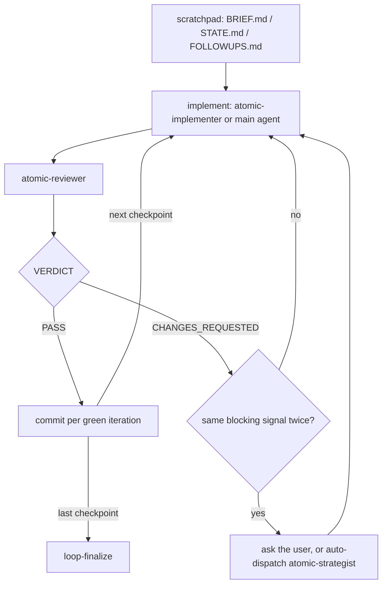

# Implement-loop consolidation


## Problem


`/subagent-implementation`, `/quick-fix`, `/autopilot`, and `/implement` run one loop: seed a scratchpad, produce a checkpoint, dispatch `atomic-reviewer`, triage the verdict, commit per green iteration, then verify, audit, and refresh signals. Each command restates that loop in full and differs from its siblings in eight policy choices (who writes the code, what happens when stuck, which finalize steps run, and so on). The restatements are kept in sync by hand: `quick-fix.md:50` and `implement.md:194` each contain a note saying "this command and `/subagent-implementation` are co-consumers of the same contract; a shape change to either should update both." That note exists because no partial holds the shared text.

Three costs follow.

| Cost | Where it shows |
|------|----------------|
| Size. The family is 72.8k chars of source (84.1k rendered after the `worktree-setup` partial expands into three of them). Every invocation loads one command body into the main context. | `subagent-implementation.md` 22.0k source / 27.6k rendered; `autopilot.md` 15.9k / 21.6k; `implement.md` 16.0k / 21.6k; `quick-fix.md` 13.3k. |
| Gates that say the same thing several times. `/quick-fix` and `/implement` each spend about 45 lines on a fit-gate table, a mid-loop escape-hatch list, a four-step "on fire" procedure, and a ten-line handoff block, with the same routing rows in both (cause unknown → diagnose; approach or criteria open → plan; contract choice → plan). `/quick-fix` states "no numeric file threshold" three times (`:24`, `:74`, `:184`). `/subagent-implementation` spends 31 lines on the stuck check (`:131-161`, a printed block plus an `AskUserQuestion` with the same three options plus six numbered steps) where `/implement` states the same contract in one paragraph (`:103`). `/autopilot` states its five rules, restates them as Phase 3 overrides (`:70-77`), and restates them again as constraints (`:133-139`). The auditor's once-only rule appears in all four commands and in the auditor's own constraints. | `quick-fix.md:11-24, 115-145`; `implement.md:13-26, 115-139`; `subagent-implementation.md:131-161`; `autopilot.md:9-19, 70-77, 133-139`. |
| Duplicated instructions per dispatch. `atomic prompt reviewer` (5,605 chars) and `atomic-reviewer.md` restate each other: the suppression-pattern rule, the output format, the read-brief → pull-diff → verify-signals workflow, and the no-fix/no-commit constraints. Severity tiers are defined three times in one reviewer dispatch (the `atomic-review` skill, the agent file, the brief). The implementer receives two output formats that disagree: `agent-signals-output` ends in `## Commit`, the brief ends in `## Status DONE \| BLOCKED \| NEEDS_CONTEXT`, and the orchestrator reads both. The agent bounces with `NEED CLARIFICATION:` while the orchestrator triages on `NEEDS_CONTEXT`. This duplication is loaded on every dispatch, twice per iteration, not once per invocation. | `atomic-reviewer.md:43-51` vs `briefs/reviewer.md` step 5; `:110-145` vs step 7; `:74-90` vs steps 1-4. `agent-signals-output.md` vs `briefs/implementer.md` step 6; `atomic-implementer.md:38-42` vs step 6 status line. |

Two smaller defects. `autopilot.md:70` says "run the loop exactly as `/subagent-implementation` defines it" without loading that file; a command body is not in context by mention, only its description, so the model runs the loop from its memory of that file. And the four commands disagree on choices that have no policy reason to differ: `/subagent-implementation` gates on a file count (`:27`, "touches ≥3 files") that `/quick-fix` forbids; `/quick-fix` refuses to build a cold index (`:39`) while the global contract calls indexing automatic; `/quick-fix` deletes its scratchpad (`:168`) while the others retain it for `/git-cleanup`; `/quick-fix` uses a three-iteration cap where the others use a same-signal stuck check.


## Goals / Non-goals


- Goals:
  - One source for the loop text, composed into every command at build time, so a change applies to all four and a missing partial name fails `make bundle`.
  - Each command reads as a policy table plus the sections only it needs.
  - Entry and mid-loop routing to sibling verbs is one table, stated once.
  - The dispatch briefs contain only what varies per dispatch; the agent file contains the rules.
  - Resolve the four inconsistencies above with one answer each.
- Non-goals:
  - Merging the four commands into one with modes. `docs/spec/quick-fix.md` and `docs/spec/autopilot.md` both rejected a mode flag on `/subagent-implementation`; those decisions stand.
  - Changing what any agent checks, the scratchpad trio, the verdict protocol, or the stuck-fix escalation contract from `docs/design/stuck-fix-escalation.md` (surface a runnable escalation; never auto-dispatch outside `/autopilot`).
  - Template conditionals or a `dict` helper. `docs/design/artifact-templates.md` fixed partials as pure fragments; this design keeps that rule.
  - New Go verbs in the same change. Four are named below as follow-ons because they remove the largest remaining deterministic blocks, but the partials do not depend on them.


## The shared loop and its settings


Every command runs this loop. The commands differ only in who produces the checkpoint, what happens when stuck, and which finalize steps run; the policy table in each command states those choices.



The settings as the four commands set them today:

| Setting | `/subagent-implementation` | `/quick-fix` | `/autopilot` | `/implement` |
|------|---|---|---|---|
| Writer | `atomic-implementer` | `atomic-implementer` | `atomic-implementer` | main agent |
| Entry gate | spec exists / small → inline / refuse | fit table | none, plans itself | fit table |
| Worktree | ask | none | auto | ask, clean tree only |
| Cold index | build | degrade | build | build |
| Stuck | 2 same-signal rounds → ask | 3-iteration cap → ask | auto-strategist | 2 same-signal rounds → ask |
| Non-blockers | ledger → user | ledger → user | fix all, ledger empty | ledger → user |
| Finalize | verify, follow-ups, log, docs, audit, signals | verify, audit, follow-ups | verify, docs, audit, signals, ship | verify, follow-ups, log, docs, user-picked gate, signals |
| Scratchpad at end | retain | delete | retain | retain |

Everything outside that table is shared loop text, and it is the same in each file. Counted by grep across the four: the `atomic template brief` seeding appears three times verbatim, the reviewer placeholder table three times, the five commit steps three times, the four-step signals block three times (`subagent-implementation.md:234-239`, `autopilot.md:96-103`, `implement.md:167-174`), the code-intel check four times, and the auditor once-only rule five times counting the agent.


## What one dispatch loads


The reviewer's system prompt is `atomic-reviewer.md` after partial expansion plus five skills declared in its frontmatter. The user turn is `atomic prompt reviewer` with four placeholders filled. Where each rule is stated today:

| Rule | `atomic-review` skill | `atomic-reviewer.md` | `atomic prompt reviewer` |
|------|:---:|:---:|:---:|
| Severity tiers and finding format | yes | yes, with additions | yes |
| Suppression-pattern rule | | yes | yes |
| Output structure, totals, verdict line | | yes | yes |
| Read brief → pull diff → verify signals | | yes | yes |
| Report only; do not commit | | yes | yes |
| Do not write under the scratch path | | | yes |

The brief's shape comes from the cold-op model in `docs/design/artifact-consolidation.md`, where a `general-purpose` subagent runs `atomic prompt <name>` itself and the brief has to be self-contained. The implementer and reviewer are not cold ops: the orchestrator runs the verb and dispatches to a custom agent whose file is already the system prompt. A self-contained brief is unnecessary on that path.


## Approaches


| # | Approach | Pros | Cons |
|---|----------|------|------|
| A | Shared partials (`implement-loop`, `loop-finalize`, `handoff`) plus a policy table at the top of each command. Settings whose variants are one clause long are handled by conditional sentences inside the partial (`Stuck ask → …; Stuck auto → …`), as `worktree-setup` already does for its interactive and hands-off modes. | One source; a partial rename or removal fails the build; follows the pure-fragment rule from `artifact-templates.md`; the conditional-sentence pattern is already in use. | The model resolves three or four "per the policy" clauses while reading the partial. A partial edit changes four commands at once. |
| B | One skill, `atomic-implement-loop`, loaded on demand; commands stay short and invoke it. | Same dedup. `/autopilot` would load the loop text only when it reaches the loop. | Skills copy byte-for-byte, so the loop text could not compose partials of its own. Correctness depends on the model invoking the Skill tool mid-command, the gap `autopilot.md:70` has today. Nothing checks it at build time. |
| C | Fold the three siblings into `/subagent-implementation` as modes. | One file. | Rejected twice already (`docs/spec/quick-fix.md` approach B, `docs/spec/autopilot.md` approach B): every invocation loads every mode's text, and the entry conditions become harder to state. |
| D | Text-only pass: cut the gates and the rationale in place, keep four copies. | No build change; lowest effort. | The co-consumer sync problem stays. Roughly a third of the saving of A. |


## Recommendation


**A**, together with the shorter briefs and the four unifications below. D's cuts are made inside the partials, so each cut is made once.

Evidence for the mechanics:

- `templaterender.go:63-74` clones the partial pool per artifact and executes with `nil` data, so a partial receives no parameters, an include is a plain text substitution, and a name that does not resolve fails `make bundle`. This is how `worktree-setup` composes into three commands today.
- `worktree-setup.md:27-37` already states two behaviors ("interactive mode (ask-if-unspecified)" and "hands-off mode (auto-create)") as sentences the caller selects between. The policy table names the selection instead of implying it.
- `docs/design/stuck-fix-escalation.md` fixes the escalation as an orchestrator decision that surfaces a runnable offer and never auto-dispatches; `/autopilot` overrides it by its own spec. The loop partial keeps both behaviors as the `ask` and `auto` values of one setting. Only the text changes.
- `atomic code sync` refuses to create an index by design (`codeintel/cli/code.go:211`), so the present/absent branch stays until a verb absorbs it.


### Target shape


```
context/_partials/
├── implement-loop.md     index, scratchpad trio, implement (dispatch or inline),
│                         review, triage, stuck check, commit per green      4.1k
├── loop-finalize.md      verify, docs, audit, follow-ups, log, signals, report,
│                         each step run when the policy names it             2.6k
├── handoff.md            one routing table, checked at entry and mid-loop   0.7k
└── worktree-setup.md     detect → ask|auto|none → create → EnterWorktree   1.2k with `atomic worktree new`; 5.6k as today

context/commands/
├── subagent-implementation.md   policy table + Understand + Spec             1.9k
├── quick-fix.md                 policy table + Surface                       1.4k
├── implement.md                 policy table + Checkpoints                   2.1k
└── autopilot.md                 policy table + Scratch hygiene + Resolve + Plan + Ship   3.0k
```

Sizes are the delivered files. The commands keep the `<workflow>` wrapper the authoring rules ask for, and a `<constraints>` block only where a rule is not already stated above it (`/quick-fix`'s no-spec rule).

What each command keeps as its own text, and what moves into the partials:

| Command | Keeps as its own text | Moved into the partials |
|---------|-----------------------|-------------------------|
| `/subagent-implementation` | Understand (investigator dispatch), Spec (currency, the small-and-obvious inline path) | Phases 0 index and 1 scratchpad, Phase 2 loop and stuck block, Phase 3 finalize including the 28-line defer mechanics and the signals block |
| `/quick-fix` | Surface (optional investigator) | Fit gate, escape hatch, iteration cap, loop, finalize, rules |
| `/autopilot` | Scratch hygiene, Resolve (issue lookup), Plan, Ship | Five-rules block (becomes the policy table), Phase 3 overrides, Phase 4 (becomes `loop-finalize`), constraints restatement |
| `/implement` | Checkpoints (declare before writing; the exit when remaining context runs low) | Fit gate, escape hatch, worktree copy, index copy, scratchpad copy, per-checkpoint steps, finalize copy, the three-way final-gate choice |


### Unifications


Four choices differ across the commands without a policy reason. One answer each:

| Question | Today | Proposed | Why |
|----------|-------|----------|-----|
| Stuck handling in `/quick-fix` | 3-iteration cap, then ask | Same-signal check, `ask` | One mechanism for one concern. A cap fires on slow progress that is still progress; the signal check fires on no progress. |
| Final gate in `/implement` | User picks auditor, reviewer, or strategist | `atomic-auditor` always | Removes a prompt, a table, and the strategist verdict-parsing caveat. The strategist is dispatched from the stuck check, not at finalize. |
| Scratchpad at the end of `/quick-fix` | Deleted after dispositions | Retained; `/git-cleanup` archives it | Same lifecycle as the other three. |
| Cold index in `/quick-fix` | Degrade | Build | The global contract calls indexing cheap, idempotent, and never prompted. Skipping the index saves seconds and leaves the reviewer without the call graph. |

Also removed: the `≥3 files` bar in `subagent-implementation.md:27`. The entry row reads "more than a small obvious change," and `handoff` states once that no row counts files.


### Shorter briefs


`atomic prompt implementer` and `atomic prompt reviewer` shrink to the per-dispatch variables plus the one constraint the agent file lacks (the scratch path is orchestrator-owned). Three agent-side edits keep every instruction the long briefs stated:

- `agent-signals-output` gains a `## Status` line (`DONE | DONE_WITH_CONCERNS | BLOCKED | NEEDS_CONTEXT`) so the implementer's report includes both the commit proposal and the status the orchestrator triages on, in one format.
- `atomic-implementer.md` scope-guard bounces keep `OUT OF SCOPE:` and `NEED CLARIFICATION:` (the refusal vocabulary every agent shares, and what `/subagent-diagnose` triages on) and end with `## Status` `BLOCKED` or `NEEDS_CONTEXT`, so the orchestrator triages on one line in every report.
- The `general-purpose` fallback in the dispatch heuristic is dropped. Feature mode accepts any file count, so "neither fits" has no definition, and a generic agent would need the long brief this change removes.


### Before and after


Measured on the samples below. Rendered means after partial expansion, which is what the main agent loads.

| Surface | Today | Proposed | Note |
|---------|------:|---------:|------|
| Family source (4 commands + worktree partial) | 72.8k | 21.4k | commands 8.4k, new partials 7.4k, worktree partial 5.6k as today |
| `/subagent-implementation` rendered | 27.6k | 14.7k | 10.2k once the worktree partial shrinks |
| `/implement` rendered | 21.6k | 14.9k | 10.4k once the worktree partial shrinks |
| `/autopilot` rendered | 21.6k | 15.1k | 10.6k once the worktree partial shrinks |
| `/quick-fix` rendered | 13.3k | 8.5k | no worktree |
| `atomic prompt reviewer` | 5,605 | 346 | per dispatch |
| `atomic prompt implementer` | 3,466 | 372 | per dispatch |
| Stuck check | 31 lines | 7 lines | `subagent-implementation.md:131-161` → `implement-loop` Triage |
| Fit gate + escape hatch + handoff | ~45 lines × 2 commands | 12 lines × 1 partial | |
| `defer` mechanics | 28 lines | 1 line | the full `atomic followups add` invocation |
| Signals refresh | 8 lines × 3 | 1 step × 1 | |
| Code-intel check | 5 lines × 4 | 1 line × 1 | |

The rendered totals fall from 84.1k to 53.2k with today's worktree partial, and to 39.7k once it shrinks. The per-dispatch saving is about 8.4k chars per iteration (two briefs), loaded on every iteration of every run.


### CLI verbs to add later


Four blocks are deterministic procedures written as instructions to the model. Each is a candidate `atomic` verb in a separate Go change; the partials work either way and get shorter once the verb exists.

| Block today | Lines | Verb | Effect on the partial |
|-------------|------:|------|------------------------|
| `worktree-setup.md:69-131`: branch check, `git worktree add`, eight-row setup detection, six-row baseline-test detection, report | ~60 | `atomic worktree new <branch>` | 5.6k → 1.2k (sample below) |
| Signals refresh staging and commit, three copies | 8 each | `atomic signals commit <topic>` | step 6 becomes "exit 1 → dispatch inferrer → verb" |
| `subagent-implementation.md:193-220` defer arg mapping | 28 | `atomic followups promote <ledger> F-<N> --topic <slug>` | step 4 loses the long invocation |
| Code-intel present/absent branch, four copies | 5 each | `atomic code sync --or-index` | one line, no branch |


## Samples


The delivered files are the reference. During review this section held draft text; keeping a copy here would be a second source of truth for the next partial edit to desynchronise.

| File | What it is |
|------|------------|
| `context/_partials/handoff.md` | The routing table, checked at entry and mid-loop. |
| `context/_partials/implement-loop.md` | Index, scratchpad trio, implement (dispatch or main agent), review, triage with the stuck check, commit per green. |
| `context/_partials/loop-finalize.md` | The seven finalize steps, each run when the policy names it. |
| `context/commands/quick-fix.md`, `subagent-implementation.md`, `implement.md`, `autopilot.md` | A policy table, the sections only that command needs, and the partial includes. |
| `atomic/internal/coldprompt/briefs/reviewer.md`, `implementer.md` | The dispatch briefs: per-dispatch variables plus the scratch-path constraint. |
| `context/_partials/agent-signals-output.md` | The implementer's output format, ending in a `## Status` line. |

Not built yet: `worktree-setup` on top of `atomic worktree new` (the first verb in the table above). The partial keeps its current 5.6k form until that verb exists.


## What the samples drop


Text in today's files that the samples do not include, listed so each can be kept or dropped on purpose.

| Dropped | From | Reason to drop | Reason to keep |
|---------|------|----------------|----------------|
| "Haiku-backed and read-only, so it's cheap; spend Haiku tokens so Sonnet dispatches start with a target" | `subagent-implementation.md:12` | Rationale for an instruction the policy table already gives | None found |
| Three-iteration cap and its `AskUserQuestion` | `quick-fix.md:66, 147-153` | Replaced by the stuck check (unification 1) | A hard limit on iterations for the fast verb |
| Cold index → degrade | `quick-fix.md:39` | Unification 4 | None beyond seconds saved |
| Final-gate choice table and strategist parsing caveat | `implement.md:153-165` | Unification 2 | A user who wants the strategist's assessment at the end |
| "For a trivial task that needs no loop, still run a minimal single-checkpoint loop; do not bypass the reviewer" | `autopilot.md:138` | Implied by `Writer: atomic-implementer` and the loop having no bypass | One sentence would keep it explicit |
| `/documentation` authoring mode writing new pages, versus the ship verb's maintenance mode | `autopilot.md:85-88` | The docs step invokes `/documentation`; the command picks its own mode | The distinction is why autopilot runs docs at all; two clauses in the finalize step would keep it |
| Documentation advisory line at report time (`/documentation — N doc surfaces may be stale`) | `subagent-implementation.md:244-250` | Unnecessary where the docs step runs | Useful for `/quick-fix`, which skips docs; one clause in the report step keeps it |
| "Subagent output is the tool result; summarize in 1-3 lines" | `subagent-implementation.md:264` | The output style already says it | None |
| "Reviewer and implementer are separate agents; never combine roles" | all four | Structural: the loop has two dispatches | None |
| `general-purpose` fallback | `subagent-implementation.md:95`, `quick-fix.md:72` | No defined trigger; needs the long brief | None found |
| `<the_five_rules>` and `<scratch_hygiene>` tag names | `autopilot.md` | Headings give the same structure; the wrappers the authoring rules ask for are `<workflow>` and `<constraints>` | None |


## Risks


| Risk | Likelihood | Mitigation |
|------|-----------|-----------|
| A "per the policy" clause is misread and the wrong mode runs (worktree asks under `/autopilot`, strategist auto-dispatches under `/quick-fix`) | med | Setting values are exact tokens quoted identically in the policy table and the partial (`ask`, `auto`, `none`, `fix-all`). The same pattern runs today in `worktree-setup` across `/subagent-implementation` and `/autopilot`. |
| A partial edit changes four commands at once and one of them did not want it | med | That is what the co-consumer notes ask for by hand today. A setting absorbs a variant that is one clause; a variant longer than that gets its own micro-partial per `artifact-templates.md`. |
| A shortened brief omits an instruction a dispatch relied on | low | The reviewer and implementer agent files already state every removed rule (table above); the three agent-side edits fix the two omissions found (`## Status`, bounce vocabulary). Verify by diffing a rendered agent file against today's brief before deleting a line. |
| The auditor now runs in `/quick-fix` with docs skipped and reports 🟡 on every untouched surface | low | Already handled: `atomic-auditor.md:82` reports a scheduled surface as 🟡 under a brief, not 🔴. |
| Someone reads the policy table as documentation and skips the partials | low | The policy table is the first `##`; the partials follow under their own headings in the rendered file, which is what the model reads. |


## Resolved questions


- `/quick-fix` runs the same-signal stuck check; the three-iteration cap is gone.
- `atomic-auditor` is the final gate in `/implement`; the three-way pick is gone.
- `/quick-fix` retains its scratchpad and builds a cold index.
- The `general-purpose` fallback is gone.
- Kept from "What the samples drop": the `/documentation` authoring-mode clause and the `/quick-fix` advisory line.
- The CLI verbs are a separate change; `worktree-setup` is unchanged until then.
- The implementer's bounce vocabulary is kept; the `## Status` line is the triage signal (see Shorter briefs).
