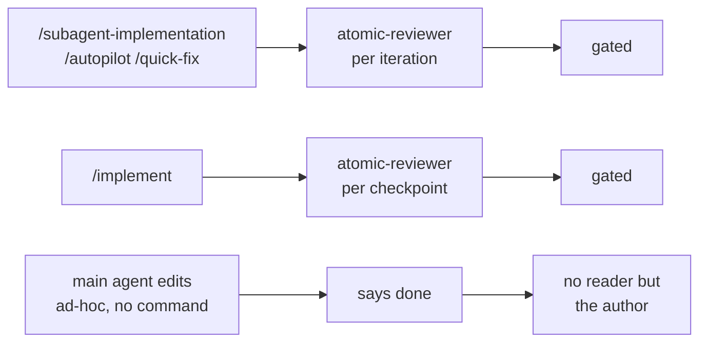

# Main-agent review gate


Design for GitHub issue #271, second attempt. PR #275 solved the same issue with a `PostToolUse` + `Stop` hook pair and was closed unmerged: too heavy for the problem, and it wires a turn-blocker into every session on `atomic update`. The issue was reopened asking for context engineering instead.


## Problem


Three implementation paths exist. Two gate themselves.



Seven user complaints in the issue say the same thing in different words: *did you do a review of your work with a subagent?* The rule that was supposed to prevent them already exists, in `context/skills/atomic-verify/SKILL.md`.


## Why the rule never fires


A skill ships two things to a session, and they load at different times:

| Part | Where it lives | When it enters context |
|------|----------------|------------------------|
| `description` | frontmatter | every session, in the skill roster |
| body | `SKILL.md` below the frontmatter | only after the `Skill` tool is invoked |

The review-gate rule is in the body. `atomic-verify`'s description triggers it on phrases Claude is *about to say* — "done", "fixed", "ready". That moment is the end of a turn, when the model is writing prose and has stopped calling tools. So loading the rule requires a tool call at the one point in a turn where a tool call is least likely, and the instruction to make that call is inside the text the call would load.

The rule can only fire if it has already fired. That is the mechanical reason seven rewordings changed nothing, and issue #269 records the same outcome for the sibling comment-discipline rule: three rewrites, no behavior change. Editing text that is not in context cannot change behavior.


## What a fix has to do


Claude Code's own documentation sets the ceiling: CLAUDE.md and rules are "context, not enforced configuration. To block an action regardless of what Claude decides, use a `PreToolUse` hook instead." Hooks are out by decree, so the goal is adherence, not enforcement, and two levers are documented to raise it — instructions that are loaded when they are needed, and instructions "concrete enough to verify."

That gives two tests a candidate has to pass:

1. The gate is in context at the moment the completion claim is written.
2. Skipping the gate is visible in the output, not silent.

Today's rule fails both. It is absent at claim time, and a claim with no review looks exactly like a claim with one — which is why every complaint in the issue is the user asking after the fact.


## Approaches


| # | Mechanism | Test 1: in context at claim | Test 2: skip is visible | Verdict |
|---|-----------|------------------------------|--------------------------|---------|
| A | Reword the skill body again | no — body still unloaded | no | rejected: the failure mode itself |
| B | Path-scoped rule on code globs | partial — injects at *read* time, not claim time | no | rejected, see below |
| C | Required output shape in `context/CLAUDE.md` | yes — loaded every session | yes — the line is present or it is not | **chosen** |
| D | Same shape, in the output style | yes | yes | rejected: opt-out surface |
| E | `Stop` hook | n/a | yes | rejected by the issue |


### Chosen: the claim states the review that ran


Move the gate out of the skill body and into `context/CLAUDE.md`, and state it as a constraint on the reply rather than an instruction about behavior. A reply that calls code the main agent wrote done, ready, fixed, or green is incomplete unless it contains:

```
review: <PASS|CHANGES_REQUESTED> (<agent> on <model>)
```

The line is unwritable without a verdict, and a verdict is unobtainable without dispatching the agent. Skipping the gate no longer produces a normal-looking answer; it produces an answer with a missing field, in front of the person who has asked for this seven times. Naming the model is part of the attestation: a gate that silently ran on a weaker model than the session is the complaint from 2026-09-08, not a fix for it.

The difference from a reworded rule is not tone. It is category. "Dispatch a reviewer before claiming done" is a behavior instruction: unloaded at claim time, satisfiable by self-assessment ("tests pass, close enough"), and invisible when skipped. "This reply contains this line" is a format constraint on the text being generated: present at generation, checked against the literal output, and visibly absent when unmet.


### Rejected: path-scoped rule


The obvious lever, and the one the repo already uses for `docs/spec/**`. It fails on scope and timing.

- **Timing.** Claude Code injects a path-scoped rule "when Claude reads files matching the pattern, not on every tool use." Reads happen while working; the claim happens after. A rule injected twenty tool calls before the claim is in the same position as a skill that fired too early.
- **Scope.** A gate on "code the main agent wrote" needs a glob over every language the user might write. That is a catch-all, which this repo already rejected once for the comment-discipline rule on exactly that ground: loading on every file touch to restate something CLAUDE.md can load once.
- It also fires on pure reads, so exploring a repo would inject a gate for edits that never happened.

Kept as a complement, not a substitute, and not built: nothing about the audit line needs a rule to work.


### Rejected: the output style


`context/output-styles/atomic.md` is the surface that governs reply shape, so a reply-shape contract belongs there on subject-matter grounds. It loses on reachability: the style is seeded, swappable per project through `/config`, and disableable with `atomic config set output_style.seed false`. A gate that a style switch removes is not a gate. `context/CLAUDE.md` installs as `~/.claude/CLAUDE.md` and has no opt-out.


### Rejected: a new Go mechanism


Nothing here needs code. The binary would only be re-stating a rule the model already reads, with an install step and a drift check attached.


## Which agent the gate dispatches


`atomic-reviewer`, dispatched with an explicit model override.

The issue asks for the gate to run on Opus or Fable, and notes that `atomic-reviewer` is pinned to `claude-sonnet-5` while `atomic-auditor` has no `model:` field. That reads as a reason to prefer the auditor. It is not, because **the frontmatter pin is not binding on the caller.** The Agent tool's `model` parameter "takes precedence over the agent definition's model frontmatter", and a probe confirms it: `atomic-reviewer`, pinned to Sonnet, dispatched with `model: opus`, reports running as `claude-opus-5[1m]`. The pin is a default, not a ceiling.

With that premise gone, the reviewer wins on every remaining axis.

| | `atomic-reviewer` | `atomic-auditor` on one diff |
|---|---|---|
| Built for | a diff against an intent | a finished delivery across a range |
| Effort | `xhigh` | `max` |
| Spec compliance pass | n/a — reviews intent vs diff | substitutes `intent:` for the spec |
| Coherence pass | n/a | reads "one change rather than a range" |
| Commit soundness pass | n/a | `(nothing found)` — no commit exists yet |
| Comment counting | runs `atomic code comments` natively | skipped |

Three of the auditor's four passes degrade to a no-op or a substitution on a single ad-hoc diff, at the most expensive effort tier the roster has, on a trigger that fires on every completion claim about main-agent code. An edit → "done" → edit → "done" session pays that each round, because the dedupe guard only skips when the tree has not changed.

The comment row is the one that decides it rather than merely favoring it. Issue #269 exists because comment noise passes every gate. `atomic-reviewer` already runs `atomic code comments` as part of its code-mode signals, and that verb defaults `--diff` to `HEAD` and scans untracked files for any non-range value — so on an ad-hoc working diff it counts exactly what the gate needs, with no wiring. `atomic-auditor` runs no comment counter at all. A gate that drops the counter reopens the issue it sits next to.

`atomic-auditor` keeps its contract unchanged: the finished whole, once, after a loop goes green.


## Symmetry


Both exits gate with the same agent and report the same line, so the two never disagree about who read the change:

```
atomic-verify (before "ready")      ──> atomic-reviewer, working diff ──> review: line in the claim
/commit review-gate (before commit) ──> atomic-reviewer, staged diff  ──> review: line before the message
```

The ship verbs' `review-gate` partial keeps its existing skip guards (already-reviewed, docs-only) and gains one: skip when the claim gate already read this same tree and nothing has changed since. In a normal session that makes the commit gate a no-op, so the cost is one review per change, not two.

Resolving the diff scope is part of the dispatch, not left to the agent:

- **working** — `git diff HEAD`, plus untracked files. `git diff HEAD` does not show an untracked file at all, and a new file is the most common shape of an ad-hoc change, so a gate that stops at `git diff HEAD` returns PASS on code it never read. `git ls-files --others --exclude-standard` lists them; each is read in full.
- **staged** — `git diff --cached`.


## Net effect on prose


The change adds instruction text on balance: across `context/`, +599 words against −401, a net +198, and `context/CLAUDE.md` grows 12 lines. That growth is the cost being paid, not a side effect to wave past, because `context/CLAUDE.md` loads every session in every repo while the deleted `atomic-verify` bullet came off a surface that loads only when the skill is invoked. Moving a rule from a lazily loaded surface to an always-loaded one is a real context budget decision.

It is worth it here only because the always-loaded surface is the point: a rule that is absent when the claim is written cannot work at any length. The block is held under 15 lines to keep the cost bounded, and the deleted bullet means the lazily loaded copy is not left behind to drift.


## Out of scope

- Hooks of any kind, per the issue.
- The loop gates: `/implement`, `/subagent-implementation`, `/quick-fix`, `/autopilot`, `/subagent-diagnose` keep `atomic-reviewer` per checkpoint, and `atomic-auditor` keeps its once-per-loop finalize pass. Neither contract changes; the ad-hoc gate reuses the reviewer rather than reshaping anything.
- Changing any agent's `model:` frontmatter. The pins stay as defaults; the ad-hoc gate overrides at dispatch.
- Documentation-only changes. Prose belongs to the doc-impact step, not a code gate.
