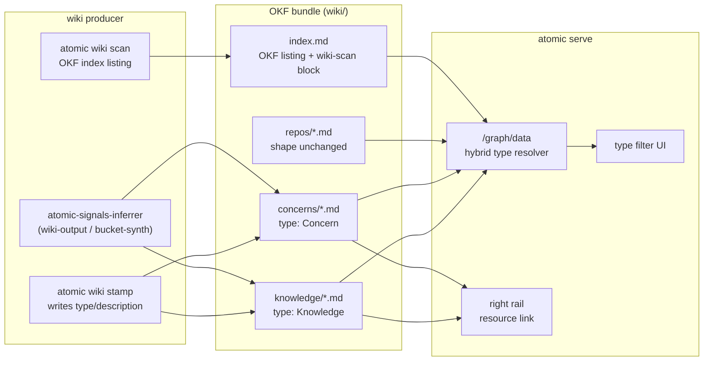

# OKF alignment for wiki + serve

## Problem

The wiki + serve subsystems independently reinvented ~70% of Google's [Open Knowledge Format (OKF) v0.1](https://cloud.google.com/blog/products/data-analytics/how-the-open-knowledge-format-can-improve-data-sharing): a directory of markdown files with YAML frontmatter, cross-linked, rendered as a navigable graph. Two drifts from the spec:

1. **Links.** serve layered Obsidian `[[wikilinks]]` on top of standard markdown links. OKF uses standard markdown links only; standard links are read by OKF consumers, Obsidian, GitHub, and goldmark natively, so `[[…]]` bought nothing OKF doesn't give for free.

2. **No `type` frontmatter.** OKF's one required field is absent everywhere. serve's frontend already ships Cytoscape style selectors for `node[type="repo"|"concern"|"knowledge"|"bucket"|"external"]` (`atomic/internal/serve/templates/layout.html:45`), but `buildCytoElements` hardcodes `Type:"page"` for every node (`atomic/internal/serve/graphoverlay.go:93`). The color-by-type feature is ~90% built; only backend population is missing.

Aligning to OKF makes bundles consumable by agents (progressive disclosure via `index.md`), interoperable with Obsidian/Notion/MkDocs and Google's tooling, and turns `atomic serve` from an our-wiki-only viewer into a general OKF viewer.

## Scope (decided with user)

atomic is tailored to software development and git repositories. OKF is adopted where it adds value, not cosmetically.

| Decision | Rationale |
|----------|-----------|
| **DROP `log.md`** | Git history IS the update log. Per-directory change logs are not in our wheelhouse. |
| **Realm-root `index.md` → OKF listing** | Progressive-disclosure listing body, alongside the existing managed `<wiki-scan>` + `## Members` blocks. |
| **Repo-summary pages: keep shape** | `wiki/repos/<name>.md` and their relative source links stay unchanged. Their link targets are source files in sibling repos (`../../repo/src/x.ts`), not bundle concepts — OKF's bundle-relative `/path.md` form doesn't apply there. |
| **Standard markdown links between concepts** | New cross-links between OKF concepts (knowledge, concerns, index) use standard bundle-relative `[text](/path.md)`. serve keeps its `[[…]]` parser for back-compat tolerance (OKF: consumers MUST tolerate). |
| **Signals files unchanged** | Files under a code repo's `.claude/project/` keep their current shape. |

## Goals / Non-goals

Goals:

- Required `type` frontmatter on OKF concept pages produced by the wiki; serve colors and filters by it.
- Recommended frontmatter (`description`, `tags`, `resource`, `timestamp`) where meaningful.
- Realm `index.md` is an OKF-conformant progressive-disclosure listing.
- serve surfaces `resource` as an open-underlying-asset link and renders any OKF bundle, not just our layout.
- Standard bundle-relative markdown links between concepts.

Non-goals:

- `log.md` — git is the log.
- Restructuring repo-summary pages or rewriting their relative source links.
- Changing signals files inside code repos.
- A central `type` registry — OKF types are producer-defined and uncentralized.
- Removing the `[[…]]` parser from serve — kept for tolerance.

## Approaches — how serve learns a node's `type`

The central design fork. serve must attach a `type` to each graph node so the existing FE selectors fire.

| # | Approach | Pros | Cons |
|---|----------|------|------|
| A | Read frontmatter `type` per page | OKF-conformant; honors producer intent; works for any OKF bundle | needs `type` on every concept; per-node frontmatter read |
| B | Infer from path convention (`repos/`→repo, `concerns/`→concern, `knowledge/`→knowledge) | zero producer change; honors "keep repo shape"; FE class names already match these dirs | not OKF (type not in frontmatter); breaks for arbitrary OKF bundles |
| C | Hybrid: frontmatter `type` when present, else path-convention, else `page`/`external` | OKF-conformant where declared; zero churn on repo summaries; renders foreign OKF bundles; FE already built | two resolution paths |

## Recommendation

**Approach C (hybrid).** serve resolves a node's type as: frontmatter `type` (mapped to an FE class) → path-convention fallback → `page`/`external` default. This:

- delivers typed coloring immediately (the FE selectors already exist),
- conforms to OKF wherever the producer declares `type`,
- honors "keep repo shape" — repo-summary pages need zero changes and still color correctly via the path fallback,
- makes serve a general OKF viewer (foreign bundles with frontmatter `type` just work).

The producer writes `type` (+ `description`, `tags`) on **knowledge** and **concern** pages, where it is most useful for agents and consumers. Repo summaries optionally gain `type: Repo Summary` (additive frontmatter, not a structural change) — but the hybrid resolver means they color correctly even if left untouched, so this is low-stakes (see Open questions).

## Type vocabulary (producer-defined, sw-dev flavored)

| Page | `type` | `resource` | FE node class |
|------|--------|------------|---------------|
| `wiki/repos/<name>.md` | `Repo Summary` (optional) | repo path / git remote (optional) | `repo` (via path fallback) |
| `wiki/concerns/<name>.md` | `Concern` | absent (abstract) | `concern` |
| `wiki/knowledge/<topic>.md` | `Knowledge` | absent (abstract) | `knowledge` |
| `index.md` | none (OKF: no frontmatter except `okf_version`) | — | n/a |

Maps to OKF's permissive type model: consumers must tolerate unknown types (serve falls back to `page`).

## serve link resolution (evidence-driven)

Evidence (gather-evidence A1) overturned an assumption: serve does **not** render standard bundle-relative `/path.md` links today. `resolvePageHref` (`atomic/internal/serve/graph.go:421`) treats a leading slash as a filesystem-absolute path (`filepath.IsAbs(target)`) and returns it as broken/external — no htmx in-shell rewrite.

OKF §5.1 makes `/path.md` (bundle-root-relative) the **recommended** cross-link form, and a general OKF viewer must render foreign bundles that use it. So serve must resolve a leading-slash href as relative to the served/bundle root (when it resolves to a page/file under root) **before** the `IsAbs` external fallback. This is a required checkpoint, not free behavior.

Relative links (`./other.md`, `../x.md`, OKF §5.2) already resolve correctly — so the producer could emit relative links instead and avoid the serve change. Rejected: it would leave serve unable to render the recommended OKF form and any foreign bundle using it, defeating the "general OKF viewer" goal. Fix serve.

## Producer → consumer flow

Flow from the wiki producer (stamp / scan / agent) through the OKF bundle to serve as consumer.

## Resolved decisions (post strategist + evidence)

| Question | Resolution | Why |
|----------|------------|-----|
| `type: Repo Summary` on repo-summary pages? | **No** — leave repo pages byte-identical | Respects the user directive ("keep code-repo pages as they are"). serve's path-convention fallback colors them `repo` anyway. Trade-off (below) documented for opt-in later. |
| `resource` on repo summaries? | **Omit** | Optional in OKF; no consumer need yet. |
| `okf_version` in realm `index.md` frontmatter? | **Drop** | serve strips frontmatter before render (invisible in the one viewer we ship); collides with the managed-block writer that seeds the index body first-line; OKF makes it MAY-optional. Frontmatter-free index is *more* §6-conformant. |
| Canonical node-type vocabulary | **Short lowercase** (`repo`/`concern`/`knowledge`) internally; producer writes human-readable title-case (`Knowledge`, `Concern`); serve maps long→short | The shipped CSS selectors are short lowercase; OKF examples are title-case. A mapping layer reconciles both. |
| Who writes `type`/`description` frontmatter? | **The producer model** (signals-inferrer B3 for knowledge; `/refresh-wiki` orchestrator for concerns) — NOT `atomic wiki stamp` | `type`/`description` are producer-defined content (OKF §4.1), not computed fingerprints. Matches the existing model-writes-content / code-writes-fingerprints split (`title:` is already agent-written). Agent-written keys survive `stamp`'s round-trip. |
| `type` filter UI | **In scope** — real legend + click-to-toggle node visibility | Explicit user request; color-without-filter is low value. |

## Risks

| Risk | Sev | Mitigation |
|------|-----|------------|
| R1 type-string mismatch silently no-ops coloring (`Knowledge` ≠ `knowledge`) | High | serve resolver maps long→short via explicit table; both frontmatter + path paths converge on short lowercase; serve test asserts `type: Knowledge` → node class `knowledge`. |
| Three node-emission sites (`graphoverlay.go:93` global, `:195` local/rail, `:321` provenance) | Med | Fix `:93` + `:195` through the shared resolver; `:321` already emits real kinds. Test the rail mini-graph path too. |
| serve path-fallback disagrees with foreign OKF consumers on untyped repo pages | Med | Accepted per user directive; documented in PR as a one-line opt-in (`type: Repo Summary`) the user can enable. |
| Concern pages typeless → §9 conformance gap | Med | `/refresh-wiki` orchestrator (the concern author) writes `type: Concern` + `description`. |
| Sequencing: producer title-case `type` landing before serve mapping | Med | Land serve consumer pair (link fix + typed resolver+mapping) first; producer frontmatter is forward-compatible (path-fallback covers it). Regenerate bundle (`make bundle`) since the agent is a bundled artifact. |
| Realm `index.md` carries non-OKF `<wiki-scan>` tags + member links escaping the bundle | Low | Tolerated by OKF §9 (unknown tags / broken-or-external links). `## Members` upgraded to §6 list form with descriptions; `<wiki-scan>` kept as a machine block a foreign consumer ignores. Cross-bundle member links are intentional (members are sibling repos, not bundle concepts). |
