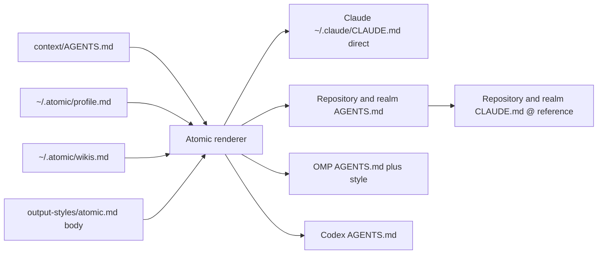

# Multi-harness Atomic distribution


## Problem


Atomic authors one configuration corpus under `context/`, but the current bundle and lifecycle target Claude Code directly. `bundlemirror` recognizes one exact `CLAUDE.md` source, `claudeinstall` owns every install decision, repository state follows harness fingerprints, and the wiki registry lives inside the Claude global file. An OMP or Codex installation therefore inherits Claude paths and behavior or receives only part of Atomic.

The feature must preserve one authored policy and workflow corpus while delivering each harness through its native steering, artifact, configuration, and lifecycle surfaces. Existing user guidance, profile data, wiki registrations, model choices, disabled integrations, and repository state remain authoritative throughout migration and uninstall.

One steering source produces native files without turning instructions into rules:



The existing system already supplies reusable mechanics. `artifacts.Load` enumerates the canonical corpus and hashes rendered artifacts (`atomic/internal/artifacts/catalog.go`), `claudeinstall` separates planning from application and compares exact bytes (`atomic/internal/claudeinstall/install.go:116-240`), the wiki package rejects malformed managed regions (`atomic/internal/wiki/registry.go:17-42`), and config path helpers keep user state under `~/.atomic` (`atomic/internal/config/paths.go:8-52`). The design extends those invariants rather than preserving Claude as the common denominator.


## Goals / Non-goals


- Goals:
  - Make `context/AGENTS.md` the sole authored global steering source, remove the global-source `context/CLAUDE.md`, render directly into Claude's `~/.claude/CLAUDE.md`, and use thin `CLAUDE.md` references only beside repository and realm `AGENTS.md` files.
  - Deliver a native OMP package and an import-free profile `AGENTS.md` composed from Atomic steering followed by the output-style body.
  - Keep commands, agents, skills, actual path-scoped rules, session behavior, and model preferences native to each supported harness.
  - Track explicit target enrollment, physical resource ownership, shared visibility, desired generations, interruption recovery, and safe target uninstall.
  - Select one repository-state tree independently of the active harness.
  - Preserve unowned prose and authoritative profile/wiki data through migration and target removal.
  - Prove the adapter boundary with an offline Codex agent projection before OMP release, then add Codex runtime support as a separate milestone.
- Non-goals:
  - A universal workflow interpreter or a common runtime tool API.
  - Separate authored Claude, OMP, and Codex prompt trees.
  - Treating global steering or output style as a rule.
  - Selecting concrete provider or model IDs for users.
  - Publishing the generated OMP package to a registry in the first milestone.
  - Renaming existing repository-state directories during the first milestone.
  - Windows support.


## Approaches


| # | Approach | Pros | Cons |
|---|----------|------|------|
| A | Use each harness's Claude compatibility behavior | Small installer change; current files remain in place | OMP does not import the complete Claude agent and lifecycle surface; keeps Claude directories authoritative |
| B | Maintain one authored tree per harness | Native files are easy to inspect | Workflow prose, rules, and fixes drift across trees; every change requires synchronized edits |
| C | Build a universal semantic workflow model | Can target structurally different runtimes | Introduces a second language for existing prompts; overstates what tool calls, hooks, permissions, and rules share |
| D | Canonical instruction bodies with narrow native adapters | One authored corpus; native delivery; direct reuse of current planning, hashing, block, and settings primitives | Requires explicit capability evidence and per-adapter lifecycle code |


## Recommendation


Use approach D. Keep authored instruction bodies in `context/`, render them once, and let each adapter own only native envelopes, discovery, configuration, and lifecycle operations. The current exact `CLAUDE.md` bundle predicate (`atomic/internal/bundlespec/bundlespec.go:47-50`) and five-rung harness-dependent state resolver (`atomic/internal/config/harness.go:37-48`) are the first boundaries to replace.

### Steering composition


`context/AGENTS.md` contains the current Atomic contract, and the global-source `context/CLAUDE.md` is removed. The Claude adapter renders the contract directly into `~/.claude/CLAUDE.md`; it does not create or reference a global `~/.claude/AGENTS.md`. Repository roots and nested realm scopes use shared `AGENTS.md` files with adjacent thin `CLAUDE.md` references.

The renderer captures canonical steering, `~/.atomic/profile.md`, and the byte-preserving `<wikis>` registry at `~/.atomic/wikis.md` under one generation. Claude receives direct global steering plus repository and realm loaders. OMP receives an import-free `AGENTS.md` containing that rendered steering, one blank line, and the output-style body after parsed YAML frontmatter is removed. Codex receives a native materialization within its documented instruction surface.

Global steering and output style are never rules. Only actual scoped rule bodies enter the rule pipeline.

### Rule model and scope semantics


Atomic keeps the existing Markdown rule files as authored source, but parses each one into a harness-neutral `RuleRecord` before projection. This is a narrow data model for scope and identity, not a second prompt language.

| Field | Contract |
|---|---|
| `id` | Stable producer-qualified ID: `shipped:<source-relative-path>` or `wiki:<project-key>:<domain>` |
| `class` | `shipped` for `context/rules/**`; `wiki-pointer` for repository-refresh-generated domain cards |
| `source` | Source path, producer, and source digest; no checkout-specific absolute path |
| `base_kind` | Scope anchor such as `repository-root`; never an absolute runtime path |
| `include` | Ordered positive globs from `paths:`; empty is invalid for a scoped rule |
| `body` | Frontmatter-free Markdown bytes |
| `projection` | Target, enforcement tier, projection digest, and native resource identity |

`context/rules/**` remains Claude-compatible source syntax. The parser accepts only the documented `paths:` key for these rules; unknown scope metadata fails validation instead of being silently dropped. It normalizes separators to `/` and rejects absolute and parent-escaping patterns without needing a checkout.

At projection or match time, Atomic creates a `RuleInstance` that binds one immutable `RuleRecord` to a project key and an absolute, symlink-resolved base selected by `base_kind`. Candidate paths resolve through that instance. The `RuleRecord` ID and source digest stay identical when the same shipped rule is used in two repositories or worktrees; only instance identity and runtime base differ. Matching supplies every overlapping rule in stable `RuleRecord.id` order. Filesystem case behavior is recorded by CP0 and cannot change canonical matching silently.

Repository wiki refresh is the second canonical rule producer. It writes domain pointer rules under `<state-root>/rules/wiki/`, where `<state-root>` is the selected harness-neutral repository-state directory. The default remains `.claude`, so existing `.claude/rules/wiki/**` checkouts remain valid without relocation. These pipeline-owned cards use `wiki:<project-key>:<domain>` identity and bind to their producing repository through `RuleInstance`. Realm refresh does not produce scoped pointer rules because one realm spans multiple repository bases.

### Rule projection and enforcement


Rule delivery has four explicit tiers:

1. `native-scope`: the harness selects and supplies the rule through a proven native scoped-rule surface.
2. `hook-required`: Atomic deterministically matches the operation path and injects the rule before the operation, but the prose remains model guidance.
3. `deny-enforced`: an Atomic hook denies an operation because a machine-checkable predicate failed.
4. `unsupported`: the harness cannot reproduce the behavior safely.

No adapter may label `hook-required` or `unsupported` behavior as native parity. `atomic harness rules status` and doctor report the tier, source digest, projection digest, disabled state, collision state, and last verified runtime behavior for every enrolled target.

Each adapter consumes four CP0 capability roles rather than assuming a product API name: a static scoped-rule surface, a session-baseline event, a pre-operation event exposing structured target paths, and context-return or deny results. The capability matrix maps those roles to tested native names and payloads. A missing or failed role produces `unsupported`; it does not strand installation or become an implementation error.

| Harness | Native materialization | Scoped activation | Deterministic enforcement | Explicit limits |
|---|---|---|---|---|
| Claude | Shipped rules under `~/.claude/rules/atomic/`; generated wiki cards use `<state-root>/rules/wiki/` directly when that root is `.claude`, otherwise a managed `.claude/rules/atomic-wiki/` projection | Native scoped-rule behavior after CP0 proves matching, precedence, lifetime, resume, and child delivery | Only separate validators and hooks with machine predicates | Rule prose is guidance, not a sandbox boundary |
| OMP | Shipped rules in the Atomic extension package and repository-generated cards under the CP0-proven project rule surface | Adapter translates canonical `paths:` into the CP0-selected native scope fields. If static scope is only advisory, the CP0-selected pre-operation event must inject every matched body before supported read/edit/write operations | A proven deny result may block only an exact machine predicate on an event it mediates | Missing target paths, unsupported tools, sticky lifetime, and child behavior remain explicit gaps until runtime proof |
| Codex | Atomic plugin contains the matcher, rule index, and CP0-selected hook registration; project cards remain in the selected state root | CP0-selected session-baseline events provide bounded baseline context; a synchronous pre-operation event with structured target paths supplies matched bodies through the proven context-return field | A proven deny result may block only machine-checkable predicates with exact target paths | Hosted or local tools without a mediated event and recoverable path are `unsupported`; semantic prose compliance cannot be hard-enforced |

Current product documentation supplies candidates for each Codex role, but CP0 owns their concrete names, payloads, trust behavior, limits, disablement, reload, and child-session evidence before Milestone B claims support. The adapter builds a portable Atomic plugin and deterministic matcher using only the proven registration and event surfaces. Atomic does not replace the Codex binary, poll the filesystem, or claim coverage for tools that bypass the selected event.

The matcher extracts exact paths from CP0-proven structured edit, patch, and MCP inputs. Shell commands are not treated as safely parseable path expressions. An operation without exact target paths is recorded as uncovered, receives no matched rule body for that operation, and remains `unsupported` even if session-baseline context listed rule IDs or digests. Post-operation validation may report semantic violations, but it cannot retroactively turn a completed operation into enforcement.

### Write authority and storage layout


One path has one authority. Native harness files are projections unless the row says otherwise.

| State or resource | Authority and writer | Conflict, commit, and removal contract |
|---|---|---|
| `context/**` embedded in the selected binary | Immutable release authority; written only by the Atomic build | Rendered once per operation; source digest enters every projection |
| `~/.atomic/config.toml` | User configuration; written by explicit `atomic config` and lifecycle settings operations | Preserve unknown/user keys; preserve on target and full uninstall |
| `~/.atomic/profile.md` | Mutable user authority; written by profile refresh and explicit edits | Legacy native import occurs once during adoption; later divergent native copies are conflicts |
| `~/.atomic/wikis.md` | Mutable registry authority; written first by wiki registration/removal operations | Projection failure marks targets stale; it never rolls registry authority back |
| `~/.atomic/install/ledger.json` | Enrollment, physical-resource, consumer, generation, and last-applied authority | Commit only after native verification; full uninstall retains rows referenced by unresolved journals until recovery completes |
| `~/.atomic/install/operation.lock` | Ephemeral lifecycle serialization; real mutating operations hold a platform advisory lock and record operation ID plus writer version | Dry-run never opens it; closing releases the lock; the inert path may persist and has no ownership meaning |
| `~/.atomic/install/journals/<operation-id>.json` | In-flight operation authority | Written and fsynced before mutation; completed journals are cleaned, unresolved journals survive uninstall |
| `~/.atomic/install/transactions/<operation-id>/{stage,backup}/` | Staging and transaction backups | Staging validates before publication; backups referenced by unresolved journals survive |
| `~/.atomic/backups/**` | User recovery history | Preserved by full uninstall |
| `~/.atomic/<project-key>/state-location.json` | Project-state selection shared across worktrees | Persisted before resolution switches; retained while an unresolved journal references the selection |
| `~/.atomic/packages/omp/atomic/` | Atomic-owned generated OMP package | Published as a generated directory; shared visibility and consumers recorded separately |
| `~/.atomic/packages/codex/atomic/` | Atomic-owned generated Codex plugin | CP0-proven native registration and hook trust verified per enrolled `CODEX_HOME`; trust is never fabricated |
| Claude, OMP, and Codex native roots | Derived target state written only by the owning adapter | Changed owned bytes conflict; unowned bytes and user settings win |
| Repository/realm steering and repository rule projections | Shared `AGENTS.md` managed blocks, thin Claude loaders, and target-native generated directories | Canonical writes precede projection; one failed target becomes stale without rolling back other targets |

The repository-state record lives at `~/.atomic/<project-key>/state-location.json`, not under a new `projects/` hierarchy. This reuses the current worktree-sharing convention and avoids a second project-key namespace.

After one-time legacy adoption, mutable data is one-way: authority first, then projections. Profile refresh writes `~/.atomic/profile.md`; wiki registration writes `~/.atomic/wikis.md`; repository refresh writes canonical pages and rule cards; realm refresh writes canonical pages and steering only. A changed derived copy is never imported automatically. Malformed managed blocks or changed derived bytes block only that target and preserve its last valid generation.

### Global install and target lifecycle

```mermaid
flowchart LR
    accTitle: Recoverable multi-harness installation
    accDescr: Explicit target selection is rendered, observed, journaled, staged, committed, verified, and only then recorded in the central ledger.
    %% Source: Architecture defined by this design.
    BIN["Selected Atomic binary"] --> DISC["Discover instances"]
    DISC --> SELECT["Explicit enrollment selection"]
    SELECT --> RENDER["Render one canonical generation"]
    RENDER --> OBSERVE["Observe native and shared resources"]
    OBSERVE --> JOURNAL["Persist journal and backups"]
    JOURNAL --> STAGE["Stage and validate projections"]
    STAGE --> APPLY["Apply one native commit unit"]
    APPLY --> VERIFY["Verify effective content"]
    VERIFY --> LEDGER["Commit ledger state"]
```




Discovery never enrolls. `atomic install` or `atomic harness enroll` selects concrete Claude homes, OMP profiles, or Codex homes, then reports every physical resource and every unenrolled instance that can see a shared resource before writing.

Per-target convergence writes:

| Target | Global writes |
|---|---|
| Claude | Atomic block in `~/.claude/CLAUDE.md`, commands, agents, skills, output style, shipped rules, narrow `settings.json` hook/style mutations, and ledger records |
| OMP | Shared Atomic package, profile-owned `AGENTS.md` block, native extension registration, role defaults only where user settings are absent, session hook state, and consumer records |
| Codex | Atomic plugin package, CP0-proven native registration state, global `AGENTS.md` managed block, proven event configuration, skills/agents, trust-pending status, and target records |

An OMP package may be visible to unenrolled profiles when OMP's native package surface is shared. That visibility is reported separately from enrollment and consumer ownership. Enrolled profiles with incompatible desired package generations make the entire shared-package plan refuse before mutation.

Update re-executes the replacement binary before convergence so only the replacement's embedded generation can publish. Repair reuses the same planner and transaction protocol. A target uninstall removes only unchanged target-owned resources and consumer links. Full uninstall after the final target preserves `config.toml`, `profile.md`, `wikis.md`, and backups. It removes completed operational and project-adoption state, but retains unresolved journals, referenced transaction backups, referenced ledger rows, and referenced state-location records until recovery completes.

### Repository and realm wiki lifecycle


Repo and realm flows share authority rules but not content-generation code.

| Flow | Canonical writes | Derived writes |
|---|---|---|
| Repo initialize | Root `AGENTS.md` managed block, root thin `CLAUDE.md`, `docs/wiki/AGENTS.md`, `docs/wiki/CLAUDE.md`, scope marker in the selected state root | Harness-native project steering after enrollment |
| Repo refresh | `docs/wiki/scan.md`, `docs/wiki/index.md`, domain pages, `<state-root>/rules/wiki/**` | `.claude/rules/atomic-wiki/**` when needed, the CP0-proven OMP project-rule surface, and the Codex matcher generation |
| Realm initialize | `<realm>/AGENTS.md`, `<realm>/CLAUDE.md`, `<realm>/wiki/AGENTS.md`, `<realm>/wiki/CLAUDE.md`, realm scope marker, authoritative registry entry in `~/.atomic/wikis.md` | Enrolled target registry and steering views |
| Realm refresh | Managed scan/member/bucket regions and generated pages under `<realm>/wiki/**`; capture-surface block in `<realm>/AGENTS.md` | Enrolled target steering projections; no realm-scoped pointer rules |

Initialization creates absent shared `AGENTS.md` files and adjacent thin Claude loaders. Repository scope owns the repository root pair and `docs/wiki/` pair. Realm scope owns the `<realm>/` pair for capture and member guidance plus the nested `<realm>/wiki/` pair for the wiki repository. It never overwrites any of these files wholesale. Existing Claude prose moves into the adjacent shared file only through the journaled migration, with byte preservation and effective-load verification. A malformed or conflicting loader stops that scope.

Repo refresh requires a Git repository. It writes into the invoked worktree, while project-keyed selection and operational state remain shared across worktrees. Realm refresh may start from a non-Git realm root, but `<realm>/wiki/` remains its own initialized Git repository and is committed automatically after a successful refresh.

Refresh applies this order:

1. Resolve scope and any persisted repository-state root.
2. For repository scope, write scan, synthesis, stamping, linkification, steering, and canonical rule cards. For realm scope, write realm and nested-wiki steering plus scan, member, bucket, and domain pages without scoped rule cards.
3. Update `~/.atomic/wikis.md` first for registry changes and verify the authority bytes.
4. Auto-converge wiki steering and repository rule projections for already-enrolled targets only.
5. Record per-target success, stale, disabled, unsupported, or conflict state without rolling back canonical wiki output.
6. Clear wiki content dirtiness after canonical refresh succeeds; projection drift remains visible through the ledger and doctor.

Ship hooks may mark a registered realm dirty, but never run synthesis. Session-start hooks read staleness and report only. `/refresh-wiki` is the sole model-driven refresh entry point; deterministic `atomic wiki` and adapter commands own filesystem mutations around it.

### Enrollment and recoverable convergence


Availability does not enroll a harness. Physical resources have one ownership record even when several targets can discover them. The record separates native identity, visibility, consumers, desired generation, last-applied digest, prior state, and convergence status.

Each operation observes current state, persists its journal and backups, stages and validates every projection, applies one native commit unit, verifies effective content, and then updates the ledger. Recovery tests interrupt between every adjacent boundary. Initial generated-directory publication uses one same-filesystem rename; replacement moves current to transaction backup and staging to current before recording the rename.

### Migration and compatibility state machine


The current Claude-only installer is a supported source state, not an unstructured legacy directory. Migration consumes its existing evidence: the `[install]` version and artifact paths in `~/.atomic/config.toml`, write-once `~/.atomic/pre-install/manifest.json` and copies, timestamped backups, the parseable `<atomic>` block, `~/.atomic/proposed/CLAUDE.md` and any `.atomic-merged` file, current hook/style settings, mutable profile/wiki data, and existing project-state roots. The legacy pre-install snapshot becomes preserved recovery history; migration never rewrites or repurposes it.

Discovery is read-only and classifies the observed installation before enrollment:

| State | Meaning | Allowed next step |
|---|---|---|
| `absent` | No proven Atomic ownership | Fresh explicit enrollment |
| `legacy-complete` | Every legacy-declared resource is present and no proposal is pending; `complete` describes structure, not verified ownership | Review batched per-resource ownership decisions, then adopt |
| `legacy-partial` | Missing listed files, pending proposal/merge, malformed snapshot, or interrupted legacy mutation | Resolve each conflict, then adopt |
| `v2-clean` | Ledger and native verified generation agree; no unresolved journal | No-op or normal convergence |
| `v2-in-flight` | An unresolved journal owns staged or applied work | Recover oldest-first before any new plan |
| `v2-orphaned` | Generated package, registration, loader, or projection has no ledger/journal owner | Treat as unowned conflict; never auto-delete |
| `mixed` | Legacy and v2 ownership evidence overlap or disagree | Recover v2 work, then explicitly resolve legacy evidence |

Artifact names, legacy config paths, and a legacy version string do not prove ownership. The selected binary automatically recognizes exact bytes only for its own embedded generation; this design ships no historical-generation digest catalog. A uniquely parseable Atomic block is independently verifiable because migration can preserve and replace only that block. Therefore, non-block artifacts from an older version—even a structurally `legacy-complete` install—are batched for explicit replace-or-leave-unowned decisions. Unknown bytes remain preserved and backed up. A listed but missing file is drift and is recreated only after the user accepts convergence. A pending proposed Claude merge must be finished, discarded, or explicitly superseded before target adoption. A missing or corrupt pre-install snapshot requires explicit acknowledgment that historical restoration is unavailable; the v2 transaction still captures current bytes before mutation.

Every real install, update, repair, adoption, uninstall, or ledger-managed `atomic doctor --fix` follows this preamble:

1. Acquire the advisory lock at `~/.atomic/install/operation.lock`.
2. Read schema versions and refuse a newer unreadable schema before mutation.
3. Recover unresolved journals oldest-first, then re-observe all native and shared resources.
4. Compute and present the complete classified plan.
5. After explicit consent, write and fsync the journal, backups, and parent directories before the first native commit.
6. Apply, verify, and ledger-commit each unit; release the lock after final status is durable.

Dry-run performs the same pre-recovery discovery, classification, capability checks, and conflict detection but is bit-for-bit read-only: no lock file, directory, journal, backup, profile refresh, trust prompt, stage, registry/adoption write, or cleanup. For `v2-in-flight`, it simulates journal-described writes in memory. When current journal, ledger, and digest observations determine one safe result—including committing already-applied verified bytes to the ledger or discarding proven-unused staging—it shows an advisory hypothetical post-recovery plan. It reports `blocked_on_recovery` only when the safe result depends on an unavailable observation, an external/native side effect needed to decide, a later edit or conflict, or user choice. An empty or already-converged real plan creates no journal or backup, so repeated adoption or convergence of the same verified generation is a no-op.

Partial v2 recovery is digest-driven. Uncommitted staging is discarded only when a journal proves ownership and no native unit used it. Applied-but-unrecorded bytes equal to the intended digest are verified and ledger-committed. Automatic rollback restores a transaction backup only when current bytes still equal the journal's applied digest; a later edit turns rollback into conflict. Completed ledger generations are never implicitly rolled back. Post-commit restoration is a separate explicit removal or restore decision.

Repository-state migration is adopt-in-place. Candidate discovery requires actual Atomic state signatures and ignores empty `.claude` or `.pi` directories. A legacy explicit `harness.dir` may supply evidence for the initial `state.dir` selection, but Pi agent configuration remains independent. The selected `state-location.json` is written and fsynced before resolution changes. `ATOMIC_STATE_DIR` affects only the current process and never rewrites the persisted choice. A failed migration removes or restores the selection record only if no later state write used it; otherwise recovery reports conflict.

Ledger and journal formats carry schema version, `writer_version`, and minimum reader version. A new binary refuses state written by a newer incompatible schema. Update re-executes the replacement before convergence. An old Claude-only binary cannot participate in the v2 lock or journal protocol after cutover; invoking it is unsupported. Its later native writes are detected as drift or conflict by doctor/repair, and users are warned not to run the old `atomic claude uninstall` after migration.

### Repository-state selection


Repository-state selection uses this order:

```text
ATOMIC_STATE_DIR
  -> ~/.atomic/<project-key>/state-location.json
  -> user state.dir default
  -> .claude
```

The selected path never depends on Claude, OMP, Codex, or Pi process fingerprints. An unambiguous existing populated root can be adopted without moving files. Multiple populated candidates, conflicting configuration, or an obsolete override require explicit user selection. Pi's existing agent configuration remains separate.

### Delivery milestones


Milestone A establishes capability evidence, ownership, state selection, the canonical rule model, safe instruction migration, live Claude and OMP adapters, global and wiki lifecycle flows, doctor coverage, and runtime proof. An offline Codex TOML agent and hook payload golden prove the artifact and rule models are not tied to Markdown or one runtime.

Milestone B adds Codex enrollment, the Atomic plugin and hooks, shared skills, TOML agents, native instruction materialization, rule activation and deterministic deny behavior supported by runtime evidence, lifecycle integration, and isolated runtime proof.


## Resolved strategy and CP0 evidence


The strategist closed the product choices below. CP0 still records exact runtime facts per version; evidence can reduce a capability to `unsupported` but does not reopen the architecture. The local planning baseline is Claude Code `2.1.273`, OMP `18.1.18`, and Codex CLI `0.147.0`. Version output proves availability only, not behavior.

### Claude instruction loading


**Decision:** Support only capability-matrix-listed versions. Global delivery remains direct `~/.claude/CLAUDE.md` with no global `AGENTS.md` fallback. Repository and realm scopes use adjacent `CLAUDE.md` imports of `AGENTS.md`. A failed or unproven version is unsupported and preserves the last valid projection.

**Evidence boundary:** CP0 proves global/root/nested discovery and precedence, relative import resolution, delivery count, primary/resumed/child behavior, and size limits in isolated homes. Current official documentation identifies `~/.claude/CLAUDE.md` as user instructions, root-to-working-directory `CLAUDE.md` loading, on-demand nested loading, relative `@` imports with four-hop depth, and `AGENTS.md` through a Claude loader: [Claude Code memory](https://code.claude.com/docs/en/memory). Those documented semantics are candidates until the runtime scenarios pass.

### OMP native surfaces


**Decision:** Package/profile registration, steering, artifact discovery, static rule scope, matched-body delivery, and deterministic deny are independent capability rows. Static scope is optional. Scoped-rule support requires either proven native matched-body delivery or a proven pre-operation event for every claimed read/edit/write operation. Missing rows degrade only that surface; user configuration and disablement win.

**Evidence boundary:** CP0 owns concrete roots, package/profile identity, event names and payloads, path extraction, ordering, sticky lifetime, resume/child delivery, deduplication, reload, concurrency, failure, cleanup, and visibility for OMP `18.1.18` and every later claimed version.

### Codex plugin, trust, and bypasses


**Decision:** Codex rules ship through the Atomic plugin and its lifecycle hooks. Atomic never fabricates trust or replaces the Codex binary. Supported rule delivery requires proven plugin registration/trust observation plus a context-return path for matched bodies. Every bypass is reported as uncovered and `unsupported`.

**Evidence boundary:** CP0 owns default/custom `CODEX_HOME` discovery, registration, trust and disablement precedence, mediated tool inventory, and local/hosted bypasses. Current official documentation says plugin hooks are not automatically trusted, changed definitions require review again, local shell/patch/MCP/function tools are mediated, and hosted tools are not: [Codex hooks](https://learn.chatgpt.com/docs/hooks) and [plugin packaging](https://developers.openai.com/plugins/build/plugins).

### Codex event payload and limits


**Decision:** Match only exact structured paths; never parse shell commands for path scope. Never silently truncate a matched rule set. A spill mechanism counts only if CP0 proves the consumer resolves the full body before execution; otherwise the operation is uncovered and receives no matched-body claim. Deny only exact machine predicates on a proven synchronous event.

**Evidence boundary:** CP0 records fields, rewrites, encoding, ordering, timeout/exit semantics, reload, concurrency, child behavior, cleanup, and whether spilled context is available before execution. Current docs specify a default 2,500-token additional-context threshold, concurrent matching hooks, structured local-tool input, pre-operation deny/rewrite/context results, and hosted-tool gaps; runtime proof determines what Atomic claims.

### Codex command semantics


**Decision:** Skills are not commands. Atomic does not claim command parity through skill discovery. A workflow may ship as an explicit-only skill, reported as a skill, by disabling implicit invocation. Commands remain unsupported until CP0 proves a non-deprecated native explicit invocation surface with argument delivery and no ambient trigger.

**Evidence boundary:** Current Codex skill documentation supports explicit `$skill` or `/skills` selection, implicit selection by description, and `allow_implicit_invocation: false`. Custom prompt slash commands exist but are deprecated, so Atomic does not build a new command surface on them: [Codex skills](https://learn.chatgpt.com/docs/build-skills) and [custom prompts](https://learn.chatgpt.com/docs/custom-prompts).

### Projection limits, overrides, and registration


**Decision:** Preflight every projection against proven limits before mutation. Refuse only the over-limit resource and preserve its last valid generation; never truncate silently. User overrides and deliberate disablement win. Shadowing is degraded or disabled state, not something repair overwrites.

**Evidence boundary:** CP0 records numeric instruction and payload limits, precedence, path and identity constraints, registration cardinality, and failure behavior per tested version. Current documented planning bounds include Claude's recommended sub-200-line instruction files, Codex's default 32 KiB combined project-instruction limit, its skill-list budget of 2% of context or 8,000 characters when unknown, and the hook context threshold above. Adapter claims use observed runtime limits, not documentation alone.
