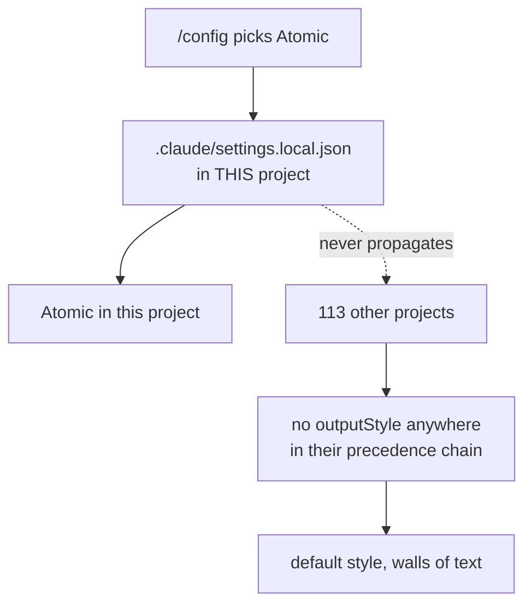

# Output style seed


New Claude Code sessions in most projects start on the default output style, not Atomic, even for a user who has picked Atomic before. This design covers why that happens and how `atomic` makes Atomic the effective default, without ever fighting a deliberate choice.


## The problem, as observed


Sessions open with the default voice and produce walls of text. Checking the project shows no output style configured, despite the user having selected Atomic in the past.


## Root cause


Three facts combine. All were verified rather than assumed.

**Fact 1 — the picker writes project-local.** `/config` → Output style saves to `.claude/settings.local.json` at the project level. The standalone `/output-style` command was deprecated in v2.1.73 and removed in v2.1.91. Source: [Output styles](https://code.claude.com/docs/en/output-styles).

**Fact 2 — the user level was never set.** A scan of this machine found `outputStyle` in exactly five files, every one a project-scoped `.claude/settings.local.json`:

```
projects/github/atomic-claude/.claude/settings.local.json   -> "Atomic"
projects/taxgentic/server/.claude/settings.local.json       -> "Atomic"
projects/spt/website/.claude/settings.local.json            -> "Atomic"
projects/spt/npm-packages/.claude/settings.local.json       -> "Atomic"
projects/noorm/monorepo/.claude/settings.local.json         -> "Atomic"
```

`~/.claude/settings.json` carries no `outputStyle` key. Neither does any of the 118 project entries in `~/.claude.json`, so no undocumented per-project store is shadowing the file chain.

**Fact 3 — the fix was documented but manual.** `docs/reference/output-style.md` already tells the reader to add the key to `~/.claude/settings.json` by hand for global scope. Nobody does that. The gap is automation and detection, not mechanism.

So the style was picked five times, five times project-locally, and the other 113 projects fall through to the built-in default.




## Settings precedence


Verified against [Settings](https://code.claude.com/docs/en/settings). Highest wins:

| Rank | Source | Scope |
|------|--------|-------|
| 1 | Managed settings (`managed-settings.json`, MDM) | machine |
| 2 | CLI args (`claude --settings`) | invocation |
| 3 | `.claude/settings.local.json` | project, personal |
| 4 | `.claude/settings.json` | project, committed |
| 5 | `~/.claude/settings.json` | user |

A user-level `outputStyle` **does** apply to a project whose settings files omit the key. That is the only lever this design pulls.


## Approach: seed the user-level key


One function with one job:

> If `~/.claude/settings.json` has no `outputStyle` key, set it to `"Atomic"`.

Never overwrite. Never touch a project file. Never touch a value someone already chose.

That single rule fixes 113 of the 118 projects on this machine, because precedence rank 5 answers every project that does not override it.

### Triggers

| Trigger | Where | Why it exists |
|---------|-------|---------------|
| `atomic claude install` | after the bundle is applied | the style file must exist before the key can point at it |
| `atomic claude update` | shares `installOrUpdate` | an existing install self-heals |
| `atomic hooks session-start` | alongside `refreshProfile` | belt-and-braces; the fix lands with no user action at all |

**On the session-start trigger.** Its marginal reach is small and that is understood. `atomic update` re-execs the freshly swapped binary as `atomic claude update` (`atomic/cmd/atomic/cmd_update.go:322-334`), `.goreleaser.yaml` publishes no brew or package-manager channel, and `install.sh` ends by instructing the user to run `atomic claude install` — so almost every route that puts this code on a machine already runs the install trigger seconds earlier. What is left for the hook is `atomic update --skip-claude-update`, a failed artifact refresh, and any future distribution channel that bypasses `atomic update`.

It is kept anyway, by explicit decision, because the cost is one file read on a path that already reads several and the check becomes a permanent no-op the moment the key exists.

The trigger is **ungated**: there is no "seeded once" marker. The consequence is stated plainly rather than hidden — a user who deletes `outputStyle` to return to the stock style will find it re-seeded on the next session start. Under this design the opt-out is `atomic config set output_style.seed false` or an explicit pinned value, not an absent key. See *Opting out*.

The hook resolves its target as `~/.claude`, the same way `checkWikiStaleness` and `checkWherePosition` already do, because a hook invocation carries no `--target`. On a machine installed with `atomic claude install --target <elsewhere>` the guard finds no `output-styles/atomic.md` under `~/.claude` and the hook trigger silently no-ops, leaving the install trigger — which does know the target — as the one that seeds. That is the correct outcome and needs no extra handling.

Like `refreshProfile`, the seed swallows every error. The session-start hook must never block.

### Why not a per-project write

An earlier draft had the session-start hook write `<repo>/.claude/settings.local.json`. Rejected on three counts:

| Project-file write | User-level seed |
|--------------------|-----------------|
| first repo-working-tree write the hook has ever done; dirties `claude -p` CI runs and drops an untracked file in every repo | writes only under `$HOME` |
| `/clear` re-fires SessionStart, so an overwrite reverts the deliberate switch `/clear` was meant to apply | runs on an explicit verb, never on a session boundary |
| would require replicating Claude Code's per-repo file-placement rules, including its worktree behavior | rank 5 is the same file from anywhere |

### Guard

Writing `outputStyle: "Atomic"` when the installed bundle has no `output-styles/atomic.md` points the setting at a style that does not exist. The seed checks first and skips silently when it is missing. The value written is the frontmatter `name`, `"Atomic"`, not the filename slug.

The seed fires only for a user-level install. `atomic claude install --target ./.claude` is the documented project-scoped route, and following the target there would write `outputStyle` into a repo's committed settings file, which Rejected below forbids.

> **Superseded, 2026-09-08.** This section originally read: "The path derives from the install target, not a hardcoded `~/.claude`: `atomic claude install --target` moves the bundle, and the seed follows it." That reasoning was about `~/.claude` being relocatable and did not account for a target being a repo. The final audit reproduced the consequence: a project-scoped install wrote the key into a committed `.claude/settings.json`. See the matching `Correction:` entry in `docs/spec/output-style-seed.md`.

Under `--dry-run` the guard evaluates against the install manifest rather than the disk, since on a fresh dry run the style file is not written yet and a disk check would suppress the plan line dry-run exists to show.


## Write contract


The seed writes a file Claude Code owns and live-watches. Upstream states Claude Code watches its settings files and reloads them on change, so this write wakes every running session's watcher once and fires a `ConfigChange` with `source: user_settings`. That is acceptable for a one-time write on an explicit verb, and it is why the write must never expose a partial file.

`writeSettingsHujson` is currently `os.WriteFile` — truncate then write. A watcher reading inside that window sees invalid JSON and the session loses its `permissions` and `hooks` until the next change. The helper is fixed once, which also repairs `registerInSettings` for the case of `atomic claude install` run while a session is open:

| Concern | Rule |
|---------|------|
| torn read | write a temp file in the same directory, then `os.Rename` — the pattern `config.WritePersist` and `profile.Refresh` already use |
| symlinked settings (dotfiles repos) | `filepath.EvalSymlinks` before the rename, so the link is not replaced by a regular file |
| read-only file | probe with `os.OpenFile(resolved, O_WRONLY, 0)` and skip on `EACCES`; rename would otherwise bypass the mode bits |
| malformed settings file | warn as `malformedSettingsError` does and continue; never abort the artifact install |

A lost update against Claude Code's own write between read and rename is accepted: the window is microseconds and Claude Code writes the user file only when an option changes in the `/config` menu, never at startup.


## Feature flag


`~/.atomic/config.toml`, user scope, defaulting to enabled:

```toml
[output_style]
seed = true
```

| State | Behavior |
|-------|----------|
| key absent | seed (default true) |
| `seed = true` | seed |
| `seed = false` | no trigger writes `outputStyle`; doctor reports state but offers no repair |

Follows the `update.run_doctor` pattern: a plain bool with its default in `Default()` and explicit presence read from the raw map. Added to `knownKeys` so `atomic config set output_style.seed false` works as a CLI verb rather than a hand edit.

**User scope, not repo scope.** The behavior being disabled is a write to the user's own global settings file. A committed `.claude/atomic.toml` letting one repo suppress a user-global write is the wrong direction of control, and a user could not disable it for repos they do not own.

`--no-hooks` does not skip the seed. The seed is not a hook, and a user passing that flag might reasonably assume otherwise, so the install output says so.

### Opting out

Because the session-start trigger is ungated, **deleting the key is not an opt-out** — it is re-seeded on the next session start. Two routes work:

1. **`atomic config set output_style.seed false`** — the primary opt-out. Every trigger stops writing, and doctor drops to informational with no repair offered. This is the route the install announcement names and the one the docs lead with.
2. **Pin an explicit value.** Any value other than an absent key is left alone by the seed. *Unverified:* whether Claude Code accepts `"Default"` as an explicit value for the built-in style — one manual check is needed before this is documented as a supported route.

The design deliberately makes the config flag the real switch rather than the settings key. Stating that in the docs is part of the work: a user who deletes the key and sees it return must be able to find out why in one search.


## Diagnosis: `atomic doctor`


The user had to scan the disk by hand to learn which file pinned which style. A doctor category closes that:

| Condition | Level | Message |
|-----------|-------|---------|
| user-level `outputStyle` unset | WARN | `--fix` seeds it |
| user-level set | PASS | reports the value |
| any `outputStyle` in `<root>/.claude/settings*.json` | INFO | reports it as "may override the user-level value" |
| key set but the style file is not installed | WARN | the key points at a style that is not present |

The row reports what each file contains. It does not claim to compute the effective value, because doing so would require replicating Claude Code's per-repo file-placement rules — the same dependency this design declined above.

`--fix` seeds the user level only, never a project file, and does nothing when `seed = false`.


## Uninstall


`atomic claude uninstall` removes `outputStyle` **only when its value is `"Atomic"`**. Leaving it would point user settings at a style file that was just deleted; removing someone else's chosen value would be overreach.


## Announcement


One stdout line on install, no prompt and no flag: the write is non-destructive, only ever fills an absent key, and the line names `atomic config set output_style.seed false` as the opt-out. This matches the existing `ensureProfileStub` and `session-start hook installed.` notices.


## Rejected


- **Per-project enforcement write.** See the table above.
- **A "seeded once" marker.** Considered, and declined: it would make a deleted key stick, but it also introduces state whose only job is to remember a decision the config flag already expresses. The flag is the switch; the key is not.
- **A current-session model nudge.** `outputStyle` is read once at session start and no `hookSpecificOutput` field can change it, so a seeded key lands on the next session or on `/clear`. That path is reliable, so the `prefer-code-over-model` exception does not apply.


## Documentation to update


- `docs/reference/output-style.md` — currently instructs the reader to hand-edit `~/.claude/settings.json` for global scope. Rewrite to: install seeds the user-level default, `/config` overrides per project, `atomic doctor` reports what is set where.
- `docs/guides/install.md` — the "activate the output style" step becomes "verify", not "do".
- `docs/spec/atomic-state-and-config.md` — the new `output_style.seed` key in the user-config schema. Not `docs/reference/atomic-toml.md`, which owns the repo-scoped file.
- `context/commands/atomic-help.md:128` — the `style` topic row still says to activate via `/config`.


## Change log

- 2026-09-08 — Initial design (as `output-style-enforcement.md`). Root cause verified empirically (5 project-local files, no user-level key, 0 hits in `~/.claude.json`) and against Claude Code docs (precedence, one-session lag, no hook field for output style).
- 2026-09-08 — Reshaped after first review. Dropped the per-project enforcement write and the current-session nudge; retargeted the session-start hook at the user-level key; moved the flag from repo to user scope; added the doctor category, uninstall rule, and dry-run rule.
- 2026-09-08 — Reshaped after second review and renamed to `output-style-seed.md`. Renamed `enforce` to `seed`, since nothing is enforced. Added the atomic write contract (tmp+rename, `EvalSymlinks`, read-only probe, malformed-file warn), the settings-reload side effect, the `update.run_doctor` flag pattern, the `atomic config set` opt-out verb, the `--no-hooks` clarification, and narrowed the doctor row to reporting per-file contents rather than computed precedence.
- 2026-09-08 — Session-start trigger kept, ungated, by explicit decision after its reach was measured and found near-empty. The accepted consequence is that a deleted `outputStyle` key is re-seeded on the next session, making `atomic config set output_style.seed false` the real opt-out rather than an absent key. A "seeded once" marker was offered and declined. Opt-out section rewritten to lead with the config verb.
