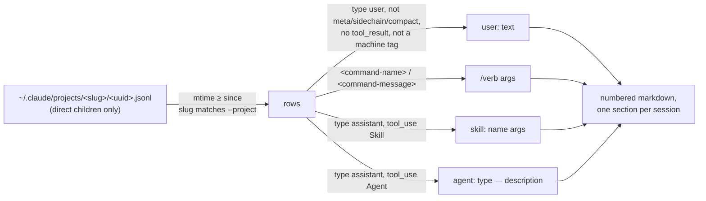

# atomic retro extract


## Problem


`/retrospective-learning` points its history scanners at raw `.jsonl` session files. Three things go wrong with that, all observed on the 2026-09-20 run (issue #270):

- Scope is the cwd's project dir only. That dir held one session; the real history was 127 sessions, 740 MB, across about 40 project dirs.
- The raw rows are almost all machine traffic: `tool_result` blocks, sidechains, skill-prompt expansions, `<system-reminder>` blocks, compaction summaries. A scanner spends its budget on noise and re-types every quote it wants to cite.
- Attribution of a complaint to the atomic artifact that ran just before it is a positional rule applied by the model over rows it cannot see cleanly, so it lands on unrelated artifacts.

An ad-hoc `jq` script that kept only user-typed text and the `Skill` / `Agent` tool calls turned 740 MB into 380 KB. This design makes that filter a deterministic verb of the binary, and reshapes the retrospective's scanners to cite lines instead of quoting.

How a session file becomes lines in the extract:




## Goals / Non-goals


- Goals:
  - One verb, `atomic retro extract`, that walks every `~/.claude/projects/*/` dir and writes one readable markdown file (or N size-balanced shards) covering every session modified since a date.
  - The date defaults to the last recorded retrospective run, so `/retrospective-learning` covers exactly what happened since it last looked.
  - Output keeps user-typed text, slash-command invocations as one line, and one line per assistant `Skill` / `Agent` call; drops every machine-injected row and block.
  - Every output line carries its own line number so a scanner answers with `file:line + category` and the orchestrator recovers the quote with `sed`.
  - Long messages are truncated with a visible marker so one pasted log cannot dominate a shard.
  - `/retrospective-learning` reads the extract, runs its scanners on Sonnet, and asks for line references instead of re-typed quotes.
- Non-goals:
  - Changing what the retrospective does with findings: tiers, the walk, the run log, the learnings file.
  - Extracting assistant prose or thinking. The retrospective mines user friction; the assistant side is reduced to which artifacts it invoked.
  - Reading `subagents/` transcripts. A subagent's user-role rows are orchestrator prompts, not the user.
  - Any output format other than markdown. No `--json`.
  - Writing the run log. The extractor reads `~/.atomic/retro-runs/`; only the retrospective writes it.
  - Windows paths or a configurable projects root beyond `$HOME`.


## What the rows look like


Verified against real session files on disk (six sessions over 1 MB, 2026-09). The extractor's contract is written against these shapes; a fixture in `testdata/` carries a synthetic copy of each.

| Row | Shape | Disposition |
|-----|-------|-------------|
| Tool output threaded as user | `type: user`, `message.content` is an array holding a `tool_result` block | drop |
| Subagent traffic in the main file | `isSidechain: true` on any row | drop |
| Skill-prompt expansion, local-command caveat, image attachment note | `type: user`, `isMeta: true` | drop |
| Compaction summary | `type: user`, `isCompactSummary: true` (text opens "This session is being continued") | drop |
| Local command echo, background-task notice, bash mode, peer-session message | `type: user`, string content opening with `<local-command-stdout>`, `<local-command-caveat>`, `<task-notification>`, `<bash-input>`, `<bash-stdout>`, `<bash-stderr>`, `<agent-message`, `<cross-session-message` | drop |
| Harness reminder appended to a typed message | `<system-reminder>…</system-reminder>` anywhere in the text | strip the block, keep the rest |
| Slash command | string content holding `<command-name>/x</command-name>` (built-ins) or `<command-message>x</command-message>` (custom commands and skills), plus optional `<command-args>y</command-args>` | one line: `/x y` |
| Typed text | `type: user`, string content, or an array of `text` blocks (images alongside are ignored) | keep, truncated |
| Assistant tool call | `type: assistant`, a `tool_use` block named `Skill` (`input.skill`, `input.args`) or `Agent` (`input.subagent_type`, `input.description`) | one line each |
| Everything else | `attachment`, `queue-operation`, `system`, `last-prompt`, `file-history-*`, and the other bookkeeping types; assistant `text` and `thinking` blocks | drop |

Row timestamps are RFC 3339 UTC. Session files are `<uuid>.jsonl` directly inside `~/.claude/projects/<slug>/`; the slug is the session's cwd with every `/` replaced by `-`. Subagent transcripts live one level deeper at `<slug>/<uuid>/subagents/`, so taking only direct children skips them without a name check. Rows holding a large `tool_result` run past 64 KiB, which is `bufio.Scanner`'s default token limit.


## Approaches


| # | Approach | Pros | Cons |
|---|----------|------|------|
| A | Go verb in the binary, streaming each file once through a struct decoder that names only the fields the filter reads | Deterministic, testable against fixtures, one process over 740 MB in seconds, no runtime dependency; the retrospective calls one command | New package and CLI verb to maintain |
| B | Ship the `jq` script inside the retrospective command | Zero Go | `jq` is not guaranteed on PATH; the filter rules live in a prompt file where nothing tests them; 740 MB through `jq` is slow; sharding and line numbering need more shell around it |
| C | Have the scanner subagents apply the filter themselves from a better brief | No code at all | This is the status quo that failed: the model re-types quotes, mis-attributes artifacts, and cannot see 740 MB |


## Recommendation


Approach A. The filter is a deterministic transform, which `context/CLAUDE.md` assigns to code, not the model; the binary already owns every other deterministic step the retrospective delegates (`doctor`, `validate`, `docs stale`). A Go package with fixtures makes the row rules above a tested contract instead of prose in a brief.

Shape of the verb, and how the retrospective calls it:

    atomic retro extract [--since <YYYY-MM-DD>] [--project <glob>] [--shards N] [--out <file.md>]

    # /retrospective-learning pre-flight
    atomic retro extract --shards 4 --out "$SCRATCH/history.md"
    # → $SCRATCH/history.1.md … history.4.md, one scanner each

Output shape, so a scanner can answer `history.2.md:184 correction`:

```
    1 | # retro extract — since 2026-08-19 — 12 sessions, 6 projects — shard 2/4
    2 |
    3 | ## 2026-09-06 · /Users/me/projects/foo
    4 | session: d730aa67-… · first: 2026-09-06T20:44:43Z · last: 2026-09-07T13:00:02Z · 41 entries
    5 |
    6 | [09-06 20:44] /model
    7 | [09-06 20:45] user: make the test pass without touching the fixture
    8 | [09-06 20:45] agent: atomic-implementer — Fix fixture-independent test
    9 | [09-06 20:51] user: no. I said without touching the fixture. …[+412 chars]
```

Decisions the issue left open, and the choice made here:

| Question | Decision | Why |
|----------|----------|-----|
| Which rows count as machine traffic beyond the issue's list | The issue's list plus `<agent-message` and `<cross-session-message` rows | Both are bus peer messages injected as user-role prompts; the user did not type them |
| No `~/.atomic/retro-runs/` and no `--since` | Default to 30 days before now, announced on stderr | A first `/retrospective-learning` run must work without portable shell date arithmetic in the command file; an error here would push that arithmetic into the prompt |
| Line numbering across shards | Each file numbers its own physical lines from 1; the answer key is `file:line` | `sed -n 'Np' file` then returns the quote with no offset bookkeeping; a global counter would make the number in the file disagree with the file's own line |
| `--out` required or optional | Optional; stdout when absent. `--shards` requires `--out` | One file to stdout is the Unix shape; shards need a stem to name the files after |
| Shard count larger than the session count | Capped at the session count | Empty shard files would dispatch scanners with nothing to read |
| Project dir shown per session | The `cwd` of the first row, falling back to the slug | The slug is the cwd with `/` folded to `-`; the real path reads better and is what the user recognizes |
| Where `--project` matches | The slug (directory name) with `filepath.Match` | `*` in `filepath.Match` does not cross `/`, so matching the cwd path would make `*foo*` miss; the slug has no separators |
| Message truncation | 800 characters, then `…[+N chars]` | Typed messages are short; anything longer is a paste. 800 keeps a long correction intact and bounds a pasted log to one screen |
| Which timestamps frame a session | First and last over every user or assistant row, not only kept ones | That is the session's real span; a session whose kept entries are one line still shows when it ran |

Scanner changes in `/retrospective-learning`, in scope per the issue:

- Pre-flight runs the extractor once into the scratchpad. Scope is every session since the last run, not the cwd's last five.
- The history brief points each scanner at one shard file, asks for `file:line + category` rows, and forbids re-typed quotes. Attribution uses the `skill:` / `agent:` / `/verb` lines that precede a finding, cited by line, instead of a positional rule the model applies over raw rows.
- The history and prior-retro runners default to Sonnet. The 2026-08-19 Haiku prior-retro auditor reported 9 of 10 accepts as drifted when all had landed.
- Step 4 recovers each cited quote with `sed -n '<line>p' <file>` before categorizing, so the orchestrator never trusts a re-typed line.


## Open questions


- Whether a `--project` match on the session's real cwd is worth a second flag once someone asks for it. Not built now.
- Whether assistant `text` blocks that immediately precede a correction would sharpen attribution. Left out; the issue scopes the assistant side to tool calls.
