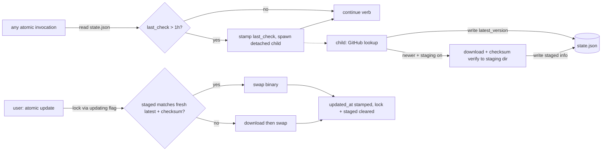

# Self-update state, check cadence, and staged downloads

## Problem

The update check pings GitHub far more than its 1-hour cache window intends. Measured 2026-08-09 (v6.1.0):

- The check goroutine writes `~/.cache/atomic/update.json` only *after* the HTTP response completes (`selfupdate.go:484-494`), but `main.go:146` waits just 100ms after `Execute()` before exiting. A GitHub round-trip is 150-400ms. Any verb faster than that fires a request whose result — including the cache write — is discarded.
- Fast verbs (`atomic where`, 25ms) die before the goroutine even dials: 5 proxied invocations produced 0 connection attempts and no cache file, ever.
- Failure paths (`selfupdate.go:477-480`) never write the cache, so offline / rate-limited / unwritable-cache machines retry on every invocation. Unauthenticated GitHub rate limit is 60 req/hr/IP — a 403 storm is self-reinforcing.
- Real-machine evidence: `checked_at` 10 hours stale despite all-day use — every mid-speed invocation that day sent a request and threw the result away.
- One `atomic doctor` run under a stalled endpoint produced 4 connection attempts (transport retries amplify during outages).

Agent-driven usage multiplies invocations (signals-gate per commit, `code sync` per iteration, session hooks), so the defect scales with exactly the usage pattern this tool is built for. A user report confirms it in the wild.

Secondary pain: when the user finally runs `atomic update`, the download starts from zero. The check already knew a newer version existed, possibly for days.

Update lifecycle after this design — the parent process never touches the network:

## Goals / Non-goals

- Goals:
    - GitHub sees at most one release lookup per hour per machine, regardless of invocation rate, process lifetime, or check outcome.
    - Update state lives in one machine-managed file with a defined schema: `~/.atomic/state.json`, `update` block carrying `last_check`, `updating`, `update_started_at`, `updated_at`, `last_notified`, `latest_version`, `stage_attempted_for`, and staged-download info.
    - Concurrent update protection: two binaries cannot run the update swap simultaneously; `--force` overrides; a crashed updater's stale lock self-expires via `update_started_at` age.
    - Persistent opt-out in user config: `[update] check = false` in `~/.atomic/config.toml` disables the background check entirely (the per-invocation `--no-update-check` flag remains).
    - Background staging: when a check finds a newer version, a detached child downloads and checksum-verifies the binary to a staging dir, so a later `atomic update` swaps instantly — after re-verifying the staged version is still the latest and the checksum still matches GitHub.
- Non-goals:
    - No auto-apply. The binary is never swapped without an explicit `atomic update`.
    - No repo-scoped opt-out in `.claude/atomic.toml` (user decision 2026-08-09; user config only).
    - No prerelease-channel changes; staging follows the same `stable` channel as the check.
    - No formal migration verb for `~/.cache/atomic/update.json` — it is deleted opportunistically when first writing state; nothing reads it afterward.
    - No staging of the artifact bundle — `atomic claude update` flow is untouched; only the binary is staged.

## Business rules

- `last_check` is stamped **before** any network attempt (synchronously, in the parent). A lost check result costs one quiet hour, never an extra request.
- The parent process performs no HTTP. Check + stage run in a detached child (`atomic update --check`) that survives the parent. The 100ms post-`Execute` banner wait is deleted; the banner renders from state already on disk.
- One lock covers update and staging: `updating=true` + `update_started_at`. A holder younger than the stale threshold blocks a second updater (clear error naming the age); older than the threshold, the lock is considered abandoned and may be taken over. `--force` skips the block.
- Background staging for a given version is dispatched at most once, ever: `stage_attempted_for` is stamped with the target version before the stager spawns, and the spawn gate is `latest_version != stage_attempted_for`. A failed attempt is recorded (`last_result`), never retried in the background — `atomic update` falls back to a normal download.
- A staged binary is trusted only if, at swap time, its recorded version equals a fresh lookup's latest AND its checksum re-verifies against the release's `checksums.txt`. Any mismatch discards the stage and falls back to a normal download. Missing/corrupt staged file is never an error — restage or download.
- Staged artifacts are disposable: they live under `~/.cache/atomic/staged/` (cache semantics — safe to delete anytime); `state.json` is the authority on what is staged.
- State writes are atomic (temp + rename), same pattern as the current cache writer. Best-effort concurrency: at most two concurrent writers in practice (parent stamping, child reporting), collisions lose one field update and self-heal on the next cycle — accepted per the serial usage pattern.

## Approaches

Check-execution architecture (the forks the config/format/staging questions didn't already settle):

| # | Approach | Pros | Cons |
|---|----------|------|------|
| A | Stamp-before-request + keep in-process check goroutine | Smallest diff | Measured: fast verbs never complete a check — on a machine running mostly short verbs, `latest_version` goes permanently stale; banner never fires; 100ms select survives |
| B | Stamp-before-spawn + detached child does check *and* stage | Check always completes once spawned; parent does zero network + zero waiting; one mechanism serves both check and stage; kills the post-Execute select | Spawns a process at most 1x/hr; child failures are invisible unless reported into state |
| C | Check only inside long-lived verbs (update, doctor, serve) | No spawn machinery | Machines that never run those verbs never learn of updates; cadence coupled to verb choice |

## Recommendation

**B.** The staging requirement already demands a detached child (user decision 2026-08-09, matching the repl harness spawn prior art in `atomic/internal/repl/spawn.go`); folding the check into the same child makes the parent's fast path pure file I/O and makes check completion independent of parent lifetime — the exact failure measured in A. Child reports its outcome into `state.json` (`last_result` field) so `atomic doctor` can surface chronic check failures instead of them being silently invisible.

Settled by user 2026-08-09: opt-out in user config only (`~/.atomic/config.toml`); state format JSON at `~/.atomic/state.json`; staging via detached child.

Defaults: `check = true`, `stage = true` (staging is the feature's point; both keys independently disable). `stage = false` still checks and banners, just never downloads in the background.

## Open questions

- Stale-lock threshold value (proposed: 10 minutes — longest plausible download+swap on slow links; spec may tune).
- Should `atomic doctor` gain explicit reporting of `last_result` failures, or is folding it into the existing category-9 config check output enough? (Proposed: fold into existing check; no new category.)
