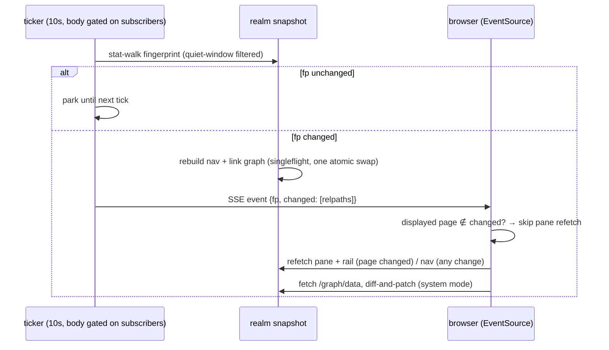

# Serve live reload

## Problem

`atomic serve` has three independent filesystem walks with three freshness models: the nav tree walks per request (`nav.go`), the Network View JSON cache stat-walks a fingerprint per request (`graphcache.go:58`), and the link graph is built once at startup and frozen (`serve.go:206`, "static for the server's lifetime"). A file created mid-session appears in nav and search but never in the graph, backlinks, or wikilink resolution until restart.

Two distinct goals, deliberately separated: (1) the **staleness bug** — the frozen link graph — which lazy rebuild alone would fix; (2) the **live-watch UX** — agents writing plan files while the user has a page or the system graph open, and the open view updating without manual reloads and without the view jumping. The second is an explicit user requirement, not an implication of the first; it is what justifies the ticker/SSE apparatus below.

Flow of the chosen shape:

## Goals / Non-goals

- Goals:
  - One filesystem walk mechanism feeding fingerprint, nav, and link graph — a single snapshot with one invalidation rule.
  - The link graph (rail OUT/IN, mini-graph, wikilink resolution, system view) reflects new/deleted/edited files without restart.
  - Open views update live: page mode preserves scroll and skips refetch when the displayed page did not change; system mode preserves node positions and viewport.
  - Zero server work when no browser tab is open.
  - Clean, fast shutdown with tabs open.
- Non-goals:
  - fsnotify or any file-watcher dependency.
  - WebSockets or htmx SSE extension (plain `EventSource`).
  - Per-page / per-subtree *fingerprints* — the whole-realm fp remains the unit of change detection; the `changed` relpath list in the event is a manifest diff, not per-page state.
  - A user-facing tick-interval flag (the interval is constructor-injectable as a test seam only).
  - Rename detection — a rename is treated as delete + create; the node's cached position is lost. Accepted.
  - Unifying the `external.go` and `search_md.go` walkers into the snapshot — they are query-scoped, not snapshot-shaped. The snapshot consolidates three of the six filter call sites; those two stay as-is.
  - Multi-user coordination (localhost, single user).
  - Code-intel index watching (separate subsystem; MCP daemon already polls).

## Approaches

| # | Approach | Pros | Cons |
|---|----------|------|------|
| A | Status quo + lazy graph rebuild (per-request fp check rebuilds link graph) | Smallest diff; no new endpoint | No push — an open page never updates; rebuild cost sits in the request path |
| B | Client polls fp endpoint every 10s | No SSE plumbing | N tabs × N walks; rebuild in request path (cold fetch after change); still needs client refetch logic — all the client work of C without the pre-warm |
| C | Server ticker (10s, body gated on subscriber count) + `/events` SSE broadcast | One walk per tick shared across tabs; rebuild pre-warms before any fetch; near-zero idle cost; client is a dumb listener | SSE handler + subscriber registry to write; goroutine lifecycle to manage |
| D | fsnotify watcher | Sub-second latency | New dep; platform edge cases; repo precedent is stat-polling (MCP daemon `SyncInterval = 10s`, `daemon.go`) |

## Recommendation

**C**, with A's lazy fp check retained as the correctness backstop: request handlers validate the snapshot fingerprint lazily, so freshness never depends on the ticker; the ticker is the proactive layer that pre-warms rebuilds and pushes events. A alone fixes the staleness bug; C exists for the live-watch requirement (see Problem). Evidence:

- The singleflight + fp-keyed cache pattern exists and works (`graphcache.go:114-149`) — the snapshot generalizes it from graph-JSON-only to nav + link graph.
- The fingerprint walk already deliberately mirrors `BuildLinkGraph` filters (`graphcache.go:55`, filters in `walk.go:20-41`) — the coupling is maintained by hand across call sites today; one walk removes the drift risk for the three snapshot-shaped consumers.
- 10s stat-polling matches the code-intel MCP daemon precedent; no new dependency.
- Subscriber gating answers the idle-cost objection to a server timer: 0 subscribers → the ticker body is a no-op.

## Cost model

The tick path is bounded by construction, not by assertion:

- **Per tick, no change**: one stat-only walk (the fingerprint manifest). No content reads, no subprocesses.
- **Per tick, on change**: rebuild of nav paths + link graph — `.md` stat + content reads only. The full-view graph JSON and the provenance DAG are **not** in the tick path: they stay lazily assembled on `/graph/data` demand behind the existing fp-keyed singleflight, exactly as today. `BuildProvenanceDAG` performs per-citation content SHA-256 reads and git subprocess calls (`provenance.go:212,256`) — that cost is paid only when a system view is actually open and fetches, never by the ticker.
- **Overrun**: if a rebuild is still in flight when the next tick fires, the tick is skipped (non-blocking check). No queued or back-to-back rebuilds.
- **Torn writes**: the manifest excludes files whose mtime is within a quiet window (~2s) of now — an agent mid-write does not flip the fp until the file settles, so half-written content is never pushed. The window is constructor-injectable alongside the tick interval.
- **Mid-walk vanish**: a file deleted between stat and content read is skipped for that rebuild without error; the next tick picks up the deletion (the manifest diff reports it).

## Concurrency contracts

These are contracts, not sketches — the spec encodes each as a success criterion or checkpoint verify:

- **Snapshot swap**: the snapshot (fp + nav paths + link graph) is one immutable struct published by a single atomic pointer swap. A handler reads the pointer once per request and works from that consistent triple; torn reads (new fp, stale graph) are impossible by construction. The graph-JSON cache remains fp-keyed as today.
- **One rebuild funnel**: ticker, lazy request-path validation, and startup warm all call the same snapshot accessor; nothing else rebuilds. Concurrent callers collapse to one rebuild — dedup keyed by rebuild generation, not by fp value (two racers walking a changing filesystem can compute different fps; fp-keyed `sf.Do` would run both).
- **Ticker lifecycle**: exactly one ticker goroutine, started at server start, stopped by the server context. It is never started or stopped on subscribe/unsubscribe edges — the *body* checks subscriber count and no-ops at zero. Flapping `EventSource` reconnects therefore cannot double-start it.
- **Subscribe resync**: every new subscription (including reconnect after sleep/resume) gets an immediate fp check-and-push, not a wait for the next tick.
- **Broadcast isolation**: each connection has a buffered send slot that coalesces to the latest event (only the newest fp matters); a per-connection writer applies a write deadline. A slow or dead subscriber never blocks the ticker or other subscribers.
- **Shutdown**: the `/events` handler returns promptly on server shutdown (and on client disconnect via the request context). `RunWithContext`'s existing 5s graceful window (`serve.go:373-378`) must not be consumed by open SSE connections — Ctrl-C with tabs open exits fast and clean, exit code 0.

## Reconciliation rules (client)

- The SSE event carries `{fp, changed: [relpaths]}` — the manifest diff the rebuild already computed. The list is capped (~100 entries); when over cap the field is omitted and clients treat everything as changed. The fp-equal no-op guard stays as the outer storm guard.
- **Page mode**: pane + rail refetch only when the displayed page's relpath is in `changed` (or the field is omitted). Nav refetches on any change, but an SSE-triggered nav refetch skips the realm staleness computation (`computeStaleness` → `wiki.Stale` shells git per member; that stays on ordinary navigation only). Scroll is preserved via a named mechanism — the **`live-swap` marker**: SSE-triggered htmx swaps mark the target, and the `htmx:after:swap` reset (`layout.html:1221-1224`) skips marked swaps. The marker applies to page-mode htmx swaps only; system mode patches via raw `/graph/data` fetch and shares the `EventSource` dispatcher (one boot script, both reconcile handlers registered on it), not the marker.
- **System mode**: fetch `/graph/data`, diff elements by id. Removed → `cy.remove()`; added → `cy.add()` seeded at a neighbor's position + offset, then scoped cola layout on the new collection only; no `fit()`, viewport untouched. **Degenerate fallback**: when `(added + removed) / (nodes + edges currently mounted) > 0.5`, or no instance is mounted, run a full re-layout — which may re-fit; a mostly-new graph has no stable frame worth preserving, accepted.
- **Layout cache**: the IndexedDB position cache re-keys from the whole-realm fp to a hash of the sorted element-id set — prose-only edits no longer invalidate cached positions — and the superseded entry is pruned on re-key, bounding growth.
- **Connectivity indicator**: a minimal status affordance (dot or equivalent) reflects `EventSource` state — live / reconnecting / disconnected — so silent staleness after a drop is distinguishable from "no changes".

## Testability decisions

- Tick interval and quiet window are constructor parameters (test seam; no user flag — the non-goal stands).
- SSE tests use `httptest.NewServer` + a real streaming client with a bounded context. The existing `search_stream_test.go` recorder pattern does not apply to an open-ended stream.
- The serve package's new concurrency surface runs under `go test -race`.
- Client checkpoints (scroll, viewport) remain manual-only — no JS test rig exists. This is an accepted, documented risk; revisit if a headless rig ever lands.

## Risks (design-level)

| Risk | Note |
|------|------|
| HTTP/1.1 ~6 connections per origin | One `EventSource` per tab + htmx requests; many simultaneous tabs can starve the pool. Localhost single-user makes this low; not mitigated in v1. |
| htmx 4.0.0-beta4 | All new client code builds on beta swap/history semantics; a beta bump can move the ground. Pinned vendored copy limits surprise. |
| Background-tab throttling | Browsers throttle timers and may delay SSE delivery in background tabs; the subscribe-resync contract covers the foreground-return case. |

## Open questions

(none — rail mini-graph updates by plain refetch with the pane; it is depth-1 and tiny, not worth a patch path)
