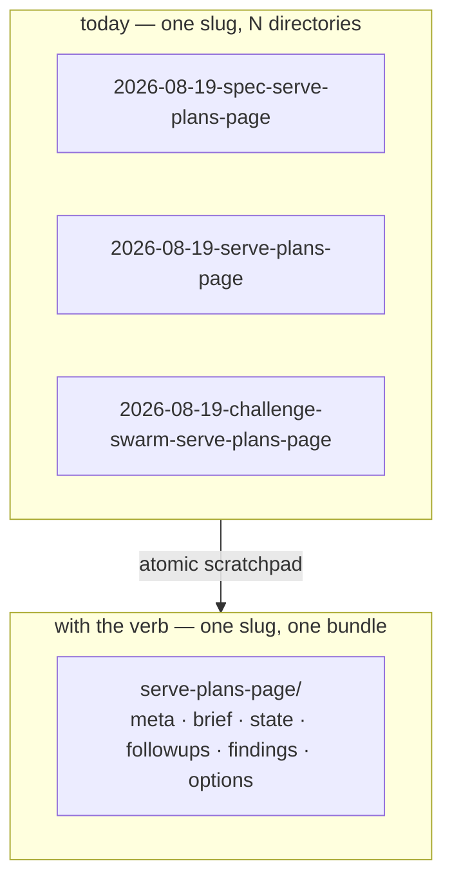
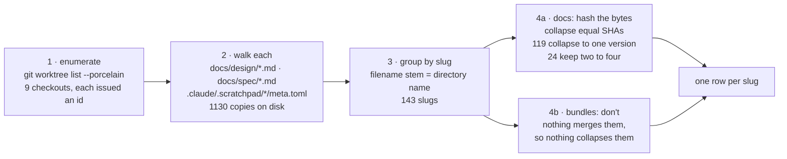
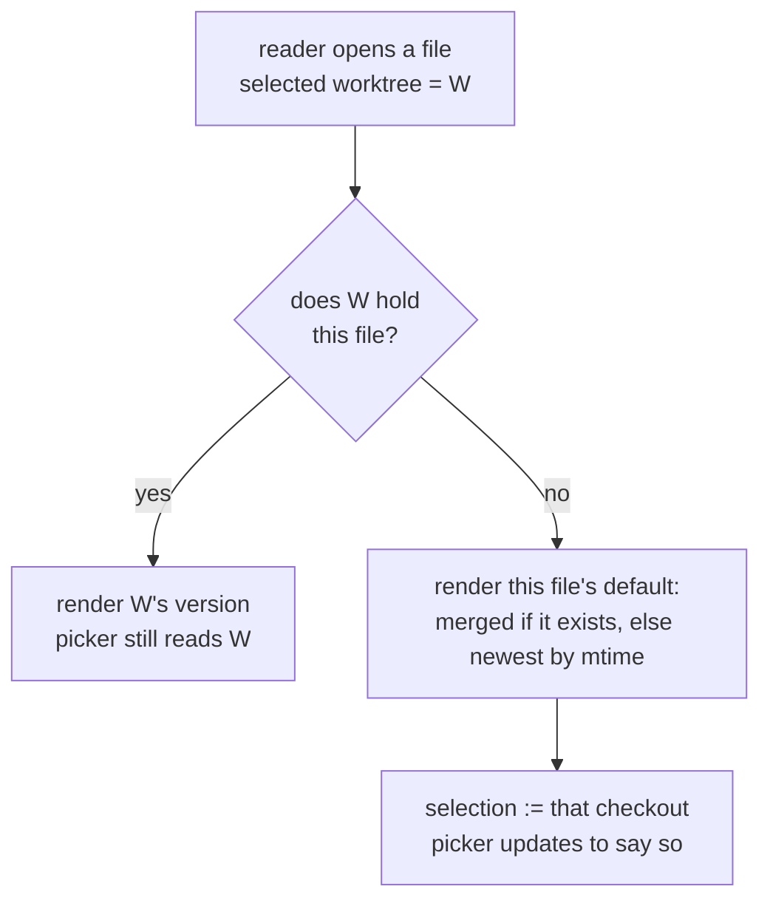

# Scratchpad bundles and the Plans surface


## Problem


A plan is written in a worktree. `/atomic-plan` produces `docs/design/<topic>.md` and `docs/spec/<topic>.md` on a feature branch, and that is where they stay until the branch merges. Meanwhile `atomic serve` renders only the checkout it was started in, so every in-flight plan is invisible to the person who has the browser open.

Serve's five walkers — nav, markdown search, the docs graph, the external-link scan, and the change fingerprint — recently stopped descending into git-ignored paths. That removed a real problem: `.claude/worktrees/` holds a full second checkout per branch, and in this repo that meant 2918 duplicate markdown files across eight worktrees, so every search answered nine times over. It also removed the only path that reached a worktree's plans at all.

Re-admitting worktrees to the general walkers would bring the duplication back. The plans are worth reaching; the other 2775 files are not.

### Committed docs are the weaker half

Measured across nine checkouts, every design and spec doc in a worktree also exists in the main checkout — the same 143 logical docs everywhere:

```
143 logical docs                    1130 copies on disk
                                     ↓ dedup by content SHA
119 docs (83%)  identical everywhere  →  one version
 22 docs         2 versions
  1 doc          3 versions             spec/atomic-state-and-config.md
  1 doc          4 versions             spec/atomic-doctor.md
```

Divergence is real but narrow, and it is all that half can offer, because `docs/**` merges. The other half never merges: `.claude/.scratchpad/` is git-ignored with zero files ever committed, so a slug's brief, state, follow-ups, research notes, and rendered visual options exist in exactly one checkout, permanently, reachable only by `cd`-ing there.

That reframes the unit. A reader does not want "a spec"; they want everything known about a piece of work — its design, its spec, and the working state that says whether anyone is still on it. **A row is a slug, aggregated across every worktree. Which checkout a given file comes from is a choice made when reading that file, not a filter applied to the list.**

### The scratchpad has no shape to read

Nothing can aggregate a bundle that has no convention, and there is none. Every command invents its own directory name:

| Creator | Directory pattern |
|---|---|
| `/atomic-plan` spec loop | `<YYYY-MM-DD>-spec-<topic>` |
| `/subagent-implementation`, `/quick-fix` | `<YYYY-MM-DD>-<topic>` |
| `/subagent-diagnose` | `<YYYY-MM-DD>-diagnose-{ci\|bug}-<slug>` |
| `/challenge-swarm` | `<YYYY-MM-DD>-challenge-swarm-<slug>` |
| `/session-report` | `session-reports/<branch>` |

Four slug-ish shapes and one keyed by branch. Planning this very feature produced three separate directories in one session — `2026-08-19-spec-serve-plans-page`, `2026-08-19-serve-plans-page`, `2026-08-19-challenge-swarm-serve-plans-page` — for one slug, with nothing relating them.

The date prefix is what fragments it. The same slug worked on across two days, or through two phases, produces two directories that no code can associate.



So this design covers two things in dependency order: a verb that gives a slug bundle a shape, and a surface that renders it.


## Goals / Non-goals


- Goals:
  - An `atomic scratchpad` verb that owns creation, lookup, listing, and archival of slug bundles, so no command hand-rolls a directory again.
  - A `--purpose` that decides which templates a bundle is seeded with, since a quick fix needs no design doc and a diagnosis needs a context file.
  - One directory per slug, accumulating across phases, rather than one per phase per date.
  - Machine-readable bundle metadata, so a listing is parsed rather than inferred from prose.
  - Migration of every command that currently creates or names a scratchpad path onto the verb.
  - A Plans surface in `atomic serve` listing slugs aggregated across every worktree, showing a slug's committed docs and its uncommitted bundle together.
  - Realm scope on day one: pick one repo — a member, or the realm root itself — and see exactly what serving from inside that repo would show. A switch between repos, not a union across them.

- Non-goals:
  - Committing scratchpad content. It stays git-ignored and worktree-local; the page reads it in place.
  - Re-admitting worktrees to nav, general markdown search, the docs graph, the external-link scan, or the fingerprint walk.
  - Keying session reports by slug. They stay branch-keyed; only their parent directory moves, below.
  - Diffing two versions of a doc against each other.
  - Any write path in `atomic serve`. The server stays read-only; only the CLI writes.
  - Reading plans from branches with no worktree on disk.
  - Gating Plans behind a loopback check. `atomic serve` is a local reading tool, not a hosted one; `--host 0.0.0.0` is a deliberate act by someone who wants LAN access and gets what they asked for. Bus chat is gated because it *writes*, which is a different question from reading.


## Approaches


Two decisions carry the design: what keys a bundle, and how the page reads one.

### Bundle identity

| # | Approach | Pros | Cons |
|---|----------|------|------|
| A | Keep `<date>-<topic>`, teach the page to group by fuzzy topic match | No migration | Grouping by string-similarity is a guess; `spec-serve-plans-page` and `challenge-swarm-serve-plans-page` share no clean prefix. Fragility is the whole problem |
| B | `<slug>/` alone, date moves into metadata | One directory per slug forever; phases accumulate; grouping is identity, not inference | Migration of seven creators; two runs of one purpose on one slug now share a directory |
| C | `<slug>/<purpose>/` nested per phase | Phases stay separable | Reintroduces the fragmentation one level down; the page has to re-merge them anyway |

**B.** The date was never identity — it was a uniqueness hack standing in for one. Slug is the identity every command already has in hand, and the page needs bundles related by work, not by day.

### How the page reads a bundle

| # | Approach | Pros | Cons |
|---|----------|------|------|
| D | Serve walks worktrees itself and parses bundle files | No new CLI surface | Serve reimplements what the verb knows; two definitions of a bundle drift apart |
| E | Serve shells out to `atomic scratchpad list --json` per worktree | One definition, owned by the verb | A subprocess per worktree per request; serve currently shells to git only for ignore rules |
| F | Serve reads `meta.toml` directly, with the verb owning the format | One format, no subprocess in the request path; the verb stays the only writer | The format becomes a contract two components share |

**F.** The verb owns writing and the format; serve only reads. E's subprocess-per-worktree is the cost the aggregator's whole cache design exists to avoid, and D duplicates the definition — the exact failure the naming sprawl above already demonstrates.


## Recommendation


### The verb

`atomic scratchpad`, shaped like `atomic repo` — a parent with subcommands, `flag.FlagSet` per leaf, exit `0` ok / `1` runtime / `2` usage.

| Subcommand | Does |
|---|---|
| `new <slug> --purpose <p>` | Create or extend a bundle; seed the templates that purpose calls for |
| `path <slug>` | Print the absolute bundle path, so callers stop constructing one |
| `list [--json] [--archived]` | Enumerate bundles with their metadata — the page's read model, and a CLI answer to "what am I working on". `--archived` reads the archive root instead |
| `archive <slug>` | Retire a bundle without destroying it |

`new` is additive on an existing bundle: it seeds what is missing for the requested purpose and leaves the rest alone. That replaces today's "refuse if the directory exists" guard, which exists only because a second phase had no way to join the first.

Paths resolve through `config.ScratchpadDir(root)`, never a literal — the harness directory is a ladder (`ATOMIC_HARNESS`, `PI_CODING_AGENT` → `.pi`, `CLAUDECODE` → `.claude`), so a hardcoded `.claude/.scratchpad` is wrong under `atomic`'s own supported configurations.

### What each purpose seeds

Derived from what the seven existing creators actually write. `docs/design/` and `docs/spec/` sit outside the bundle; the verb creates them for `plan` and the bundle points at them.

| `--purpose` | design | spec | BRIEF | STATE | FOLLOWUPS | CONTEXT | lenses/ + findings/ |
|---|:--:|:--:|:--:|:--:|:--:|:--:|:--:|
| `plan` | ✓ | ✓ | ✓ | ✓ | ✓ | | |
| `implement` | | | ✓ | ✓ | ✓ | | |
| `fix` | | | ✓ | ✓ | ✓ | | |
| `diagnose` | | | ✓ | ✓ | ✓ | ✓ | |
| `review` | | | | | | | ✓ |

`plan` writes `docs/design/<slug>.md` and `docs/spec/<slug>.md` as well as the bundle. The verb therefore writes outside the scratchpad, which its name does not advertise — accepted, because the alternative is two commands that must agree on a filename, and a slug whose bundle points at documents nothing guaranteed were created.

`review` is the case that pays for the whole model. `/challenge-swarm` already writes a lens role file per perspective and a findings file per lens; under a slug bundle those stop being scratch and become the audit trail of a design decision — the prompt each lens was given, beside what it found, readable months later next to the design it attacked. Nothing else in the system records why a design survived review.

### Bundle metadata

`meta.toml` at the bundle root, written by the verb, read by everything else:

```toml
slug = "serve-plans-page"
purposes = ["plan", "review"]      # appended as phases join
created = 2026-08-19
updated = 2026-08-19
status = "active"                   # active | archived
description = "migrated"            # optional, provenance only
```

Deterministic and code-readable. Status inferred from prose in `STATE.md` would put a model in the path of a question a file can answer.

`description` is not what a Plans row displays — that comes from the document's own `## Goal`, which is the human-facing text and stays authoritative. The field exists so a bundle whose metadata was synthesized rather than authored can say so.

### Per-user state leaves the repository

Two things live in the scratchpad today that are not work-in-progress at all. Session reports are one user's why-context for one branch, consumed by their next commit. Reminders are one user's nudges, surfaced by the session-start hook. Neither is repo content, and neither belongs in a directory the Plans page is about to read as a list of slugs.

Both move to a per-project directory under the user's home:

```
~/.atomic/<project-key>/
├── reports/<branch>/     why-context, consumed by the next commit
├── reminders/            pending nudges, surfaced at session start
└── archive/<slug>/<created>/   retired bundles, outliving the worktree that held them
```

`<project-key>` is the absolute repo path with separators replaced — the convention Claude Code already uses for transcripts, so two clones never collide. `~/.atomic/` has no project-keyed directory today (`retro-runs` and `improve-runs` are flat), so this establishes one.

Reminders leaving matters more than it looks. `RemindersDir` resolves to `<root>/<harness>/.scratchpad/reminders` (`config/harness.go:130`) — a non-dot, `meta.toml`-less directory sitting directly under the scratchpad root. The invariant "every non-dot entry is a slug" is therefore false *today*, before this design adds anything. Moving reminders out makes it true rather than merely tolerated.

Legacy entries still have to be survivable, so the listing rule is content-based rather than name-based: **a bundle is a directory with a `meta.toml`.** The walk descends through directories that have none and stops at the first that does, so a pre-migration `reminders/`, a legacy `session-reports/`, and every dated bundle from before the slug change are all passed over without the verb carrying a list of names to ignore — and the archive's extra `<slug>/<created>/` level needs no second listing rule. Dot-prefixed entries stay reserved; `.archive/` already works that way.

### Finding those paths from a prompt artifact

`/session-report` and the ship-verb partials are markdown. They cannot call `config.ReportsDir`, so left alone each would rebuild `~/.atomic/<project-key>/reports/<branch>/` in shell, and every one would have to reproduce the key-flattening byte-for-byte. That is the hand-rolled-path drift this design exists to remove, reintroduced by the step that moves the files.

`atomic where` already answers "where am I" — repo root, wiki, realm scope, code-index scope, with `--json`. "Where does my state live" is the same question, so it grows the answer rather than a new verb taking it: the current branch, and the resolved `reports/` and `reminders/` paths for this project. Artifacts read those instead of constructing anything.

### Migration, and where migration guidance lives

The creators stop constructing paths and start calling the verb: `/atomic-plan`, `/subagent-implementation`, `/autopilot`, `/quick-fix`, `/subagent-diagnose`, `/challenge-swarm`, plus the partials and skills they share. `/session-report` keeps its branch key and changes only its parent directory.

The guidance for that migration does not go inside those artifacts. An artifact that carries "if you see the old shape, do X" carries it forever — long after every install has moved, the instruction is still there being read into context every session, and nothing ever decides it is safe to delete.

`atomic migrate` already exists for repo-scope conversions (`--repo`, `--realm`; it is what retires `.signalsignore`), registering each migration as a `steps_*.go` file whose `init()` appends to `Registry`. It gains two things here.

First, an actual migration: detect a repo's existing `session-reports/` and `reminders/` under the scratchpad and relocate them to `~/.atomic/<project-key>/`. Both are mechanical moves with no content rewrite, so the conversion is safe to run unattended and needs no LLM in the path.

Second, a log: dated entries describing what changed and how to move, emitted on request rather than embedded in prompts.

```
atomic migrate --show-log            every entry, newest first
atomic migrate --show-log <since>    entries after a version or date
```

Artifacts then carry one durable line instead of a growing pile of conditionals — *"this is the current shape; if what you find does not match, run `atomic migrate --show-log` for the change history"*. The instruction never goes stale because it names no specific migration, and the log grows in one place that a human curates and an agent reads on demand.

### Dated bundles the migration can rename with certainty

The relocation is not the only conversion that can run unattended, and the second one is deliberately narrow. `<YYYY-MM-DD>-<slug>` is the shape `/subagent-implementation` and `/quick-fix` produce, and stripping the date is only safe when something independent confirms the remainder is a real slug. `docs/design/<slug>.md` and `docs/spec/<slug>.md` both existing in the checkout is that confirmation, and checking it is a `stat` — no parsing, no model, no guess.

```
.claude/.scratchpad/2026-08-19-serve-plans-page/
        strip the date  ->  serve-plans-page
        docs/design/serve-plans-page.md   exists
        docs/spec/serve-plans-page.md     exists
        ->  mv to .claude/.scratchpad/serve-plans-page/ and write meta.toml
```

Every field is determined by what is already on disk:

```toml
slug = "serve-plans-page"       # the directory name minus the date
purposes = ["plan"]             # design + spec is what --purpose plan seeds
created = 2026-08-19            # the date prefix
updated = 2026-08-19            # the directory's mtime
status = "active"
description = "migrated"
```

`created` is the reason to do this rather than leave the directories alone: the date prefix is real information, and a bare rename would throw it away. The migration moves it out of the name and into a field before the name loses it.

The docs-existence check also does the excluding, without a list of exceptions to maintain. `2026-08-19-spec-serve-plans-page` strips to `spec-serve-plans-page`, which no document is named, so the spec-loop, diagnose, and challenge-swarm shapes fall out on their own. A `/quick-fix` bundle has no design or spec, so it stays dated too — correct, because nothing on disk says what its slug is.

Four more skips, each because the deterministic answer is *don't*:

| Condition | Why it is skipped |
|---|---|
| `<scratchpad>/<slug>` already exists | The rename would clobber a live bundle |
| The dated directory already has a `meta.toml` | Already a bundle; its metadata is not this migration's to overwrite |
| Two dated directories strip to the same slug | Merging them is a judgment call, not a move |
| Only one of design/spec exists | Weaker evidence than this rule is willing to act on |

A skip says what it skipped and why. Silence would read as *nothing to do*, which is the wrong thing to believe about a directory that stayed dated — and staying dated has a consequence: `list` skips any entry without a `meta.toml`, so an unconverted bundle is invisible to the Plans surface. That is the status quo rather than a regression, but it is the reason a skip is worth printing.

This is the bulk of the work and it is prompt-artifact editing, not Go. Each artifact currently spells out a `mkdir -p` and a naming rule; each becomes `atomic scratchpad new <slug> --purpose <p>` and `atomic scratchpad path <slug>`.

### The surface

A row is a slug, and it spans every checkout. Which checkout a given file comes from is settled when that file is opened, not before the list is drawn.

| Half | Repeats across checkouts? | Treatment |
|---|---|---|
| `docs/design/<slug>.md`, `docs/spec/<slug>.md` | yes — merged, so present everywhere | dedup by content SHA; versions ordered by mtime, labelled by worktree |
| `.claude/.scratchpad/<slug>/` | no — never committed | no dedup; attributed to the one worktree holding it |

Content-SHA dedup still earns its place on the committed half, where the measurements above apply. On the scratchpad half there is nothing to dedup, which is precisely why it is worth showing.

A bundle is not all markdown. `atomic-visual-options` renders a self-contained HTML file — deliberately offline, inline CSS, no scripts — and that file is the record of a visual decision, useless as source text and readable only as a page. The surface renders it as a page, sandboxed in an iframe rather than injected into the app's own document, since a bundle artifact is not written against the app's stylesheet and must not reach it. Markdown renders through the existing pipeline; anything else in a bundle is offered as a file rather than pretending to be prose.

### What aggregation actually does

Three passes, and each collapses a different kind of repetition. Git supplies the checkouts; the filename stem supplies the slug; the bytes supply the version.

Counts are this repo, measured:



**A version is a distinct content SHA, not a checkout.** Nine checkouts holding `spec/atomic-doctor.md` are nine files on disk and four versions, because five of them are byte-identical:

```
sha a1b2...   main  deslop  context-reorg  docs-concision  wiki-visual-output   merged
sha c3d4...   scope-marker-docs
sha e5f6...   selfupdate-state
sha 7890...   serve-focus-canvas
```

That is the row's four dots, one filled. The count is what the reader sees at a glance; the grouping is why it is four and not nine.

A version therefore holds a *set* of checkouts, which decides both how it is labelled and how it is found. It is labelled by the merged checkout when one is in the set, and by the most recently modified otherwise — one representative name, so the picker stays scannable. "Merged" is a claim about the bytes, not the directory: the default-branch checkout's copy counts only when git tracks it there and it is unmodified. An untracked scaffold sitting in `main`'s working tree is a working copy like any other and competes on mtime. But it is *searchable by every name in the set*: typing `deslop` finds the version above even though the entry reads `main`. Type-ahead over the full set costs nothing and closes the gap between "the branch I am working on" and "the label this version happens to wear".

Bundles skip all of it. Nothing merges them, so nothing collapses them: two checkouts each holding `.claude/.scratchpad/<slug>/` are two bundles in the row, each attributed to the checkout that has it. That repetition is content rather than noise — it is two sessions working the same slug, which is what the surface exists to show. It only reads as content when each bundle wears its branch: the rail groups bundle files per bundle under that name, and opening one opens it at its own checkout.

### Archival follows the work, not a command's close-out

Bundles are retired today, one way or another, by every command that finishes with one open. `/challenge-swarm` deletes its workspace at close-out (`context/commands/challenge-swarm.md:306`); `/subagent-implementation` deletes `$SCRATCH` at finalize; `/autopilot`'s Phase 6 does the same; `/atomic-plan`'s spec loop deletes its bundle on `PASS`; `/subagent-diagnose` moves its bundle to a local `.claude/.scratchpad/.archive/<topic>/` rather than deleting it, which escapes the immediate loss but still buries it in a per-checkout namespace nothing else queries. `/quick-fix` is the one exception — it already retains `$SCRATCH`. Under every other lifecycle a bundle cannot be an audit trail, because it is gone (or unreachable) before anyone would look — the promise and the behaviour contradict each other.

Commands stop deleting. A bundle is retired when the *work* is, which is when its worktree is cleaned up or its branch merges, not when a command finishes a phase. `/git-cleanup` is already the verb that reaps stale worktrees and branches, so archival rides it.

Session reports ride the same verb, and their lifecycle does change. A report is why-context for one branch, consumed by that branch's next commit. Once the branch is gone there is no future commit to consume it, so `/git-cleanup` reaps a report as soon as its branch disappears from `git branch -a` — no grace window, unlike the 30-day one that protects a still-open branch's report. Leaving them would be worse now than before: reports outlive the worktree once they live under `~/.atomic/`, and a reused branch name would inherit a stale predecessor's report as if it were its own.

Archiving therefore has to survive the directory it came from, which `.archive/` inside a worktree does not. A retired bundle moves to `~/.atomic/<project-key>/archive/<slug>/<created>/`, beside that project's reports and reminders. An audit trail that dies with the worktree is not one, and this is the same reasoning that took reports out of the repo.

An archive nobody can query is write-only, so `list --archived` reads that root with the same listing code — the bundles are the same shape, only the root differs. And because a slug is now a durable name rather than a per-day directory, `new` can answer a question it never could before: **on an exact slug match in the archive, it prints that prior work exists and where to read it.** A `stat` for a high-signal answer, since someone typing a slug they have used before has either forgotten they did this or is deliberately revisiting, and the old design and swarm findings are already on disk.

That notice prints and proceeds — it never blocks and never prompts. "You may be repeating yourself" is not grounds to stop someone, and blocking would fight the additive `new` above. `new` on an archived slug creates a fresh bundle rather than resurrecting the old one; the reader decides what to do with the pointer. Matching stays exact: similarity matching would put the verb in the business of judging what counts as related, paying a false positive on every `new` to catch a rare case, when search across archived bundles answers "did I explore something like this" properly.

One consequence of keying by absolute repo path: re-clone the project elsewhere and the key changes, orphaning prior archives, reports, and reminders. The key is load-bearing in a way it was not when this state lived inside the repo.

Worktrees are enumerated with `git worktree list --porcelain`, not a glob over `.claude/worktrees/*`: only git reports the branch, which is the identity the reader is shown, and a worktree may sit anywhere on disk. A user who asks for a worktree elsewhere gets one; the tool works with that rather than pretending the convention is a constraint. Docs, specs, and bundles are enumerated at whatever paths git reports.

That has a consequence worth stating plainly, because it is a correctness question rather than a security one. Every content route in this package is bound to the served root through `safeResolve` (`render.go:378-395`), which joins to root, resolves symlinks on both sides, and rejects anything landing outside. A worktree outside the root would therefore be *listed* by the aggregator and *refused* by `/api/page` — a row the reader can see and cannot open.

Widening `safeResolve` itself is the obvious fix and the wrong one. It is the containment guard for *every* path this server serves — `api_handlers.go:80,95,166,218`, `context_handler.go:56,139`, and eight sites in `graph.go` — so relaxing it relaxes all of them for the benefit of one surface. It also rejects absolute paths outright (`render.go:377`), and a client sending a checkout path would be sending exactly that, so the widening would quietly change what every route accepts.

The narrower fix is a resolver scoped to reading a bundle file, keyed by **a worktree id the server issued**. `/api/plans` already enumerates worktrees; it hands each one an id, and the client asks for *that id plus a relative path*. The client never sends a filesystem path, so nothing about the request can influence the allowed set — it is the worktree list, computed server-side, and `safeResolve` keeps its existing contract untouched.

That also settles an ambiguity a widened check would have left open. The same relpath deliberately exists under several roots — that repetition is the divergence the page exists to show — so "resolve against whichever root matches" has no defined answer. An id names one.

Worktrees under `.claude/worktrees/` are already inside the served root, so the common case needs none of this; only out-of-root worktrees do.

Reading within the served root is already solved: the enumeration change restricted listing only, and `/api/page` still renders a git-ignored path, verified returning 200 for a file under `atomic/internal/embedded/bundle/`.


## What it looks like to use

Starting a plan. The verb creates the bundle and the two documents together, so nothing has to agree on a filename afterwards:

```console
$ atomic scratchpad new serve-plans-page --purpose plan
created  .claude/.scratchpad/serve-plans-page/
         meta.toml  BRIEF.md  STATE.md  FOLLOWUPS.md
created  docs/design/serve-plans-page.md
         docs/spec/serve-plans-page.md
```

A later phase joins the same bundle rather than opening a second one, and says so:

```console
$ atomic scratchpad new serve-plans-page --purpose review
extending serve-plans-page (created 2026-08-19, purposes: plan)
created  lenses/  findings/
```

Reusing a slug whose work was retired months ago. One stat, printed and stepped past — it never blocks:

```console
$ atomic scratchpad new signals-router --purpose fix
note     archived bundle exists: ~/.atomic/-Users-alonso-projects-github-atomic-claude/archive/signals-router/2026-02-28/
created  .claude/.scratchpad/signals-router/
         meta.toml  BRIEF.md  STATE.md  FOLLOWUPS.md
```

Asking what is in flight, and what was:

```console
$ atomic scratchpad list
SLUG                 PURPOSES       UPDATED     STATUS
serve-plans-page     plan, review   2026-08-19  active
bus-envelope-trace   fix            2026-08-14  active

$ atomic scratchpad list --archived
SLUG                 PURPOSES       CREATED     UPDATED
signals-router       plan           2026-02-28  2026-03-11
wiki-bucket-index    plan, review   2026-01-22  2026-01-30
```

Commands stop constructing paths and ask instead — this is the whole point of the verb existing:

```console
$ atomic scratchpad path serve-plans-page
/Users/alonso/projects/github/atomic-claude/.claude/worktrees/plans-page/.claude/.scratchpad/serve-plans-page
```

`atomic where` answers position and state location in one call, which is what the prompt artifacts read instead of building `~/.atomic/...` in shell:

```console
$ atomic where --json
{
  "repo_root": {
    "path": "/Users/alonso/projects/github/atomic-claude/.claude/worktrees/plans-page",
    "source": "marker"
  },
  "branch": "worktree-plans-page",
  "project": {
    "key": "-Users-alonso-projects-github-atomic-claude",
    "main_root": "/Users/alonso/projects/github/atomic-claude",
    "reports_root": "~/.atomic/-Users-alonso-projects-github-atomic-claude/reports",
    "reports": "~/.atomic/-Users-alonso-projects-github-atomic-claude/reports/worktree-plans-page",
    "reminders": "~/.atomic/-Users-alonso-projects-github-atomic-claude/reminders",
    "archive": "~/.atomic/-Users-alonso-projects-github-atomic-claude/archive"
  },
  "repo_scope": { "found": true, "path": "…/docs/wiki/index.md" },
  "realm_scope": { "position": "none", "source": "none" },
  "code_index": { "scope": "NoIndex" }
}
```

`repo_root` keeps its existing meaning and its existing resolution — override, then a `scope = "repo"` marker, then git, then the directory itself. This session is marker-rooted, which is why `source` says so. Nothing about origin detection changes.

The new `project` block answers a different question and is added beside it, never in place of it: `repo_root` is *where you are*, `project.main_root` is *which clone this checkout belongs to*. They differ inside a worktree, and that difference is the point — every worktree of one clone shares one `key`, so reports, reminders, and archives are written and read from the same place regardless of which checkout you happen to be in.

Migration is one command, and the log answers "what changed" without any artifact carrying the answer in its prose:

```console
$ atomic migrate --repo .
moved    .claude/.scratchpad/session-reports/  ->  ~/.atomic/-Users-.../reports/
moved    .claude/.scratchpad/reminders/        ->  ~/.atomic/-Users-.../reminders/

$ atomic migrate --show-log
2026-08-19  scratchpad bundles are slug-keyed
            One directory per slug, no date prefix. Phases join an existing
            bundle. Run `atomic scratchpad new <slug> --purpose <p>` rather
            than creating directories by hand.

2026-08-19  session reports and reminders moved out of the repo
            Now under ~/.atomic/<project-key>/. Resolve paths with
            `atomic where --json`; never construct them.

2026-06-02  .signalsignore retired in favour of [scan] in .claude/atomic.toml
```


## Visual decisions
Picked from two rendered side-by-sides (`atomic-visual-options`, throwaway). The second round re-asked the questions the slug reframe changed.

| Code | Choice | What it means |
|---|---|---|
| **A2** | Two-line row, carrying what the bundle holds | Slug and version dots on one line, description beneath, and chips naming the parts that exist — design, spec, brief, findings, options. An absent description collapses the row rather than leaving a gap, which matters at the measured 24% rate. Liveness was offered and rejected: a person works several slugs at once, so "active" claims something the file cannot know |
| **B3** | One dot per version, filled = merged | Encodes count and which version is merged in a single glyph |
| **D1** | One list of slugs | The design/spec split becomes structure inside a row rather than a split between sections |

The realm repo picker sits on the title line — the top bar already states position, so the page does not repeat it. It appears only in realm scope, listing the members plus the realm root.

Rejected outright: a worktree selector above the list, and any page-level version control. See the aggregate rule above.

### Reading a slug: the right rail carries navigation

An opened slug reuses the shell it sits in rather than inventing a layout. The middle pane renders one file; the **right rail carries the navigation**, exactly as it already does for a page — where today it holds Overview / Links / Graph above a Contents outline and Backlinks, here it holds the bundle's parts and the file's own headings.

The version picker belongs there too, beside the file it applies to. It is a type-ahead rather than a tab strip, because the candidates are branch names a reader may not recognise and the count is unbounded — a repo with a dozen worktrees would wrap a tab strip into uselessness. Each entry carries three things:

```
worktree name                       the identity, and what the reader picks by
  relative path to the worktree     small, beneath — absolute instead when the
                                    worktree lives outside the served root
  created · last updated            small, when the checkout can supply them
```

The path answers "which of these is the one I have open in a terminal", which a branch name alone does not when several branches share a prefix. The dates answer "which of these is stale", which is the reader's real question when four versions of a spec disagree. Both are secondary to the name and are typeset that way; both are omitted rather than faked when a checkout cannot supply them.


### A version selection follows the reader, and yields rather than blocks

Picking a version is picking a **worktree name**, not a position in a list, and that name persists as the reader moves between files. Each file re-resolves it against its own versions, which is what makes the selection portable: `spec/atomic-doctor.md` on `deslop` and `docs/design/serve-plans-page.md` on `deslop` are two different content SHAs found by one name.

The name will not always resolve, and the rule for that case is the whole point. Committed docs exist in every checkout, so a selection almost always holds. A bundle file exists in exactly one — a `findings/` directory written by a swarm on another branch lives only there. The reader still sees it listed, because the rail lists what the row aggregates rather than what the current selection contains, and opening it must not be a dead end.

**So navigation always wins and the selection yields.** The file opens, and the picker moves to the checkout that actually holds it.



The inverse — grey the row out, or refuse the click — would hide the one half of a slug that exists nowhere else, to defend a preference the reader can restate in two keystrokes. The selection is a convenience, and it loses to the file.

Which means the picker doubles as a statement of where you are. It is never showing a branch whose content is not on screen, so the reader can trust it after a navigation they did not think about.


## Open questions


- What does the page show for a slug whose bundle exists but whose docs do not, and the reverse? Both are normal: a `fix` bundle never has a design, and a merged plan's bundle may have been archived.

Resolved while specifying:

**Archived bundles are excluded, by the same rule that excludes them from `list`.** `.archive/` is a reserved dot-prefixed namespace; the aggregator honours it rather than carrying a second opinion about what a bundle is. Surfacing archives is a later filter, not a default.

**The list is an aggregate; version choice belongs to the file.** There is no worktree selector above the list. A row already spans every checkout — that is what makes it an aggregate — so asking the reader to pick a checkout before showing them anything would narrow the one view whose value is breadth. The list answers *what work exists here, and where does it disagree with itself*.

Choosing a version is therefore a property of reading a file, not of viewing the list, and it lives beside the file in the right rail. A reader opens a doc and asks "show me this one as it stands on that branch" — a question about the document in front of them, which is where the control belongs.
**`review` is a purpose, not a flag.** `/challenge-swarm` seeds directories where the others seed files, which is a difference in what a purpose expands to rather than a different kind of thing; the matrix already has a column shape that carries it.

**`list` reports the checkout it runs in, not every worktree.** Per-worktree keeps the verb simple and leaves `atomic serve` as the only thing that aggregates across checkouts — the CLI answers *what is here*, the surface answers *what exists anywhere*.
