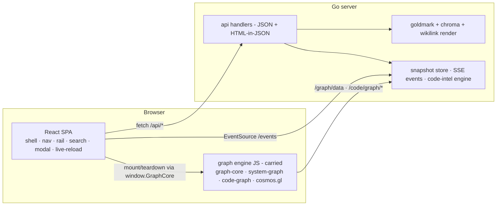

# Serve React frontend

## Problem

The `atomic serve` UI has outgrown its htmx fragment-swap architecture. The interaction layer is a single 1,596-line `templates/layout.html` carrying nine inline `<script>` blocks, wired to htmx lifecycle events (`htmx.onLoad`, `htmx:after:swap`, `htmx:before:request`) with window-global boot guards (`__atomicSearchBooted`, `__atomicEventsBooted`) so listeners survive history-restore body swaps. Symptoms:

- Client state lives in DOM attributes, window globals, and custom htmx headers (`HX-Live-Swap`); every new feature adds another delegated listener plus a guard against double-binding.
- Server handlers emit OOB fragments targeting DOM ids (`#rail-props-content` and three siblings, `rail_handler.go`) — the Go layer hard-codes page layout.
- Rendered markdown embeds `hx-get` attributes (`wikilink.go`, `resolvePageHref`) — the render pipeline is coupled to the swap mechanism.
- Structural feature loss: live-reload graph-pane reconcile (spec `serve-live-reload.md` CP5) was dropped at the cosmos merge because there is no client component model to reattach it to (follow-up `cosmos-graph-live-reload-reconcile`).
- Dynamic browser-side rendering — re-render on data change without a server round-trip per fragment — requires manual DOM surgery per feature.

Refactor the frontend to a React SPA. The Go server stays the data and markdown-render backend; the cosmos.gl graph engine and the visual design carry over unchanged.

Target architecture — React owns interaction, Go owns data and markdown rendering, the graph engine is untouched behind its existing window contracts:

## Goals / Non-goals

- Goals:
  - React SPA owns all interaction: shell, nav, rail, search, code modal, theme, live-reload reconcile.
  - Feature parity — every row of the blast-radius inventory below survives the cutover.
  - Graph engine carried, not rewritten: `graph-core.js`, `system-graph.js`, `code-graph.js`, vendored `cosmos-graph.js`, rail Cytoscape. Only the mount glue moves into React lifecycle.
  - Visual design carried: `app.css` custom-property theme system, typography, three-pane layout survive with pruning, not redesign.
  - Single-binary property preserved: built frontend embedded via `go:embed`; no Bun/Node, no network fetch at runtime.
  - URL scheme preserved: `/page/<relpath>`, `/graph?view=&member=`, `/search?q=&src=` deep links keep working.
- Non-goals:
  - No visual redesign; same look, same themes.
  - No new features beyond parity. Graph-pane live-reload reconcile becomes *attachable* (React owns the pane lifecycle) but its implementation stays follow-up `cosmos-graph-live-reload-reconcile`.
  - No SSR / Next.js — the server renders markdown, never React.
  - No change to the security contract: read-only, localhost-default, path-traversal guards intact.
  - No rewrite of graph engine internals or vendored libraries.
  - Windows support (repo policy).

## Blast radius

Full inventory of screens, features, HTML/CSS/design elements, and endpoints. Verdicts: **carry** (unchanged or near-unchanged), **rebuild** (reimplemented in React), **reshape** (server response changes shape, logic survives), **delete**.

### Screens and features

| # | Screen / feature | Today | Verdict |
|---|------------------|-------|---------|
| 1 | Persistent three-pane shell (top bar · nav · content · rail) | `layout.html` static skeleton + htmx swaps | rebuild — React app shell |
| 2 | Top bar: brand/logo home link | `<a>` + htmx nav | rebuild |
| 3 | Top bar: breadcrumb (`realm › member › page`) with per-segment nav-folder expansion | server-rendered in page fragment, `data-nav-folder` | rebuild — breadcrumb data in page JSON |
| 4 | Top bar: search trigger, ⌘K / Ctrl-K / `/` shortcuts | inline script | rebuild |
| 5 | Top bar: light/dark theme toggle; before-paint init from localStorage → OS fallback | inline scripts | rebuild — toggle in React; before-paint init stays a tiny inline script in `index.html` |
| 6 | Top bar: live-connection indicator (live / reconnecting / disconnected) | inline script painting `#conn-indicator`, repainted after body swaps | rebuild — React state, repaint hack dies |
| 7 | Left nav: collapsible tree; realm groups (Realm / Repos / Concerns / Knowledge / Buckets / External); repo-scope docs tree | `/nav` HTML fragment, `
` elements | rebuild — `/api/nav` JSON + React tree |
| 8 | Left nav: stale / drift badges | `computeStaleness` inline in nav HTML | rebuild — badge fields in nav JSON |
| 9 | Page view: goldmark GFM + chroma render, frontmatter stripped | server render (`render.go`) | carry — stays in Go; delivered as HTML-in-JSON; React injects |
| 10 | Page view: in-body wikilink resolution (`[[page]]`, `[[page\|alias]]`, broken/ambiguous classes), single-source with rail edges | server render (`wikilink.go`) | carry render; reshape output — plain `href`s instead of `hx-get`; React intercepts clicks |
| 11 | Page view: three link forms (bundle-relative, relative, wikilink) resolved server-side; source links open code modal; external links new-tab; nonexistent page → in-shell 404 | `resolvePageHref` + htmx attrs | carry resolution; reshape attrs; rebuild interception |
| 12 | Page view: mermaid fenced blocks rendered client-side, theme-reactive | vendored `mermaid.min.js` + inline theming script | carry lib; rebuild glue as React effect |
| 13 | Directory URLs: index probe (`README.md`/`readme.md`/`index.md`) or listing | `resolveDirIndex` + `directoryListingHTML` | carry probe; reshape listing to JSON |
| 14 | In-shell 404 fragment | `serve404` | reshape — 404 JSON + React view |
| 15 | Right rail: Properties slot — ordered YAML frontmatter; JSON pretty-print for non-primitives; http(s) values as anchors; type chip; hidden when empty | `/rail/` OOB fragment 1 | reshape — `/api/rail` JSON + React |
| 16 | Right rail: this-page mini-graph (Cytoscape, depth-1, type-colored, hover/click) | OOB fragment 4 + `htmx.onLoad` mount | carry Cytoscape + `/graph/data?node=&depth=1`; rebuild mount as React component |
| 17 | Right rail: OUT links with broken/ambiguous/external/codefile annotations | OOB fragment 2 | reshape — JSON + React |
| 18 | Right rail: IN backlinks + orphan note | OOB fragment 3 | reshape — JSON + React |
| 19 | Graph mode: URL-addressable `/graph` page, `[page\|system]` toggle, rail collapse | htmx nav + `enterGraphMode()` | rebuild — React route; view/member params preserved |
| 20 | Graph mode: docs graph — cosmos.gl GPU sim, settle-then-pause, drag reheat, label overlay zoom fade, type legend/filter, OKF type colors from CSS vars, provenance/drift edges, hover preview card, click → page modal | `graph-core.js` + `system-graph.js` | carry — engine and profile untouched; React provides container + lifecycle |
| 21 | Graph mode: code graph — per-repo symbol graph, kind-group legend, `contains` de-emphasis, size-by-degree, click → code modal | `code-graph.js` | carry |
| 22 | Graph mode: Docs\|Code switcher + realm member picker (hidden single-member) | inline glue in `system-graph.js`/`layout.html` | rebuild — React controls calling carried profiles |
| 23 | Graph mode: fingerprint-keyed IndexedDB layout cache; WebGL2 detect + message | `graph-core.js` | carry |
| 24 | Code modal: chroma source pane with per-line anchors, `file:line` scroll | `/file/` fragment | carry chroma; reshape to HTML-in-JSON; rebuild modal |
| 25 | Code modal: intel pane — file symbols, node detail, callers/callees/impact drill, member-aware | `/code/*` HTML fragments | reshape — JSON + React |
| 26 | Code modal: back-stack; source-pane sync via `data-file`/`data-line`; same-file fetch dedup | `htmx:before:request` + `htmx:after:swap` hacks | rebuild — React state; hacks die |
| 27 | Search dialog: command palette, md\|code toggle, debounced live results | inline script + `/search/md`, `/code/search` fragments | rebuild — React + JSON |
| 28 | Search page `/search?q=&src=`: All\|Markdown\|Code tabs, SSE-streamed results per member, spinner, "not indexed" notes | `search_page.go` + `/search/stream` SSE HTML events | rebuild — React + SSE hook; stream payloads reshape to JSON |
| 29 | Federated code search: member union (federation + self-index), concurrent bounded pool, `only`/`exclude` params | `codesearch.go` | carry server logic; reshape response |
| 30 | Code schema view `/code/schema`: tables/views, FK graph, writers/readers | HTML fragment | reshape — JSON + React |
| 31 | External-link registry `/external`: URL, citing pages, first-seen | HTML page | reshape — JSON + React view |
| 32 | Status dashboard `/status`: wiki staleness + code-index health | HTML page | reshape — JSON + React view |
| 33 | Live-reload: `/events` SSE, quiet-window fingerprint, nav refetch always, page refetch when changed, cap-omitted list = refetch all, scroll preservation | server + inline client script + `HX-Live-Swap` header | carry server; rebuild client as hook — scroll preservation is natural (React re-renders content, not panes) |
| 34 | Theme retheme cascade on toggle: cosmos graphs, rail Cytoscape, mermaid diagrams | `atomicMermaidRetheme`, `window.__railCy`, engine retheme | rebuild glue — React effect calling carried retheme APIs |
| 35 | htmx history handling: full-shell restore on Back/Forward, scroll reset except live swaps | htmx 4 + guards | delete — React Router owns history |
| 36 | `/healthz` liveness probe | plain text | carry verbatim |

### Client assets

| Asset | LOC | Verdict |
|-------|-----|---------|
| `templates/layout.html` | 1,596 | delete — replaced by React app + minimal `index.html` |
| `assets/app.css` | 2,590 | carry — prune htmx-specific selectors; class names preserved so components restyle for free |
| `assets/graph-core.js` | 1,437 | carry verbatim |
| `assets/system-graph.js` | 375 | carry; htmx mount delegation removed (React calls the profile) |
| `assets/code-graph.js` | 304 | carry |
| `assets/vendor/cosmos-graph.js` | 2,678 | carry verbatim |
| `assets/vendor/cytoscape.min.js` | (min) | carry — rail mini-graph |
| `assets/vendor/mermaid.min.js` | 3,405 | carry (or npm dep — open question) |
| `assets/vendor/htmx.min.js` | (min) | delete |
| `assets/logo.png`, fonts | — | carry |

`layout.html` inline-script disposition:

| Block (lines) | Purpose | Destination |
|---------------|---------|-------------|
| 9–16 | before-paint theme init | stays inline in `index.html` |
| 25–92 | mermaid theming | TS module + React effect |
| 138–239 | `TYPE_HUE` / ramp palette / `atomicCyTypeColors` | TS module — single color source consumed by React, rail Cytoscape, and carried profiles |
| 251–363 | `atomicCyStyle` Cytoscape stylesheet factory | TS module (rail mini-graph only) |
| 373–548 | `AtomicGraphUI` (preview card, navigate, modals) | adapter module — window contract preserved so carried profiles keep working; internals delegate to React |
| 550–682 | rail mini-graph mount | React component |
| 693–733 | search-page SSE streaming | React hook |
| 744–750 | system-graph mount delegation | React route effect |

### Endpoints

| Route | Today | Verdict |
|-------|-------|---------|
| `/graph/data` | JSON + fingerprint header | carry verbatim — consumed by carried `system-graph.js` and rail mini-graph |
| `/code/graph/data`, `/code/graph/members` | JSON | carry verbatim — consumed by carried `code-graph.js` |
| `/events` | SSE `{fp, changed}` | carry verbatim |
| `/healthz` | text | carry verbatim |
| `/static/*` | embedded assets | carry — sources from Vite `dist/` |
| `/page/*` | shell or fragment + rail OOB | reshape — `/api/page/<relpath>` JSON `{html, relpath, breadcrumb, hasMermaid, …}` |
| `/rail/*` | 4 OOB fragments | reshape — `/api/rail/<relpath>` JSON `{props, out, in, graphURL}` |
| `/file/*` | shell or chroma fragment | reshape — `/api/file/<relpath>` JSON `{html, path, …}` |
| `/nav` | HTML tree | reshape — `/api/nav` JSON tree + badges |
| `/search/md` | HTML results | reshape — `/api/search/md` JSON |
| `/code/search` | HTML results | reshape — `/api/code/search` JSON |
| `/search/stream` | SSE with HTML payloads | reshape — SSE payloads become JSON |
| `/code/node`, `/code/callers`, `/code/callees`, `/code/impact`, `/code/files`, `/code/schema`, `/code/file` | HTML fragments | reshape — `/api/code/*` JSON |
| `/status` | HTML dashboard | reshape — `/api/status` JSON + React view |
| `/external` | HTML page | reshape — `/api/external` JSON + React view |
| `/`, `/page/*`, `/graph`, `/search`, `/status`, `/external` (document loads) | full shell render | rebuild — all non-API, non-static GETs serve the SPA shell; React Router resolves |

### Server code

- Untouched: `snapshot.go`, `events.go` (server side), `graph.go`, `graphoverlay.go`, `codegraph.go`, `code_graph_members.go`, `code_members.go`, `walk.go`, `stale.go`, code-intel engine, `frontmatter` package, `mdlink` package.
- Reshaped (HTML templates → JSON marshalling; logic survives): `context_handler.go`, `rail_handler.go`, `nav.go`, `search_md.go`, `search_page.go`, `search_stream.go`, `codesearch.go`, `codeexplorer.go`, `health.go`, `external.go`, `render.go` (template split; markdown pipeline itself untouched except emitting plain `href`s), `wikilink.go` (renderer emits plain `href`s), `serve.go` (mux + SPA fallback + embed source).
- Test surface: the serve package is ~18.2k LOC including tests; every reshaped handler's tests move from HTML assertions to JSON assertions.

### Tooling and docs

| Surface | Impact |
|---------|--------|
| `scripts/graph-gates.mjs` | update — drives UI selectors (`#btn-graph`, switcher buttons); must target the React shell; re-run all 5 gates per view |
| `scripts/test-system-graph-culling.cjs` | unaffected (`graph-core.js` untouched) |
| Build pipeline (`atomic/Makefile`, `.githooks/pre-commit`, CI) | new `frontend` stage: Bun build + committed-dist drift gate, mirroring render/bundle |
| Root `package.json` | untouched — VitePress docs site + playwright stay; the frontend gets its own workspace `package.json` |
| `docs/reference/serve.md`, `docs/spec/atomic-serve.md`, `docs/wiki/serve.md` | amend after implementation (note: reference currently overstates graph live-reload — CP5 was dropped; correct while amending) |
| Follow-up `cosmos-graph-live-reload-reconcile` | unblocked structurally; implementation stays a follow-up |
| Follow-up `code-graph-hub-drag-unverified` | unchanged — engine untouched |

## Approaches

Four decision dimensions.

### D1 — Build tooling

| # | Approach | Pros | Cons |
|---|----------|------|------|
| A | Bun + React + TypeScript, dedicated workspace under `atomic/internal/serve/frontend/` — Bun is package manager, bundler, and test runner | one tool covers install/bundle/test; native TS/JSX transpile; fewest dev dependencies; fast installs and test runs | younger ecosystem than Vite/npm; dev-server/HMR less turnkey |
| B | Vite + React + TypeScript on npm | most-traveled toolchain; turnkey dev server + HMR | three tools where Bun ships one (npm + Vite + Vitest); larger transitive dependency tree |
| C | No-build React alternative (Preact + htm as vendored ES modules) | preserves zero-build property | no TS, no JSX, no ecosystem; at ~4k FE LOC this recreates the maintainability problem being solved |
| D | Hand-rolled esbuild | fewer dev deps than Vite | reimplements dev-server/HMR/asset hashing that Bun and Vite each ship for free |

### D2 — Embedding the built bundle

| # | Approach | Pros | Cons |
|---|----------|------|------|
| A | Commit built `dist/` + `go:embed` + CI drift gate (`make frontend && git diff --exit-code`) | mirrors the repo's render/bundle precedent (`commands/`, `agents/`, `atomic/internal/embedded/bundle/` are all tracked generated outputs with drift gates); `go build` works with no Bun installed; goreleaser untouched | committed generated code; noisy diffs on FE changes (hashed filenames) |
| B | Build in CI only, `dist/` gitignored | clean history | `make -C atomic build` breaks for contributors without Bun; goreleaser and every CI job need a Bun setup step; violates "clone → go build" |
| C | Runtime CDN fetch | trivial pipeline | violates single-binary / offline contract outright |

### D3 — API shape

| # | Approach | Pros | Cons |
|---|----------|------|------|
| A | Hybrid: goldmark/chroma/wikilink rendering stays in Go, page and file content delivered as HTML strings inside JSON; all structural data (nav, rail, search, code intel, status, external) pure JSON | render pipeline single-sourced (wikilink resolution stays identical between body and rail by construction); no JS markdown/highlighter deps; server tests keep covering rendering | React injects server HTML (`dangerouslySetInnerHTML`) — acceptable: content is local-filesystem, read-only, same trust domain as today |
| B | Pure JSON + client-side markdown (remark/rehype + shiki) | full client control | duplicates goldmark+chroma+wikilink in JS; two render pipelines drift; breaks the single-source wikilink invariant; large JS deps |
| C | Keep HTML-fragment endpoints; React fetches and injects fragments | least server change | React reduced to an htmx re-implementation; no component/data model win — fails the goal |

### D4 — Routing and delivery

| # | Approach | Pros | Cons |
|---|----------|------|------|
| A | SPA with React Router; URL scheme preserved; all non-`/api`, non-static, non-carried GETs serve the shell; reshaped endpoints move under `/api/*`; carried-JS endpoints (`/graph/data`, `/code/graph/*`, `/events`) keep their paths | deep links stable; carried graph profiles need zero fetch-path edits; clean API/document split | mixed prefix story (`/api/*` plus three legacy paths) — documented, deliberate |
| B | Move *everything* under `/api/*` including graph data | uniform prefix | forces edits inside carried `system-graph.js` / `code-graph.js` — touches what the user said not to touch, for cosmetics |
| C | MPA (full reload per screen) | simpler | loses persistent shell, graph state, scroll position — regression |

## Recommendation

**A across all four dimensions**: Bun-toolchained React + TS workspace at `atomic/internal/serve/frontend/` (workspace conventions — domain-scoped `layouts/pages/components/hooks/utils` layout, per-component folders, `ui/` barrel — codified in `frontend/CLAUDE.md`), committed `dist/` embedded via `go:embed` with a render/bundle-style drift gate, hybrid API (HTML-in-JSON for rendered content, JSON for structure) under `/api/*`, React Router SPA preserving today's URL scheme with carried-JS endpoints left at their current paths.

Migration strategy: **additive, then cutover**. `/api/*` endpoints land alongside the existing htmx routes (both read the same snapshot store and render pipeline), the React app is built screen-by-screen against them, and a final checkpoint flips `/` to the SPA shell and deletes `layout.html`, the htmx vendor, the fragment templates, and the OOB handlers. Every intermediate checkpoint keeps the existing UI working and tests green.

Evidence:

- `layout.html:1596` / nine inline script blocks / window-global boot guards — the interaction layer already exceeds what fragment-swap plus vanilla JS can carry (investigator table, this branch).
- CP5 drop at the cosmos merge (`docs/spec/serve-live-reload.md`, 2026-07-08 change log) — a feature died specifically for lack of a client component model to attach to.
- Repo precedent for committed generated outputs with drift gates: `commands/`, `agents/` (`make render`), `atomic/internal/embedded/bundle/` (`make bundle`) — D2-A is the same pattern, third instance.
- Graph engine contracts already isolate the engine from the shell: profiles talk to the DOM through `window.GraphCore.mount(container, profile)`, `window.AtomicGraphUI`, `window.AtomicCodeExplorer` (`docs/wiki/serve.md`, layout.html blocks 373–548) — React can honor these contracts without touching engine code.

## Open questions

- Mermaid: keep the vendored `mermaid.min.js` (3,405 LOC min) or take it as a dependency bundled by Bun? Affects only the retheme glue; vendored is the conservative default.
- Dev-mode iteration: ship a Bun dev-server proxy config (`/api` → running `atomic serve`) for contributors, or accept build-then-embed as the only loop? Proxy config is cheap and non-load-bearing; lean yes.
- `scripts/graph-gates.mjs` selector updates: same PR as the cutover checkpoint, or immediate follow-up? Lean same PR — the gates are the only browser-level verification this repo has.
- React version pinning and Bun config specifics: settle at implementation time (context7 verify then); the design intentionally does not pin.
