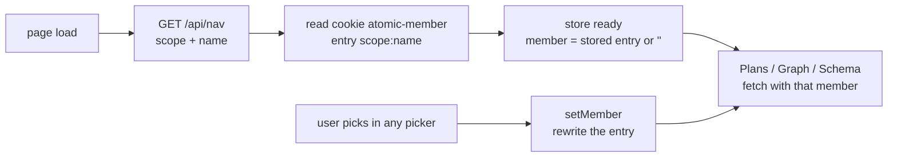

# Serve realm UX: which repo, which checkout, which version


## Problem


Five things went wrong in one session on a realm with several member repos.

| Seen | Cause |
|------|-------|
| Plans opens on `(local)` and says "No plans found" | The realm root is a plain directory, not a git repository. The aggregator asks `git worktree list`, gets an error, and treats the root as having zero checkouts. Its ten design and spec docs never reach a row. |
| The realm's own design and spec docs are unreachable except by a typed URL | Same cause. The page route serves them, but no nav group and no Plans row points at them. |
| Switching to `server` does not stick | The pick lives only in `?member=`. The rail's Plans link is bare `/plans`, and Graph and Schema each carry their own copy of the param. |
| A spec opens on `main` when a newer version exists in a worktree | The default version is the merged one. A reader mid-work wants the version being worked on. |
| Nothing on screen says where an open plan file lives | The breadcrumb reads `plans › checkout-flow › findings/api-surface.md`. Only the URL carries `member=server&at=main`, and the version picker sits in the rail. |

Each is small. Together they make the Plans surface untrustworthy in exactly the setting it exists for: a realm with several repos and many worktrees.


## Decisions


### The current repo is a browser-held pick, keyed by what is being served

The pick is one value, `currentMember`, held in a module-level store, read and written by every picker (Plans, Graph, Schema) and every fetcher that sends `member`. It never appears in the URL.

Four places could hold it. Three fail on a requirement that is real on a developer's machine:

| Where | Fails because |
|-------|---------------|
| `?member=` in the URL | Every link must carry it or the pick resets. Five call sites already drifted once; `usePlansScope` exists to corral them. |
| Server-side session plus cookie | Adds the only per-client state to a read-only server. Dies with the process. One pick shared by every tab. |
| `localStorage` | Scoped to origin, and origin includes the port. A serve on 4500 and one on 4501 cannot share a pick. |
| `document.cookie`, keyed by scope and name | Cookies ignore the port. Keying by `realm:acme` or `repo:damusix/atomic-claude` means a different realm served later on the same port reads its own entry, never a neighbour's. |

The fourth is the choice. One cookie, `atomic-member`, holds a URL-encoded JSON map:

```
{ "realm:acme": "api", "repo:damusix/atomic-claude": "" }
```

The identity comes from `/api/nav`, which already returns `scope` and `name`. Cookie names cannot carry `:` or `/`, so the identity is the map key rather than the cookie name.



Two rules keep the store honest:

- **Only a pick writes.** A page that cannot honour the stored member, such as Graph when the member has no code index, renders its own fallback and leaves the store alone. Switching to Plans afterwards still finds the pick.
- **Fetchers wait for ready.** Until the identity is known no page fetches with an empty member, so the first render is the remembered repo rather than the root followed by a flash.

Reload keeps the pick. A new realm on the same port gets its own entry. Two tabs on the same host share one pick, which is the cost of crossing ports. Accepted.

### A root that is not a git repository is one checkout

When `git worktree list` fails at a root, the root is its own single checkout: id from its resolved path, empty branch, never merged, no creation time. Its `docs/design`, `docs/spec`, and scratchpad aggregate as one version each. The realm-root entry in Plans stops depending on the root being a repository.

### A file opens at its newest version

The default version for a file with no held selection is the newest by mtime. The merged version keeps its label and its filled dot, and stays one keystroke away in the picker. The held-selection rule is unchanged: a checkout name picked once follows the reader between files and yields only when a file does not exist in that checkout.

This replaces "merged if it exists, else newest" in the Plans design. Merged-first bought a stable picker. Stability is still there, since the picker names whatever is on screen. What changes is that the thing on screen is the work in progress, which is what a reader of a realm mid-flight is looking for.

### The realm root wears the realm's name

The empty-prefix member renders as the realm's `name` from `/api/nav`, `acme`, in every picker. `(local)` said nothing about where you were.

### The top bar says where the file lives

For `/plans/:slug/*` in realm scope the breadcrumb gains the member after `plans`, and the open file carries its checkout: branch and path relative to the served root, absolute when outside it.

```
ACME REALM › plans › api › checkout-flow › findings/api-surface.md
                                                  worktree-billing · api/.claude/worktrees/billing
```

The checkout comes from the resolution the slug view already computes to render the file and to position the version picker. The slug view publishes it to a small store; the top bar reads it. One source, so the crumb and the picker can never disagree. Bundles gain `path` and `outsideRoot` in the Plans payload so a bundle file can be placed the same way a committed doc is.


### A bundle mock runs its own scripts, and the write routes stop trusting the sandbox

Issue #234: a bundle's `.html` file, the mock `atomic-visual-options` writes into a scratchpad, renders inside an iframe whose `sandbox` attribute is empty, and the raw response carries `Content-Security-Policy: sandbox`. Scripts are blocked on both sides, so an interactive mock shows its first frame and nothing works, with the only error in the console.

Both sides grant `allow-scripts` and nothing else. The frame keeps an opaque origin, so its scripts cannot read the app's cookies or storage, and `allow-same-origin`, `allow-forms`, and `allow-popups` are never added.

What the sandbox alone no longer prevents is a POST from inside the frame to `/api/bus/*` or `/api/code/index`. Those routes are unauthenticated and gated only on the TCP peer being loopback, and a frame running on the same machine passes that gate. So the write routes gain the check the sandbox was standing in for: a browser request whose `Origin` header names anything but the server's own origin, or whose `Sec-Fetch-Site` header is anything but `same-origin`, is refused. An opaque-origin document sends `Origin: null`, which fails that check. The bus page's own requests carry the server's origin and pass. CLI callers send neither header and are untouched.

| Considered | Why not |
|-----------|---------|
| Raw `text/html` route opened in a new tab | The same CSP applies to a top-level document, and the mock leaves the plan it belongs to |
| Keep scripts blocked, show a notice in the frame | Explains the failure without fixing the case the plans view exists for |


## Non-goals


- Running scripts for HTML outside a scratchpad bundle. The raw route serves only bundle files.
- Granting a bundle frame `allow-same-origin`, `allow-forms`, or `allow-popups`.
- `?at=` stays in the URL. Version selection is per file and already follows the reader; moving it is a separate decision.
- No nav group for the realm root's own `docs/` tree. Plans is the surface for design and spec docs; the page route already serves the rest by path.
- The server never reads the cookie.
- The three components that each fetch `/api/nav` today keep doing so. The store adds one more, once per page load.
- A row's title and description still come from the merged version of its spec when one exists.


## Where this lands


Contract: `docs/spec/serve-realm-ux.md`. The Plans design, `docs/design/serve-plans-page.md`, is amended where it stated the merged-first default and in its picker paragraph. Its spec, `docs/spec/serve-plans-page.md`, is amended where it assumed the realm root is a git repository and where it stated the default version.
