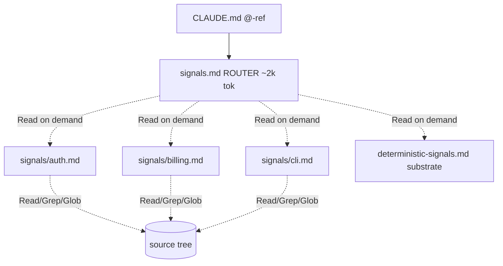

# Signals as router, not dump

## Problem

Current signals workflow (`docs/spec/signals-workflow.md`) produces two flat files: `deterministic-signals.md` (tree + manifests + languages) and `inferred-signals.md` (framework, domains, conventions). Both are `@`-ref'd from `CLAUDE.md` and loaded into **every** session.

Today on this repo: ~31KB combined (~7-8k tokens). Tolerable. On a large monorepo (50k+ files, multiple services, vendor trees) the deterministic tree alone could blow past 50k tokens. Two failure modes:

1. **Tree dump unbounded.** Full `tree -L ∞` enumeration scales linearly with file count. A monorepo with 200k files makes signals unusable.
2. **Inferrer reads everything.** Even when the tree fits, the inferrer reads the entire deterministic file each run to refresh a section that may only depend on `package.json`.

Eager loading also wastes context on irrelevant domains. If the user asks about auth, the LLM does not need the full enumeration of `marketing/landing-pages/` loaded into context to answer.

## Three surfaces, three jobs

Claude Code already provides two persistent-context surfaces. Signals is the third. Mixing their jobs is what gets us in trouble.

| Surface | Job | Voice | Loading |
|---------|-----|-------|---------|
| `CLAUDE.md` (project + nested) | **Intent.** "How we work here." Conventions, axioms, workflow rules. | Imperative steering | Eager for root + ancestors; lazy when Claude reads files in subdirs (nested only) |
| `.claude/rules/*.md` with `paths:` frontmatter | **Scoped intent.** "When editing TS, do X." | Imperative steering | Lazy — triggers when Claude `Read`s a file matching the glob |
| `.claude/project/signals/...` (this design) | **Facts.** "Billing domain exists at `src/billing/`, talks to Stripe via webhooks." | Declarative, neutral | TBD — see below |

Signals are not rules. They do not tell Claude what to do. They tell Claude what is *true* about the repo right now, derived by inference from the deterministic substrate. Putting facts into `CLAUDE.md` or `rules/` would (a) bloat steering surfaces with non-steering content, (b) abuse `paths:` triggers — facts about billing should be available when the user *asks* about billing, not only when Claude happens to `Read` a billing file.

## Goals / Non-goals

**Goals**

- Bound auto-loaded signals to a small, predictable size (target: ≤2k tokens for the router file, regardless of repo size).
- Make deterministic-signals a *substrate* the LLM consults on demand, not a file it eagerly reads.
- Use git's existing change tracking (last-touch SHA per path, `git diff --name-only` since last scan) to identify which domain files need refresh. No custom hash engine.
- Preserve the "Claude already knows where things live" property — a session should still be able to answer "where is auth?" without grepping cold.

**Non-goals**

- Eliminating the deterministic scan. The scan still runs; only its consumption model changes.
- Re-implementing what `Grep`/`Glob`/`Read` already do. The router points; the standard tools fetch.
- Solving git-LFS, vendored binaries, or generated-code trees beyond standard ignore rules.
- Backward compatibility with the current flat-file consumers. This is a breaking change to the signals contract.

## Proposal in one diagram

Eager-loaded router points at on-demand domain files; deterministic substrate stays on disk, consulted by tools.



## File layout

```
.claude/project/
├── signals.md                 # router, ~2k tokens, auto-loaded via @-ref in CLAUDE.md
├── signals/                   # domain files, NOT auto-loaded
│   ├── auth.md
│   ├── billing.md
│   └── cli.md
└── deterministic-signals.md   # tree + last-touch SHAs + manifests, on-disk substrate, NOT auto-loaded
```

Only `signals.md` is auto-loaded. Domain files and the deterministic substrate live on disk for the LLM to `Read` on demand.

**Activation rule.** If the entire repo's facts fit in ~500 lines, the inferrer produces a flat `signals.md` with no `signals/` directory — single file, no router table. Above that threshold, the router + per-domain-files shape kicks in. LLM judges at inferrer-run time; no config threshold.

## Router shape (`signals.md`)

Plain markdown paths, NOT `@`-refs — `@`-refs are eager + transitive (verified against [Claude Code memory docs](https://code.claude.com/docs/en/memory)) and would defeat the lazy-load design.

```markdown
# Project facts (router)

## Repo at a glance
<5-10 lines: stack, build cmd, test cmd, entry point>

## Domains
| Domain  | Repo paths                            | One-liner                      | Detail            |
|---------|---------------------------------------|--------------------------------|-------------------|
| auth    | src/auth/, src/middleware/auth.ts     | JWT + session, 2FA optional    | signals/auth.md    |
| billing | src/billing/, prisma/schema.prisma    | Stripe-backed, webhook-driven  | signals/billing.md |
| cli     | atomic/cmd/atomic/, atomic/internal/  | Go CLI, embedded bundle        | signals/cli.md     |

## Cross-cutting
- Tests: co-located *_test.go / *.test.ts
- Conventions: see CLAUDE.md
- Deterministic tree + hashes: .claude/project/deterministic-signals.md
```

LLM enters a domain conversation → `Read`s the router → either `Read`s `signals/<domain>.md` for the inferred narrative OR jumps straight to repo paths via `Read`/`Grep`/`Glob`. No new tool surface, no `@`-ref chain, progressive discovery via primitives that already exist.

## Domain file shape (`signals/<domain>.md`)

Each domain file explains the domain *as fact* — what exists, what it does, who it talks to — and routes the LLM to the actual repo files. Plain markdown paths, no `@`-refs.

```markdown
# auth

## What it does
JWT-backed session auth with optional 2FA via TOTP.

## Where it lives
- src/auth/token.ts — JWT generation + validation
- src/auth/two-factor.ts — TOTP setup, code verification
- src/middleware/auth.ts — request guard, role check
- prisma/schema.prisma — User, Session, TwoFactor models

## What it talks to
- Redis (session cache)
- Postgres via Prisma (user store)
- Email provider (2FA backup codes)

## Conventions worth knowing
- Tokens expire 24h; refresh path: POST /auth/refresh
- 2FA codes: 6-digit TOTP, 5-min window
```

Fact-shaped, not steering-shaped. Tells the LLM what *is*; lets the LLM decide whether to `Read` the actual files.

**Naming continuity.** On rescan, the inferrer reads any existing `signals/*.md` as the prior-run anchor. If a domain's underlying paths still match, the inferrer keeps the existing filename rather than renaming. Prevents `signals/auth.md` → `signals/identity.md` churn on identical-code reruns.

**Splitting huge domains.** If a domain is large enough that one file gets unwieldy, the LLM (or inferrer) MAY split it into a subfolder:

```
.claude/project/signals/
├── auth.md
└── cli/
    ├── cli.md           # entry-point; router still points here
    ├── commands.md
    ├── doctor.md
    └── bundle.md
```

Convention: the entry-point file at `signals/<domain>/<domain>.md` keeps the same role as `signals/<domain>.md`. It carries the overview and routes to the sub-files via plain markdown links. The router (`signals.md`) does not change — it still points at the entry-point. Splitting is an inferrer/LLM judgment call based on domain size, not a structural requirement.

## Bounded tree

Replace unbounded `tree` with:

| Level | Output |
|-------|--------|
| ≤ `max_depth` (default: 3) | Full file enumeration |
| `max_depth + 1` | Folder names with `(N files, M dirs)` summary, no contents |
| `> max_depth + 1` | Elided; appears only as a count on the parent |

`max_depth` default in config (`output.signals.max_depth = 3`, per axiom 2 carve-out for shell-settable). Per-folder override is an open question — see Q2.

## Change detection via git

Use git's existing per-path commit tracking. No custom hash engine.

**Per-file last-touch SHA.** Inline in the tree, shown git-style:

```
├── atomic/ (7 subitems, a3f2bb1)
│   ├── cmd/ (2 subitems, b1c4ee5)
│   │   └── atomic/ (2 subitems, f8e2aa9)
│   │       ├── main.go (2c4abc3)
│   │       └── main_test.go (9b1f7d2)
```

Each SHA is `git log -1 --format=%H -- <path>` (truncated to 7 chars). For folders, the SHA is the most recent commit that touched any descendant — gives the same "did anything change under here?" signal as a folder hash, without the engine.

**Detecting what changed since last scan.** The binary records the scan-time HEAD SHA. On rescan: `git diff --name-only <prev-head>..HEAD` lists every path touched. Map each path to its owning domain (by entry-point prefix match) → the set of domain files to refresh. Outside a git repo, fall back to file mtime comparison against `.deterministic-signals.prev.md`.

**Generated-file exclusion.** Bundle outputs (e.g. `atomic/internal/embedded/bundle/`) churn on every commit. Inferrer reads a `.signalsignore`-style file (or reuses `.gitignore` for tree elision, plus an explicit exclusion list for change detection) so domain files don't thrash from regenerated-output noise.

## Alternatives considered

| Option | Pros | Cons |
|--------|------|------|
| **A. Status quo** | Zero work | Breaks on large repos; eager-load waste |
| **B. Just bound tree depth, keep eager load** | Small change | Doesn't solve eager-load of irrelevant domains; loses fine-grained change detection |
| **C. Router + per-domain files + git change tracking** (proposed) | Scales to monorepos; aligned with progressive disclosure; reuses git instead of inventing a hash engine | More moving parts; breaking change; domain partitioning is heuristic |

## Recommendation

Option C. Concretely:

1. **Git-tracked change detection.** Per-path last-touch SHA inline in the deterministic tree. `git diff --name-only <prev-head>..HEAD` between scans gives the changed-path list; map paths to owning domains by entry-point prefix; refresh only affected domain files. No hashing engine.
2. **`signals.md` as router** — ~2k tokens, auto-loaded via `@-ref` from `CLAUDE.md`. Lists domains with repo paths + one-liner + plain markdown link to `signals/<domain>.md`.
3. **`signals/<domain>.md` per-domain files** — on disk, NOT `@`-ref'd. LLM `Read`s them when entering that domain's conversation. Fact-shaped: what exists, where it lives, what it talks to.
4. **Deterministic substrate stays on disk**, not auto-loaded. Holds the tree + last-touch SHAs + manifests + language counts. Inferrer reads it; user-facing sessions don't (unless the LLM deliberately `Read`s it for ground truth).
5. **Bounded tree depth.** `max_depth` (config-default 3): below cutoff, full enumeration; beyond cutoff, folder name + child count + folder SHA, no contents. Prevents monorepo-scale overflow in the deterministic file itself.
6. **Activation by judgment.** Inferrer produces flat `signals.md` (no `signals/` dir) when the whole repo fits in ~500 lines; router shape only when content exceeds that. No config threshold.
7. **Naming continuity.** Inferrer reads existing `signals/*.md` as anchor; keeps prior filenames when underlying paths still match. Prevents identical-code-rerun churn.
8. **Per-domain migration confirms** (axiom 3): first flip from flat to router presents proposed domain partition as a numbered list, accepts `1 3 5`/`all`/`none` (axiom 4), generates only confirmed `signals/*.md` files.

LLM progressively discovers via primitives that already exist: `Read` `signals.md` → identify relevant domain → `Read` `signals/<domain>.md` → `Read`/`Grep` actual repo files.

## Open questions

- **Q1. Domain partitioning heuristic.** How does the inferrer decide what counts as a "domain"? Top-level dirs under `src/`? Manifest-declared workspaces (pnpm, cargo, go modules)? LLM-inferred clusters? Probably a hybrid: structural defaults + LLM override.
- **Q2. `max_depth` per-subtree override.** Some folders need deep enumeration (`atomic/internal/`), others should be elided at depth 1 (`node_modules/`, `vendor/`). Standard `.gitignore` semantics for the elision list, plus an explicit deep-list for opt-back-in.
- **Q3. Worktree multiplication.** Each `.worktrees/<branch>/` has its own `.claude/project/`. Domain files multiply per worktree and may drift between branches. Probably fine (each worktree reflects its branch's truth) but the doctor `signals` check must not cross-compare worktrees.
