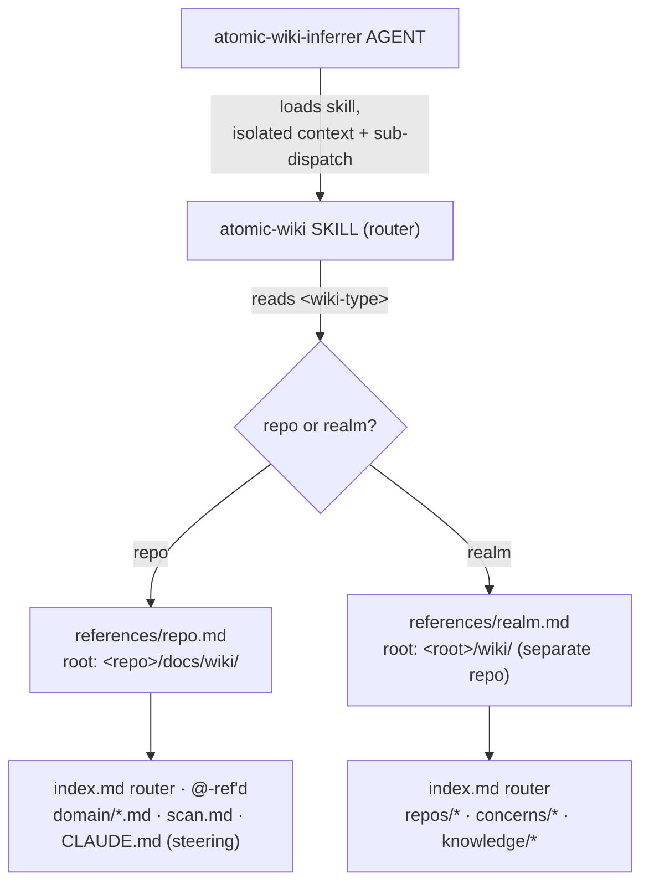
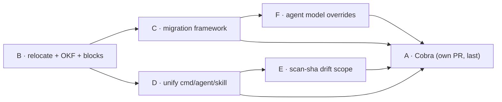

# Signals → Wiki unification


## Problem


Two parallel knowledge subsystems run near-identical pipelines:

- **signals** — per-repo context map at `.claude/project/signals*`. `scan → infer → wire @-ref`. Machine-written, regenerable, disposable cache.
- **wiki** — cross-repo knowledge at `<root>/wiki/` (a separate repo). `scan → classify → synthesize`. Committed audit trail, partly hand-curated (buckets).

Both scan a tree, infer structure, write an indexed router, and track staleness by content hash. The cost of two systems: duplicated agent logic, two refresh commands (`refresh-signals` vs `refresh-wiki`), two storage conventions, two mental models. The OKF-alignment work and `atomic serve` already render both as one navigable graph — storage and tooling have not caught up to that unified view.


## Goals / Non-goals


Goals:

- One storage convention, one router shape, one OKF frontmatter contract across repo-scope and realm-scope knowledge.
- One refresh verb (`refresh-wiki`), one inferrer agent (`atomic-wiki-inferrer`), one skill (`atomic-wiki`, as a skill-router).
- Drift-aware refresh: decide full-vs-incremental re-infer by diffing the committed `scan.md` against a fresh rescan (git is the diff tool).
- A **versioned, replayable** migration framework (`atomic migrate`) backed by install state in `config.toml` — not a one-shot. The signals→`docs/wiki/` relocation is its first registered step; future breaking changes register their own.
- Config-driven, persistent **agent model overrides** (`config.toml [agents]`) — pin implementer / reviewer / strategist / etc. to a tier (`haiku|sonnet|opus|fable`), re-applied on every install so upgrades never clobber the choice.
- The whole `atomic` CLI on Cobra — separate workstream, sequenced last.

Non-goals:

- No change to realm-wiki storage **location**: `<root>/wiki/` stays. Only repo-scope moves (to `docs/wiki/`).
- No new third staleness mechanism — the committed `scan.md` (via git) is the diff baseline; `<scan-sha>` only disambiguates double-scan / stale-scan cases. Reconcile with the existing `atomic signals stale` content hash and the impl-phase SHA-range refresh.
- Not bundling Cobra with the semantic work.
- No behavior change to bucket synthesis beyond adopting the shared frontmatter/router contract.
- `migrate` is not a one-shot script. One-off relocation logic that cannot replay across versions is rejected.


## Unified model


One concept — a generated, OKF-typed knowledge graph for a tree of code — at **two scopes**, disambiguated by a `<wiki-type>` marker and routed by the skill. The two scopes keep different roots (they never collide on disk); "wiki" names the concept, `<wiki-type>` names the scope.

The unified mental model is captured below.





| Scope | `<wiki-type>` | Root | Contents |
|-------|---------------|------|----------|
| repo | `repo` | `<repo>/docs/wiki/` | the repo's own signals-as-wiki (this is the relocation) |
| realm | `realm` | `<root>/wiki/` (separate repo, **unchanged**) | cross-repo summaries + concerns + bucket knowledge |


## `docs/wiki/` layout (repo scope)


| Path | Was | @-ref'd? | Written by | OKF type (proposed) |
|------|-----|----------|-----------|---------------------|
| `docs/wiki/index.md` | `.claude/project/signals.md` | **yes** (from root `CLAUDE.md`/`CLAUDE.local.md`) | inferrer | `Index` |
| `docs/wiki/<domain>.md` | `.claude/project/signals/<domain>.md` | no | inferrer | `Domain` |
| `docs/wiki/scan.md` | `.claude/project/deterministic-signals.md` | **no** (thousands of lines) | `atomic signals scan` | **none** — raw output, never FM, not a graph node |
| `docs/wiki/CLAUDE.md` | `.claude/project/signals-steering.md` | no (lazy nested-memory) | user / setup | OKF FM + citations |

Control blocks inside `index.md` (machine-managed, mirroring the existing `<wiki-scan>` / `<wiki-buckets>` block pattern):

- `<wiki-type>repo</wiki-type>` — scope marker (also written into `claude.local.md`/`CLAUDE.md` by `atomic-setup`; index copy is the canonical machine anchor).
- `<scan-sha>…</scan-sha>` — sha of `scan.md` as of the last successful **infer**. Tiebreaker only: when the committed `scan.md`'s sha ≠ this value, scan.md was committed without re-inferring (double-scan or stale-scan) → fuller re-infer warranted. The routine diff baseline is the committed `scan.md` itself, via git.
- `<wiki-schema>N</wiki-schema>` — the repo's wiki layout/migration version. Repo-scope migrations read it to decide what to apply. Lives here (committed, per-repo) — **not** in the global `config.toml`, which has no business tracking ad-hoc repos.


## OKF frontmatter contract


Every generated doc carries OKF-style frontmatter (`type:` / `description:` / bundle-relative cross-links), reusing the schema and `frontmatterTypeToClass` mapping already established in `docs/spec/okf-alignment.md` and `graph.go:resolveNodeType`. This makes signals docs first-class nodes in the same graph `atomic serve` renders.

Types: `index.md` → `Index`, `<domain>.md` → `Domain` (new `frontmatterTypeToClass` cases alongside the existing `Concern` / `Knowledge` / default `page`). `scan.md` is the exception — raw machine output, **no frontmatter**, never a graph node. The B spec adds the two new type cases.


## Loading mechanism (verified)


Verified against `code.claude.com/docs/en/memory.md` (claude-code-guide agent, this session):

- A subdirectory `CLAUDE.md` (e.g. `docs/wiki/CLAUDE.md`) is **not** auto-loaded at session start. The upward walk loads only cwd + ancestors; subdirectory memory loads lazily, when Claude reads a file under that subdir.
- Lowercase `claude.md` is **not** recognized as a memory file. Must be exactly `CLAUDE.md` / `CLAUDE.local.md`.
- `@`-ref imports recurse to max depth 4, expanded at load time.

Design: `index.md` is `@`-ref'd from the root `CLAUDE.md`/`CLAUDE.local.md` (loads at session start, as today). Steering becomes `docs/wiki/CLAUDE.md` — it does **not** load at session start, but it **does** lazy-load as nested memory whenever Claude reads a file under `docs/wiki/`, which is exactly when the inferrer operates. This leverages Claude Code's own loading instead of telling the agent to read a `steering.md`. Two caveats, both settled by experiment (this session): (1) the file must be uppercase `CLAUDE.md`; (2) a *dispatched subagent* **does** get the nested-memory lazy-load — confirmed: a subagent that read a file under the dir had that dir's `CLAUDE.md` injected into its context as a system reminder, on a single Read with no separate access to the CLAUDE.md. **But** subagents apply injection-skepticism to nested CLAUDE.md surfaced mid-task and declined to follow it in both runs. So nested-memory guarantees *delivery*, not *compliance* — the inferrer's dispatch brief (and the `atomic-wiki-inferrer` system prompt, which we author) must explicitly name `docs/wiki/CLAUDE.md` as authoritative steering to read and follow.


## Skill-router architecture


The scan→infer→synthesize workflow lives in the `atomic-wiki` skill, structured as a **router**:

```
skills/atomic-wiki/
├── SKILL.md ............. thin: conversational ops (bucket add/list, "wiki this") +
│                          router that reads <wiki-type> and loads the right reference
├── references/repo.md ... the repo-scope pipeline (operates on docs/wiki/)
└── references/realm.md .. the realm-scope pipeline (operates on <root>/wiki/)
```

The `atomic-wiki-inferrer` agent (renamed from `atomic-signals-inferrer`) loads the skill; its sole job is to detect scope (read `<wiki-type>` via the atomic CLI) and run the inference, providing the **isolated context + per-domain sub-dispatch** a skill alone cannot.

**Why this reverses the earlier "skill absorbed into agent" decision.** The original absorption removed the `atomic-signals` skill because a skill loaded into the main context bloated it with the full pipeline text. The skill-router pattern avoids that: `SKILL.md` stays thin, and the heavy per-scope workflow loads on demand from `references/` *only when that scope is active*. Progressive disclosure is the mechanism that was missing the first time. The agent still owns execution; the skill is now just the DRY home for the workflow text shared between repo and realm scopes (and between conversational and agent invocation).


## Versioned migration framework (workstream C)


`migrate` is not a one-shot. Breaking changes recur (`5.9.0 → 6.0.0 → 6.12.1 → 7.0.0 …`), so migration is a **replayable chain**: an ordered registry of version-tagged steps that pulls any prior install up to the current version, running every step whose target version is newer than the recorded state.

One registry, two scopes. Each step declares which it operates on:

| Scope | Operates on | Version anchor | Example step |
|-------|-------------|----------------|--------------|
| `install` | `~/.claude/` (global installed artifacts) | `~/.claude/.atomic/config.toml` `[install]` | "v6.0.0: remove skill X, rename agent Y→Z" |
| `repo` | a repo's atomic-managed files | `<wiki-schema>` block in that repo's `docs/wiki/index.md` (committed, travels with the repo); idempotent steps as backstop | "v6.0.0: relocate signals → docs/wiki/" |


### State file — `config.toml`


Global state lives in the existing `~/.claude/.atomic/config.toml` (schema bumps to v2, validated by `checks_config.go`), not a separate JSON. Machine-written install state goes in an `[install]` table:

    [install]
    version = "6.0.0"

    [install.artifacts]                    # what atomic put down — drives prune + uninstall
    agents = ["atomic-implementer", "atomic-wiki-inferrer", "..."]
    commands = ["commit", "autopilot", "..."]
    skills = ["atomic-tdd", "..."]
    output-styles = ["atomic"]
    rules = ["typescript/style", "..."]

Answers the two questions future migrations ask:

- **Migrating from what version?** → `install.version`. Selects which steps run.
- **Should I delete an artifact?** → diff `install.artifacts.<kind>` (what the prior version put down) against what the current bundle ships; installed-then but not-shipped-now → removed → prune it. Closes a real gap (`atomic update` refreshes but never prunes), and `install.artifacts` is exactly what keeps a prune — and `atomic uninstall` — from touching artifacts the *user* hand-added.


### Config-driven agent model overrides (workstream F)


Set via an **interactive CLI** (`atomic config agents`, huh-driven) — config.toml is machine-owned, never hand-edited. Keys are full agent filenames. Re-applied on every install:

    [agents]
    atomic-implementer = "haiku"
    atomic-reviewer    = "haiku"
    atomic-strategist  = "sonnet"
    # atomic-investigator, atomic-wiki-inferrer omitted → bundled default stands

- **Lever:** each atomic agent ships a default `model:` in its frontmatter. On install, `claudeinstall` copies the agent file then patches `model:` to the configured tier (reuse `internal/frontmatter` parse/rewrite). No override → default stands.
- **Survives upgrades by re-derivation, not storage.** The tier is never baked into the installed file as truth — it is re-applied from config on every install, so a freshly bundled agent (with a new default) still gets the user's choice. Manual edits to `~/.claude/agents/*.md` are clobbered on install (managed artifacts); config is the supported lever.
- **Valid tiers:** `haiku | sonnet | opus | fable`, allowlist-validated in `checks_config.go`, mapped to Claude Code's `model:` frontmatter values.


### Registry + runner


- Ordered `[]Migration{ TargetVersion, Scope, Up(ctx) }`, registered in Go (likely a new `internal/migrate/` package).
- **`atomic update` auto-runs** install-scope steps after artifact refresh (the common path). **`atomic migrate` is the explicit/force entry** — needed when there is no upgrade event to hook (uninstall + reinstall, vs CLI upgrade), and for targeting repos:
    - `atomic migrate` — install-scope (global).
    - `atomic migrate --repo [path]` — repo-scope steps on that repo (default cwd).
    - `atomic migrate --realm [path]` — realm-scope steps, then prompt to migrate each atomic'd member repo within it (fan-out).
- Runner: read the recorded version → run every step with `TargetVersion > recorded` in semver order → write the current version. Reuse the version comparison in `internal/selfupdate` / `internal/version` (verify before adding a dep).
- Each `Up` is idempotent — safe to re-run, detects already-applied target state. The signals→`docs/wiki/` step `git mv`s the files + rewrites the `@`-ref, and no-ops if `docs/wiki/index.md` already exists.


### Relationship to existing machinery


- `claudeinstall/snapshot.go` snapshots **pre-install user state** for uninstall/restore; the `config.toml [install]` table records **what atomic installed + its version** for migration/prune. Different concerns — reuse the file-walk helpers, keep them distinct.
- `atomic update` already re-execs artifact refresh after the binary swap (`main.go:runUpdate`); the runner hooks in *after* that refresh so migrations see the new bundle.


## Approaches — open sub-decisions


Program-level decisions are locked (see Recommendation). Rows below were resolved this session except 4–5 (Cobra, prune), which finalize in their workstream specs.


| # | Decision | Options | Resolution |
|---|----------|---------|------------|
| 1 | Steering file name | `steering.md` (agent-read) vs `CLAUDE.md` (nested-memory) | **`docs/wiki/CLAUDE.md`** — leverage Claude Code's own lazy nested-memory load instead of telling the agent to read a file; OKF FM + citations. Loads when working in `docs/wiki/` (when the inferrer operates), not at session start |
| 2 | Repo-migration version anchor | `<wiki-schema>` in index.md vs global config.toml | **`<wiki-schema>` in `docs/wiki/index.md`** — per-repo state travels with the repo (committed, survives clones); the global config.toml has no business tracking ad-hoc repos. Idempotent steps as the backstop |
| 3 | Drift baseline | separate prev file vs git-committed scan.md | **git-as-prev-store** — the committed `scan.md` is the diff baseline; `git diff` (committed vs rescan) is the change set; `<scan-sha>` is only a tiebreaker for scan-committed-without-infer. Repo-scope only |
| 4 | Cobra ↔ cliusage source of truth | duplicate command list vs derive cliusage from Cobra tree | **derive** — walk the Cobra root command tree to produce `[]cliusage.Command`; A1 linter (`TopLevelVerbs`/`LookupByPath`/`cmd.Flags`) keeps working with its data source repointed, logic untouched |
| 5 | Artifact-prune UX | per-artifact prompt vs batched vs auto | **batched confirm** — one prompt listing all removed artifacts (axiom 3); only ever touches `install.artifacts`, never user-added. `atomic uninstall` also reads `[install]` to remove the agents/commands/etc atomic installed |
| 6 | config.toml hygiene | hand-edit vs machine-owned | **machine-owned** — no hand-editing; `[agents]` set via interactive `atomic config agents` (huh), `[install]`/`[repos]` written by install/migrate. Comment-preservation hazard moot |


## Recommendation


Locked program decisions:

- Storage at `docs/wiki/` with OKF frontmatter on every doc except raw `scan.md`; `index.md` `@`-ref'd, steering is `docs/wiki/CLAUDE.md` (nested-memory), `scan.md` neither.
- `<wiki-type>` + `<scan-sha>` + `<wiki-schema>` blocks in `index.md` (per-repo state); `config.toml` holds global install + agent state.
- `atomic-wiki` skill-router + `references/repo.md|realm.md`; agent renamed `atomic-wiki-inferrer`.
- `refresh-signals` folds into `refresh-wiki`; new `migrate` verb (`--repo`/`--realm`); `update` auto-runs migrations.
- Cobra migration as its own last workstream, deriving cliusage from the command tree.

Sub-decisions: per the leans in the table above, finalized in each workstream spec.


## Decomposition & sequencing





| Order | Workstream | Spec file | Cohesion |
|-------|-----------|-----------|----------|
| B | Relocate signals → `docs/wiki/`; OKF frontmatter; `<wiki-type>` + `<scan-sha>` blocks | `docs/spec/wiki-storage-relocation.md` | foundation; all others depend |
| C | Versioned migration framework: config.toml `[install]` state + `<wiki-schema>` per-repo block + registry/runner + artifact prune; `migrate --repo`/`--realm`; `update` auto-runs; signals→`docs/wiki/` as the first step | `docs/spec/atomic-migrate-framework.md` | depends B (first step's target layout) |
| D | `refresh-signals`→`refresh-wiki`; `atomic-signals-inferrer`→`atomic-wiki-inferrer`; skill-router | `docs/spec/wiki-unify-commands.md` | depends B |
| E | `<scan-sha>` drift → full-vs-incremental scope, reconciled with `signals stale` | `docs/spec/wiki-drift-scope.md` | depends D (edits the skill-router + renamed agent) |
| F | Agent model overrides: `config.toml [agents]` (full agent-name keys) set via interactive `atomic config agents` + install-time `model:` frontmatter patch | `docs/spec/agent-model-overrides.md` | depends C (config schema v2) |
| A | Cobra migration; derive cliusage from command tree; preserve A1 linter | `docs/spec/cli-cobra.md` | independent; last |


## Cross-artifact ripple checklist (grounded)


Every path/name change must ripple through the surfaces below or it ships an invisible feature. `file:line` from the grounding investigators.


### Workstream B (relocation)


- [ ] `atomic/internal/signals/signals.go:20-21` — `signalsFile` / `prevFile` constants → `docs/wiki/scan.md` / `tmp/.scan.prev.md`
- [ ] `atomic/internal/signals/signals.go:25-31` — `SignalsPath` / `PrevSignalsPath` helpers
- [ ] `atomic/internal/signals/signals.go:177-178` — `ScanWithOptions` write targets; `diff.go:167-173` — `DiffPaths` read targets
- [ ] `atomic/internal/doctor/checks_signals.go:15-17` — `routerFile` / `routerRef` / `domainSubdir` constants; `:43` `SignalsPath` call
- [ ] `atomic/internal/doctor/checks_refs.go:19` — `signalsRef`; `:12-17,42-49` candidate-file search order
- [ ] `atomic/internal/doctor/checks_signals_test.go:34`, `checks_refs_test.go:57` — fixtures
- [ ] `templates/agents/atomic-signals-inferrer.md` Step 8 — `@`-ref write target + search order (rendered `agents/atomic-signals-inferrer.md:36,188,190-194`)
- [ ] `templates/shared/signals-gate.md` — staged-file paths post-infer
- [ ] `commands/refresh-signals.md:34-157`, `commands/refresh-wiki.md:39-40` (+ templates) — path references
- [ ] `atomic/internal/cliusage/cliusage.go:155,161` — `signals scan`/`show` descriptions mention `deterministic-signals.md`
- [ ] `.gitignore:35` — prev-file path; add `docs/wiki/` negation if committed
- [ ] `README.md:102` — `.claude/project/deterministic-signals.md` reference
- [ ] `claude.local.md` (this repo) — the `@.claude/project/signals.md` ref → `@docs/wiki/index.md`
- [ ] `/atomic-help` router + `docs/reference/signals-workflow.md` + `docs/reference/` tables
- [ ] `make render` + `make bundle` for any touched artifact under `agents/ commands/ skills/ rules/ output-styles/` or `CLAUDE.md`


### Workstream C (migration framework)


- [ ] new `atomic/internal/migrate/` — `Migration{TargetVersion,Scope,Up}` registry + runner; `[install]` config type + `<wiki-schema>` index-block read/write
- [ ] `~/.claude/.atomic/config.toml` `[install]` table (config schema v2) — machine-written `version` + per-kind `installed[]`; `internal/config` parse/write + `checks_config.go`
- [ ] `atomic/internal/claudeinstall/` — write the manifest on install; reuse `snapshot.go` file-walk; keep distinct from the uninstall snapshot
- [ ] `atomic/internal/claudeinstall/uninstall.go` — consult `[install]` to remove atomic-installed agents/commands/skills/etc (batched confirm)
- [ ] `atomic/cmd/atomic/main.go` — new `migrate` verb (`--repo`/`--realm` flags); `runUpdate` auto-runs the runner after artifact refresh
- [ ] `atomic/internal/selfupdate` / `internal/version` — reuse semver compare (verify it exists)
- [ ] `atomic/internal/cliusage/cliusage.go:36` — register `migrate` verb + flags + A1 description
- [ ] doctor — optional check: install-state version vs binary version (drift → "run `atomic migrate`")
- [ ] `/atomic-help` router (maintenance/binary topic) + `docs/guides/install.md` (migration on update)


### Workstream F (agent model overrides)


- [ ] `atomic/internal/config/` — `[agents]` + `[install]` schema (config v2); model allowlist
- [ ] `atomic/internal/doctor/checks_config.go` — validate `[agents]` values against `{haiku,sonnet,opus,fable}`
- [ ] `atomic/internal/claudeinstall/` — patch agent `model:` frontmatter from config on copy; reuse `internal/frontmatter` parse/rewrite
- [ ] `atomic config agents` — interactive (huh) command to set per-agent tiers; `cliusage.go` registration + A1 description
- [ ] `config.resolved.md` regeneration — reflect active agent overrides
- [ ] `docs/reference/agents.md` — note the override mechanism


### Workstream A (Cobra)


- [ ] `atomic/cmd/atomic/main.go:95` — 16-case top-level switch → Cobra root; `:42` `RenderCommandsBlock`
- [ ] `atomic/internal/cliusage/cliusage.go:16,36,377,417,430` — `Command` struct, 56-entry slice, `Commands()`, `LookupByPath()`, `TopLevelVerbs()`
- [ ] `atomic/internal/validate/artifacts.go:39,192,246` — A1 linter consumers (`TopLevelVerbs`, `cmd.Flags`, `LookupByPath`)
- [ ] `atomic/internal/codeintel/cli/code.go:70` — 11 `code` subcommands; `atomic/internal/wiki/action.go:36,246` — 6 `wiki` + 4 `bucket` subcommands (3-level nesting)


## Per-workstream spec set


Six specs, derived from this design, in sequence **B → C → D → E → F → A** (E depends on D's skill-router + renamed agent; F on C's config v2; A last for a stable verb set). Each is its own `/subagent-implementation` loop + PR. This design doc is the shared contract they all cite. All six are written: `docs/spec/wiki-storage-relocation.md`, `atomic-migrate-framework.md`, `wiki-unify-commands.md`, `wiki-drift-scope.md`, `agent-model-overrides.md`, `cli-cobra.md`.


## Resolved this session


- **OKF types:** `index`→`Index`, `<domain>`→`Domain`, `scan.md`→no frontmatter (not a graph node).
- **`atomic-setup` scope detection:** not-a-repo + has `wiki/` → realm; repo + no `wiki/` → repo; repo + has `wiki/` → ask, treat as wiki if ambiguous. Non-repo realm ("git-wiki") handling deferred if it proves load-bearing.
- **`migrate` edge case** (old layout + partial new layout both present) → **merge**.
- **Drift is repo-scope only.** Git-committed `scan.md` is the diff baseline; `<scan-sha>` is a tiebreaker (its necessity is reduced — revisit in the E spec).
- **Two state stores, each scoped:** `config.toml` (global — `[install]` + `[agents]`) for install/agent state; `<wiki-schema>` block in each repo's `docs/wiki/index.md` for per-repo migration version (travels with the repo). Global config holds no ad-hoc-repo state.
- **`atomic update` auto-runs migrations; `atomic migrate` is the explicit/force entry** (+ `--repo` / `--realm`).
- **Agent-override keys = full agent filenames** (`atomic-implementer`); set via interactive `atomic config agents`; config machine-owned.
- **Steering = `docs/wiki/CLAUDE.md`** (nested-memory lazy-load) with OKF FM.
- **Prune UX = batched confirm**; `atomic uninstall` also consults `[install]` to remove atomic-installed artifacts.
- **Pre-framework first run** (no `[install]` table): treat as a floor version and run all steps — idempotency makes over-running safe.
- **Subagent nested-memory (verified by experiment):** dispatched subagents DO receive nested `docs/wiki/CLAUDE.md` (injected on a Read in that dir) — but treat it skeptically. The `atomic-wiki-inferrer` brief must name it as authoritative steering; delivery is automatic, compliance is not.
- **F dispatch-model check (verified, F spec):** no command passes `model:` when dispatching atomic agents — every `model:` at dispatch targets `general-purpose`. The install-time frontmatter-patch lever is viable; no dispatch-time pivot needed.


## Still open


- **Cobra ↔ cliusage** (row 4): derive from the Cobra tree vs duplicate — finalized in the A spec (`cli-cobra.md`).
