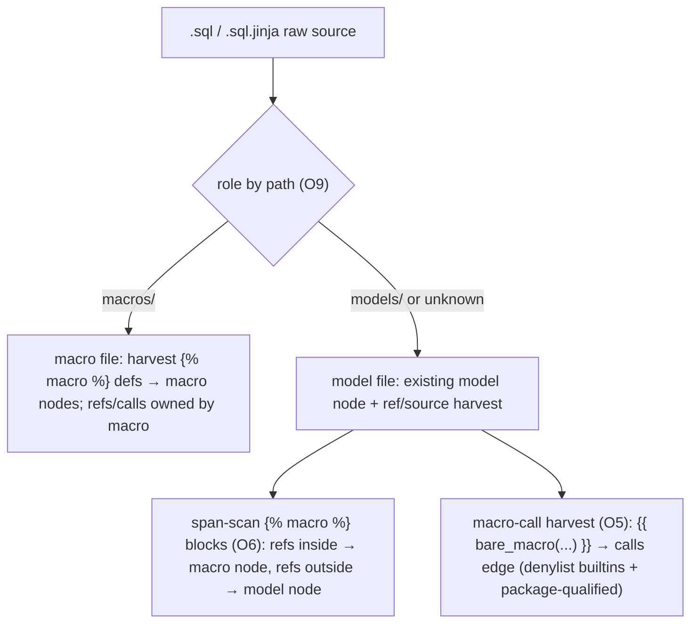

# dbt + Snowflake SQL extraction — v2 design

Implements the full **v2 deferred menu** carved out by `docs/design/sql-dbt-snowflake.md` (v1) and listed in the
v1 spec's Non-goals. v1 shipped the core (Snowflake stage/stream/task/clone/COPY + dbt Jinja ref/source pre-pass).
v2 picks up everything v1 deferred. Object-level lineage only, same as the parent.

Parent design: `docs/design/sql-dbt-snowflake.md`. Parent spec: `docs/spec/sql-dbt-snowflake.md` (the v1 contract;
its Non-goals enumerate every item built here). Grounding research: `docs/research/sql-dbt-snowflake-coverage.md`.
All work lives in `atomic/internal/codeintel/extraction/standalone/sql.go` (+ `sql_test.go`),
`atomic/internal/codeintel/types/` (taxonomy), and — new for v2 — `atomic/internal/codeintel/indexer/orchestrator.go`
(compound-extension routing).

## Scope — the full deferred menu

The user selected every v2 item after each was labelled with its value/cost. Built here:

| Item | Source | Value | New node kind |
|---|---|:---:|---|
| `.sql.jinja` ingestion | v1 user-deferred | med | — (routing only) |
| O5 dbt macro nodes + `{{ macro() }}` call edges | #68 | med | `macro` |
| O6 refs inside macro bodies attributed to the macro | #68 | med | — |
| O7 versioned refs → distinct nodes | #68 | low | — (reference naming) |
| O8 dbt `config(alias=…)` capture | #68 | low | — (model Metadata) |
| O9 dbt project-path role awareness | #68 | low | — (path-convention) |
| O1 `CREATE FILE FORMAT` node | #69 | low | `file_format` |
| O2 VARIANT/OBJECT/ARRAY column typing | #69 | low | — (column Metadata) |
| O4 `LATERAL FLATTEN` argument as a reference | #69 | low–med | — |
| standalone top-level `COPY INTO` | #69 | med | `script` (lazy) |

**Three new `types.NodeKind`**: `file_format`, `macro`, `script`. `TestNodeKindCount` 35 → 38; appendix-C `want`
set extended. **No new EdgeKind** — macros use `calls`, everything else reuses `references` / `writes`. `AllEdgeKinds`
stays 13.

## Load-bearing constraints (from the v1 code)

Read these before designing each item; they shape the seams.

- **`SQLExtractor.Extract(filePath, source)` is stateless per file.** It receives one file path + its bytes — no
  project context. So O9 (project-path awareness) is implemented as **directory-convention role detection from the
  `filePath` argument**, NOT by parsing `dbt_project.yml` (which needs orchestrator-level project state). Custom
  `model-paths` overrides remain out of scope; dbt's default paths (`models/`, `macros/`, `analyses/`, `tests/`,
  `seeds/`, `snapshots/`) are recognised from the path.
- **The dbt pre-pass already harvests every `ref()`/`source()` in the file and attributes them to the model node**
  (`sql.go` B2/B3, lines 608–640). O6 must therefore *subtract* the refs that fall inside a `` span and
  re-attribute them to the macro node — it is a refinement of an existing whole-file scan, not a new scan.
- **`ref()` uses the resource name, never the alias** (dbt docs, `generate_alias_name`). So O8 alias capture is a
  pure annotation on the model node (`Metadata.alias`) — it produces **no edge** and never changes a `ref` target.
- **Versioned model default warehouse name is `<model>_v<v>`** (dbt docs, primary-verified). O7 names the reference
  target `<model>_v<N>` for an explicit `v=N`/`version=N` — matching dbt's real compiled identifier so the edge can
  resolve against a `<model>_vN.sql` model file. This **supersedes the v1 design's `m@vN` placeholder naming**, which
  was a sketch; `_vN` is the dbt-accurate form. Unversioned refs stay `<model>` (unchanged from v1).
- **Column nodes already exist with a `Metadata json.RawMessage` field** (`extractColumns`). O2 writes the declared
  type token there; no struct change, no new node kind.
- **`LATERAL`/`UNNEST`/`TABLE` are already in `sqlKeywordsForRef`** (denylisted from FROM-list references). O4 must
  parse `FLATTEN(...)` explicitly rather than rely on the FROM scan, and emit an edge only when its input is a bare
  relation identifier — never for a column expression already covered by the FROM table.

## `.sql.jinja` routing (v1 user-deferred)

Two changes, both surgical:

1. **Orchestrator compound-extension routing.** `extToLanguage` / `standaloneExts` are keyed by `filepath.Ext`, which
   returns `.jinja` for `model.sql.jinja` — a miss. Add a compound-aware extension helper used at the three dispatch
   sites (orchestrator lines ~318, ~382, ~409): if the path ends in `.sql.jinja`, treat the extension as `.sql.jinja`
   and route to the standalone SQL registry. Register `.sql.jinja` in both maps via the existing `init()` so the one
   canonical list stays authoritative. The standalone registry's `For()` lookup also keys on the ext — register
   `.sql.jinja → SQLExtractor` there too (or fold `.sql.jinja` into `standalone.SQLExtensions` and let `IsSQLExt`'s
   existing `HasSuffix` match it; `IsSQLExt` already works for compound suffixes, so adding it to the slice is the
   smallest change — but `filepath.Ext`-keyed map lookups in the orchestrator still need the compound helper).
2. **Double-extension model basename.** `sql.go:582-583` strips one extension (`filepath.Ext`), yielding `model.sql`
   for `model.sql.jinja`. Strip `.sql.jinja` wholesale when present, else fall back to the single-ext trim. The model
   node name must be `model`, matching what other models' `ref('model')` resolves to.

Decision: **add `.sql.jinja` to `standalone.SQLExtensions`** (so `IsSQLExt` and the registry both pick it up via the
existing canonical-list wiring) **and** add a `compoundExt(path)` helper for the orchestrator's `filepath.Ext`-keyed
map lookups. This keeps one source of truth for the extension list while fixing the map-key mismatch.

## dbt macros — O5 / O6 / O9 (the dbt core of v2)

### O9 — path-convention role detection (prerequisite for O5/O6)

A new `dbtFileRole(filePath) → {model, macro, other}` helper, from the path segments:

- contains `/macros/` → **macro** (harvest `` defs; do NOT create a model node).
- contains `/analyses/`, `/tests/`, `/seeds/`, `/snapshots/` → **other** (skip dbt model-node creation; these are not
  models — but a `` defined anywhere is still a macro def).
- otherwise (including `/models/` and any unrecognised dir) → **model** (preserves v1 behaviour exactly for the common
  case, so no regression).

This is the *only* O9 surface — directory convention from `filePath`. `dbt_project.yml` custom `model-paths` stays a
documented non-goal (needs orchestrator project state the stateless extractor doesn't have).

### O5 — macro nodes + call edges

- **Definition.** ` … ` (whitespace-control tolerant) → one `macro` node named
  `name`. Macro defs are harvested in BOTH model files and macro files (a model can define an inline macro, though
  rare; macro files are the norm).
- **Call edges.** A `{{ name(...) }}` invocation → a `calls` edge from the enclosing owner (model node, or macro node
  per O6) to `name`. Guard against false edges with a **denylist** of dbt/Jinja builtins, plus a **package-qualified
  skip**:
  - Denylisted bare names (not macro calls): `ref`, `source`, `config`, `var`, `env_var`, `is_incremental`,
    `should_full_refresh`, `this`, `target`, `builtins`, `adapter`, `exceptions`, `modules`, `api`, `log`, `print`,
    `run_query`, `run_started_at`, `statement`, `return`, `set`, `dbt_version`, `invocation_id`, `flags`, `model`,
    `graph`, `fromjson`, `tojson`, `fromyaml`, `toyaml`, `zip`, `range`. (Curated from the dbt Jinja context; the
    common ones that otherwise read as `name(...)` calls.)
  - **Package-qualified calls** (`dbt_utils.star(...)`, `dbt.foo(...)`, any `a.b(...)`) → skipped. These are external
    package macros not defined in this repo; emitting edges to unresolvable names is the "noise" the v1 design warned
    about. Bare local macro calls are the only ones that produce edges.

### O6 — refs inside macro bodies attributed to the macro

The v1 B2/B3 harvest credits *every* `ref()`/`source()` to the model node. O6 refines this:

- Scan ` … ` spans (byte ranges) first.
- A `ref()`/`source()` whose match offset falls **inside** a macro span → `references` edge owned by that **macro
  node** (not the model). A `ref()` in a generic macro is a fragment of that macro's logic, not a model→model edge.
- A `ref()`/`source()` **outside** all macro spans → model node, exactly as v1.

Implementation: build the macro-span list once; B2/B3 each test the match offset against it and pick the owning node.
The placeholder-substitution residual (B5) is unaffected — it still substitutes every `{{ ref }}` so residual SQL stays
grammatical; only the *edge ownership* changes.

### O7 — versioned refs → distinct reference target

The v1 `dbtRefRE` already captures the `v=`/`version=` keyword in an independent optional group (it is currently
*ignored*). v2 reads it: an explicit `v=N` / `version=N` makes the reference target `<model>_v<N>` (dbt's default
compiled name) instead of `<model>`. Both the B2 harvest and the B5 substitution placeholder use the same versioned
name so they agree. Unversioned refs are unchanged. No model YAML is parsed (so "latest version" of a bare `ref('m')`
is still just `m`) — that part stays a non-goal.

### O8 — `config(alias=…)` capture

`{{ config(… alias='custom' …) }}` anywhere in a model → set the model node's `Metadata` to `{"alias":"custom"}`.
Annotation only: no node renamed, no edge emitted (ref uses the resource name). Tolerate other config kwargs around
`alias`. Single quotes per dbt convention; tolerate double quotes.

## Snowflake — O1 / O2 / O4 + standalone COPY

Independent of the dbt work; can land in either order after taxonomy.

### O1 — CREATE FILE FORMAT node

New top-level def loop mirroring `stageRE`: `CREATE [OR REPLACE] [TEMPORARY|TEMP] FILE FORMAT [IF NOT EXISTS] <name>`
→ a `file_format` node. No outbound edges (the `TYPE = CSV …` options are not lineage). Node-completeness only, so a
`CREATE STAGE … FILE_FORMAT = my_fmt` reference target has a definition to resolve against later.

### O2 — VARIANT/OBJECT/ARRAY column typing

`extractColumns` currently captures only the column name. v2 records the declared type token into the column node's
`Metadata` as `{"type":"<TYPE>"}` for every column (capturing all types is simpler and lower-risk than filtering to
three, and existing tests assert column *names*, not Metadata, so no regression). Success is asserted specifically for
`VARIANT` / `OBJECT` / `ARRAY`. Parameterised types (`NUMBER(38,0)`) record the base token; structured
`OBJECT(a INT)` records `OBJECT`.

### O4 — LATERAL FLATTEN argument as a reference (guarded)

Parse `FLATTEN ( [INPUT =>] <expr> )` (also inside `TABLE(FLATTEN(...))`). Emit a `references` edge **only** when
`<expr>` is a bare relation identifier (`schema.tbl` / `tbl`) — never when it is a column expression (`t.col`, which is
already covered by the FROM table `t`) and never to `FLATTEN`/`LATERAL`/`TABLE` themselves. In practice FLATTEN input is
usually a VARIANT column, so this fires rarely by design — the guard is the point. Negative tests assert no garbage.

### standalone top-level COPY INTO — lazy `script` owner

v1 captures `COPY INTO` only inside a routine/task body (it needs an owning node). v2 adds a **lazily-created `script`
node** (named by file basename) that owns top-level statements with no enclosing definition. Created **only** when a
top-level `COPY INTO` (outside any routine/task and outside the dbt pre-pass) is found — never for ordinary `.sql`
files, to avoid a per-file node explosion. A dbt model already owns its top-level statements via the model node (B5),
so the `script` node never collides with a `model` node (different files / different kinds). The COPY direction logic
(`@`-prefix decides writes-to-stage vs reads-from-stage) is reused verbatim from v1's `bodyCopyIntoRE`.

## Checkpoint sequence

Each green before the next. Taxonomy first; dbt and Snowflake tracks are independent after that.

1. **Taxonomy** — add `file_format`, `macro`, `script` kinds; `TestNodeKindCount` 35 → 38; appendix-C `want`.
2. **`.sql.jinja` routing** — `SQLExtensions` add + orchestrator `compoundExt` helper + double-ext basename.
3. **O9 path-role** — `dbtFileRole` helper (prerequisite for macros).
4. **O5 macros** — `` nodes + `{{ macro() }}` call edges (denylist + package-qualified skip).
5. **O6 macro-body refs** — span-scan; re-attribute in-span refs to the macro node.
6. **O7 versioned refs** — `<model>_v<N>` reference target.
7. **O8 alias** — `config(alias=…)` → model Metadata.
8. **O1 FILE FORMAT** — new def loop + node.
9. **O2 column typing** — type token → column Metadata.
10. **O4 FLATTEN** — guarded relation-argument reference.
11. **standalone COPY** — lazy `script` owner node.

## Test strategy

`sql_test.go` conventions (`newSQL`, `findSQLNode`, `hasUnresolvedRef`, `countUnresolvedRefs`, package-level
`const …Fixture`). Minimum one fixture per checkpoint, plus the high-risk guards:

- `.sql.jinja`: a `model.sql.jinja` ingests, model node named `model`, ref DAG identical to the `.sql` equivalent.
- O5: bare local macro call → `calls` edge; `dbt_utils.star()` and `ref()`/`config()` → NO edge (denylist + package
  skip). This is the false-edge guard.
- O6: a model with `{{ ref('a') }}` at top level AND `{{ ref('b') }}` → `references` to
  `a` owned by the model, `references` to `b` owned by the macro `m`, not the model.
- O7: `ref('orders', v=2)` → reference target `orders_v2`; `ref('orders')` → `orders` (both in one fixture).
- O8: `{{ config(alias='daily') }}` → model node Metadata `alias=daily`.
- O9: a file under `macros/` produces a macro node but NO model node; a file under `models/` (or unrecognised) keeps
  the v1 model node.
- O1: `CREATE OR REPLACE FILE FORMAT my_csv TYPE=CSV` → `file_format` node `my_csv`.
- O2: `c VARIANT`, `o OBJECT`, `a ARRAY` columns → column Metadata `type` = `VARIANT`/`OBJECT`/`ARRAY`.
- O4: `FROM raw, LATERAL FLATTEN(INPUT => raw.payload)` → `references` to `raw` only, none to `FLATTEN`/`payload`;
  `FLATTEN(INPUT => other_tbl)` (bare relation) → `references` to `other_tbl`.
- standalone COPY: a file with a top-level `COPY INTO fact FROM @stg` (no routine) → a `script` node owning a `writes`
  to `fact` + `references` to `stg`; an ordinary `.sql` with no top-level COPY produces NO `script` node.
- Taxonomy: `TestNodeKindCount` = 38 with the three new kinds present.

## Risks

- **`.sql.jinja` routing has three call sites** (orchestrator ~318/~382/~409) — miss one and the file is silently
  skipped or mis-routed. The compound-ext helper must be used at every `filepath.Ext`-keyed lookup, verified by an
  end-to-end index test, not just unit tests.
- **O6 span arithmetic** — the macro-span byte ranges must be computed on the same string the ref-offset comes from
  (raw, comment-stripped source). An off-by-one mis-attributes a ref. Dedicated fixture with a ref on each side of the
  span boundary.
- **O5 denylist completeness** — an incomplete denylist emits false `calls` edges to Jinja builtins. The package-
  qualified skip catches the package case; the bare-name denylist must cover the common builtins. Err toward skipping
  (a missed real macro call is a smaller harm than a graph full of edges to `is_incremental`).
- **O2 Metadata on every column** — confirm it does not perturb existing column-node tests (they assert names, so it
  should not) and that the JSON is valid `json.RawMessage`.
- **`script` node noise** — must be lazy (only on a real top-level COPY). A bug that creates one per file pollutes the
  graph for every plain SQL file.

## Status

Design complete. Spec (`docs/spec/sql-dbt-snowflake-v2.md`) derived from this. No code written yet.
