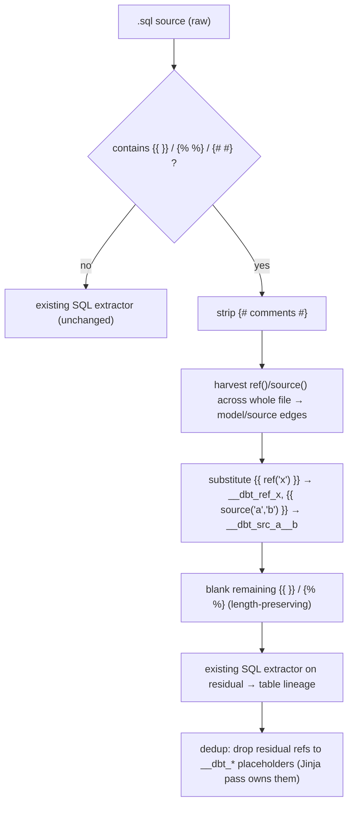

# dbt + Snowflake SQL extraction — design

Extends the standalone SQL extractor (`atomic/internal/codeintel/extraction/standalone/sql.go`) to cover two
SQL ecosystems it currently misses: **Snowflake dialect** (#69) and **dbt models** (#68). Grounded in the
coverage research at `docs/research/sql-dbt-snowflake-coverage.md` (primary-doc-verified). Object-level lineage
only, consistent with the parent spec `docs/spec/sql-language-support.md`.

Two ticket premises were corrected by the research and are load-bearing here:

- **#69:** `CREATE OR REPLACE` / `IF NOT EXISTS` are *already* handled by `modPat` (`sql.go:193`). The real
  preamble gap is only the class/security modifiers (`TRANSIENT`/`TEMP`/`SECURE`/`RECURSIVE`).
- **#68:** dbt `ref('a','b')` is `(package, model)` — package **first** — and the version is a keyword
  (`version=`/`v=`), not a 2nd positional. The naive "2nd arg = model" reading corrupts edges.

## Scope decisions (settled)

| Decision | Choice |
|---|---|
| Breadth | Full core scope + O3 (syntax-tolerance guards), both tickets, one branch. O1/O2/O4–O9 → v2. |
| dbt residual SQL | Placeholder substitution (`{{ ref('x') }}` → `__dbt_ref_x`) so residual SQL stays grammatical. |
| dbt `.sql.jinja` | **v2** — `filepath.Ext` returns `.jinja`, so it needs orchestrator compound-ext routing, not a list-add. Plain `.sql` dbt models are already ingested. |
| dbt macros | Defer to v2. |
| Versioned refs | Collapse `ref('m', v=N)` → single `m` node. |

## Taxonomy changes

New `types.NodeKind` values (append to the const block + `AllNodeKinds`, bump `TestNodeKindCount` 31→35, extend
the appendix-C `want` list in `types_test.go`):

- `stage` — Snowflake `CREATE STAGE`.
- `stream` — Snowflake `CREATE STREAM`.
- `task` — Snowflake `CREATE TASK`.
- `model` — a dbt model (one per templated model file). A model materializes as a table/view, but a dedicated
  kind keeps `code search --kind model` meaningful and avoids polluting `table`.

**No new EdgeKind.** Every relationship reuses existing kinds: ref/source/clone/stream-on/task-after →
`references`; COPY-INTO-table → `writes`; COPY-FROM-table → `references`; task body `CALL` → `calls`.
`AllEdgeKinds` stays at 13.

`source('a','b')` targets are **not** nodes (the definition lives in `sources.yml`, which we do not parse) — the
edge is an unresolved reference to a synthetic name `a.b`, exactly like an external-table reference today.

## Architecture / seams

Two independent attach points, from the baseline research:

```
Snowflake → same shape as the APPLY work, in sql.go
   definitions: new *RE + extraction loop next to the existing CREATE loops
   body edges : new body*RE + addRef block inside scanBodyEdges
   identifier : widen tolerance for @stage tokens (definitions/refs)

dbt → a NEW pre-pass at the TOP of SQLExtractor.Extract, BEFORE stripStrings
   (stripStrings blanks the quoted arg inside {{ ref('x') }} — must harvest first)
```

dbt pipeline (per templated file):



## Snowflake plan (#69 core)

Each item is additive regex in the established pattern. Sequenced so the prerequisite lands first.

1. **Preamble modifiers (prerequisite).** Widen the definition preamble so `CREATE [OR REPLACE]
   {TRANSIENT|TEMPORARY|TEMP|VOLATILE|LOCAL|GLOBAL} TABLE` and `CREATE [OR REPLACE] {SECURE|RECURSIVE}… VIEW`
   parse. Implementation: a `classPat` fragment spliced into `tableRE`/`viewRE` (and any other affected
   preamble), placed after `modPat`. Without this, the new node kinds below are missed on the idiomatic
   `CREATE OR REPLACE TRANSIENT …` spelling.
2. **`COPY INTO` (both directions).** `COPY INTO <tbl> FROM @stage` → `writes` to table + `references` to stage.
   `COPY INTO @stage FROM <tbl|(query)>` → `writes` to stage + `references` to the table(s). Direction decided by
   `@`-prefix on the COPY target. **Body edge in `scanBodyEdges`, owned by the enclosing routine/task.** A
   standalone top-level COPY (no owning definition) is v2 (needs a file-owner node).
3. **`CREATE TASK`.** New `task` node (top-level definition loop). `AFTER <t1>[, <t2>…]` → `references` (task→task
   dependency, comma list) via a **dedicated regex on the CREATE TASK text**, NOT `scanBodyEdges` (the `AFTER`
   keyword is denylisted there). Body `AS <sql>` / `AS CALL proc()` → reuse the body-edge scan (references/calls).
4. **`CREATE STREAM … ON {TABLE|VIEW|EXTERNAL TABLE|STAGE|DYNAMIC TABLE|EVENT TABLE} <name>`.** New `stream`
   node + one `references` edge to the source object (alternation on the object keyword).
5. **`CREATE STAGE`.** New `stage` node. Recognize `@name` / `@~/path` / `@%table` in `FROM` as a `references`
   edge (anchors COPY's stage end). Identifier tolerance: an `@`-led token in FROM/COPY position.
6. **`CLONE`.** `CREATE … TABLE|VIEW <new> CLONE <src>` → `references` edge `new → src` (the body has no FROM,
   so this is the only way to catch clone lineage). Folds into the preamble work.

False-positive guards (no edge, just don't choke): `QUALIFY`, `::` casts, `$1` positional, `LATERAL FLATTEN` /
`TABLE(FLATTEN(...))` must not be read as a real table reference.

## dbt plan (#68 core)

1. **Activation gate.** Run the pre-pass only if the file contains `{{` / `{%` / `{#`. Plain SQL → no-op,
   existing extractor unchanged.
2. **`ref()` harvest (whole file, after `{#…#}` removal).** Regex anchored on `ref(` + quoted literal(s),
   correctly disambiguating: 1 literal = model; 2 literals = `(package, model)`; `version=`/`v=` is a keyword,
   ignored for the edge. Emits a `references` edge from this model to the model-name string. Scans the whole
   file (refs legitimately live inside ``/``/`` bodies).
3. **`source()` harvest.** Always-2-arg `source('a','b')` → `references` to synthetic `a.b`.
4. **Model node.** One `model` node per templated file, named by file **basename** (dir excluded; `alias` does
   not change the `ref` name). This is the resolution target for other models' `ref()`.
5. **Placeholder substitution + residual extract.** Replace `{{ ref('x') }}` → `__dbt_ref_x`,
   `{{ source('a','b') }}` → `__dbt_src_a__b`, blank remaining `{{ }}`/`` length-preserving, run the
   existing extractor for table/column lineage, then drop any residual references to `__dbt_*` placeholders
   (the Jinja pass already owns those edges — avoids double counting and dangling FROM).
6. **Extension.** `.sql.jinja` registration is **v2** (`filepath.Ext` returns `.jinja` → needs orchestrator
   compound-ext routing + double-ext basename, not a list-add). Plain `.sql` dbt models are already ingested, so
   dbt DAG extraction works without it.

Statically-unresolvable inputs are skipped (no garbage edges): `ref(var('x'))` / non-literal args,
cross-project refs (emit namespaced-unresolved at most), `{{ this }}` self-edges.

## Optional / deferred menu — decided

**In scope: core + O3** (the syntax-tolerance regression guards). **Everything else (O1, O2, O4–O9) is v2**,
including dbt macros (O5/O6). The table records value/cost for the v2 backlog.

| # | Item | Ticket | Lineage value | Cost | Note |
|---|------|--------|:---:|:---:|------|
| O1 | `CREATE FILE FORMAT` node | #69 | low | XS | Node only, no edges. Node-completeness only. |
| O2 | VARIANT/OBJECT/ARRAY column **typing** captured | #69 | low | S | Column type is currently dropped for all dialects; this is a broader feature, not Snowflake-specific. |
| O3 | `QUALIFY` / `::` / `$1` explicit tolerance tests | #69 | low | XS | Already harmless; adds only regression tests. |
| O4 | `LATERAL FLATTEN` arg as a reference | #69 | low–med | S | FLATTEN is a built-in TVF over a column expr; edge is noisy. |
| O5 | dbt **macro nodes** (``) + `{{ macro() }}` **call edges** | #68 | med | M | Needs a built-in/package denylist (`is_incremental`, `dbt_utils.*`, `ref`, `config`…) to avoid false edges. |
| O6 | dbt **refs inside macro bodies** attributed to the macro | #68 | med | M | Depends on O5; a ref in a generic macro is a fragment, not a true model→model edge. |
| O7 | dbt **versioned refs** as distinct `m@vN` nodes | #68 | low | S | Core collapses to `m`; distinct nodes need model YAML (`latest_version`). |
| O8 | dbt **`alias`** → compiled warehouse table name captured | #68 | low | S | Affects the DB identifier, not the DAG; only useful for warehouse-name lineage. |
| O9 | dbt **project-path awareness** (`dbt_project.yml` `model-paths`) | #68 | low | M | Core gate (`{{ }}` presence) already makes the feature safe without it. |

## Test strategy

- Snowflake: per-construct fixtures + `hasUnresolvedRef`/`findSQLNode` assertions, mirroring `tsqlFixture` style.
  Explicit `CREATE OR REPLACE TRANSIENT` / `SECURE VIEW` / `CLONE` / `COPY INTO` both-direction / `TASK … AFTER`
  / `STREAM ON` cases. Negative guards for QUALIFY/`::`/`$1`/FLATTEN.
- dbt: fixtures for 1-arg / 2-arg / version-keyword `ref()`; `source()`; ref inside ``; placeholder
  residual still yielding table lineage; the 2-arg-vs-version disambiguation (an explicit fixture, since
  mislabeling silently corrupts edges); plain-SQL-with-no-Jinja no-op; `.sql.jinja` ingestion.
- Taxonomy: `TestNodeKindCount` 31→35; appendix-C list updated.

## Risks

- **Preamble regex order** — splicing `classPat` after `modPat` must not break the 200+ existing
  Postgres/MySQL/T-SQL definition tests. Land item 1 with the full suite green before the rest.
- **dbt placeholder collisions** — `__dbt_ref_*` must be a name no real table uses; dedup on the prefix.
- **Whitespace-control Jinja** (``) and multi-line blocks — the strip/substitute regexes must match
  the hyphenated and DOTALL forms.
- **2-arg ref disambiguation** — the single highest-risk correctness point; covered by a dedicated fixture.

## Status

Design complete. Spec (`docs/spec/sql-dbt-snowflake.md`) to be written once the optional-menu picks are
confirmed. No code written.
