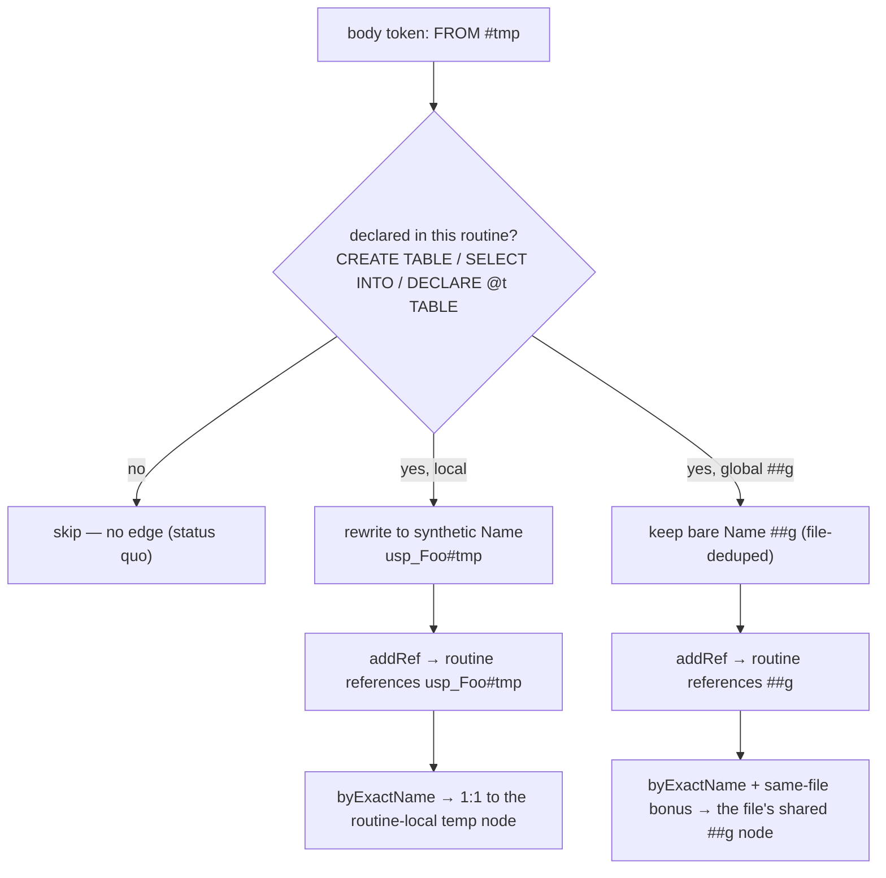

# T-SQL lineage gaps v2 — temp tables, OUTPUT INTO, PIVOT, column-level

Phase 2 of issue #70. Phase 1 (`docs/spec/tsql-lineage-gaps.md`, #103, v5.7.0) shipped
`CROSS`/`OUTER APPLY` → `calls`. This closes the four remaining audit gaps with real lineage,
not deferral.

## Problem

The standalone SQL extractor (`atomic/internal/codeintel/extraction/standalone/sql.go`) captures
object-level body edges (`FROM`/`JOIN` → references, `INSERT`/`UPDATE`/`DELETE`/`MERGE` → writes,
`EXEC`/`CALL`/`APPLY` → calls). Four T-SQL constructs still produce no lineage:

| Gap | Today | Why it matters |
|-----|-------|----------------|
| Temp tables `#tmp` / table vars `@t` | Zero edges — `sqlQNameRaw` starts `[A-Za-z_]`, so `#`/`@` tokens never match. Invisible, not wrong. | Intra-proc + cross-statement dataflow (proc materializes `#tmp`, reads it back) is uncaptured. |
| `OUTPUT … INTO <target>` | Zero edges. | Write-target lineage of MERGE/INSERT audit patterns is missed. |
| `PIVOT` / `UNPIVOT` | Source captured by inner `FROM`; operator itself unhandled. | Verify no false edges + no lost source ref. |
| Column-level lineage | Object-level only. | Industry-wide weak spot; the differentiating capability. |

The blocker that made these "not a regex add" (per the issue's own deferral comments):
**resolution is global name-based** (`byExactName` → `GetNodesByName(name, "")`). Naively emitting a
`#tmp` reference would collide two procedures' distinct `#tmp` objects into one node — false
cross-proc lineage, worse than nothing. Column names collide even harder (`id` is in every table).

## Resolution mechanics (grounded 2026-06-24)

Three facts from the resolver decide every approach below:

1. **Same-file scoring disambiguates across files.** `computeScore` (`resolution/name_matcher.go:449`)
   adds `ScoreSameFile = +100` when a candidate's file equals the reference's file. Two files each
   declaring `#tmp` resolve each reference to their own file's node for free. Only the *same-file,
   multiple-routine* case still collides.

2. **Resolution matches by the node `Name` field; qualified resolution is dot-count gated.**
   `matchReference` (`name_matcher.go:124`) dispatch order: filePath → `byQualifiedName` (only when
   `name` has `::` or **≥2 dots**, `isQualifiedDot` line 621) → `byMethodCall` (single dot; filters to
   `method`/`function` kinds) → `byExactName` (matches the `Name` column) → fuzzy. Consequence: a
   single-dot `acct.id` never reaches `byQualifiedName`, hits `byMethodCall` which excludes columns,
   then `byExactName("acct.id")` which fails because the column node's `Name` is `id` (bare), not
   `acct.id`. **Column refs do not resolve today.**

3. **A synthetic-unique-name precedent exists.** The dbt work (`sql.go:911`, `__dbt_ref_<model>`)
   synthesizes a name shared by node and reference so global resolution maps them 1:1. The same trick,
   with the synthetic string as the node's actual `Name`, gives each routine's `#tmp`/`@t` a distinct
   resolvable identity.

**Scope split.** Gaps 1–3 are pure-extractor (`sql.go` only) — fact 1 + fact 3 cover them. Gap 4
(column-level) additionally needs a **bounded, SQL-scoped resolver change** (fact 2): single-dot SQL
`table.col` refs must reach qualified resolution, and `byQualifiedName` must prefer an exact full-QName
match over its loose `.col` suffix filter. This is a targeted strategy addition, not a resolver
redesign. The earlier "no resolver changes" assumption was disproven by the dispatch trace above and is
abandoned for gap 4.

## Goals / Non-goals

- **Goals:** real, false-positive-free lineage for all four gaps; intra-proc temp dataflow correctly
  scoped; OUTPUT-INTO write edges; PIVOT source preserved with no false edges; object→column
  references via alias resolution that resolve to the specific column node.
- **Non-goals:**
  - **Column→column derivation lineage** (`v.full_name` derives from `person.first` + `person.last`).
    Needs view-output-column extraction (views have no column nodes today) + SELECT-expression parsing.
    Separate epic; out of scope here.
  - **Unqualified column references** (`SELECT id FROM acct`). Ambiguous; only qualified `alias.col`
    refs emit.
  - **New NodeKind / EdgeKind.** Temp tables reuse `table` + `Metadata`; column refs reuse `references`.
  - **Scalar variable edges.** `@id INT` is not a relation; only `@t` declared `TABLE(…)` emits edges.
  - **Resolver redesign.** Gap 4's resolver change is two scoped tweaks (below), not a new resolution
    model. Gaps 1–3 touch no resolver code.
  - **Column type semantics**, query-plan analysis, stored-proc control flow (inherited from parent).

## Scoping model (gaps 1–2)

Local temp tables and table variables are **routine-scoped**; global temp tables are **file-scoped**
(global temps persist across connections — their cross-proc lineage is real and intended).

```
declaration site                       → node Name (resolved by) → scope
──────────────────────────────────────────────────────────────────────────────
CREATE TABLE #tmp / SELECT…INTO #tmp   → synthetic <routine>#tmp  → routine-local
DECLARE @t TABLE(…)                    → synthetic <routine>@t    → routine-local
CREATE TABLE ##g                       → bare ##g (file-deduped)  → file-local (+100 bonus)
real table OUTPUT…INTO Audit           → bare Audit               → global (normal table resolution)
```

- The synthetic name is the node's **actual `Name` field** (resolution matches `Name`) and is set on
  every body reference to that token within the routine — so global resolution maps 1:1 even when two
  routines in one file both declare `#tmp`. The written token (`#tmp`) is preserved in
  `Metadata{"temp":…}` for display; it is not the resolution key.
- The synthetic name contains no `.`/`/`/`::` so it resolves via `byExactName` (not misrouted to
  qualified/methodCall strategies), reinforced by the same-file bonus.
- Global `##g`: a file may declare `##g` more than once (conditional branches). The extractor **dedups
  global temp nodes by name within the file** so reads/writes resolve to one shared node.

Caption — how a `#tmp` reference resolves (the gate is "declared in this routine?"):



## Approaches

### Temp-table / table-variable scoping

| # | Approach | Pros | Cons |
|---|----------|------|------|
| A | Synthetic routine-scoped `Name` + reuse `NodeKindTable` + `Metadata{"temp":…}` | No resolver change; mirrors `__dbt_ref_` precedent; no taxonomy tax; same-file scoring reinforces | Synthetic node names appear in `code search` (mitigated: written token in `Metadata`) |
| B | New `NodeKindTempTable` + resolver scope-awareness (file/proc filter) | "Pure" model; distinct search kind | Resolver redesign (the deferral's blocker); taxonomy tax across 6 surfaces; over-engineered |
| C | Emit nothing (status quo) | Zero risk | Leaves the gap — rejected, user wants it done |

**Recommendation: A.** Minimum correct change. Reuses the proven synthetic-name pattern, touches only
`sql.go`, and the same-file +100 bonus handles the cross-file case for free.

### Declaration gating (false-positive guard)

Only emit temp/var edges for tokens **declared** in the routine body: `CREATE TABLE #x`,
`SELECT … INTO #x`, `DECLARE @x TABLE(…)`. An undeclared `@id` is a scalar and is skipped (status quo).
The body pre-scan for declarations is the price of correctness and is cheap (same body text).

### Column-level scope (the key decision)

| # | Slice | What it builds | Effort | Verdict |
|---|-------|----------------|--------|---------|
| 4a | Object→column references | alias→table map from FROM/JOIN; qualified `alias.col` → `references` routine→`table.col` column node, **with the bounded resolver tweak so it resolves** | Moderate; `sql.go` + 2 small `name_matcher.go` tweaks | **Recommended** |
| 4b | Column→column derivation | + view-output-column nodes + SELECT-expression parsing + per-output-column lineage | Large; new node extraction + expression grammar | Out of scope — separate epic |

**Recommendation: 4a only.** It is the correct, achievable, false-positive-free slice and delivers the
differentiating capability ("what columns does this routine read"). The two resolver tweaks it needs:

1. **Single-dot SQL `table.col` reaches qualified resolution.** In `matchReference`, when
   `ref.Language == SQL` and the name is single-dot and `byMethodCall` yields nothing, fall through to
   `byQualifiedName`. Scoped to SQL so non-SQL `receiver.method` resolution is untouched.
2. **`byQualifiedName` prefers exact full-QName.** When any candidate's `QualifiedName` equals the full
   reference name, return only those — the loose `.col` suffix match is a fallback, not a peer. This is
   a general correctness improvement (an exact qualified match should beat a simple-name suffix).

4b requires extracting view/select output columns as nodes — which the extractor does not do today
(only table DDL yields column nodes) — plus expression parsing the parent spec scopes out. Bundling 4b
would balloon #70 into a multi-surface epic.

## Risks

| Risk | Likelihood | Mitigation |
|------|-----------|-----------|
| `@scalar` mistaken for table var | med | Strict gate on `DECLARE @x TABLE(…)` set; scalars skipped |
| `OUTPUT … INTO` over-matches a following statement's `INTO` | med | Restrict the OUTPUT→INTO gap to an output-list char class (`[\w.\[\]*,\s]+`); a real statement boundary (FROM/SELECT/VALUES/`;`) breaks the run → no match; negative test |
| Resolver tweak 1 leaks into non-SQL resolution | med | Gate strictly on `ref.Language == LanguageSQL`; existing cross-language resolution tests must stay green |
| Resolver tweak 2 (prefer-exact) regresses other languages | low | Prefer-exact only narrows when an exact full-QName match exists; full suite + eval guard |
| Synthetic temp nodes clutter `code search` | low | Reuse `table` kind + `Metadata{"temp":…}`; written token in metadata |
| Qualified column ref resolves to a same-named column in another schema | low | Emit table-qualified-as-written; exact-QName preference + same-file bonus; documented limitation, silent degrade |
| Same-file multi-proc `#tmp` collides | low | Synthetic name encodes the routine — the explicit fix; dedicated test |
| Global `##g` declared twice in one file | low | File-level dedup of global temp nodes by name |

## Open questions

- None blocking. 4b (column→column derivation) is deferred by recommendation; if wanted, it becomes its
  own issue after 4a ships (it needs view-output-column extraction first).
