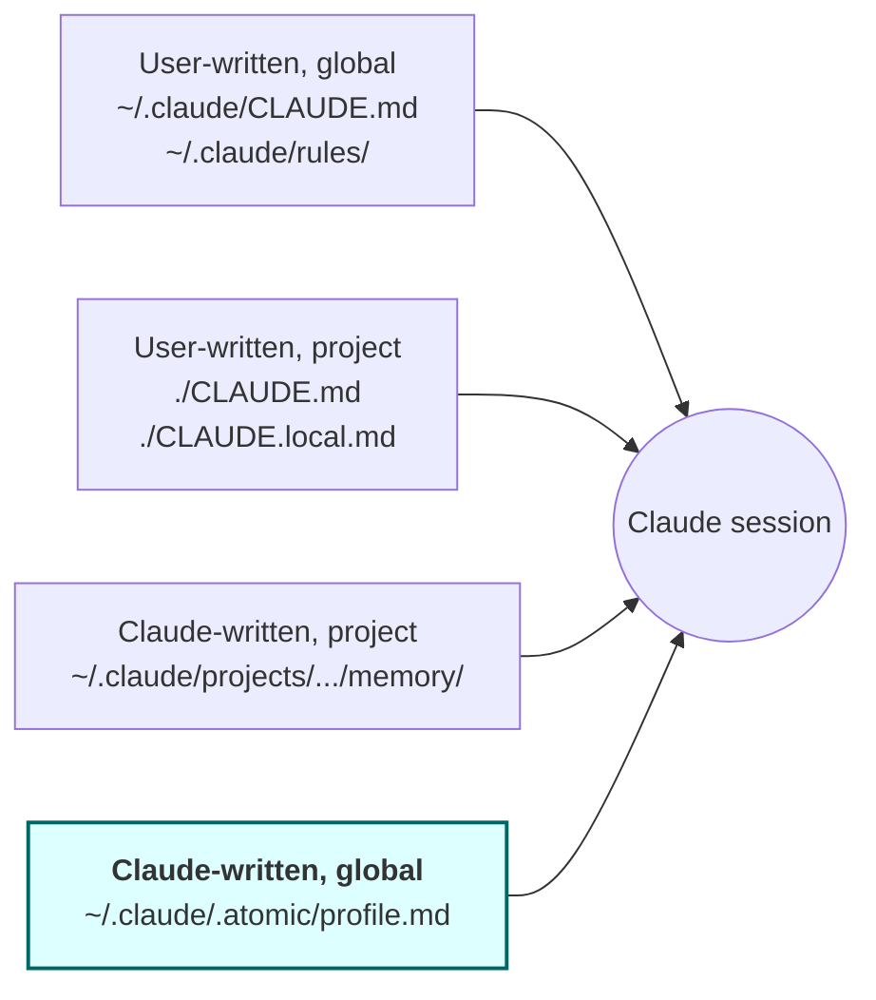
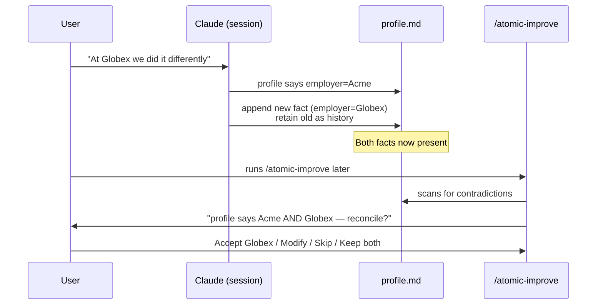
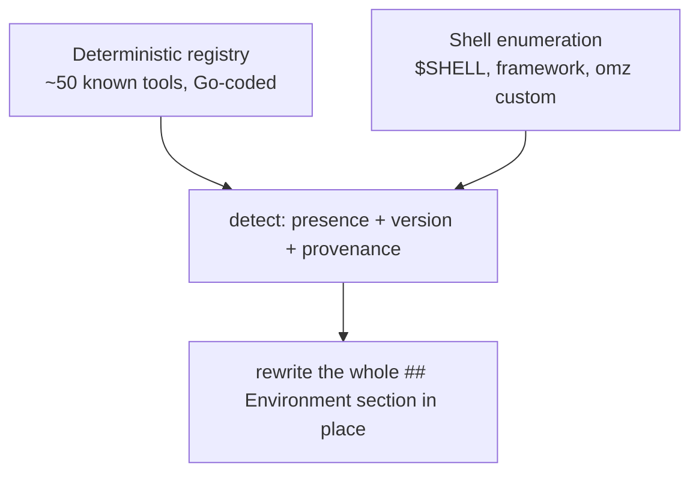
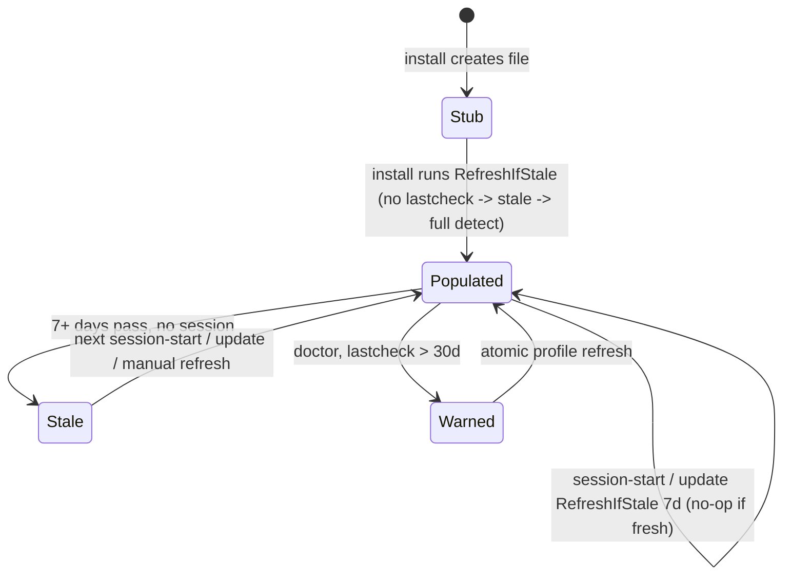

# User profile

A global, auto-updated identity file at `~/.claude/.atomic/profile.md`. Captures durable facts about the user (name, role, projects, interests, people) so Claude can draw on them across every session and every project — closing a real gap in Claude Code's current memory model.


## Problem

Claude Code's existing memory surfaces split cleanly into two halves: user-written content (`~/.claude/CLAUDE.md`, `~/.claude/rules/*.md`) is global but static; Claude-written content (auto memory) is dynamic but per-repo (`~/.claude/projects/<project>/memory/`).

There is no global tier of Claude-written memory.

The effect: a user introduces themselves in repo A — *"I'm Danilo, senior engineer at Acme, working on a side project for live-music gear"* — and Claude in repo B knows none of it the next morning. Personal facts that should anchor every interaction (name, role, communication preferences, active projects, hobbies, important relationships) live nowhere durable across projects. The user re-introduces themselves at the start of every new context, or accepts that Claude treats them as a stranger every session.

This is a structural gap, not a usage problem. The fix is a new surface, not better instructions.


## Goals

- Single global file holding curated identity facts about the user, available to every session.
- Claude updates the file opportunistically when a fact surfaces naturally in conversation.
- Drift between recorded facts and current reality is surfaced via `/atomic-improve` — not by interrupting work mid-conversation.
- Historical facts are preserved (old + new), not overwritten — useful for drawing parallels.
- Bootstrap at install captures the deterministic environment (git config, OS, hardware) so the file is non-empty on day one.
- Cleanly survives `atomic claude install/update/uninstall` — the file is user data, not bundle data.


## Non-goals

- Not a setup wizard. No interactive interview at install.
- Not a policy engine. Privacy is the user's responsibility; the file is not encrypted, not redacted, and not filtered for sensitive topics.
- Not a replacement for `~/.claude/CLAUDE.md`. CLAUDE.md is for instructions the user writes; profile is for facts Claude observes.
- Not a per-project file. Project-scoped preferences continue to use existing auto memory.
- Not a real-time enforcement mechanism. The file is context, not a hook.
- Not time-tracked. No `last_observed` columns, no review cadence, no expiry — the maintenance cost outweighs the value when event-driven drift detection already exists.


## Conceptual model

The four memory surfaces after this change:



The new tier (highlighted) is the missing quadrant.


## Routing rule (profile vs. auto memory)

Default behavior for facts Claude judges worth saving:

| Fact shape | Destination |
|---|---|
| Identity (name, location, languages) | profile |
| Profession (role, employer, team) | profile |
| Active projects (work + side) | profile |
| Hobbies, interests, taste | profile |
| Important relationships (coworkers, collaborators) | profile |
| Communication style preferences (terse, verbose, no emojis) | profile |
| Project-tinted commands ("for this repo, use pnpm not npm") | existing auto memory |
| Project-tinted conventions ("integration tests hit real DB here") | existing auto memory |
| Codebase-specific patterns | existing auto memory |

Rule of thumb: *if the fact would still be true in a different repo, it goes to profile.* Otherwise it stays in auto memory.

Claude needs an explicit instruction in `~/.claude/CLAUDE.md` for this — without it the default auto-memory path captures user-type facts in the wrong place.


## Drift handling

Event-driven, no time-based clock.



- Real-time: Claude appends new fact, never overwrites the old.
- Deferred: `/atomic-improve` introduces a new finding category — **profile drift** — that surfaces contradictions and asks the user per-finding.
- No periodic review. No staleness clock. If you stop mentioning a side project, it sits in the file silently — that's accepted.


## XML volatility tags

Sections carry tags signaling how often facts there tend to change. The tags don't drive cadence (no clock); they bias the drift-detection heuristic so Claude weights contradictions more aggressively in `<volatile>` sections than `<stable>` ones.

| Tag | Meaning | Example sections |
|---|---|---|
| `<stable>` | Rarely changes | Identity, Interests, Hobbies |
| `<volatile>` | Changes routinely | Work, Active projects, People |
| `<deterministic>` | Captured from env, not conversation | Environment |


## Schema (strawman, locked at this level of detail)

Plain markdown. Pre-defined sections. No timestamps.

```markdown
# User profile

## Identity
<stable>
- Name: ...
- Location: ...
- Native language: ...
</stable>

## Work
<volatile>
- Employer: ...
- Role: ...
- Team: ...
</volatile>

## Active projects
<volatile>
- ...
</volatile>

## Interests
<stable>
- ...
</stable>

## People mentioned
<volatile>
- Alice (coworker) — owns billing service
- ...
</volatile>

## Environment
<deterministic>
- Git user.name: ...
- Git user.email: ...
- OS: ...
- Arch: ...
- CPU count: ...
</deterministic>
```

Claude appends to existing sections; does not invent new section names. Old facts stay (history); new facts append below. The spec defines the exact append contract.


## Bootstrap

At `atomic claude install`, runs once:

1. Create `~/.claude/.atomic/profile.md` if absent (idempotent — same pattern as `ensureResolvedConfigStub`).
2. Populate `## Environment` section with deterministic env capture:
   - `git config --global user.name` / `user.email`
   - `runtime.GOOS`, `runtime.GOARCH`
   - `runtime.NumCPU()`
3. Add `@~/.claude/.atomic/profile.md` to the atomic-owned block of `~/.claude/CLAUDE.md` (alongside the existing config.resolved.md ref).
4. Add routing instruction to `~/.claude/CLAUDE.md`: *"Facts about the user personally go to `profile.md`. Project-tinted preferences continue to auto memory."*
5. Print one-line nudge: `Profile created at ~/.claude/.atomic/profile.md. Mention things about yourself naturally; Claude will fill it in. Run /atomic-improve to review drift.`

No interactive interview. No mid-conversation prompts.


## Approaches considered

| # | Approach | Pros | Cons |
|---|---|---|---|
| A | New file at `~/.claude/.atomic/profile.md`, install-generated stub, opportunistic write, `/atomic-improve` review (this design) | Mirrors existing `config.resolved.md` pattern; no bundle changes; clean uninstall story; routing rule is one CLAUDE.md edit | Requires teaching Claude a new write target via CLAUDE.md instruction |
| B | Bundle a template `profile.md` shipped with the binary, modified per-user | Discoverable from the bundle; consistent shape across users | Wrong tool: bundle artifacts are *read-only contracts that update*. User content overlaid on a bundled file fights `atomic claude update`. Maintenance nightmare. |
| C | Use `~/.claude/CLAUDE.md` directly for user-written profile content | Zero new surfaces; existing global file | Defeats the "Claude writes opportunistically" requirement — CLAUDE.md is a user-written contract, not an append target Claude should mutate. Mixes voices and breaks the install/update boundary. |
| D | Patch Claude Code itself: add a global tier to auto memory | Fixes the gap at the root | Out of our control. Belongs upstream. |
| E | First-session interactive interview ("What's your name? Where do you work?") to bootstrap | Rich content day one | Hostile UX — first contact becomes a wizard. Forced answers are worse than observed facts. |


## Recommendation

**Approach A.** Strong precedent in `config.resolved.md`: install-time idempotent stub under `~/.claude/.atomic/`, @-ref'd from `~/.claude/CLAUDE.md`, never bundled, never overwritten on update. Uninstall must explicitly preserve it (user data).

Confidence: high. The pattern is proven; the gap it fills is real; the maintenance cost is low because there is no clock and no schema validator.


## Open questions

- **Bootstrap nudge surface.** One-line stdout message after install vs. logged-only. Stdout is more discoverable but adds noise to the install transcript. Default to stdout, accept that it adds one line.
- **Doctor integration.** Should `atomic doctor` check that `profile.md` exists and is @-ref'd, parallel to the signals-ref check? Probably yes — keeps the wiring honest — but the spec should call this out so the doctor check gets added explicitly.
- **CLAUDE.md routing instruction wording.** The exact prose Claude sees that tells it "personal facts go to profile, not project memory" is load-bearing. The spec should include the verbatim text, not a paraphrase — that's the actual contract.
- **`/atomic-improve` finding format.** Strawman is `[profile drift] "<old fact>" — flagged stale. You mentioned "<new fact>" in N sessions. [Accept new / Modify / Skip / Keep both]`. Worth confirming the exact prompt during spec authoring.


## v2 — Deterministic environment refresh + dev-tooling fingerprint

### Problem (v2)

v1 captured five static fields (`git user.name/email`, OS, arch, CPU) once at install. They never update and miss the dev-tooling fingerprint that would let Claude steer: which language runtimes exist and at what version, which version managers are in play, whether the runtime in use is system-installed or manager-managed, what containers/orchestration/CLI tooling is present, and what shell + shell framework the user runs. A profile that says "node 22 via nvm, python is pyenv-managed 3.12 not system 3.9, zsh + oh-my-zsh with custom plugins X/Y" lets Claude pick the right commands without asking.

### Reconciliation with the v1 "not time-tracked" non-goal

v1 §Non-goals states *"Not time-tracked. No staleness clock, no expiry."* That non-goal stands **for conversation-observed facts** (Identity, Work, Active projects, Interests, People). v2 adds a clock **only to the `<deterministic>` block**, which v1 already excludes from drift detection. The two do not conflict: observed facts remain un-clocked and never auto-rewritten; the env block gains a refresh cadence because it mirrors machine state, not conversation.

### Detection model — registry + shell enumeration (deterministic only)



All detection is deterministic Go. No LLM in the loop (see §"LLM discovery — dropped").

**Detection registry (the floor and the ceiling).** A static registry of ~50 tools. For each: candidate binary name(s), version command, and a detection strategy. The registry is the *sole* source of truth — extended only by editing the Go registry, never by runtime discovery. Categories:

| Category | Examples |
|----------|----------|
| Language runtimes | node, python/python3, go, rustc, ruby, java, elixir, deno, bun, php, gcc/clang |
| Package/build managers | npm, pnpm, yarn, pip, cargo, bundler, mix, maven, gradle, make, bazel |
| Version managers | nvm, pyenv, rbenv, asdf, mise, rustup, volta, fnm, sdkman |
| Containers/orchestration | docker, docker-compose, podman, kubectl, helm, k9s, minikube, kind |
| Monorepo/build | nx, turbo |
| CLI tools | jq, yq, rg, ast-grep/sg, fd, fzf, gh, git, curl |
| Cloud | aws, gcloud, az, terraform, pulumi |

**Shell environment.** `$SHELL` / login shell; framework detection (oh-my-zsh via `~/.oh-my-zsh`, prezto, starship, etc.); enumerate `~/.oh-my-zsh/custom/` plugins and themes. Deterministic (filesystem + env reads).

### LLM discovery — dropped

An earlier draft proposed an LLM layer that nominates candidate binaries the registry doesn't know, with code doing the actual detection. **Dropped** (pressure-test 2026-05-28). The curated registry captures ~95% of real environments; the marginal tool an LLM would surface is rare enough that the cost (a model pass + a persistence path + unbounded candidate growth) isn't justified. Conscious trade: the registry is the only source of truth, extended by code edits, never by discovery. A niche tool the registry never heard of stays invisible until someone adds it to the registry. Accepted.

### Provenance — active runtime only, not an inventory

For each runtime, detect the **active** binary (what runs when you type `python`/`node`/etc. in the user's shell), its version, and classify the source of that one binary. **No enumeration of all installed versions** — a version-manager user can have a dozen pythons; the block records only the active one. Separately, record a presence flag per installed version manager (decided 2026-05-28).

The two questions Claude needs answered: *does the user have python? is the active python system or manager-managed?* Not *how many pythons are installed.*

| Source class | Signal (of the active binary's resolved path) |
|--------------|-----------------------------------------------|
| version-manager shim | path under `~/.pyenv/shims`, `~/.asdf/shims`, `~/.nvm/versions`, `~/.rbenv/shims`, volta/fnm dirs |
| homebrew | path under `/opt/homebrew`, `/usr/local` (macOS) or linuxbrew |
| system | `/usr/bin`, `/bin`, `/usr/local/bin` (non-brew) |
| other | anything else, record raw path |

Output shape: `python: 3.12 (pyenv)` plus, in the version-managers list, `pyenv: installed`. The active runtime's source class is the parenthetical; the manager-presence flags live alongside the other tools.

### Version-manager detection gotcha

`nvm`, `sdkman`, and several managers are **shell functions, not binaries on PATH** — `exec.LookPath("nvm")` returns "not found" even when installed. Detection must fall back to known install directories (`~/.nvm`, `~/.sdkman`, `~/.pyenv`, `~/.rbenv`, `$ASDF_DIR`/`~/.asdf`, `~/.cargo/bin/rustup`, `~/.volta`, mise binary or `~/.local/share/mise`). Each registry entry declares whether it detects via binary, directory, or both.

### Refresh + staleness gate

- `<deterministic>` tag gains an attribute: `<deterministic lastcheck=YYYY-MM-DD>`.
- New user-facing subcommand `atomic profile refresh`:
  - `atomic profile refresh` — unconditional: re-detect, rewrite the section, stamp today.
  - `atomic profile refresh --if-stale <dur>` (e.g. `7d`) — self-gating: read `lastcheck`; within window → no-op exit 0; else refresh. The trigger stays dumb; the gate is deterministic Go.
- **Version capture:** for each detected tool, run its version command and store the **trimmed first line** of output verbatim. No per-tool parsing, no semver extraction (decided 2026-05-28). Presence is the strong signal; the version string is a bonus. If the version command errors but the binary exists, record presence with version unknown.

### In-place rewrite — anchor on the `## Environment` heading

The riskiest mechanic. The binary owns the **entire `## Environment` section** — from the `## Environment` heading to the next `##` heading (or EOF) — and rewrites it wholesale on every refresh. Rewrite and recreate are the same operation; there is no separate "patch the block" path (decided 2026-05-28, option B).

| Case | Behavior |
|------|----------|
| Section present (clean) | Replace heading→next-`##` span wholesale |
| Section present but malformed (half-block, tags stripped) | Same wholesale replace — cannot produce duplicates because the anchor is the heading, not the tags |
| Section absent ("gone" = not in the file) | Append a fresh `## Environment` section |
| File absent | Recreate the whole file from the stub, then populate |

Because the anchor is the heading and the replace is wholesale, a truncated or hand-mangled block self-heals on the next refresh. Every user-authored section (Identity, Work, Active projects, Interests, People) is outside the `## Environment` span and is never touched.

### Scheduling — session-start hook (LOCKED)

**Mechanism: session-start hook calling `atomic profile refresh --if-stale 7d`.** No routines, no crons, no OS scheduler. Locked after `/gather-evidence` (2026-05-28) against the official Claude Code docs.

The initial "cron / routines" instinct was right about wanting durable scheduling but pointed at primitives that can't do a durable *local* refresh:

| Mechanism | Durable | Local file access | Why rejected |
|-----------|---------|-------------------|--------------|
| `CronCreate` / `/loop` | ✗ "Recurring tasks automatically expire 7 days after creation"; session-scoped, "fire only while Claude Code is running and idle" | ✓ | Expires; needs an open session |
| Routines (cloud) | ✓ durable, weekly preset, headless | ✗ "Access to local files: No (fresh clone)"; runs on Anthropic cloud | **Cannot touch `~/.claude/` or run `LookPath` on the user's machine** |
| OS scheduler / Desktop task | ✓ | ✓ | Viable but adds an install/uninstall side-effect + platform-specific plumbing — unnecessary given the hook baseline |
| **Session-start hook + `--if-stale 7d`** | ✓ for active users; irrelevant for inactive | ✓ deterministic, self-gating | **Chosen** — reuses the already-installed hook, zero new scheduler |

**Decision (confidence: high, evidence-backed).** The session-start hook already runs `atomic hooks session-start` (`hooks.SessionStart(root, now)` at `cmd/atomic/main.go:426`). Extend it to also fire `atomic profile refresh --if-stale 7d`. The `--if-stale` gate makes it cheap (no-op when fresh). An active user opens sessions more than weekly, so the env block stays current; an inactive user isn't using Claude anyway, so staleness is moot. No durable scheduler needed. *Tradeoff accepted:* a user who never opens a session for >7 days gets a stale block until next session — acceptable, since the data only matters inside a session.

**Key evidence finding:** profile refresh is inherently *local* (detects this machine's tools, writes `~/.claude/.atomic/profile.md`). Routines run cloud-side on a fresh repo clone with no local file access — disqualifying regardless of their durability. This is why neither original pick survived.

### Open questions (v2)

All resolved (`/gather-evidence` + `/pressure-test`, 2026-05-28):

- ~~Durable scheduler choice~~ → session-start hook + `--if-stale 7d`. No routines/crons/OS scheduler.
- ~~LLM augmentation placement~~ → Layer dropped entirely. Registry-only.
- ~~Provenance depth~~ → active runtime + source class + per-manager presence flag. No version enumeration.
- ~~Block-absent behavior~~ → recreate in all cases; anchor on `## Environment` heading, wholesale rewrite.
- ~~Version-parse fidelity~~ → trimmed first line of `--version`, no parsing.

No open questions remain. Ready for spec.


## v2.2 — Install-time population + unified trigger model

### Problem (v2.2)

v2 shipped the detection engine and a session-start refresh, but **install was never wired to it**. `atomic claude install` calls `ensureProfileStub` → `RenderStub` (the v1 path: git user/email, OS, arch, CPU — five fields). The ~55-tool fingerprint only appears later, when the session-start hook first fires `RefreshIfStale`. Consequences:

- **Day-one profile is half-populated** — a fresh install yields a stub with five fields and empty tooling.
- **The fingerprint depends on two things being true**: the new binary is installed AND `atomic hooks install` wired the session-start hook. A user with the binary but no hook never gets tooling unless they run `atomic profile refresh` by hand.
- **No single statement of the trigger model** — who populates, who keeps fresh, who surfaces staleness was implicit and split across CP3/CP4/CP5.

This is a wiring gap, not a detection gap. The engine works (proven by dogfooding); nothing calls it at setup.

### Goals (v2.2)

- A fresh install leaves a **complete** profile — env fingerprint populated, not a stub.
- Population is **best-effort**: a detection failure, hang, or slow tool never breaks install or update.
- One **coherent trigger model** spanning install, update, session-start, manual, and doctor — all on the same code path.
- Idempotent and non-destructive: never clobber user-authored sections; never re-detect when the block is already fresh.

### Non-goals (v2.2)

- Not changing the detection registry, provenance, or render (v2/v2.1 own those).
- Not making the LLM run refresh — it stays deterministic Go (prefer-code-over-model).
- Not a scheduler — session-start + `--if-stale` remains the cadence.

### The trigger model (canonical)

State of the `## Environment` block over a profile's life:



| Trigger | Event | Action | Gate |
|---------|-------|--------|------|
| First install | `atomic claude install`, no profile | create stub → populate | always (stub has no `lastcheck` → stale) |
| Re-install / update | `atomic claude install` / `update`, profile exists | `RefreshIfStale(7d)` | `--if-stale 7d` |
| Session open | session-start hook | `RefreshIfStale(7d)`, best-effort | `--if-stale 7d` |
| Manual | `atomic profile refresh [--if-stale]` | full or gated | flag |
| Health | `atomic doctor` | WARN if absent / `lastcheck` > 30d | report-only |

The load-bearing idea: **install, update, and the hook all call the one entry point — `RefreshIfStale(claudeHome, today, 7)`.** Same gate, same rewrite, one code path. The only special case is "no profile yet" (create the stub first), and that's already `ensureProfileStub`.

### Approaches

| # | Approach | Sketch | Cost | Risk |
|---|----------|--------|------|------|
| A | install always full-detect | unconditional `Refresh` after `ensureProfileStub` | low | re-detects on every `update` even when fresh — wasteful, slows update |
| B | install/update call `RefreshIfStale(7d)` | reuse the gate; fresh install has no `lastcheck` → always populates; update no-ops when fresh | low | needs best-effort wrapping so detection failure can't break install |
| C | leave as-is, document "run refresh after install" | zero code | zero | the current gap — half-populated, hook-dependent, manual burden |

### Recommendation (v2.2)

**Approach B**, confidence high. After `ensureProfileStub`, install and update both call `RefreshIfStale(claudeHome, today, 7)`:

- Fresh install → stub has no `lastcheck` → treated as infinitely stale → full detect → complete profile on day one.
- `atomic claude update` → refreshes only if >7 days stale; cheap no-op otherwise.
- Unifies install + update + session-start on the **exact mechanism already shipped** — no new code path, one definition of "populate if needed."

Best-effort is mandatory: wrap the call so any error/panic is swallowed and install/update still exits 0 with at least the stub present (mirror the session-start hook, which already swallows refresh errors). Install must never fail because a tool's `--version` misbehaved.

### Edge cases and rules

- **Best-effort / fail-open** — detection error → install/update succeeds with the stub. Never abort setup over a profile refresh.
- **Idempotent** — profile exists and fresh → `RefreshIfStale` is a no-op; no rewrite, no churn, no spurious diff.
- **Non-destructive** — only the `## Environment` section is rewritten (guaranteed by `RewriteEnvironmentSection`); Identity/Work/etc. preserved.
- **Hook still wanted** — install-time populate does not retire the hook; the hook keeps the block fresh as the machine changes. Without the hook, the profile is complete at install but ages (doctor warns at 30d). Acceptable.
- **Ordering** — stub → populate → CLAUDE.md `@-ref` wiring. Detection doesn't depend on the ref, so it slots in right after `ensureProfileStub`.

### Cadence — the window is the only knob

The hook fires on **session start** (once per session, not per tool call). `RefreshIfStale(W)` early-exits when the block is younger than `W` — a cheap `lastcheck` file read — and only an actual refresh costs the ~1s of detection. So `W` is the single cadence control, not a structural choice:

- short `W` (e.g. `1h`) → near-always fresh; refreshes at most once per `W` across active sessions.
- long `W` (e.g. `7d`) → minimal work, blocks staleness only weekly.

Because the no-op is nearly free, a short window carries almost no cost — the only real cost is one ~1s detect at each window boundary. Tooling changes rarely, so the default need not be aggressive. **Proposed default: `24h`**, with `W` graduating to a config value (`atomic config set profile.refresh_window`) if users want to tune it — default in code per axiom 2, promote on demand. The hook, install/update, and the no-hooks fallback (below) all read the same `W`.

### No-hooks environments — the LLM fallback (defense-in-depth)

Some environments disallow hooks: enterprise policy, `CLAUDE_CODE_DISABLE_*`, `--bare`. There the session-start hook never fires, so the deterministic trigger is absent. This is the **named `prefer-code-over-model` exception**: when the deterministic path is unreliable (a hook may not be installed), an LLM safeguard layer is acceptable as defense-in-depth.

Mechanism — no new plumbing, because profile.md is already `@`-ref'd into every session, so Claude always sees `<deterministic lastcheck=DATE>`. Ship a one-line instruction in the CLAUDE.md profile preamble:

> If `~/.claude/.atomic/profile.md`'s `<deterministic lastcheck=…>` is older than the refresh window and nothing has refreshed it this session, run `atomic profile refresh --if-stale <W>` once, silently.

Ship it **unconditionally** — no need to detect whether hooks are allowed:

| Hooks | Who triggers | LLM instruction effect |
|-------|--------------|------------------------|
| present | session-start hook (deterministic, first) | sees fresh `lastcheck` → no-op |
| absent | the LLM | self-refreshes on noticing staleness |

The `--if-stale` gate dedupes — if both fire, the second is a no-op. Deterministic path stays primary; the LLM is strictly backup; doctor's 30d WARN is the final backstop.

Constraints / honesty:
- **Best-effort, probabilistic** — the model may skip the instruction; that's why it's a backup, not the mechanism. The hook (when present) is the reliable path.
- **Needs Bash permission** for `atomic profile refresh`. In maximally-locked environments even that is denied → the profile stays at its install-time state until a manual refresh. Doctor surfaces the staleness. Accepted — there is no deterministic option when both hooks and shell are denied.
- **Silent** — the refresh must not announce itself or interrupt the user's actual task; it's housekeeping.

### Resolved (v2.2)

- ~~Refresh window value~~ → `W` is the single cadence knob; the `--if-stale` gate self-regulates so a short window is nearly free. **Default `24h`**, config-settable later (`profile.refresh_window`). The hook, install/update, and the LLM fallback all read the same `W`.
- ~~No-hooks environments~~ → unconditional LLM-fallback instruction in the CLAUDE.md profile preamble (named `prefer-code-over-model` exception); the `--if-stale` gate dedupes against the hook. See §No-hooks environments.

### Resolved (v2.2) — continued

- ~~Per-tool detection timeout~~ → **yes, ≈3s per tool.** Each tool's version command runs under a context timeout; on expiry, record `unknown` and move on. A single hung/slow `--version` cannot stall install, session-start, or a manual refresh. Distinct from the refresh window `W` (24h): the timeout bounds one subprocess; `W` bounds staleness of the whole block.

### Resolved (v2.2) — final

- ~~`update` cadence~~ → `--if-stale`. Consistency with install/hook; instant no-op when fresh.
- ~~Force-refresh path~~ → **bare `atomic profile refresh` (no flag) is always an unconditional refresh** — independent of window, hooks, or staleness. This is the guaranteed manual override: a user who just installed a tool and wants it now runs the bare command. `--if-stale W` is the gated variant used by install/update/hook. Force is always available.
- ~~Nudge wording~~ → retarget the first-install stdout nudge at the conversational sections (Identity/Work/projects), since install now populates the env block.

No open questions remain. Ready for spec.

## Change log

### 2026-05-28 — v2 deterministic refresh + tooling fingerprint (design)

**What changed:** Added §"v2 — Deterministic environment refresh + dev-tooling fingerprint": three-layer detection model (deterministic registry / LLM augmentation / shell enumeration), system-vs-version-manager provenance, version-manager shell-function detection gotcha, `lastcheck` staleness gate + `atomic profile refresh` subcommand, in-place block-rewrite requirement, and a scheduling-mechanism comparison with recommendation.

**Why:** User request to extend the install-only env capture into a periodically-refreshed dev-tooling fingerprint, expanded twice mid-design (LLM-augmented discovery, provenance differentiation, shell/omz enumeration).

**Superseded:** v1 §Non-goal "Not time-tracked" is narrowed — it now applies only to conversation-observed sections; the `<deterministic>` block gains a refresh clock. No prior behavior removed.

**Spec status:** Not yet written. Spec authoring gated on resolving the remaining open questions via `/pressure-test` (LLM-augmentation placement, provenance depth, block-absent behavior, version-parse fidelity).

### 2026-05-28 — scheduling mechanism locked (gather-evidence)

**What changed:** §Scheduling rewritten from a medium-confidence comparison to a locked decision: session-start hook calling `atomic profile refresh --if-stale 7d`. Durable-scheduler open question marked RESOLVED.

**Why:** `/gather-evidence` against official Claude Code docs (Tier 1) settled both sub-claims. CronCreate "automatically expire[s] 7 days after creation" and is session-scoped. Routines are durable + weekly-capable + headless BUT run cloud-side on a fresh repo clone with "Access to local files: No" — disqualifying for a refresh that must read this machine's tooling and write `~/.claude/.atomic/profile.md`. Both original picks (cron/routines) fail the local-file requirement; the session-start hook is the durable-local baseline with zero new machinery.

**Superseded:** Prior §Scheduling recommended session-start *primary* with OS scheduler optional and Routines as a possible fallback pending evidence. Now: session-start only; routines/crons/OS scheduler all rejected.

### 2026-05-28 — v2 forks settled (pressure-test)

**What changed:** Reconciled the v2 body to the decisions locked in `/pressure-test`. (1) Layer 2 LLM discovery dropped — detection model rewritten to registry + shell enumeration only; new §"LLM discovery — dropped". (2) No `config.toml` persistence (`[profile] extra_tools` removed). (3) Provenance narrowed to active-runtime + source class + per-manager presence flag; removed the "record both system and manager versions" inventory framing. (4) In-place rewrite re-anchored on the `## Environment` heading (whole-section wholesale rewrite) with an explicit case table; recreate==rewrite. (5) Version capture fixed to trimmed first line of `--version`, no parsing. Open-questions list collapsed to resolved.

**Why:** `/pressure-test` (2026-05-28) drove every v2 fork to a decision. The body still described the dropped Layer 2 and four unresolved questions.

**Superseded:** v2 draft's three-layer model (registry + LLM augmentation + shell), `config.toml` candidate persistence, dual-version provenance example, and byte-for-byte `<deterministic>`-tag rewrite. All replaced per the decisions above.

### 2026-05-29 — v2.2 install-time population design

**What changed:** Added §"v2.2 — Install-time population + unified trigger model": problem (install writes only the v1 5-field stub; the fingerprint depends on the session-start hook firing later), the canonical trigger model (install/update/hook all call `RefreshIfStale`), approaches, recommendation (Approach B — wire `RefreshIfStale(7d)` into install + update after `ensureProfileStub`, best-effort), edge cases, and open questions (per-tool timeout, update cadence, nudge wording).

**Why:** Dogfooding the merged v2/v2.1 on a real machine surfaced that a fresh install leaves a half-populated profile — the rich detection never runs at setup, only on the first hooked session. User asked for a design of how install-time population should work.

**Superseded:** Nothing removed. Narrows the v2 §Bootstrap (which described install as "create stub + capture 5 env fields") — install now also populates the full fingerprint via the shared refresh entry point. Spec not yet written.
