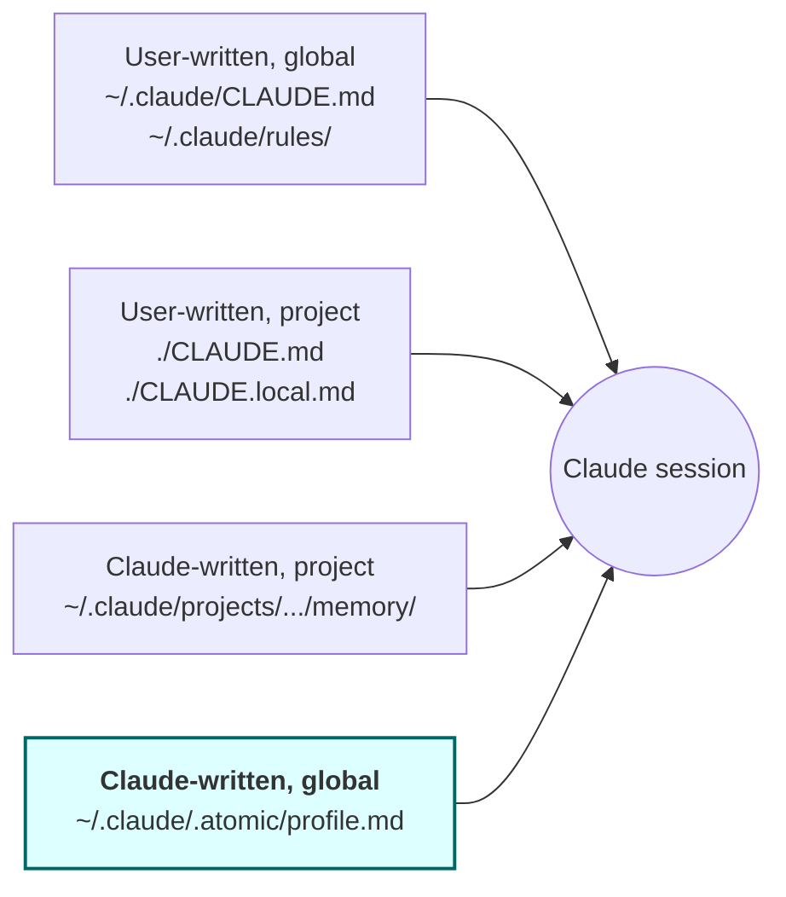
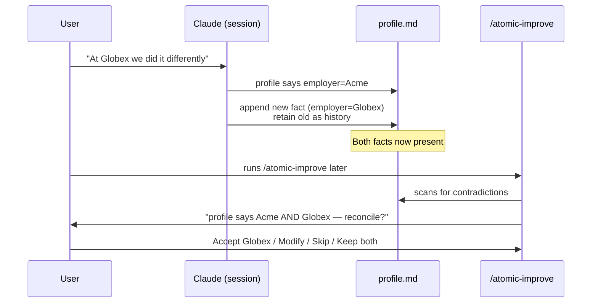

# User profile

A global, auto-updated identity file at `~/.claude/.atomic/profile.md`. Captures durable facts about the user (name, role, projects, interests, people) so Claude can draw on them across every session and every project — closing a real gap in Claude Code's current memory model.


## Problem

Claude Code's existing memory surfaces split cleanly into two halves: user-written content (`~/.claude/CLAUDE.md`, `~/.claude/rules/*.md`) is global but static; Claude-written content (auto memory) is dynamic but per-repo (`~/.claude/projects/<project>/memory/`).

There is no global tier of Claude-written memory.

The effect: a user introduces themselves in repo A — *"I'm Danilo, senior engineer at Acme, working on a side project for live-music gear"* — and Claude in repo B knows none of it the next morning. Personal facts that should anchor every interaction (name, role, communication preferences, active projects, hobbies, important relationships) live nowhere durable across projects. The user re-introduces themselves at the start of every new context, or accepts that Claude treats them as a stranger every session.

This is a structural gap, not a usage problem. The fix is a new surface, not better instructions.


## Goals

- Single global file holding curated identity facts about the user, available to every session.
- Claude updates the file opportunistically when a fact surfaces naturally in conversation.
- Drift between recorded facts and current reality is surfaced via `/atomic-improve` — not by interrupting work mid-conversation.
- Historical facts are preserved (old + new), not overwritten — useful for drawing parallels.
- Bootstrap at install captures the deterministic environment (git config, OS, hardware) so the file is non-empty on day one.
- Cleanly survives `atomic claude install/update/uninstall` — the file is user data, not bundle data.


## Non-goals

- Not a setup wizard. No interactive interview at install.
- Not a policy engine. Privacy is the user's responsibility; the file is not encrypted, not redacted, and not filtered for sensitive topics.
- Not a replacement for `~/.claude/CLAUDE.md`. CLAUDE.md is for instructions the user writes; profile is for facts Claude observes.
- Not a per-project file. Project-scoped preferences continue to use existing auto memory.
- Not a real-time enforcement mechanism. The file is context, not a hook.
- Not time-tracked. No `last_observed` columns, no review cadence, no expiry — the maintenance cost outweighs the value when event-driven drift detection already exists.


## Conceptual model

The four memory surfaces after this change:



The new tier (highlighted) is the missing quadrant.


## Routing rule (profile vs. auto memory)

Default behavior for facts Claude judges worth saving:

| Fact shape | Destination |
|---|---|
| Identity (name, location, languages) | profile |
| Profession (role, employer, team) | profile |
| Active projects (work + side) | profile |
| Hobbies, interests, taste | profile |
| Important relationships (coworkers, collaborators) | profile |
| Communication style preferences (terse, verbose, no emojis) | profile |
| Project-tinted commands ("for this repo, use pnpm not npm") | existing auto memory |
| Project-tinted conventions ("integration tests hit real DB here") | existing auto memory |
| Codebase-specific patterns | existing auto memory |

Rule of thumb: *if the fact would still be true in a different repo, it goes to profile.* Otherwise it stays in auto memory.

Claude needs an explicit instruction in `~/.claude/CLAUDE.md` for this — without it the default auto-memory path captures user-type facts in the wrong place.


## Drift handling

Event-driven, no time-based clock.



- Real-time: Claude appends new fact, never overwrites the old.
- Deferred: `/atomic-improve` introduces a new finding category — **profile drift** — that surfaces contradictions and asks the user per-finding.
- No periodic review. No staleness clock. If you stop mentioning a side project, it sits in the file silently — that's accepted.


## XML volatility tags

Sections carry tags signaling how often facts there tend to change. The tags don't drive cadence (no clock); they bias the drift-detection heuristic so Claude weights contradictions more aggressively in `<volatile>` sections than `<stable>` ones.

| Tag | Meaning | Example sections |
|---|---|---|
| `<stable>` | Rarely changes | Identity, Interests, Hobbies |
| `<volatile>` | Changes routinely | Work, Active projects, People |
| `<deterministic>` | Captured from env, not conversation | Environment |


## Schema (strawman, locked at this level of detail)

Plain markdown. Pre-defined sections. No timestamps.

```markdown
# User profile

## Identity
<stable>
- Name: ...
- Location: ...
- Native language: ...
</stable>

## Work
<volatile>
- Employer: ...
- Role: ...
- Team: ...
</volatile>

## Active projects
<volatile>
- ...
</volatile>

## Interests
<stable>
- ...
</stable>

## People mentioned
<volatile>
- Alice (coworker) — owns billing service
- ...
</volatile>

## Environment
<deterministic>
- Git user.name: ...
- Git user.email: ...
- OS: ...
- Arch: ...
- CPU count: ...
</deterministic>
```

Claude appends to existing sections; does not invent new section names. Old facts stay (history); new facts append below. The spec defines the exact append contract.


## Bootstrap

At `atomic claude install`, runs once:

1. Create `~/.claude/.atomic/profile.md` if absent (idempotent — same pattern as `ensureResolvedConfigStub`).
2. Populate `## Environment` section with deterministic env capture:
   - `git config --global user.name` / `user.email`
   - `runtime.GOOS`, `runtime.GOARCH`
   - `runtime.NumCPU()`
3. Add `@~/.claude/.atomic/profile.md` to the atomic-owned block of `~/.claude/CLAUDE.md` (alongside the existing config.resolved.md ref).
4. Add routing instruction to `~/.claude/CLAUDE.md`: *"Facts about the user personally go to `profile.md`. Project-tinted preferences continue to auto memory."*
5. Print one-line nudge: `Profile created at ~/.claude/.atomic/profile.md. Mention things about yourself naturally; Claude will fill it in. Run /atomic-improve to review drift.`

No interactive interview. No mid-conversation prompts.


## Approaches considered

| # | Approach | Pros | Cons |
|---|---|---|---|
| A | New file at `~/.claude/.atomic/profile.md`, install-generated stub, opportunistic write, `/atomic-improve` review (this design) | Mirrors existing `config.resolved.md` pattern; no bundle changes; clean uninstall story; routing rule is one CLAUDE.md edit | Requires teaching Claude a new write target via CLAUDE.md instruction |
| B | Bundle a template `profile.md` shipped with the binary, modified per-user | Discoverable from the bundle; consistent shape across users | Wrong tool: bundle artifacts are *read-only contracts that update*. User content overlaid on a bundled file fights `atomic claude update`. Maintenance nightmare. |
| C | Use `~/.claude/CLAUDE.md` directly for user-written profile content | Zero new surfaces; existing global file | Defeats the "Claude writes opportunistically" requirement — CLAUDE.md is a user-written contract, not an append target Claude should mutate. Mixes voices and breaks the install/update boundary. |
| D | Patch Claude Code itself: add a global tier to auto memory | Fixes the gap at the root | Out of our control. Belongs upstream. |
| E | First-session interactive interview ("What's your name? Where do you work?") to bootstrap | Rich content day one | Hostile UX — first contact becomes a wizard. Forced answers are worse than observed facts. |


## Recommendation

**Approach A.** Strong precedent in `config.resolved.md`: install-time idempotent stub under `~/.claude/.atomic/`, @-ref'd from `~/.claude/CLAUDE.md`, never bundled, never overwritten on update. Uninstall must explicitly preserve it (user data).

Confidence: high. The pattern is proven; the gap it fills is real; the maintenance cost is low because there is no clock and no schema validator.


## Open questions

- **Bootstrap nudge surface.** One-line stdout message after install vs. logged-only. Stdout is more discoverable but adds noise to the install transcript. Default to stdout, accept that it adds one line.
- **Doctor integration.** Should `atomic doctor` check that `profile.md` exists and is @-ref'd, parallel to the signals-ref check? Probably yes — keeps the wiring honest — but the spec should call this out so the doctor check gets added explicitly.
- **CLAUDE.md routing instruction wording.** The exact prose Claude sees that tells it "personal facts go to profile, not project memory" is load-bearing. The spec should include the verbatim text, not a paraphrase — that's the actual contract.
- **`/atomic-improve` finding format.** Strawman is `[profile drift] "<old fact>" — flagged stale. You mentioned "<new fact>" in N sessions. [Accept new / Modify / Skip / Keep both]`. Worth confirming the exact prompt during spec authoring.


## Change log

<!-- Populated on first amendment after the spec is approved. -->
