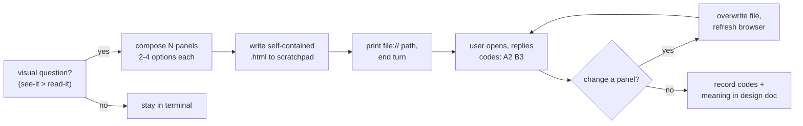

# Visual options for planning

## Problem

Some planning decisions are visual: layout, color, spacing, visual hierarchy, wireframe
structure, diagram shape. Describing them in prose or paginating an `AskUserQuestion` widget
loses fidelity — the user cannot compare what they cannot see. The terminal renders text and
tables well and renders a two-column layout comparison or a color palette not at all. Planning
needs a way to put 2-4 visual variants in front of the user, side by side, and capture which
they picked, without standing up infrastructure for what is a throwaway decision aid.

## Goals / Non-goals

- Goals:
  - Render 2-4 visual options per decision dimension in a browser, during planning.
  - Capture the pick as short typed codes in the terminal (`A2 B3`), not browser clicks.
  - Zero runtime infrastructure: one self-contained HTML file, opened by the user.
  - Throwaway artifact; the durable record is the chosen codes, written into the design doc.
- Non-goals:
  - No server, websocket, live reload, click capture, telemetry, or auth.
  - Not for conceptual or text choices — those stay in the terminal.
  - Not a committed asset; the HTML is disposable scratch.
  - No `atomic` binary subcommand and no Go code — the model authors the HTML directly.

## The panel / code model

A **panel** is one decision dimension (Layout, Color, Nav). Within a panel sit 2-4 **options**,
each labelled with the panel letter plus an option number: `A1 A2 A3`. One HTML file stacks N
panels. The user opens it, eyeballs the variants, and replies with one code per panel:

```
A2 B3 C1
```

The browser renders the visual; the choice stays in the terminal. This is the plain-text indexed
selection of axiom 4 — a typed code line beats a multi-select widget for a grid of variants, and
it sidesteps any need to capture clicks (which is the only reason a server would be required).

## The gate (just-in-time, see-it-over-read-it)

Offer visuals only when a question is genuinely visual — a real mockup, layout, palette, or
diagram comparison. The test: *would the user understand this better seeing it than reading it?*
A question that is merely *about* a UI topic is not automatically visual: "what should the wizard
do?" is conceptual (terminal); "which of these wizard layouts works?" is visual (browser).
Decide per question, not per session.

## Approaches

| # | Approach | Pros | Cons |
|---|----------|------|------|
| A | Static self-contained HTML in scratchpad + terminal code selection | Lowest effort; readable anywhere a browser exists; fewest tokens; naturally throwaway; choice stays in terminal | Iteration is overwrite-and-refresh, not live |
| B | Local server rendering live screens with click capture | Live reload; structured click events | Server lifecycle, ports, auth, websocket protocol, telemetry — heavy infrastructure for a planning aid |
| C | Markdown / ASCII mockups in the terminal | No new artifact at all | Cannot render visual fidelity: CSS layout, color swatches, real wireframes |
| D | `AskUserQuestion` preview field | Native, no file | Capped at 4 options; monospace preview only; no true visual rendering; no multi-dimension grid |

## Recommendation

Approach A. The decision aid is throwaway, so it should cost almost nothing to produce and leave
no runtime behind. A single HTML file with inline styles renders anywhere, the user opens it with
their own browser, and the pick comes back as a typed code line. Live iteration is unnecessary:
overwriting the same file and a browser refresh covers it. The choice mechanism (typed codes)
removes the only thing that would justify a server — capturing interactions — so the server,
ports, auth, and event protocol all fall away.

The loop:



## Artifact lifecycle

The HTML lives in the gitignored scratchpad (`.claude/.scratchpad/<date>-<topic>/`) and is
disposable. Nothing about the mockup is committed. What persists is the decision: the chosen codes
and what each meant, written into `docs/design/<topic>.md` when the skill runs inside a plan. A
reader of the design doc sees "chose A2 (two-column) and B3 (high-contrast palette)" — not a dead
link to a file that was cleaned up.

## Integration

The capability is a skill (`atomic-visual-options`) so it auto-fires on natural phrasing ("show me
a few options", "mock up some variants", "let me see this side by side") per axiom 5, and is also
invoked by `/atomic-plan` just-in-time when a design question turns out to be visual. Skills are
the how, commands are the when: `/atomic-plan` supplies the moment, the skill supplies the
rendering and selection rules.

## Open questions

None material. Defaults: print a `file://` path rather than auto-opening a browser; no client-side
JavaScript in the generated file (the selection happens in the terminal, so the page is pure
display); honor `prefers-color-scheme` for light/dark.
