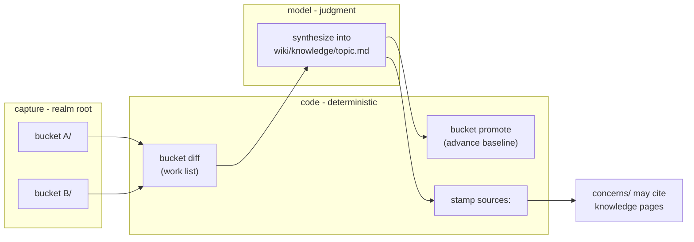

# Wiki capture buckets

## Problem

Realms accumulate working knowledge outside their member repos: research notes, raw dumps (exports, transcripts, PDFs), business-facing work items. Today this is hand-managed per realm — ad-hoc folders, a per-workspace fingerprint script (bun/zx), conventions re-explained in a prompt document every time a new realm adopts the pattern. The synthesis pipeline (capture → distill into `wiki/knowledge/`) exists conceptually (`docs/guides/knowledge-base.md`) but has no tooling: every adopter reinstalls a runtime, copies a script, and hopes the conventions hold.

The wiki feature already solves the identical problem for *repos*: code computes what changed (`scan`/`stale`/`stamp`), the model decides what it means. Buckets are the same contract applied to non-repo content, keyed on SHA-256 manifests because capture folders have no git HEAD.

## Goals / Non-goals

- Goals:
  - Zero-dependency bucket tooling: `atomic wiki bucket add | list | diff | promote` (Go, ports the fingerprint script's semantics exactly).
  - Buckets carry **no semantics in code** — a bucket is a registered folder with a manifest; its meaning lives in its own `index.md` conventions block, which synthesis reads as context.
  - One staleness surface: `atomic wiki stale` reports bucket pending work alongside repo/concern staleness.
  - `/refresh-wiki` offers bucket creation once per realm and runs bucket synthesis as a phase.
  - Knowledge pages get the same fingerprint-based staleness story as repo summaries (`sources:` frontmatter, code-stamped).
- Non-goals:
  - The wiki/wiki scan refuse guard — independent fix, ships separately before this work.
  - Auto-retraction of knowledge when a source file is removed (v1 reports `removed`; human/model decides).
  - Per-bucket slash commands (`/wiki-from-research` etc.) — synthesis is one generic phase.
  - Hardcoded bucket names or per-name behavior (`research`/`raw`/`tickets` are prompt examples only).
  - Any relationship to `atomic followups` — buckets are arbitrary user folders; no shared tooling or taxonomy.
  - Versioning capture content itself — buckets are working material; only the wiki repo is versioned.

## Concepts

| Concept | Definition |
|---------|-----------|
| Bucket | User-named folder at the **realm root** (sibling of `wiki/`). Registered, fingerprinted, synthesized. Never nested inside `wiki/`. |
| Manifest | SHA-256 snapshot of bucket content files: `current` / `baseline` / `previous`. Lives at `wiki/.buckets/<name>/` — baseline is "what the wiki has consumed", i.e. wiki-side state, versioned with the wiki repo. |
| Two-phase contract | `diff` = read-only work list (current vs baseline: new/changed/removed). `promote` = rotate baseline→previous, current→baseline — run only after successful synthesis. Re-running `diff` without `promote` never loses the work list. |
| Registry | Machine: managed `<wiki-buckets>` block in `wiki/index.md` (code-owned, spliced like `<wiki-scan>`). Narrative: `## Capture surfaces` section in realm `CLAUDE.md` — created with the file if `CLAUDE.md` is absent, appended (existing content preserved) if present, written on first `bucket add` (the upward CLAUDE.md walk makes it visible to member-repo sessions too). Code writes the structure with purpose placeholders; the `/refresh-wiki` offer flow prompts the model to fill in what each bucket is for. |
| Bucket index | `<bucket>/index.md` — purpose line + `## Conventions` block the user fills. Load-bearing: the only place a bucket's meaning exists; synthesis reads it as context. No status column — status is implied by the manifest diff. |
| Knowledge page | `wiki/knowledge/<topic>.md` — **topic-keyed**, not bucket-keyed. Multiple buckets' files about the same topic merge into one page. Provenance lives in `sources:` frontmatter (`<bucket>/<file>@<sha256>`), stamped by code from the manifest. |
| Citation DAG | capture → knowledge → concerns. Concerns may cite `knowledge/<topic>.md@<sha256>` (new resolver id type) but **never bucket files directly** — one synthesis boundary, one staleness path per fact. |

## Business rules

- Code computes/writes/compares every fingerprint; the model only declares *which* sources/citations apply. Same axiom as `atomic wiki stamp` today.
- Baseline advances only on `promote` after successful synthesis. A failed or aborted synthesis leaves the work list intact.
- Manifest content files exclude infrastructure: the bucket's `index.md` and OS junk. Manifests are never hand-edited.
- Bucket names are user-defined; the only reserved name collision is `wiki` itself.
- The bucket-creation offer fires once: `/refresh-wiki` on a realm with no `<wiki-buckets>` block prompts (with `research`/`raw`/`tickets` as examples); a decline is recorded in the block so the offer never re-nags. `atomic wiki bucket add` works any time after.
- Code writes structure, the model writes meaning: `bucket add` stubs the `CLAUDE.md` section and bucket `index.md` with purpose placeholders; the `/refresh-wiki` offer flow prompts the model (asking the user where needed) to describe what each bucket is for in both places. Unfilled placeholders surface in the disposition output.
- `removed` files are reported in the diff and surfaced during synthesis; nothing is auto-deleted from `wiki/knowledge/`.
- Phase order inside `/refresh-wiki` is upstream-before-downstream: repo summaries → bucket synthesis (knowledge) → concern staleness recheck against fresh hashes → concern re-author → stamp-as-written → linkify. The DAG guarantees one pass converges; no fixpoint loop.
- Bucket synthesis is dispatched to `atomic-signals-inferrer` in a new bucket-synthesis mode — fresh context per bucket (raw dumps can be large), consistent with repo summaries in wiki mode.

## Approaches

| # | Approach | Pros | Cons |
|---|----------|------|------|
| A | Status quo: per-workspace zx script + prompt doc | No atomic changes | Runtime dep (bun/zx) per realm; manual setup; conventions drift; script copies fork |
| B | Go verbs (`atomic wiki bucket …`) + inferrer synthesis phase in `/refresh-wiki` | Zero deps; one staleness surface; reuses stamp/stale/registry patterns verbatim; semantics stay user-side | New verb family + agent mode to maintain |
| C | Per-bucket slash commands (`/wiki-from-research` …) | Mirrors original setup | Hardcodes bucket semantics into artifacts; N commands for N buckets; contradicts "no semantics in code" |
| D | Bucket-keyed output (`knowledge/<bucket>/`) | Trivial provenance | Defeats synthesis — same topic split across buckets never merges; wiki becomes a mirror of capture |

## Recommendation

**B**, with topic-keyed knowledge output (rejecting D) and provenance via `sources:` frontmatter. Evidence: the repo-side machinery this extends already exists and is tested — `StampConcern`/`resolveFingerprint` (`atomic/internal/wiki/stamp.go:44-56`) needs one new id type; `<wiki-scan>`/`## Members` splicing (`atomic/internal/wiki/wiki.go`) is the registry pattern to copy; `atomic wiki stale` already walks `reflects:` lists and recomputes fingerprints live. The fingerprint script's semantics (two-phase promote, previous-rotation, ignore set) are proven in two live realms and port 1:1 to Go.

Manifest location decision: `wiki/.buckets/<name>/` over `<bucket>/.fingerprints/` — the baseline answers "what has the wiki consumed", which is wiki state; storing it in the wiki repo makes the wiki self-describing (clone it, know exactly what it reflects) and keeps capture folders pure content. Supersedes the reference doc's layout; existing realms migrate by moving manifests once.

## Open questions

- Binary files in buckets (PDFs, images): hashed like any file, but synthesis cannot read them — v1 relies on the user describing them in the bucket `index.md`. A future `bucket describe` helper or OCR pass is out of scope.
