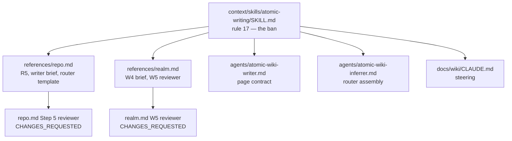

# Wiki pages record facts, not measurements

## The problem

`docs/wiki/index.md` carried a `## Language breakdown` table of LOC, file counts, and percentages copied out of `docs/wiki/scan.md`. Domain pages carried sibling counts: "19 verbs", "14 checks", "23 route resolvers", "eleven domains".

Two costs, both observed:

- **Merge conflicts across parallel PRs.** Every branch that touches code regenerates different numbers. PRs #274, #275 and #276 each conflicted on `docs/wiki/index.md` and `docs/wiki/scan.md`, and each had to be hand-resolved. The numbers were the conflict: two branches adding unrelated Go files produce two different LOC totals on the same table row.
- **Context spent on nothing actionable.** `docs/wiki/index.md` is `@`-ref'd into every session, so the table was paid for on every turn. A session cannot act on "Go 193302 LOC, 60%", and the figure is wrong as soon as anything lands.

A count also rots quietly. `docs/wiki/bundle.md` said the YAGNI ladder carried "the same seven steps verbatim" while the ladder in `context/CLAUDE.md` had nine. Nothing failed when the ladder grew, because nothing checks a count.

## The rule

A wiki page contains no count of things in the repo. No LOC totals, file counts, percentages, or language tables, and no count of verbs, artifacts, domains, checks, resolvers, steps, lenses, icons, registry entries, tests, or sections. It records structure, responsibilities, contracts, constraints, coupling, and citations to real paths instead.

Two kinds of number survive, and neither is a count:

| Kind | Examples |
|---|---|
| An identifier naming one numbered thing | `Check 9`, `category 14`, `Zone 1`, `Shape 2`, `exit 2`, `R1-R8`, `pass A` |
| A version, documented limit, or contract value | `Go 1.25`, a pinned dependency, `30 days`, `50 results`, `5 iterations`, `3 to 6 lenses`, a `500`-file gate, a `16 MiB` buffer, a port |

Out of scope: `docs/wiki/scan.md` is deterministic output from `atomic signals scan`, and statistics are its job. The `<scan-sha>` stamp on the router stays. Also out of scope: the page contract inside `context/skills/atomic-wiki/references/*.md` and `context/agents/*.md`, which states section counts inside prohibitions. Those are artifacts, not wiki pages.

## Where the rule is stated

Stated once, in the voice skill both wiki pipelines and the writer agent already load; enforced as a mechanical check at each point that can stop a page.

The reviewer is the part that matters. `atomic-wiki-inferrer` writes the router itself and dispatches `atomic-wiki-writer` per domain; both run in fresh context, so a rule only the writer sees is a rule that holds until the next model re-derives "be specific, quantify" from rule 12 of the voice skill. Issues #269 and #271 are the same shape: a wiki rule nobody checks is a wiki rule that fails.

## Approaches weighed

### Deterministic strip in Go

Post-process every written page and delete any row or sentence matching a statistics pattern.

Rejected. `500 files`, `64 KiB`, `Go 1.25` and `19 verbs` are the same token shape and different answers, so a regex either misses the counts in prose or eats the contract values. A silent strip is also worse than a stale number, because the page loses a fact nobody can see it lost. The ban is mechanical for a reader; it is not mechanical for a matcher.

### Rule stated only in the writer agent

Rejected. The inferrer assembles `docs/wiki/index.md` at Step 7 without dispatching a writer, so the router, the file that actually conflicted, would keep its table.

### A test the writer applies to each number

Rejected, after being built and reviewed. The rule asked "would this number go stale from a commit that does not change the fact it illustrates?", with a perishable and a durable example set.

It is permissive by construction. Any number can be argued into the keep case, because any number illustrates something, and the writer pays reasoning tokens on each one. The build demonstrated it on itself: three sweeps missed eight counts, and the implementer and the auditor reached opposite conclusions on a ninth. A rule that produces two answers from two careful readers is not a rule.

### A flat prohibition, checked mechanically

Chosen. A wiki page never counts things in the repo. No test to run, nothing to adjudicate, and the rule is shorter than the test it replaces, which matters because it loads on every turn.

The carve-out is stated as a boundary rather than a second test: a version and a documented contract value are not counts. An identifier that happens to contain a digit (`Check 9`, `Zone 1`) names a thing rather than a quantity, so it was never in scope.

The reviewer check is the same shape. It does not ask whether a number is perishable; a count of repo things is `CHANGES_REQUESTED`, full stop.

## Live instance

The rule is inert while the repo's own wiki breaks it, so the same change removes `## Language breakdown` from `docs/wiki/index.md` and sweeps the counts out of the domain pages. `docs/wiki/CLAUDE.md` permits a hand edit to correct a factual error, and this change rewrites the page contract in the same commit.

The acceptance test is the cost it was meant to remove: two branches that each add Go code no longer produce a conflicting hunk in `docs/wiki/index.md`.
