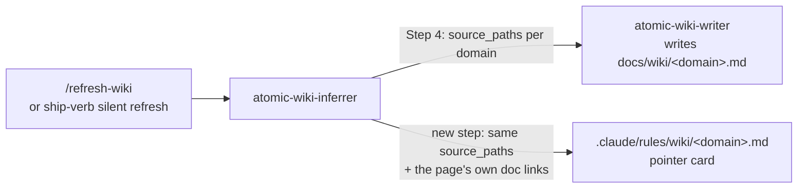
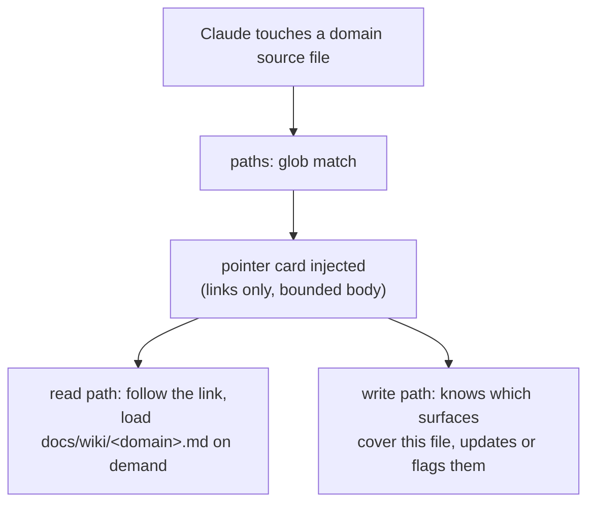

# Wiki pointer rules


## Problem


Documentation drift has one structural cause: the only moments that remind Claude to update docs are inside `/subagent-implementation` and the ship verbs. Any session that edits code outside those flows, a quick ad-hoc fix, a debugging session, a subagent with a narrow brief, ships changes with no signal that a documentation surface covers the touched file. The same gap exists in the read direction: nothing tells Claude, when it opens a source file, that a wiki domain page, a spec, or a reference doc already explains that area. The docs exist; the bridge from code file to doc file does not.

The wiki pipeline already computes the missing link. When `atomic-wiki-inferrer` classifies domains, it hands each `atomic-wiki-writer` dispatch the domain's `source_paths` set, and the finished domain page curates the related docs in its own body. That mapping is discarded after each refresh instead of being turned into something the harness can act on.

Claude Code's path-scoped rules are the delivery mechanism. A rule file under `.claude/rules/` with `paths:` frontmatter globs injects its body whenever Claude touches a matching file, in the main session and in subagents. The design: have the wiki pipeline emit one small pointer rule per domain, so the domain map is always one hop away from any file in the domain.

A caption for each flow below; first, generation.



Then runtime, where the card pays off.




## Goals / Non-goals


- Goals:
    - Touching any file in a wiki domain injects a pointer card naming the domain page and its related docs, in every session type, subagents included.
    - The card carries an explicit update nudge covering both drift classes: behavior changes stale the listed pages, and renames or removals stale mentions beyond them (the cross-doc grep is part of the nudge).
    - Cards regenerate with the pages on every wiki refresh, full or incremental, interactive and silent, and stale cards for removed domains are deleted.
    - Card bodies are pointers only, never wiki content, with a hard line budget.
- Non-goals:
    - Realm-scope wikis. Version one targets the repo-scope pipeline (`references/repo.md`) only.
    - Go-side generation or a persisted machine-readable domain classification. The classification stays model-side where it lives today.
    - Doctor validation of rule files between refreshes. A follow-up entry covers extending the signals doctor check.
    - Auto-loading wiki page content. The card links; the reader follows.


## Approaches


| # | Approach | Pros | Cons |
|---|----------|------|------|
| A | Inferrer emits cards as a new pipeline step | Data already in hand at Step 4; zero Go; the domain page itself is the relevance source for links | Agent-authored globs unvalidated between refreshes |
| B | Deterministic Go generator (`atomic wiki rules`) | Rendering and validation in code | Requires inventing a persisted machine-readable classification just to render ten-line files; classification is model-side anyway |
| C | Hybrid: agent stamps `paths` frontmatter on wiki pages, Go renders cards from it | Regeneration deterministic once stamped | Two-phase coupling; still trusts agent-written input; new frontmatter contract on every domain page |
| D | Single catch-all rule pointing at `docs/wiki/index.md` | One file, trivial to emit | No per-domain links, so the nudge is generic and the read path costs an extra hop through the router |


## Recommendation


Approach A. Evidence:

- The domain-to-path-set mapping already exists at dispatch time: Step 4 of the repo pipeline passes `source_paths` per domain to each writer (`context/skills/atomic-wiki/references/repo.md:60-81`). Emitting a card is a second, smaller consumer of the same data.
- Link relevance needs no second judgment pass: each domain page already curates its related docs in its `## Where it lives` table and `## Coupling` section (`docs/wiki/signals.md:67-100`, `docs/wiki/bundle.md:130-150`). The card's index links are drawn from the page's own links, bounded by the body budget.
- The delivery mechanism is proven and documented: `.claude/rules/authoring/*.md` uses the same `paths:` frontmatter shape in this repo, and official Claude Code docs confirm path-scoped rules "trigger when Claude reads files matching the pattern", load in subagents by default, and inject per read event (code.claude.com/docs/en/memory, path-specific rules). Both halves of the feature, read-time awareness and write-time nudge, ride a documented trigger.
- Zero Go changes keeps version one shippable as markdown-artifact edits only. `atomic repo init` never ignores `.claude/rules/` (`atomic/internal/repoinit/repoinit.go:48-116` guarantees scratchpad, index, worktrees, tmp only), so in most user repos the cards commit naturally. Repos that hand-ignore `/rules/*`, this one included (`.claude/.gitignore:12`), are handled by a `git check-ignore` probe plus an appended negation pair in both modes, named in the interactive report and staged mechanically by the ship gate. Additive idempotent edits of this kind are already in the pipeline's spirit (Step 8c bootstraps `CLAUDE.md`).

Approach B and C both fail the YAGNI ladder at rung one: nothing needs the classification to persist outside the refresh that uses it. D was rejected because the per-domain links are the feature; the generic form is barely better than the `@`-ref'd router that already loads every session.


## Rule card contract


One file per domain: `.claude/rules/wiki/<domain>.md`, wholly owned by the pipeline. Hand edits are lost on the next refresh, and the card says so. Shape:

```markdown
---
# generated by /refresh-wiki — do not hand-edit; regenerated every refresh
paths: ["atomic/internal/signals/**", "context/agents/atomic-wiki-inferrer.md"]
---

Domain: signals. Scan, infer, and wire the project context Claude loads each session.

- Map: docs/wiki/signals.md
- Contracts: docs/spec/signals-workflow.md, docs/spec/signals-refresh-timing.md
- Reference: docs/reference/repo-wiki.md

Consult the map before changing behavior here. Behavior changes stale the pages above. Renames or removals stale mentions beyond them: grep the old name across docs/ before shipping.
```

Rules that keep the card honest and cheap:

- Glob derivation and the three-rung tie-break ladder: see `docs/spec/wiki-pointer-rules.md`'s matching success criterion for the contract text. Disjointness matters because `paths:` has no negation syntax: an overlapping partition would inject two cards for one touched file, so exclusivity has to be won at partition time, not filtered after. Rung 1 (Start-here directory prefix) goes first because it is the only mechanical tie-break, deciding every file already under a domain's own Start-here tree without judgment; rungs 2 and 3 exist only for the harder cross-cutting files that rung 1 can't place.
- The pointer index is typed by doc-surface family, one line per non-empty category. `Map:` is the domain wiki page — exactly one, by construction: the pipeline writes one page per domain. Every other category is multi-valued, comma-separated on its line: `Contracts:` (`docs/spec/`), `Reference:` (`docs/reference/`), `Guides:` (`docs/guides/`), `Research:` (`docs/research/`), `Design:` (`docs/design/`), and `Related:` as the catch-all for a linked doc outside those families. Category assignment is mechanical, by path family.
- Link candidates come from two sources: the docs the domain page itself links to, and doc surfaces the project's CLAUDE.md couples to the domain — a wiring rule or contract citation that names a `docs/` file for that domain's flow. Every linked path is checked to exist on disk at emission time; a missing target is dropped, not shipped.
- The generated marker is a YAML comment inside the frontmatter block, never a body comment. The body is injected into context on every matching read, and the harness strips frontmatter from injection (observed: injected rules arrive body-only) — so provenance rides the file, not the prompt.
- Body budget: twelve lines maximum after frontmatter, blank lines included, which caps the index at what a signpost carries. A domain whose surfaces would overflow the budget points at the Map page, which remains the exhaustive hub.
- The one-line domain description is the same sentence the router table carries, so the card and `docs/wiki/index.md` cannot disagree.
- Every body line is deterministic text: the description verbatim from the router, the closing line as the fixed literal in the shape above, links sorted by path within each category. A refresh that changes nothing in a domain rewrites a byte-identical card, so ship commits carry no wording churn.


## Lifecycle


- Emission runs as a new repo-pipeline step after index assembly (Step 7 in `references/repo.md`), when every page and its links are final. If `.claude/rules/wiki/` is absent or holds no cards, that is a bootstrap run: the step first runs Step 3's domain partition for every domain in the router table (classification only, no writer dispatch) so each domain has a `<source_paths>` block to derive globs from, then emits every domain's card regardless of scope; the Start-here fallback is not an option, so a repo whose wiki predates pointer cards doesn't get stranded with a partial or under-scoped set from its next incremental run. Otherwise (cards already exist), cards follow the same scope as pages: a full refresh rewrites every card; an incremental refresh rewrites only the cards of the domains it re-dispatched, because those are the only domains whose `source_paths` it recomputed this run, so a non-re-dispatched domain's card is left untouched, its persisted `paths:` standing until that domain's next re-dispatch. In every case, the step deletes any card whose domain is absent from the current router table.
- Before writing, the step probes `git check-ignore -v` on the target dir. If ignored, it appends a negation pair (`!/rules/wiki/`, `!/rules/wiki/**`) to the ignore file that produced the match. The interactive Step 9 report names the edit; silent mode stays silent, as the pipeline already requires.
- The `signals-gate` partial, and the finalize-time staging in `/subagent-implementation` and `/autopilot`, all stage `.claude/rules/wiki/` alongside `docs/wiki/*.md` after a refresh, so every commit that carries domain page changes carries the cards too. Each also stages any ignore file the refresh modified, found mechanically (`git status --short -- .gitignore .claude/.gitignore`) rather than reported by the inferrer, since silent mode returns nothing. A refresh that appends a negation pair must not leave that edit as an unstaged diff after any of the three staging points runs.
- `atomic-wiki-inferrer`'s scoped-writes contract widens from "the active wiki root and the `@`-ref target" to also include `.claude/rules/wiki/` and the negation append. The agent description and the reference pipeline state the widened scope in the same words.
- A repo with no wiki gets no cards: the step is part of the wiki pipeline and never runs standalone.
- During a refresh, writer subagents reading domain source files receive the previous refresh's cards. Harmless: the cards point at the pages the writers are rewriting.


## Open questions


- None.
