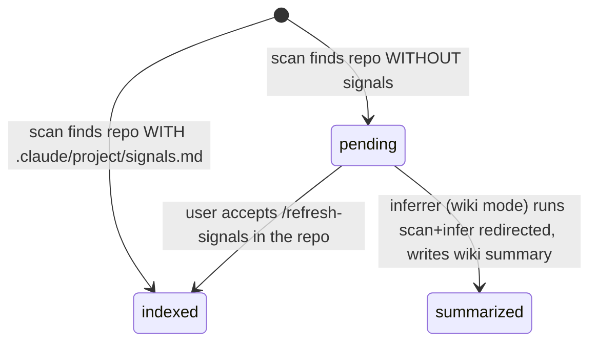
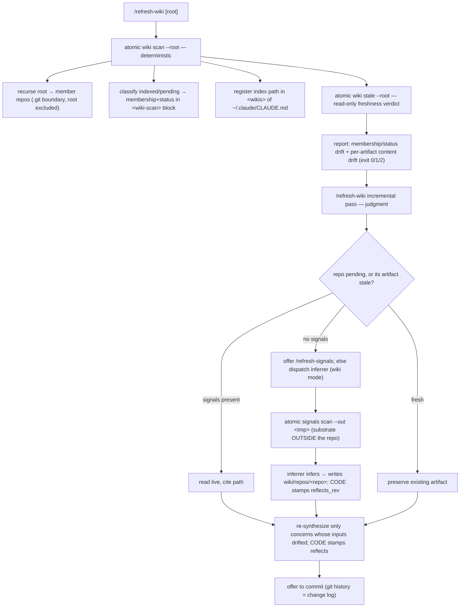
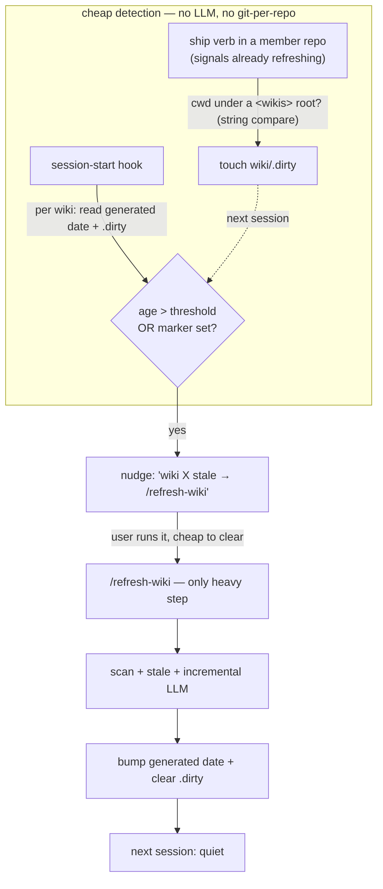

# Project wikis


## Problem


Atomic signals describe **one repo's internals**. Nothing describes **how repos relate** within a realm of work. A developer with a folder of microservices (or a set of OSS libs, or client projects) has no durable, machine-and-human-readable map of the cross-cutting concerns between them: shared libraries, dependency edges, duplicated patterns, contracts one repo owns and another consumes.

The knowledge exists only in the developer's head. A fresh Claude session rediscovers it every time, repo by repo, with no orientation to the realm as a whole.


## Goal / Non-goals


**Goal.** A `wiki` is a portable, git-initialized knowledge base for one **realm** of cross-repo concerns. Two deterministic CLI verbs (`atomic wiki scan`, `atomic wiki stale`) scaffold it, scan its root for repos, record which have signals, register the wiki globally, and report staleness. `/refresh-wiki` drives the LLM pass: it summarizes no-signals repos (reusing the signals explorer, with output **redirected** into the wiki so the source repo is never touched), synthesizes cross-cutting concerns, and refreshes **incrementally**. A cheap session-start nudge plus a ship-time drift marker keep the wiki from rotting unnoticed.

**Non-goals.**

- Not a replacement for signals. Signals stay repo-local and authoritative; the wiki points at them, never copies them.
- Not a dependency graph generator. Cross-cutting concerns are LLM-curated prose with cited evidence, not a parsed import graph.
- Not a CLI "membership" system. Cross-realm links are LLM-curated via the `<wikis>` registry.
- Not a new agent. The no-signals explorer is the existing `atomic-signals-inferrer` in a wiki-output mode.
- Out of scope: monorepo sub-packages (a repo is a `.git` boundary); `--full` self-containment (summarizing `indexed` repos too); auto-committing the wiki.


## Concept


| Term | Meaning |
|------|---------|
| **wiki** | A knowledge base for one realm. Lives at `<root>/wiki/`. Its own git repo. |
| **root** | A folder that *contains* repositories. The wiki's scan scope. The root is never itself a member. |
| **repo** | A member: a directory with a `.git` entry, found by recursing the root. Recursion stops at the repo boundary. |
| **realm** | The scope a wiki covers (client / OSS / personal). One wiki per realm; 3-5 per machine is typical. |

Mental model: **signals = one repo's internals; a wiki = how a realm's repos relate.** The CLI/command parallel is exact:

| Deterministic CLI | called by | LLM command |
|---|---|---|
| `atomic signals scan` | → | `/refresh-signals` |
| `atomic wiki scan` / `atomic wiki stale` | → | `/refresh-wiki` |


### Repo knowledge states


"No signals" is not a defect — it is a fork between repo-owned and wiki-owned knowledge. Some repos (OSS especially) should never carry committed signals; the wiki summarizes them instead, never touching the repo.



| State | Knowledge source |
|-------|------------------|
| `indexed` | repo has `.claude/project/signals.md` → read live, cite the path — never copied |
| `summarized` | no in-repo signals → `wiki/repos/<repo>(/<domain>).md`, written by the inferrer in wiki mode |
| `pending` | no signals, not yet summarized (fresh scan) → the refresh pass resolves it |


## Code / model split




The model never does deterministic work: not the scan, not staleness, **and not the fingerprints**. The inferrer authors prose; a code step computes `git rev-parse HEAD` and writes `reflects_rev`.


## Wiki layout


```
<root>/wiki/
├── index.md      # managed <wiki-scan> block (CLI-owned) + narrative zone (LLM-owned)
├── README.md     # CLI-written
├── .gitignore    # ignores the transient .dirty marker
├── repos/        # wiki-level summaries — ONLY for no-signals repos
│   ├── billing.md            # frontmatter: reflects_rev (code-stamped)
│   └── gateway/<domain>.md    # large repo: domain-split
└── concerns/     # LLM-curated cross-cutting docs
    └── shared-auth.md        # frontmatter: reflects: [acme-api@<sig-hash>, billing@<sha>]
```

No in-file change log — the wiki repo's git history is the change log.


## Staleness


Detection is **deterministic**; only re-judging a flagged concern needs the model. Fingerprints live in two stores, split on the code/model line — because the deterministic scan rewrites its block to *now* every run, so the block can't preserve "what an artifact was built from."

| Store | Owner | Holds | Answers |
|-------|-------|-------|---------|
| `<wiki-scan>` block in `index.md` | CLI (`atomic wiki scan`) | membership + status | "did the set of repos / their signals presence drift?" |
| artifact frontmatter (`reflects_*`) | **code**, at author time | the fingerprint each summary/concern was built from | "is this artifact stale?" |

`reflects_*` is written by a deterministic step (`git rev-parse HEAD` for code summaries; `signals.md` content hash for `indexed`-repo references) — **never by the model**, so `atomic wiki stale` is trustworthy. `atomic wiki stale` is read-only, exits `0` fresh / `1` stale / `2` error. A missing/unparseable `reflects_*` counts as stale (fail-safe).


## Forcing function


A wiki is out-of-band from any single repo's lifecycle, so it can't self-heal the way signals do (ship verbs re-run the inferrer in-repo). Instead: two **cheap** detectors feed one nudge; the single heavy step (`/refresh-wiki`) clears both. The hook detects *neglect*, the ship boundary detects *drift* — neither spawns git or re-runs deterministic signals.



- **Neglect (hook).** Session start reads, per registered wiki, the scan block's `generated` date and the `.dirty` marker — stats only, zero git. Nudges if age exceeds a tunable threshold (default in memory, axiom 2) **or** the marker is set. Mirrors how the session-start hook already injects reminders / refreshes the profile.
- **Drift (ship boundary).** A ship verb in a member repo already touched source. One path-prefix check (cwd under a registered `<wikis>` root — string compare, no git) → `touch wiki/.dirty`. Converts "it's been a while" into "real changes pending." This is the layer that actually fights rot.
- **Heal.** `/refresh-wiki` is the only place git-per-repo and the LLM run. On *full* completion (scan + stale + LLM all succeed) it bumps `generated` and clears `.dirty`; a partial/aborted run leaves the marker set, so the nudge self-clears only when the work actually finished. Acting on the nudge is cheap when nothing drifted (a near no-op), which is what keeps it from becoming banner blindness.
- **Honest baseline.** The wiki is nudge-driven, not guaranteed-fresh. Stated in the docs.


## Refresh + change log


`/refresh-wiki` is the single idempotent entry point (init == refresh), parallel to `/refresh-signals`. Re-runs update only what drifted. The wiki is its own git repo, so its git history is the change log — the command ends by offering to commit (message via `atomic-commit`). Committing is offered, not automatic.


## Approaches


| # | Decision | Chosen | Rejected + why |
|---|----------|--------|----------------|
| 1 | Registry location | `<wikis>` block in `~/.claude/CLAUDE.md` | `config.toml` (LLM can't see it in-session); a new `@-ref`'d file (context bloat). |
| 2 | No-signals explorer | reuse `atomic-signals-inferrer` in wiki mode, fed by `atomic signals scan --out` (substrate redirected outside the repo), output written into the wiki, @-ref wiring skipped | New agent — rejected: extra artifact that drifts from the explorer it duplicates. Write-into-repo-then-move-and-clean — rejected: leaks on crash, risks deleting pre-existing `.claude/`, must revert a CLAUDE.md edit. Redirecting the output removes the whole class of risk. |
| 3 | index.md structure | two-zone single file (`<wiki-scan>` block + narrative) | split sidecar — rejected: user wants the block inside `index.md`. |
| 4 | Concern synthesis | `/refresh-wiki` orchestrator; per-repo summaries by the inferrer | in-agent synthesis — rejected: needs all repos together. |
| 5 | Cross-realm refs | LLM-curated, evidence-cited, linked via the registry | CLI membership mechanism — rejected: the registry is the only mechanism needed. |
| 6 | Knowledge routing | pointer to in-repo signals; summarize only when absent | copy signals into the wiki — rejected: breaks single-source-of-truth. |
| 7 | Registry write | CLI splices `<wikis>` directly into CLAUDE.md | proposed/ + merger — rejected: content outside `<atomic>` is auto-preserved. |
| 8 | Fingerprint store | artifact frontmatter, **written by code** | in the scan block — rejected (block rewrites to now). Written by the model — rejected: recording `git rev-parse HEAD` is a deterministic transform; model clerical error would silently corrupt staleness. |
| 9 | Staleness detection | deterministic comparator; model only re-judges flagged concerns | model-driven freshness review — rejected: drift is mechanically detectable. |
| 10 | Forcing function | cheap neglect timer (hook) + cheap drift marker (ship boundary) → one self-clearing nudge | git-per-repo sweep in the hook — rejected: too heavy for session start. Pure manual — rejected: rots unnoticed. cwd-scoped hook — rejected: blind to the untouched wikis that actually rot. |


## Recommendation


New `atomic/internal/wiki/` package mirroring `internal/signals/` (Options + injectable clock, idempotent body-compare write, shared repo-discovery walk for `scan`/`stale`; worktree-aware `os.Lstat` `.git` detection; block writes via the profile `## Environment` splice pattern). Add `--out <dir>` to `atomic signals scan` (substrate outside the scanned repo; default unchanged). Two internal CLI helpers keep deterministic work out of the model: `atomic wiki stamp` (writes `reflects_*` from `git rev-parse HEAD` / signals-hash; cited repos passed as `--cites`) and `atomic wiki mark-dirty` (path-prefix check → touch `.dirty`). `wiki.CheckStaleness` (injected runner+clock seam, no git) backs the session-start nudge; the shared `signals-gate` partial invokes `mark-dirty` on every ship. `/refresh-wiki` + the inferrer's wiki mode are rendered artifacts; both auto-bundle.


## Open questions


- **Large-repo domain-split threshold.** Agent judgment, with a rough signal in the prompt — no hard numeric gate.
- **Neglect threshold default.** Start in memory (axiom 2), graduate to config if it needs to be shell-settable.
- **Concern `reflects` granularity.** One drifted input flags the whole concern (conservative); the model decides during re-review whether it actually changed.
- **Repos with no commits / dirty trees.** No `HEAD` → always-needs-summary; dirty tree isn't in HEAD → wiki reflects committed state, `reflects_dirty` is a hint not a gate.
