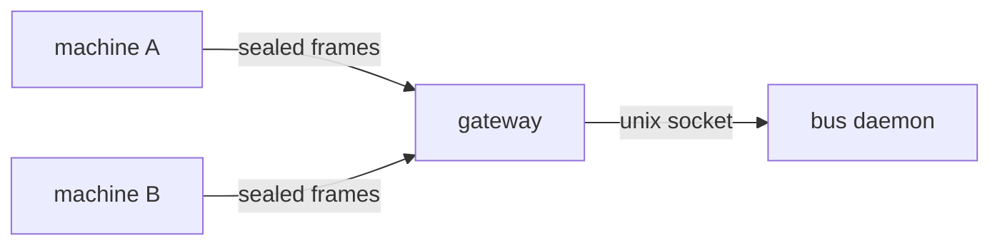
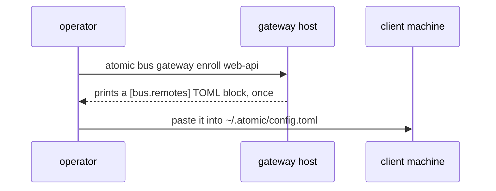

# Hosting `atomic bus` over a network


`atomic bus` normally connects sessions on one machine through a Unix socket. This guide takes it
one step further: a gateway process on a host you control, enrolled machines each holding one key,
and every other machine's `atomic bus` verbs working over the network exactly as they do locally.

It does not teach you Tailscale, EasyPanel, Docker, or Cloudflare. You already know your own
infrastructure. It covers deploying *this* gateway, in the two shapes most setups need: inside a
VPN your machines already join, and on a host behind a proxy that terminates TLS.


## What this gives you


A gateway runs beside the bus daemon on one host. It opens each frame sent to it, checks the key
that sealed it, rewrites the sender's identity so it cannot be forged, and forwards the request to
the daemon over the same Unix socket a local session would use. The daemon never knows the network
exists.



Two machines, one room, no third party in the room's traffic. That is the whole feature. Everything
below is how to stand up the host side and enroll the client side.


## Before you start


You need:

- **A host.** Anything that can run the `atomic` binary and stay reachable from the machines that
  will join rooms: a VPS, a container on a platform you already use, a machine on a VPN.
- **An address the client machines can reach.** A VPN interface address for the private topology, or
  a public hostname for the proxy topology.
- **The `atomic` binary on the host and on every client machine.** See the
  [install guide](./install.md).
- **Clocks within two minutes of each other.** Every frame carries a timestamp, and the gateway
  refuses one too far from its own clock. See "Clock skew" below before you deploy anything.

One published port is enough: `443/tcp` when a proxy is involved, or nothing at all inside a VPN.
One volume holds everything the gateway and daemon need to persist: `~/.atomic`. Losing it drops
every enrolled key, the room roster, and every room's transcript.


## Run the gateway


One command starts the gateway and the daemon together. The gateway spawns the daemon itself, so
you never run `atomic bus serve` separately on the host.

```bash
atomic bus gateway --addr :8443
```

`--addr` is where the gateway listens for `/v1/op`, the one HTTP endpoint every verb speaks through.
Bind it to whichever interface matches your topology:

- Inside a VPN, bind to that interface's address (`--addr 10.8.0.1:8443`, for example) so nothing
  outside the VPN can reach it at all.
- Behind a proxy, bind to loopback or a private interface (`--addr 127.0.0.1:8443`) and let the
  proxy be the only thing exposed publicly.

By default the gateway speaks plain HTTP. That is deliberate; see "What is protected" below for why
TLS is optional rather than required. If you are exposing the gateway directly rather than behind a
terminating proxy, add a certificate:

```bash
atomic bus gateway --addr :8443 --tls-cert cert.pem --tls-key key.pem
```

State lives under `~/.atomic` on the host: the key store, the daemon's socket, its roster, and every
room's log. Mount one volume there and the gateway survives a restart with nothing lost.


## Enroll a machine


Enrollment is one command on the host and one paste on the client. There is no shared secret typed
by a person; the gateway generates the key.



On the host:

```bash
atomic bus gateway enroll web-api
```

This prints a block like:

```toml
[bus.remotes.web-api]
host = "http://<this gateway's reachable host:port>"
key  = "…"
```

The scheme matters: a `host` with no `://` is treated as `https`, so a plain-HTTP gateway (the
default) needs `http://` written explicitly, or every verb fails with
`http: server gave HTTP response to HTTPS client`. Pass `--tls-cert` to `enroll` — the same file
you run (or will run) the gateway with — and it prints `https://` instead:

```bash
atomic bus gateway enroll web-api --tls-cert cert.pem
```

Replace the host after the scheme with the address the client machine reaches: the VPN address or
the public hostname, matching whichever topology you deployed. Paste the block into
`~/.atomic/config.toml` on the client machine. That machine can now reach any room on this gateway.

The key is printed exactly once. If you lose it, enroll a new name; there is no way to recover a key
from the store afterward.


## Join from two machines


With the client configured, every `atomic bus` verb works exactly as it does locally, with one
addition: `--host <name>` picks the remote instead of the local daemon.

```bash
# on machine A
atomic bus join checkout --as fe --host web-api

# on machine B
atomic bus join checkout --as api --host web-api
```

After the first join, `atomic bus` remembers which host a room lives on. Later commands against
`checkout` on that session resolve there automatically, with no `--host` needed:

```bash
atomic bus send checkout "cart total is off by a cent" --to api
```

The receiving session's `recv` gets it exactly as it would from a local daemon. A room name is
claimed per host, so a session cannot hold `checkout` on two different buses at once. The second
join is refused rather than silently splitting the room.

Nearly everything the local bus can do, the network bus can do: `tail`, `say`, `halt`, `resume`,
`close`, `read`, `end`, and `prune` all work with `--host`, alongside `join`, `leave`, `send`,
`recv`, `who`, `rooms`, and `status`. Two exceptions: `chat` stays local-only — an interactive
raw-mode session against a remote gateway is not something it attempts — and `shutdown`, which the
gateway refuses outright. An operator with shell on the host stops the daemon directly.


## Inside a VPN


This is the smaller step, and the better first deployment. Nothing is published to the internet: an
attacker has to already be on the VPN before the gateway is reachable at all.

```
atomic bus gateway --addr 10.8.0.1:8443
```

No `--tls-cert` needed. There is nothing to terminate inside the VPN, and the frame's own seal
already protects the content in flight. See "What is protected" below for exactly what that seal
does and does not cover.

Enroll without `--tls-cert` too, so the printed block already reads `host = "http://10.8.0.1:8443"`
— matching how this gateway actually listens.


## Behind a proxy


The proxy terminates TLS and forwards plain HTTP to the gateway. The gateway itself listens on a
private interface or loopback, never directly on the public port:

```
atomic bus gateway --addr 127.0.0.1:8443
```

Point your proxy's `443/tcp` at that address. Two things the proxy needs to get right for a
streaming verb like `recv` or `tail` to work:

- **No idle timeout under 30 seconds.** A quiet room still exchanges a sealed heartbeat every 30
  seconds precisely so a proxy in front does not decide the connection died and close it.
- **No response buffering.** Each envelope has to reach the client as soon as the gateway seals it,
  not after the proxy accumulates a buffer's worth.

Give the client its own certificate only if the proxy's certificate is not in the system trust
store: a self-signed cert, or an internal CA.

```toml
[bus.remotes.web-api]
host = "https://bus.example.com"
key  = "…"
ca   = "~/.atomic/bus/web-api-ca.pem"
```

`enroll` on this host prints `http://`, since the gateway process itself still speaks plain HTTP —
it has no way to know a proxy sits in front terminating TLS. Change the scheme to `https://` and the
host to the proxy's public address by hand; leave `ca` out entirely when the proxy's certificate is
publicly trusted.


## What is protected


"Encrypted" invites the wrong assumption, so this states the boundary directly.

The transport is sealed end to end between a client and the gateway. A network-path attacker,
including a proxy that terminates TLS in front of the gateway, cannot read, alter, replay, or
reorder a frame. Every frame is authenticated and every response stream is bound together, so
tampering with any of it ends the connection rather than delivering a forged message.

A dropped or delayed frame is **detected, not prevented**: it ends the stream, the client
reconnects, and any envelope published during the gap is lost rather than forged — nothing is
surfaced to the agent beyond the reconnect. `atomic bus read <room> <msg-id>` recovers a lost
message from the room log on the host.

What that seal does not cover:

- **Room logs on the host are plaintext.** Every message ever sent, in every room, sits in
  `~/.atomic/rooms/<room>.log` in the clear.
- **`keys.json` holds real keys.** Anyone with shell access to the host can read every enrolled
  key and every room, full stop.
- **Any enrolled key can instruct any agent.** There are no roles. A key holder is trusted the same
  way a local process on that machine is trusted, and the bus's reaction policy tells a receiving
  agent to act on an addressed message as if the user had asked. A key that reaches the wrong hands
  reaches every agent listening on that gateway.

Issuing a key is the trust decision. Revoking it is the remedy:

```bash
atomic bus gateway revoke web-api
```

The gateway notices on its next lookup. Nothing restarts, and a live stream from that machine ends
within one frame.


## Clock skew


Every frame carries a timestamp, and the gateway rejects one more than 120 seconds away from its
own clock, in either direction. Keep the host and every client machine's clock within that window:
NTP, or whatever time sync your platform already runs, is enough.

A machine whose clock has drifted past the window cannot connect, and the failure is silent: no
error naming the skew, only a frame the gateway drops with nothing written back. From the client's
side that is indistinguishable from the gateway being down entirely. If a machine that enrolled
successfully suddenly cannot reach any room, check its clock before anything else.
