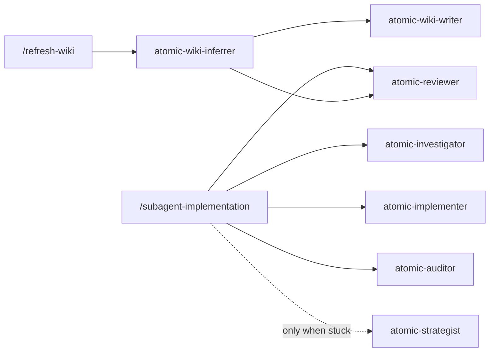

# Agents

Agents are specialized workers that run in a fresh context. The orchestrator dispatches them during `/subagent-implementation`, `/quick-fix`, and `/subagent-diagnose`, but you can also invoke them directly via the Agent tool. Two of [Anthropic's agent patterns](https://www.anthropic.com/engineering/building-effective-agents) are built in: orchestrator-workers (a parent breaks the task down and delegates to workers) and evaluator-optimizer (the implementer writes, a separate reviewer critiques).


## Who dispatches whom

Two orchestration trees cover every dispatch. The implement loop fans out per checkpoint, implementer then reviewer, with the investigator scoping surfaces, the auditor gating the whole delivery once at the end, and the strategist called in only when the loop is stuck. The wiki pipeline fans out per domain, one writer per domain with the same reviewer gating each page.



`/quick-fix` and `/subagent-diagnose` reuse the implement loop's tree, `/autopilot` runs it end to end, and ship verbs dispatch the wiki-inferrer silently. `/atomic-plan` borrows the reviewer alone, in spec-mode.


## Code agents

These write, review, and gate code.

| Agent | What it does | Model |
|-------|-------------|-------|
| `atomic-implementer` | Dual-mode implementation agent. The orchestrator declares the mode at dispatch time. **feature mode**: implements a feature checkpoint — one cohesive slice across however many files it touches (controller + service + DTO + tests, etc.); refuses cross-cutting or ambiguous scope. **surgical mode**: small targeted edits with a hard cap of 2 files, test files excluded; bounces anything larger back to the orchestrator. Both modes write a failing test first. | Sonnet, `medium` effort |
| `atomic-reviewer` | Reviews a diff after each implementer pass. Re-runs the quality signals it verifies (tests, type checks). One line per finding, ends with PASS or CHANGES_REQUESTED. Flags suppression patterns — error-catching added to dodge a failure without investigating it. Flags over-engineering — reinvented stdlib, duplicate helpers, or one-implementation abstractions — and comment noise; both are 🟡 and drive the verdict, never nits. Checks the implementer's proposed commit message against `atomic-git-discipline`. Also runs in spec-mode: reviews a draft spec against its design doc (coverage, voice, over-prescription) to gate the `/atomic-plan` spec loop. | Sonnet, `xhigh` effort |
| `atomic-auditor` | Final gate on a finished implementation, dispatched once after the loop goes green. Audits four things per-checkpoint review cannot see: success criteria no single checkpoint owned, iterations that each passed and do not compose, commit types that misstate user-visible impact, and documentation that is current but says nothing. Never edits the repo; findings also land in `$SCRATCH/AUDIT.md`. Fresh context, ends with PASS or CHANGES_REQUESTED. | caller's choice, `max` effort |


## Research agents

These read code but never write it.

| Agent | What it does | Model |
|-------|-------------|-------|
| `atomic-investigator` | Locates code. "Where is X defined?", "What calls Y?", "List all uses of Z." When an index is present, leads with `atomic code explore` for broad scoping (one natural-language query returns the relevant symbols, files, and relationships), then uses `atomic code search/callers/callees/impact` for targeted follow-up; falls back to `sg`/`grep` otherwise. Returns a file:line table with no speculation. | Haiku, `low` effort |
| `atomic-strategist` | Reasons through hard problems — plans, specs, architectural tradeoffs. Surfaces hidden assumptions and recommends approaches. Read-only; never implements. Dispatched for root-cause analysis when the implement→review loop gets stuck on the same failure. | caller's choice, `xhigh` effort |


## Infrastructure agents

These handle system-level tasks.

| Agent | What it does | Model |
|-------|-------------|-------|
| `atomic-wiki-inferrer` | Scope-sensitive wiki pipeline, and an orchestrator rather than an author. Repo scope: scans via `atomic signals scan`, infers domain structure (using real import/call edges from the code-intel index when present; filename heuristics otherwise), dispatches one `atomic-wiki-writer` per domain and `atomic-reviewer` per page, then assembles `docs/wiki/index.md` and wires the `@docs/wiki/index.md` ref (checking `claude.local.md`/`CLAUDE.local.md` before `CLAUDE.md`). Realm scope: executes the cross-repo pipeline against `<root>/wiki/`. Runs in its own context so the scan, which is thousands of lines, never enters the caller's. Dispatched by `/refresh-wiki` and silently by ship verbs. | Sonnet, `medium` effort |
| `atomic-wiki-writer` | Authors one wiki page from source, dispatched once per domain by `atomic-wiki-inferrer` with the page contract and source paths in its prompt. Carries the `atomic-writing` skill in frontmatter, so the page's reading order, its diagrams, and its voice load as context rather than arriving as a request. Reads the files rather than inferring from filenames, draws every shape the domain has, and reports judgments separately from facts. Holds no `Agent` tool, so it cannot fan out. | Sonnet, `high` effort |


## Model and effort overrides

Each agent's model and effort default to the bundled tier shown in the tables above. `atomic config agents` pins either or both per agent: it prompts interactively, one agent at a time, and writes the choices to `config.toml`. Set one field, both, or neither; a blank answer keeps the bundled default for that field.

- **model** — a tier alias (`haiku`, `sonnet`, `opus`) or an exact Claude Code model id such as `claude-opus-4-8`, with no provider prefix. Validation is lenient: any well-formed value passes through to the frontmatter, and Claude Code resolves it at runtime.
- **effort** — `low`, `medium`, `high`, `xhigh`, or `max`. Claude Code downgrades per model at runtime when a model does not support the requested level.

**Bundled defaults:**

| Agent | Default tier |
|-------|-------------|
| `atomic-investigator` | `claude-haiku-4-5-20251001`, effort `low` |
| `atomic-implementer` | `claude-sonnet-5`, effort `medium` |
| `atomic-reviewer` | `claude-sonnet-5`, effort `xhigh` |
| `atomic-wiki-inferrer` | `claude-sonnet-5`, effort `medium` |
| `atomic-wiki-writer` | `claude-sonnet-5`, effort `high` |
| `atomic-auditor` | unpinned, effort `max` |
| `atomic-strategist` | unpinned, effort `xhigh` |

`atomic-strategist` and `atomic-auditor` ship with no `model:` field on purpose, so the parent session or your own config decides whether a given question is worth opus or fable. Effort is the knob that survives an unpinned model. (`fable` is forward-reserved and may not correspond to a live Claude Code model tier yet.)

### How an override travels

1. **Config.** `atomic config agents` writes a nested table to `config.toml`, machine-owned and namespaced under the harness, so pi's own `[pi.agents.<name>]` overrides stay separate:

    ```toml
    [claude.agents.atomic-implementer]
    model = "claude-opus-4-8"
    effort = "high"
    ```

2. **Install.** The installer patches `model:` and `effort:` into each agent file's frontmatter on every `atomic claude install` or `atomic claude update`, and `atomic config agents` re-patches the already-installed files the moment you save, no reinstall needed. Only the fields you set are applied. Both fields are re-derived from config on every install rather than baked into the file, so upgrades never clobber the choice.

3. **Drift check.** `atomic doctor` compares each installed agent's frontmatter against what your config would produce, inside the same install-integrity check that covers every artifact. A missing override reports WARN; `atomic doctor --fix` re-applies the patch.

`atomic config list` shows what is active; no override stored means no `claude.agents.*` lines:

```
claude.agents.atomic-implementer.model = claude-opus-4-8
claude.agents.atomic-reviewer.effort   = high
```

### Edge cases

| Case | Behavior |
|---|---|
| scalar entry (`atomic-implementer = "opus"`) | config parse error; nested tables are the only accepted shape |
| running Claude Code session | keeps the old frontmatter; restart to pick up the change |
| custom `--target` install directory | not re-patched on save; re-run `atomic claude install --target <dir>` |
| agents added manually to `~/.claude/agents/` | never patched; only bundled artifacts tracked by `[install.artifacts]` are |
