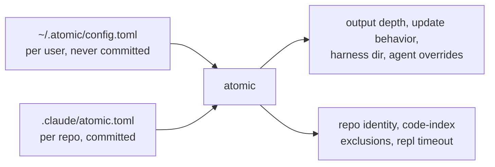

# .claude/atomic.toml

The repo-scoped config file. It is committed, so it applies to everyone working in the repository, and it holds settings that belong to the project rather than to you.

There are two config files and they do not overlap:



Your personal preferences live in `~/.atomic/config.toml` and never reach the repository. Facts about the project live here. A teammate cloning the repo should get the same code-index exclusions you have; they should not inherit your update settings.

`atomic repo init` creates the file with a `scope` marker. Everything else you add by hand.

## Keys

| Key | Type | Default | What it does |
|-----|------|---------|--------------|
| `scope` | string | none | Declares this directory as `"repo"` or `"realm"` |
| `[code] ignore` | string array | empty | Glob patterns excluded from the code-intel index |
| `[repl] idle_timeout` | string | `1h` | How long an idle `atomic repl` session survives |

A complete example:

```toml
scope = "repo"

[code]
ignore = ["vendor/**", "*.generated.ts", "dist/**"]

[repl]
idle_timeout = "30m"
```

## scope

`scope` states what a directory is, so nothing has to guess. Without it, a repo root is inferred from `git rev-parse --show-toplevel` and a realm root is found by looking up your personal `<wikis>` registry, which means the same directory can resolve differently for two people.

`atomic where` reports which one answered.

| Value | Means |
|-------|-------|
| `"repo"` | A single project. Written by `atomic repo init`. |
| `"realm"` | A root holding several member repos plus a shared wiki. Written by `atomic wiki init --scope realm`. |

Discovery walks upward from the current directory to the filesystem root, taking the first marker of the kind it wants. It crosses `.git` boundaries deliberately, because a realm root sits above the repos it contains.

A marker naming the other kind is skipped, not treated as an error. `atomic doctor` warns when `scope = "repo"` contradicts a realm registered at the same path.

## [code] ignore

Patterns here keep files out of the code-intel index. Use it for vendored trees, generated output, and build artifacts, which add nodes and edges without telling you anything about the code you write.

Matching rules, which are not gitignore rules:

| Pattern | Matches |
|---------|---------|
| `vendor/**` | contains a slash, so it matches the full repo-relative path |
| `*.generated.ts` | no slash, so it matches the basename at any depth |
| `./dist/**` | leading `./` is stripped, then treated as a path pattern |
| `build/` | trailing slash only, matches nothing — write `build/**` |

There is no negation syntax. An invalid pattern is dropped with a warning rather than failing the run.

Newly ignored files are removed from the index on the next `atomic code index` or `atomic code sync`, through the same pruning that handles deleted files.

**If your repo gitignores `.claude/` wholesale**, add a negation so this file is actually committed:

```gitignore
.claude/*
!.claude/atomic.toml
```

Uncommitted, it only configures your own machine, which defeats the point of a repo-scoped file.

## [repl] idle_timeout

How long a named `atomic repl` interpreter session stays alive with no activity. Accepts a Go duration string: `30m`, `2h`, `90s`.

Resolution order is repo, then user, then the `1h` built-in default. Set it here when the project's sessions are expensive to start; set it in `~/.atomic/config.toml` when it is your own preference.

## How the file is read

Loading is lenient by design, because a config problem should never stop you working:

| Condition | Result |
|-----------|--------|
| File absent | Empty config, no error |
| Unknown key | Warning; the rest of the file still loads |
| Invalid glob | Pattern dropped with a warning |
| Malformed TOML | Error, and the caller degrades rather than failing |

`atomic doctor` category 13 reports on this file. An absent file passes, since the file is opt-in. Parse errors, unknown keys, invalid globs, and an invalid `scope` value all warn. It never fails, so a bad config file cannot block the rest of the check suite.
