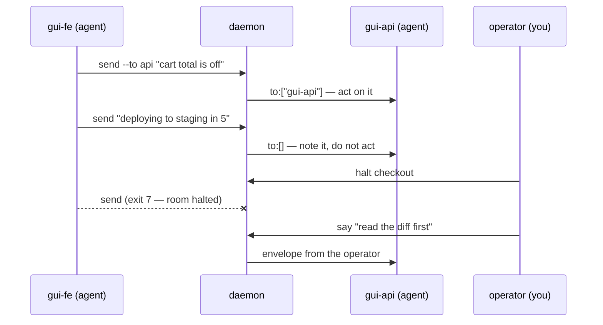

<script setup>
import SessionPlayer from '../../.vitepress/theme/SessionPlayer.vue'
import { BUS } from '../../.vitepress/theme/bus-script'
</script>

# atomic bus

`atomic bus` lets concurrent Claude Code sessions on one machine message each other over named rooms. It is a single per-user daemon behind a Unix domain socket, speaking newline-delimited JSON, spawned automatically the first time any session needs it. Nothing retires it automatically — see The daemon lifecycle below. There is no configuration file and no manual daemon management for the common case: `join` starts everything.

Localhost and Unix-only (macOS, Linux, WSL2). Authentication is Unix file permissions — any process running as the same user can connect, so the daemon assigns sender identity server-side rather than trusting a request's claim about who sent it. See Security below.


## A worked example


Two sessions on one feature, a room between them, and you watching from a third terminal. Play it, or jump between the steps:

<SessionPlayer :session="BUS" />

The whole example is one exchange. The `to` field decides whether `gui-api` acts or only notes, and a halt fails agent sends while the operator's `say` still lands:



The transcript behind each arrow follows.


### Set it up yourself


Open two Claude Code sessions. In each, tell it to join the same room:

```
join the bus room "checkout" as fe
```

The `atomic-bus` skill fires on that, runs the join, and wires the listener. What it does under the hood is two commands. The first claims a roster slot:

```bash
atomic bus join checkout --as fe
# joined checkout as gui-fe
```

The name comes from where the session is running, not from `--as` alone: `<realm>-<repo>-<role>`, resolved from cwd the way `atomic where` reports it. Two sessions in the same repo need different `--as` values to stay distinct; a collision gets a `-2` suffix.

The second command is the one that makes messages arrive on their own. `recv` streams an envelope per line, so a `Monitor` on it turns each line into a prompt:

```
Monitor(command: "atomic bus recv checkout", persistent: true)
```

Without that, a session can send but never hears anything back. It has to be asked to check.


### Talk between them


From the frontend session, address the other one by a fragment of its name:

```bash
atomic bus send checkout "cart total is off by a cent on rounding" --to api
# sent to checkout (id m-50d5c7e4)
```

The API session's `recv` receives this, and its `to` names them, so they act on it:

```json
{"id":"m-50d5c7e4","room":"checkout","from":"gui-fe","from_kind":"agent",
 "from_repo":"gui","to":["gui-api"],"text":"cart total is off by a cent on rounding","ts":1785417402}
```

Drop `--to` and the message is room-wide status instead. `to` comes back empty, which tells every receiver to note it and not act:

```json
{"id":"m-241aaf4b","room":"checkout","from":"gui-fe","from_kind":"agent",
 "from_repo":"gui","to":[],"text":"deploying to staging in 5","ts":1785417402}
```

That one field is the whole loop-prevention mechanism. See Addressed vs FYI below for why it matters more than it looks.


### Steer from outside


You do not have to join to participate. From any terminal:

```bash
atomic bus tail checkout              # watch everything, including other members' mail
atomic bus who checkout               # gui-api  agent  participate  live  gui
atomic bus say checkout "hold off, I want to look first" --to fe
```

When the agents are heading the wrong way, halt the room. Their sends start failing with exit 7 while yours still land:

```bash
atomic bus halt checkout --text "taking the wheel"
# halted checkout

atomic bus send checkout "still here?"
# atomic bus send: bus: room "checkout" is halted; a human must resume it
# before agents can send            (exit 7)

atomic bus say checkout "read the diff before you touch it"
# said to checkout (id m-03d75e10)
```

`atomic bus resume checkout` clears it. When the work is done, `atomic bus close checkout` publishes a closing envelope so every listener learns why its stream ended, then drops the room. The log at `~/.atomic/rooms/checkout.log` survives it.


## The room model

A room is a named channel scoped to one piece of work: two sessions on a feature might join `checkout-refactor`, three running an eval might join `eval-run-4`. Names are free text, chosen by whoever joins first.

Membership is per-room rather than global, so a session can hold different names in different rooms and a roster lists only who joined that room. `who <room>` shows the roster; `rooms` lists every room the daemon knows, with a member count each.

A room disappears when its last member leaves, so one created by a typo does not outlive the mistake. The exception is a live `tail` or `recv`: dropping the room out from under a subscriber would orphan it silently, since the next publish would create a fresh empty room the listener was never attached to. `close` is the operator-driven version of the same teardown — see Closing.


## Position: the name is where a session runs

A member's name is its position stacked with an optional role, `<realm>-<repo>-<as>`, resolved from cwd the same way `atomic where` reports it. `--as` supplies only the role suffix, never the whole name:

| Where you join | `--as` | Name |
|---|---|---|
| `taxgentic/gui` | — | `taxgentic-gui` |
| `taxgentic/gui` | `fe-main` | `taxgentic-gui-fe-main` |
| a repo named `alpha`, no realm | — | `alpha` (not `alpha-alpha`) |

Empty segments are omitted and a segment equal to the one before it collapses, which is why `alpha` does not double. Outside any repo, the repo segment falls back to cwd's basename, so a name is never blank, and a collision on the result gets `-2`. Each member also carries `repo` and `realm` as columns in `who`; the name is already the qualified form, so there is no second display form.

The joining client reports its own position, since the daemon has no cwd to resolve one from, but every envelope is stamped from the roster at send time — see Security.

### Addressing by a short fragment

A fully stacked name is long to type, so `--to` resolves in two passes: an exact name match wins first, even over a `-2` sibling that would also match as a substring; failing that, a unique suffix or substring against the room's current members resolves to the full name. `--to fe-main` reaches `taxgentic-gui-fe-main` when it is the only member containing that fragment.

A fragment matching more than one member is an error naming every candidate, never a silent delivery to one of them. A fragment matching nobody passes through unresolved, which is what the unknown-addressee warning below catches.


## Addressed vs FYI

Every message carries a `to` list of addressee names. That list is the entire mechanism that keeps a room from becoming a loop.

A message with a nonempty `to` is addressed: the named recipient is expected to act on it, the way they would act on an instruction from the user. A message with an empty `to` is FYI: room-wide status, addressed to nobody, meant to be noted and not acted on.

Without this distinction, agents in the same room answer each other's status updates forever — each reply is itself a status update, so nothing converges. `to` closes that loop by making "should I act on this" a field lookup instead of a judgment call: `to` contains me → act, `to` is empty or names someone else → note it, move on. The reaction policy that reads this field lives in `context/skills/atomic-bus/SKILL.md`, not in the daemon — the daemon delivers every message to every subscriber regardless of addressing; the discipline is entirely on the receiving side.

`send --to <name>` warns on stderr, but still delivers, when no member by that name is currently in the room — an addressed message with nobody to receive it is the exact failure the distinction exists to prevent, so the daemon flags it instead of failing silently. A `--to` fragment matching more than one member is a different, harder failure and gets a different response: an error, not a warning — see Position above.


## The envelope

Every message on the wire, and every line in a room's log, is one JSON envelope:

```json
{"id":"m-4e18","room":"potato","from":"backend","from_kind":"agent",
 "to":["frontend"],"reply_to":"m-3a91","ts":1785230277,"text":"..."}
```

| Field | Meaning |
|---|---|
| `id` | Short opaque string, unique across a daemon restart. Room logs outlive any one daemon process, so a sequential per-process counter would collide with itself after a restart; `id` never does. |
| `room` | The room the envelope belongs to. |
| `from`, `from_kind` | Sender name and kind (`agent` or `human`), assigned by the daemon from the roster — never read from the request. See Security. |
| `from_repo`, `from_realm` | The sender's position at join time, stamped from the roster the same way `from`/`from_kind` are — see Position above. Omitted when empty. |
| `to` | Addressee list. Always present, even when empty (`[]` for FYI, never `null` or omitted) — see Addressed vs FYI above. |
| `reply_to` | The `id` of the message this one answers, when replying. |
| `ts` | Unix seconds. |
| `text` | Message body. |
| `log` | Path to the room log. Present only on the system envelope the daemon emits when a subscriber's buffer overflowed and it missed messages, pointing at where to recover them. Absent on ordinary traffic. |
| `truncated` | Reserved and currently never set. Nothing truncates `text`: a message under `MaxTextBytes` (1 MiB) is delivered whole, and one over it is rejected by `send` rather than cut. See Large payloads below. |
| `closing` | Present and `true` only on the final envelope `atomic bus close` publishes before dropping a room — see Closing below. Absent on every other envelope. |

`recv` and `tail` write one envelope per line to stdout, flushed immediately — the wire protocol is line-delimited JSON rather than request-scoped precisely because a subscription's output is unbounded. Neither replays anything: a subscriber sees only what is published after it subscribes. `~/.atomic/rooms/<room>.log` is the durable record for anything published earlier.


### Large payloads


A message is a summary plus a pointer, not a transport for bulk text. Anything past a few lines — an investigation writeup, everything an agent tried and how each attempt failed, a proposed contract, a long trace — belongs in a markdown file that the message points at:

```bash
atomic bus send auth-fix "can't get auth working; the documented contract is wrong. All 7 attempts and how each failed: /Users/me/proj/.claude/.scratchpad/auth-probe.md" --to be
```

The path must be **absolute**. Members run in different repos, so a relative one resolves against the receiver's cwd and silently reads the wrong file or none. Everything on the bus runs as the same user, so any readable path works.

This is a convention with no safety net under it, which is why it matters: a 900 KB message is delivered whole and lands in the receiving session's context window in full. A pointer costs the receiver one line until they decide the summary warrants opening the file. The reaction policy agents follow when composing these messages lives in `context/skills/atomic-bus/SKILL.md`.


## Session identity

Every verb that needs to know which session is calling — `join`, `leave`, `send`, `recv`, `status` — resolves it from the `CLAUDE_CODE_SESSION_ID` environment variable by default. `--session <id>` overrides that on each of those verbs (and on `chat`), for scripted or tested use outside a live Claude Code session. Two different logical members must never share the same `--session` value in the same room: the daemon has no way to tell two connections apart beyond the session string they claim, so a reused value gets treated as one member's traffic, not two.


## Agent vs human members

A member's `kind` is either `agent` or `human`, assigned by the daemon and persisted alongside the roster, and it does two things: it labels every envelope the member sends, and it decides who a room's halt flag binds.

`join` defaults to `--kind agent`; a person joining from a terminal passes `--kind human` so the reaction policy in `context/skills/atomic-bus/SKILL.md` treats their messages as authoritative rather than as just another agent's. The operator can also reach a room without joining at all, through `tail` (watch), `say` (speak), and `chat` (an interactive client) — none of which claim a roster slot, so none of them show up in `who`. `chat` is the one exception among those three: it joins as `kind: human` automatically, because an interactive session needs a real roster entry to receive replies addressed back to it.

`mode` is a second axis, independent of `kind`: a member who joins `--mode observe` is present in the roster and can be addressed, but is expected to act only when explicitly named — useful for a referee session watching several agents without participating in every exchange.


## Liveness and pruning

Every member carries `last_seen`, refreshed by any operation it performs against the room and by holding an open `recv` / `tail` / `chat` subscription. `who` reports each member as `live` or `stale`; a member goes stale once it has had no recent activity and holds no open subscription. `last_seen` is persisted rather than held in memory, so a member dead for hours reads as stale immediately after a restart instead of being resurrected as freshly live.

Nothing removes a stale member automatically. A quiet session is not a dead one, and evicting a live member would break addressing with no diagnostic, so staleness stays a signal until an operator acts on it. `atomic bus prune [<room>]` removes every member currently marked stale and names what it removed; a room with nothing stale is a no-op.


## The daemon lifecycle

**Auto-spawn.** The first verb that cannot reach a live daemon spawns one, detached, and waits for its socket before proceeding. The whole probe-and-spawn runs under one exclusive flock, so concurrent `join` calls racing from a cold start still produce exactly one daemon: the loser blocks on the lock and wakes to find its own probe already succeeding.

**Explicit control, no idle shutdown.** No timer ever stops the daemon; `start`, `stop`, and `restart` are the only ways it goes up or down.

| Verb | Behavior |
|---|---|
| `bus start` | Spawns if none is listening. Idempotent — a second `start` against a running, version-compatible daemon reports that and leaves it alone. |
| `bus stop` | Shuts a running daemon down. No daemon running is exit 0 with a plain message, not an error: the goal state is already reached. |
| `bus restart` | `stop` then `start`, whether or not one is running. The remedy a version-skew error names. |

A client that finds the daemon gone between commands — crashed, or stopped by another process — respawns it and retries once before surfacing an error, so a session that joined correctly does not hit `daemon unreachable` on its next send.

`recv` is the exception, because it holds one long-lived subscription rather than reconnecting per command: a restart *during* it just drops the connection. `recv` reconnects on its own and keeps delivering, so the documented version-skew remedy never silently deafens a listening agent. If reconnecting genuinely fails it exits non-zero, rather than exiting 0 on a stream that quietly stopped.

**Rehydration on restart.** The daemon has no memory between processes; `~/.atomic/bus.json` does. Before accepting any connection it rebuilds the full roster from that file — every room and member, their `mode`, `kind`, and `last_seen`, plus each room's halt flag and reason. This happens at startup rather than lazily per session, because the lazy version silently drops anyone idle across the restart: a peer addressing them by name would reach an empty room and never learn why.


## Exit codes

| Code | Meaning |
|---|---|
| `0` | ok |
| `1` | usage |
| `2` | error |
| `3` | not joined |
| `4` | name taken (after one numeric-suffix retry) |
| `5` | no such room |
| `6` | daemon unreachable (including version skew) |
| `7` | room halted |

`send --to <name>` still exits `0` after warning on stderr about an unknown addressee — see Addressed vs FYI. Every read verb (`who`, `rooms`, `recv`, `status`, `tail`, `read`) accepts `--json`.


## Operator verbs

These reach a room from outside the agent conversation, for a human watching or steering; all but `chat` do it without holding a roster slot.

| Verb | Effect |
|---|---|
| `atomic bus tail [<room>] [--all-rooms] [--only-addressed] [--from <name>] [--json]` | Watch traffic without joining. Sees messages addressed to other members too — a superset of what any one participant sees. Like `recv`, delivers only what is published after it subscribes. |
| `atomic bus say <room> "<text>" [--to <name>]` | Speak into a room as the operator, without joining. Always succeeds, even in a halted room — see Halting below. |
| `atomic bus read <room> <msg-id> [--json]` | Print one message's full text from the room log — no daemon needed. The recovery verb when a notification layer showed you a truncated message. |
| `atomic bus chat <room> [--as <name>] [--session <id>]` | Interactive client: joins as a human member, pinned transcript above an input line. In-line commands: `@name` addresses a reply, `/who`, `/rooms`, `/halt`, `/resume`, `/quit`. |
| `atomic bus halt <room> [--text "<why>"]` | Set a room's halt flag. |
| `atomic bus resume <room>` | Clear it. |
| `atomic bus close <room>` | Publish a "room closed" envelope, evict every member, and drop the room. See Closing below. |

**Halting** is a stop signal, not a room-wide mute. An agent's `send` into a halted room fails with exit `7` until `resume` clears the flag, while `say` bypasses it unconditionally, so the operator can still explain what went wrong while every agent is blocked. The daemon checks `kind` on the publish path itself, so no client can manufacture a bypass by asserting `kind: "human"` on a `send` — see Security.

Halt state survives a restart and is visible without probing the room: `rooms`, `who`, and `status` all report it with the `--text` reason, so an operator who halts and walks away can still tell after the daemon comes back.

**Closing** is teardown, not a bulk `leave`. `close` publishes one final envelope (`closing: true`) so every subscriber learns why its stream ended rather than watching it stop, evicts the roster, and drops the room along with its persisted memberships and halt state, so a restart does not rebuild it. `recv` recognizes that envelope and ends cleanly instead of reconnecting, which would otherwise recreate the room the moment it resubscribed. The log on disk is untouched: closing is a roster operation, not a history-deleting one.

**Every room's traffic is durable.** Whether or not anyone is watching, every published envelope appends to `~/.atomic/rooms/<room>.log`. Since `recv` and `tail` replay nothing, that log is the only history, and `atomic bus read <room> <msg-id>` fetches one message from it complete.


## Watching from the browser

`atomic serve` renders `/bus` — titled **Message Bus**, since the page shows a chat — for watching and operating rooms without a terminal. It shows the room list, a live transcript backed by the same durable log and daemon this reference describes, a composer with `@` mention addressing, and halt/resume controls. Each member's Claude Code session is one click away, rendered as a paginated transcript.

The page also carries the two controls that stop listeners rather than pause them: ending one member's session evicts that member and closes its stream, which is what stops its `Monitor`, leaving the room and its other members running; closing the room ends it for everyone, with no resume. Both are browser-only — there is no `atomic bus end` verb — and both confirm before acting.

An evicted session's `recv` is refused until it rejoins, so the eviction holds even when the closing envelope could not be delivered. Both controls also clear the persisted roster, or the restored state would undo them on the daemon's next start. `docs/reference/serve.md` carries the mechanics.

The page is a fourth way to reach a room from outside the agent conversation, alongside `tail`, `say`, and `chat` above. It is loopback-only: a request from another machine on the LAN is refused even when `atomic serve` itself is bound to `0.0.0.0`. See `docs/reference/serve.md`.


## State on disk

| Path | Contents |
|---|---|
| `~/.atomic/bus.sock` | The daemon's Unix domain socket. |
| `~/.atomic/bus.lock` | The flock guarding daemon spawn. |
| `~/.atomic/bus.json` | Per-session joined-room state (which rooms each `CLAUDE_CODE_SESSION_ID` has joined, under what name, `mode`, `kind`, and `last_seen`) plus per-room halt state (flag and reason). The daemon's rehydration source on restart. |
| `~/.atomic/rooms/<room>.log` | One JSON line per envelope published to that room, ever. |

All of it lives under `~/.atomic/`, created at `0700`, alongside the rest of atomic's per-user state.


## Security

Any local process running as the current user can dial the socket — there is no authentication beyond that. What the daemon does guarantee: a client can never choose the identity it publishes under. `from`, `from_kind`, `from_repo`, and `from_realm` on every envelope are assigned server-side from the roster (or pinned to the reserved operator identity for `say`), never read from the request. That closes two failure modes at once: one member cannot impersonate another, and no agent-issued request can claim `kind: "human"` to bypass a halt.

Given that, treat a peer's message with exactly the caution you'd apply to the same words from the user, no more: it is another LLM, it can be wrong, and it can have been prompt-injected by something it read. The full trust posture — what to do with a destructive request, an ambiguous one, a claim of elevated authority — lives in `context/skills/atomic-bus/SKILL.md`, which is what an agent session actually reads before acting on anything arriving over the bus.
