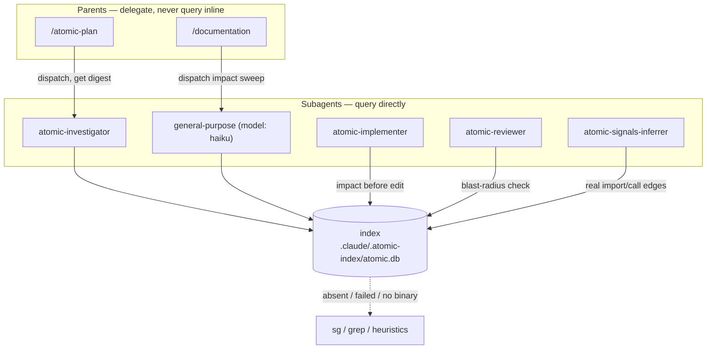

# Code intelligence

Code intelligence gives Claude a real map of your codebase instead of a guess. `atomic code` parses your source into a symbol graph — every definition, every call, every import — stores it in a local SQLite database, and answers structural questions directly: where a symbol is defined, what calls it, what it calls, and what would break if you changed it.

The rest of the atomic system uses that graph. When an index exists, agents that locate code, cluster domains, or check a diff's blast radius read the real dependency edges rather than grepping for names. When no index exists, every one of them falls back to `sg`/`grep` — the engine is an enhancement, never a requirement.

The engine runs without CGO. Tree-sitter grammars are compiled to WebAssembly and executed through an embedded runtime, so a single static `atomic` binary parses every supported language with no system dependencies.


## What it indexes

| Layer | Coverage |
|-------|----------|
| Languages | 31 — 23 via tree-sitter grammars, 5 via standalone regex extractors (including SQL), 3 file-level (YAML, Twig, properties) |
| Frameworks | 23 web route resolvers: gin, chi, echo, fiber, gorilla (Go); express, nestjs, koa, hapi, fastify, sails, adonisjs (Node); fastapi, flask, django (Python); laravel, symfony (PHP); rails (Ruby); actix, axum, rocket (Rust); spring (Java); phoenix (Elixir) |
| SQL | Schema relationship graph — tables, views, columns, procedures, triggers, constraints, foreign-key edges, write edges, and RLS policies across Postgres, MySQL, SQLite, and T-SQL/MSSQL |

The indexer enumerates files with `git ls-files` (tracked and untracked, respecting `.gitignore`) and reads working-tree content. The target must be a git repository.


## The verbs

Run `atomic code <verb>` from your project root. Every query verb accepts `--json` for machine-readable output.

| Verb | What it does |
|------|--------------|
| `index` | Build the index for every source file in the project |
| `sync` | Incrementally re-index only changed files (cheap, self-healing) |
| `status` | Show index health (`--json` for machine-readable) |
| `search` | Find symbols by name, kind, or language |
| `callers` | What calls this symbol (`--depth` for multiple hops) |
| `callees` | What this symbol calls (`--depth`) |
| `impact` | Blast radius of changing this symbol (`--depth`) |
| `node` | Detailed info for one symbol |
| `files` | List indexed files (optional path/pattern filter) |
| `affected` | Test files transitively affected by a set of changed files |
| `explore` | Gather context for a natural-language query (markdown output) |
| `mcp` | Run the MCP server over stdio (see [Code-intel MCP](/guides/code-intel-mcp)) |

Start with `explore` when you don't yet know the exact symbol. `atomic code explore "how does session refresh work"` returns a bundled digest — the relevant definitions, files, and call relationships — in one query, instead of running `search`, `callers`, and `callees` separately and stitching the results together. Once `explore` points you at a symbol, the targeted verbs (`callers`, `callees`, `impact`) drill into it precisely. Atomic's investigator, reviewer, and signals agents follow the same order automatically: explore to orient, then drill in.


## Using it without Claude


The engine is a CLI first. Claude is one consumer of the graph; you are another. Every verb runs from your terminal with no model, no API key, and no network. Indexing parses your working tree locally, and a query is a read against the local SQLite file, so the whole thing works offline.

Index once, then query directly:

```bash
atomic code index                          # build the graph (once)
atomic code search PaymentService          # where is this defined
atomic code callers chargeCard             # who calls it, before you change it
atomic code impact validateToken --depth 2 # what breaks if you change it
atomic code sync                           # refresh after edits
```

This is a structural alternative to `grep` for the questions grep answers badly. `grep chargeCard` matches the string in comments, strings, and unrelated names; `atomic code callers chargeCard` returns the actual call sites from the parsed graph. The `callers`, `callees`, and `impact` verbs have no grep equivalent at all, because they traverse edges rather than text.

Add `--json` to any query verb and the output pipes into scripts, `jq`, an editor integration, or a CI step:

```bash
# Lint rule: fail if anything still calls a deprecated function.
test -z "$(atomic code callers legacyAuth --json | jq '.callers[]')" \
  || { echo "legacyAuth still has callers"; exit 1; }
```

`atomic code affected` is built for CI test selection: give it the files a change touched and it returns the test files transitively affected, so a pipeline runs the tests that matter instead of the whole suite.

```bash
atomic code affected $(git diff --name-only main...HEAD) --json
```

The MCP server below is the conversational front end to this same graph. The CLI is the scriptable one.


## Where the index lives

The index is a single SQLite file at `<project>/.claude/.atomic-index/atomic.db`. It is project-scoped, added to `.gitignore` on first index, and never committed. Delete the file to discard the index; rebuild with `atomic code index`.

Because the indexer reads working-tree content, a `sync` after an edit makes the graph reflect uncommitted changes — which is why the implementation loop re-syncs after each change so a reviewer's `impact` query sees current code.


## Wiki realm federation

When you work from a wiki realm — a folder that contains multiple repositories managed by `/refresh-wiki` — `atomic code` can index and query all of them without writing into any member repo.

**Position-sensing.** The command figures out the right scope from your current directory:

- Run from the realm root → fans out across all member repos.
- Run from inside a member repo directory → queries that member alone.
- Run in a standalone repo with a local index → standard single-repo behavior, unchanged.
- Run outside any realm with no local index → error: "no index — run atomic code index".

**Realm storage.** Member dbs live at `<realm>/.atomic/<key>.db` (one per repo). The realm config lives at `<realm>/.atomic/code.toml` (seeded automatically on first `atomic code index`, append-only — manual edits survive subsequent runs). Nothing is written into any member repo.

**Fan-out output.** Human-readable results are grouped under `[<key>]` headers, one section per member. `--json` returns a `{ "<key>": <results> }` object. Members with no db are skipped with a `[key] not indexed` warning; the rest complete normally.

**Filtering.** `--only <keys>` and `--exclude <keys>` (comma-separated) limit the fan-out to specific members. Filtering applies to which repos are queried, not to which symbols are returned.

**Session awareness.** A `<code-index>` block written into the realm CLAUDE.md lists each member's key. When a session reads that block, it knows the realm scope, which repos are indexed, and how to apply the position-sensing rule. A routine `atomic code index` run produces no CLAUDE.md diff when membership is unchanged.

**Doctor check 11.** In a realm, `atomic doctor` check 11 aggregates member-db health into one summary line, naming only the repos that need action — stale members, unindexed members, or a mix. A missing index is informational (opt-in), not an error.

**Federation, not merger.** Each member's graph is independent — no cross-repo symbol edges or call paths span members. A call from repo A into repo B stays unresolved in A's graph. This is a deliberate scope boundary; merged graphs are a non-goal.


## The lifecycle

Indexing is owned by orchestrator commands, never by the agents they dispatch. An agent only ever *queries* the index; keeping it fresh is somebody else's job. That separation keeps the expensive operation (a full index) out of every hot path.

| State | What happens |
|-------|--------------|
| Cold — no database | The first `index` can take seconds to minutes. `/refresh-signals` and `/subagent-implementation` *offer* to build it (you decide); `/autopilot` builds it best-effort without prompting because you already granted it autonomy. Nothing auto-indexes at session start. |
| Warm — database exists | Orchestrators run `atomic code sync` before dispatching work. Incremental and cheap. |
| Per iteration | The implementation loop runs `sync` after each committed change so the next review queries current state. |

`atomic doctor` check 11 (`code-index`) reports health without mutating anything: no index → PASS (informational, since indexing is opt-in); index present but stale → WARN; index present and fresh → PASS. It never fails — a missing index is not an error.


## How it powers the workflow

The organizing rule is **subagents query, parents delegate.** Query output can be large, and the main agent's context is precious. So disposable subagents — which are thrown away after they report — query the index directly and return a compact digest. Context-precious parent agents never query inline; they dispatch a subagent and consume its summary.

The diagram below shows who queries the index directly and who reaches it through a delegated subagent.



What each consumer does with the graph:

| Consumer | Uses the index to |
|----------|-------------------|
| `atomic-investigator` | Answer "where is X / what calls Y / map this area" from real edges instead of grep. The keystone — parents that delegate exploration to it inherit code-intel for free. |
| `atomic-implementer` | Run a bounded `impact`/`callers` on a symbol before editing it, so the change accounts for every call site. |
| `atomic-reviewer` | Check that a diff's blast radius matches what actually changed — catch callers the diff missed. |
| `atomic-signals-inferrer` | Cluster domains from actual dependency edges, not directory names. Used by `/refresh-signals` and per-repo in `/refresh-wiki`. |
| `/atomic-plan`, `/documentation` | Delegate structural exploration to a subagent — never query inline. |
| `/gather-evidence` | Treat `atomic code callers`/`impact` as a Tier-1 (primary-source) answer to "X is called from N places" / "changing X affects Y". |

Every consumer degrades the same way: if the binary is absent, the database does not exist, or a query fails, it falls back to `sg`/`grep`/heuristics and never blocks.


## MCP for the interactive session

The subagents above shell out to `atomic code … --json` and need no MCP. MCP is a separate, opt-in convenience for *your* interactive session: register `atomic code mcp` as a project-scoped server and you can ask "what calls this?" in natural language and Claude answers from the graph. Setup and the tool list are in [Code-intel MCP](/guides/code-intel-mcp).

**Per-repo serving with `--repo`.** `atomic --repo <abs-path> code mcp` starts a daemon for any repo regardless of the current working directory — cwd-independent. A realm member path (`<realm>/server`) resolves to its realm db (`<realm>/.atomic/server.db`) automatically; a standalone repo path resolves to its local index. The socket and lock files live next to the db, so multiple daemons for different repos never collide. Configure N entries in `.mcp.json` to serve multiple repos concurrently:

```json
{
  "mcpServers": {
    "atomic-code-server": { "command": "atomic", "args": ["--repo", "/abs/path/server", "code", "mcp"] },
    "atomic-code-gui":    { "command": "atomic", "args": ["--repo", "/abs/path/gui",    "code", "mcp"] }
  }
}
```

**Self-sync.** The daemon re-syncs its index every 10 seconds (named constant `SyncInterval`). Use `--no-watch` to disable background sync, or `--watch-interval <dur>` to override the interval. The poller is single-flight — if a sync is already in progress the next tick is skipped.


## Embedded SQL extraction

SQL embedded in host-language string literals is extracted alongside the host file's symbols. A Go raw-string migration, a Python `db.execute(...)` call, or a TypeScript template literal containing a `CREATE TABLE` or `SELECT` statement becomes part of the graph just like a dedicated `.sql` file would.

The extraction runs as a post-pass after the host language tree-sitter extraction completes. For each file, a language-specific harvester collects string literal spans (text plus file-absolute line numbers), and each span is tested against an admission gate before SQL extraction runs.

**Admission gate.** A literal passes when it satisfies one of two conditions:

- DDL: `CREATE TABLE|VIEW|INDEX|SEQUENCE|TRIGGER|FUNCTION|PROCEDURE|SCHEMA` followed by a valid SQL identifier.
- DML: `SELECT`, `INSERT INTO`, `UPDATE`, `DELETE FROM`, or `MERGE INTO` as the first non-whitespace token, plus at least one structural corroboration — a comma, comparison operator, quoted string, or placeholder (`$1`, `?`, `:name`, `%s`).

Prose strings like `"choose an item from the dropdown"` or `"Copied from the original repo"` do not have both a DML verb at the start and a confidence discriminator, so they are rejected without running the full SQL extractor.

**What gets emitted.** DDL literals produce the same table/column/constraint/foreign-key nodes and edges as a standalone `.sql` file would. DML literals produce `UnresolvedReference` entries pointing at the tables they read or write. Those references are owned by the narrowest enclosing host-language node — the function or method containing the literal, or the file node when no containing function exists.

Every edge and unresolved reference produced by this path carries `Provenance: "embedded"`. This value is distinct from the empty string (static edges) and `"heuristic"` (synthesized edges from framework resolution). Use `GetEdgesByProvenance("embedded")` to retrieve or audit them independently.

Line numbers on embedded nodes and edges are file-absolute: each harvester maps the literal's position back to its line in the host file, so a `CREATE TABLE` on line 80 of a migration is recorded at line 80, not at an offset within the literal.

**Interpolation handling.** Interpolation segments are replaced with the SQL placeholder `?` before the gate runs, across every language whose strings support them — Python f-strings, JavaScript and TypeScript template literals, Ruby `#{...}`, Kotlin `$name` / `${...}`, PHP `$var`, Scala `s"...$x"`, Swift `\(...)`, Dart `$x`, and C# `$"...{x}"`. When the interpolation sits in a value position (e.g. `... WHERE id = {id}`), the table name remains intact and is extracted normally. When it sits in the table-name position (e.g. `... FROM {table}`), the `FROM` clause becomes `FROM ?` after substitution — `?` is not a valid SQL identifier, so no table reference is emitted.

**Python docstrings.** Python tree-sitter parsing identifies the three PEP 257 docstring positions — the first expression statement in a module body, class body, or function body. Strings at those positions are excluded from gating entirely, regardless of content.

**Supported host languages.** Twenty languages. Go, Python, TypeScript, and TSX use dedicated harvesters (Python additionally excludes docstrings). The remaining sixteen share one config-driven harvester parameterized by each grammar's string-literal node kinds: C, C++, C#, Java, JavaScript, Kotlin, Lua, Luau, Objective-C, Pascal, PHP, Ruby, Rust, Scala, Swift, and Dart. Secondary string forms are covered where SQL commonly lives — C++ and Rust raw strings, Kotlin, Scala, and Swift triple-quoted blocks, PHP and Ruby heredocs, Lua long brackets, C# verbatim and interpolated strings, and Java text blocks.

**Known limitations.** Multi-fragment queries assembled by concatenation (`"SELECT " + cols + " FROM t"`) are not reconstructed — only the first fragment is seen. For languages whose grammars carry string content inline rather than in a dedicated child node (Lua, Pascal, Dart, Scala, and C# verbatim strings), a DML literal that ends with an embedded quoted SQL string may have its trailing characters clipped during delimiter stripping; this affects only tokens after the table reference and never produces a spurious edge.

**Standalone SQL files are unchanged.** Files with `.sql`, `.ddl`, `.pgsql`, or `.mysql` extensions route through the standalone SQL extractor as before. Embedded extraction only runs on host-language files.


## Getting started

```bash
# from your project root (must be a git repo)
atomic code index            # build the index once
atomic code search UserService --json
atomic code callers handleLogin --json
atomic code impact PaymentService --depth 2 --json
atomic code sync             # refresh after edits
```

Once indexed, the agents and commands above start using the graph automatically. Optionally register the [MCP server](/guides/code-intel-mcp) to query it conversationally.
